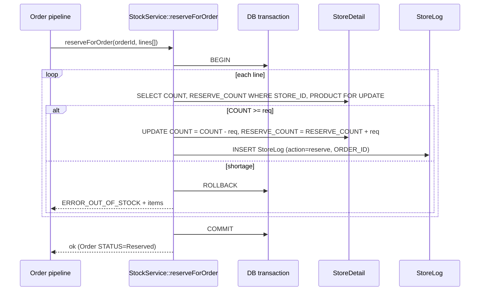
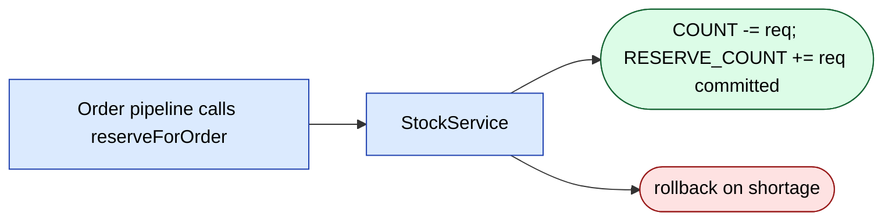
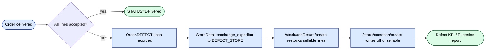
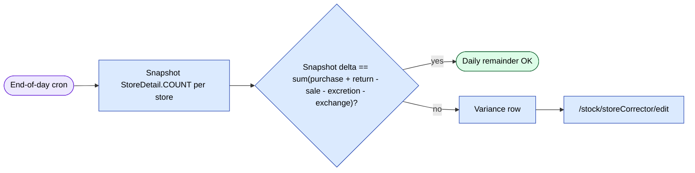

# `stock` module

Quantity-level operations on top of the warehouse layer: purchase,
returns, exchanges between stores, write-offs, corrections,
van-sales operations, planning, and stock-side reports. Complements
[`warehouse`](./warehouse.md) (which holds the document headers).

**Scale:** 126 routes across 18 active controllers (plus ~12
`.obsolete` controllers archived in place).

## Key features

| Feature | What it does | Owner role(s) |
|---------|--------------|---------------|
| Purchase / supplier intake | Inbound purchase orders from suppliers; XML/XLS import; refund handling | 1 / 9 |
| Add-return | Record a return-to-stock from a defect / reject, with original purchase lookup | 1 / 9 |
| Exchange between stores | Move stock between warehouse stores with snapshot reconciliation | 1 / 9 |
| Excretion / write-off | Permanent removal (damage, theft, expired) with per-order traceability | 1 |
| Store correction | Inventory-count adjustments with snapshots and a log trail | 1 / 9 |
| Van-sales return | Expeditor returns unsold van stock to warehouse | 9 / 10 |
| Van-sales exchange | Cross-van transfer of stock without going through warehouse | 9 / 10 |
| Plan by product | Set and track per-agent / per-product sales plans | 1 / 2 |
| Lot tracking | Per-batch (lot) remainder report with FIFO/expiry tracking | 1 / 9 |
| Stock report (current) | Live remainder, per-store, with defect & reservation breakdowns | 1 / 9 / 5 |
| Daily remainder | End-of-day snapshot reconciliation | 1 / 9 |
| Profit report | Margin per product / period (COGS vs sale) | 1 |
| Pivot reports | User-saved pivot configurations on stock & purchase data | 1 / 9 |
| Atomic reservation | `Stock::reserveForOrder()` decrements available + increments reserved in one transaction | system |

## Folder

```
protected/modules/stock/
├── StockModule.php
├── assets/
├── controllers/
│   ├── AddReturnController.php             # 7 actions — return-to-stock from defect
│   ├── BuyController.php                   # 18 actions — supplier purchase + refund
│   ├── ExchangeStoresController.php        # 5 actions — inter-store move
│   ├── ExcretionController.php             # 5 actions — write-off
│   ├── FinancialReportController.php       # 7 actions — profit/template builder
│   ├── LotReportController.php             # 3 actions — per-batch remainder
│   ├── PlanProductController.php           # 10 actions — per-product planning
│   ├── PurchaseController.php              # 13 actions — purchase view + refund management
│   ├── PurchaseReportController.php        # 8 actions — purchase rollups, daily remainder, profit
│   ├── PurchaseReportPivotController.php   # 5 actions — saved pivots on purchase data
│   ├── ReportController.php                # 1 action — stock-side recommendation report
│   ├── StockController.php                 # 11 actions — live remainder + detail views
│   ├── StockReportController.php           # 5 actions — pivot remainder report
│   ├── StoreCorrectorController.php        # 13 actions — inventory correction + snapshot
│   ├── VsExchangeController.php            # 1 action — van-sales exchange check
│   ├── VsExchangeDownloadController.php    # 3 actions — VS exchange document download
│   ├── VsReturnController.php              # 9 actions — van-sales return
│   └── VsReturnDownloadController.php      # 2 actions — VS return document download
└── views/
```

`.obsolete` archive (do not edit): `ClientSecondSale`,
`CreateStore`, `DefaultController`, `Reserve`, `Stats`,
`StoreDetail`, `StoreHistory`, `StoreRemainder`, `Totalio`.

## Key entities

| Entity | Model | Notes |
|--------|-------|-------|
| Store | `Store` (`d0_store`) | Warehouse / outlet header. `STORE_ID` PK-equivalent, `STORE_TYPE`, `VAN_SELLING`. |
| Store detail (stock cell) | `StoreDetail` (`d0_store_detail`) | The per-product quantity row. PK `STORE_DETAIL_ID`. `COUNT` is the live remainder. |
| Store correction | `StoreCorrector` (`d0_store_corrector`) | Adjustment log row: product + store + delta `COUNT` + `COMMENT`. |
| Purchase header | `Purchase` (`d0_purchase`) | Supplier purchase header. `PURCHASE_ID`, `DILER_ID`, `FILIAL_ID`, `SUMMA`, `DATE`, `DATE_LOAD`, `STATUS`. |
| Purchase line | `PurchaseDetail` | Per-product line on a purchase. |
| Purchase refund header | `PurchaseRefund` (`d0_purchase_refund`) | Refund-to-supplier header. PK `ID`. `COUNT`, `SUMMA`, `STATUS`, `DATE_DELIVERED`. |
| Purchase refund line | `PurchaseRefundDetail` (`d0_purchase_refund_detail`) | Refund line. |
| Excretion (write-off) | `Excretion` (`d0_excretion`) | Write-off row: `STORE_ID`, `PRODUCT`, `COUNT`, `COMMENT`, optional `ORDER_ID` (when triggered by a defect on an order). |
| Van-sales return | `VsReturn` (`d0_vs_return`) | Expeditor → warehouse return. `FROM_STORE_ID`, `TO_STORE_ID`, `AGENT_ID`, `COUNT`, `AMOUNT`, `STATUS`, `DATE_RETURN`. |
| Van-sales exchange | `VsExchange` (`d0_vs_exchange`) | Van-to-van transfer. `FROM_STORE_ID`, `TO_STORE_ID`, `AGENT_ID`, `STATUS`, `DATE_LOAD`. |

## Controllers

| Controller | Purpose | # actions |
|------------|---------|-----------|
| `BuyController` | Inbound purchase creation, XLS/XML import, refund-to-supplier | 18 |
| `PurchaseController` | View/edit existing purchases & refunds, save price/comment/shipper | 13 |
| `StoreCorrectorController` | Inventory corrections, snapshots, file-import of corrections | 13 |
| `StockController` | Live remainder grid + drill-downs (defect, reservation, product acting) | 11 |
| `PlanProductController` | Per-product sales-plan CRUD + import + execution view | 10 |
| `VsReturnController` | Van-sales return entry / edit / view / status change | 9 |
| `PurchaseReportController` | Purchase rollup, daily remainder, profit, defect, refund, excel | 8 |
| `AddReturnController` | Return-to-stock from defect/reject (find original purchase, set prices) | 7 |
| `FinancialReportController` | Profit-template builder + saved templates | 7 |
| `ExchangeStoresController` | Inter-store move; reminder check; per-store detail | 5 |
| `ExcretionController` | Write-off CRUD + per-write-off detail + write-off report | 5 |
| `PurchaseReportPivotController` | User-saved pivots on purchase data | 5 |
| `StockReportController` | User-saved pivots on stock remainder | 5 |
| `LotReportController` | Per-batch (lot) remainder report | 3 |
| `VsExchangeDownloadController` | Generate VS-exchange waybill 1.1 documents | 3 |
| `VsReturnDownloadController` | Generate VS-return waybill 1.1 documents | 2 |
| `VsExchangeController` | VS-exchange store check (used inline by VsReturnController.exchange) | 1 |
| `ReportController` | One action — `index`, stock-recommendation report | 1 |

### Selected actions — Purchase family

| Route | RBAC | Notes |
|-------|------|-------|
| `/stock/buy/index` | `operation.stock.purchase` | Purchase entry page. |
| `/stock/buy/createAjax` | `operation.settings.changePrice` | Inline purchase create. |
| `/stock/buy/importXls` / `importXls2` / `import2` | `operation.settings.changePrice` / `operation.stock.purchase` | XLS import variants. |
| `/stock/buy/uploadXml` | – | XML-invoice import. |
| `/stock/buy/savePurchase` | `operation.settings.changePrice` | Persist a purchase. |
| `/stock/buy/refund` / `refund2` | `operation.stock.updatePurchaseRefund` / `operation.stock.purchase` | Two refund flows. |
| `/stock/buy/exportExcel` / `exportExcel2` | – | Excel exports. |
| `/stock/purchase/index` | `operation.stock.purchaseView` | View-only purchase list. |
| `/stock/purchase/viewRefund` | `operation.stock.purchaseRefund` | View refund detail. |
| `/stock/purchase/editRefund` | `operation.stock.updatePurchaseRefund` | Edit a refund. |
| `/stock/purchase/refund` | `operation.stock.movement` | New refund. |
| `/stock/purchase/transaction` | – | Show linked ledger transaction. |
| `/stock/purchase/saveOnly{Prices,Comment,Shipper,RefundComment}` | – | Granular field-level saves. |

### Selected actions — Return / Exchange / Excretion

| Route | RBAC | Notes |
|-------|------|-------|
| `/stock/addReturn/index` | `operation.stock.movement` | Add-return entry. |
| `/stock/addReturn/getPurchase` | – | Look up the original purchase for a returned product. |
| `/stock/exchangeStores/index` | `operation.stock.exchange` | Inter-store exchange page. |
| `/stock/exchangeStores/checkReminder` | – | Validate counterparty remainder before move. |
| `/stock/exchangeStores/excelAll` | – | Excel of all exchanges. |
| `/stock/excretion/index` | `operation.stock.excretion` | Write-off list. |
| `/stock/excretion/create` | – | New write-off row. |
| `/stock/excretion/report` | – | Write-off report. |

### Selected actions — Van-sales (VS)

| Route | RBAC | Notes |
|-------|------|-------|
| `/stock/vsReturn/index` | `operation.stock.vsReturn` | "Возврат ванселлов" — van-return list. |
| `/stock/vsReturn/add` / `addnew` | `operation.stock.vsReturnAdd` | Create new van-return. |
| `/stock/vsReturn/edit` / `update` | `operation.stock.vsReturnEdit` | Edit pending van-return. |
| `/stock/vsReturn/view` | `operation.stock.vsReturnView` | View finalised van-return. |
| `/stock/vsReturn/exchange` | `operation.stock.vsReturnAdd` | Convert a return into a van-to-van exchange. |
| `/stock/vsReturn/changeStatus` | – | Approve / reject. |
| `/stock/vsExchange/checkStore` | – | Validate destination van. |
| `/stock/vsReturnDownload/download110[/_1]` | `operation.vs.downloads` | Generate waybill form-110 documents. |
| `/stock/vsExchangeDownload/download110[/_1/_2]` | `operation.vs.downloads` | Generate waybill form-110 for exchanges. |

### Selected actions — Reports

| Route | Title | RBAC |
|-------|-------|------|
| `/stock/stock/detail` | – | `operation.stock.detail` |
| `/stock/stock/detailDefect` | – | `operation.stock.detail` |
| `/stock/stock/detailRezerv` | – | `operation.stock.detail` |
| `/stock/stock/productActing` | – | `operation.stock.detail` |
| `/stock/stock/storeCorrect` | – | `operation.stock.corrector` |
| `/stock/stockReport/pivotDetail` | "Отчёт об остатках" | `operation.stock.pivotDetail` |
| `/stock/stockReport/pivotData` | – | `operation.stock.pivotDetail` |
| `/stock/purchaseReport/index` | – | `operation.stock.purchaseReport` |
| `/stock/purchaseReport/dailyRemainder` | – (harvested live) | `operation.stock.dailyRemainder` |
| `/stock/purchaseReport/profit` | – (harvested live) | `operation.stock.purchaseReportProfit` |
| `/stock/purchaseReport/refund` | – | `operation.stock.purchaseReport` |
| `/stock/purchaseReport/excel` | – | `operation.stock.detail` |
| `/stock/financialReport/index` | – | `operation.stock.profit` |
| `/stock/lotReport/index` / `data` | "Остатки по партиям" | `operation.stock.lotReport` |
| `/stock/report/index` | – | `operation.stock.recommend` |

### Stock correction (`StoreCorrectorController`)

13 actions. Key routes:

| Route | Title | RBAC | Notes |
|-------|-------|------|-------|
| `/stock/storeCorrector/index` | "Корректировки склада" | `operation.stock.corrector` | List of corrections. |
| `/stock/storeCorrector/edit` | "Корректировка склада" | – | Edit a single correction. |
| `/stock/storeCorrector/editNew` | "Инвентаризация склада" | – | Full-store stocktake flow. |
| `/stock/storeCorrector/fileImport` | "Импорт корректировок" | `operation.stock.corrector` | Excel import of bulk corrections. |
| `/stock/storeCorrector/snapshots` | – | – | Snapshot history (pre/post correction). |
| `/stock/storeCorrector/log` / `redirectLog` | – | – | Audit log for corrections. |
| `/stock/storeCorrector/overwrite` | – | – | Force-overwrite a count (bypasses delta calculation). |
| `/stock/storeCorrector/updatePrice` | – | – | Adjust price-type linked to correction. |

The `StoreCorrector` model row carries `PARENT` (linking child
corrections to a parent stocktake), `COMMENT`, and a delta `COUNT`.
Snapshots are taken before and after the correction commits — the
snapshot table is the audit trail when a count is contested.

### Plan-by-product (`PlanProductController`)

| Route | Title | RBAC |
|-------|-------|------|
| `/stock/planProduct/index` | "Результат выполнения плана" | `operation.planning.byproduct` |
| `/stock/planProduct/create` | "Установка плана по товарам" | `operation.planning.byproductCreate` |
| `/stock/planProduct/import` | – | – |
| `/stock/planProduct/preview` | – | – |
| `/stock/planProduct/set` | – | – |
| `/stock/planProduct/getDataSet` / `getData` / `getProducts` / `getAgents` / `getSvrAgents` | – | – |

This is the "plan a product → measure execution" subsystem. Plans
are set per agent + product (or per agent + product group) for a
period and the index page surfaces actual sales vs target.

## Atomic reservation pattern

When an order moves to status 2 (Reserved), the order pipeline calls
into the stock layer to decrement available count and increment
reserved count on `StoreDetail`. Both writes happen inside a single
DB transaction so a crash mid-reserve leaves no orphan delta. See
[`orders` module workflow 1.1](./orders.md) for the order-side
caller. The shared `StockService` (in `protected/components/`) is the
**single point** that mutates `store_detail` rows in production —
hand-rolled `UPDATE store_detail SET COUNT=...` SQL bypasses the
defect-store, reservation, and exchange invariants.

### Stock reservation atomic op

`StockService::reserveForOrder` is the single mutator for stock
reservations. Called from `api3/OrderController::actionPost` and
`AddOrderController::actionCreate`, it opens a transaction,
re-reads `StoreDetail` per line under a row lock, verifies
`COUNT >= req`, decrements `COUNT` (available), increments
`RESERVE_COUNT` (reserved), then commits. A failure on any line
rolls the whole order back so the caller can re-request stock.





## Key feature flow — Defect & Return



## Key feature flow — Daily remainder reconciliation



The output table lives at `/stock/purchaseReport/dailyRemainder`
(harvested live). The detail drill-down opens
`/stock/storeCorrector/edit` for the variant row.

## Lot tracking

`/stock/lotReport/index` ("Остатки по партиям") plus the JSON
endpoints `data` and `data2` provide per-batch remainder views. Each
purchase line carries a lot identifier; the report aggregates
`StoreDetail.COUNT` by lot to surface batches near expiry or
slow-moving lots. Gated by `operation.stock.lotReport`.

## API endpoints

Most of the stock module is internal admin UI; selected JSON
endpoints used by the admin SPA:

| Endpoint | Purpose |
|----------|---------|
| `GET /stock/stockReport/pivotData` | JSON for the pivot remainder report. |
| `GET /stock/lotReport/data` | JSON for the lot remainder report. |
| `GET /stock/financialReport/getJson` | JSON for the financial / profit report. |
| `POST /stock/storeCorrector/createAjax` | Inline single-row correction. |
| `POST /stock/buy/createAjax` / `updateAjax` | Inline purchase save. |
| `POST /stock/buy/createAjaxRefund` / `updateAjaxRefund` | Inline refund save. |
| `GET /stock/purchase/getStoreCount` | Live remainder lookup. |
| `GET /stock/exchangeStores/checkReminder` | Validate target store has capacity before exchange. |
| `GET /stock/vsExchange/checkStore` | Validate van destination on VS exchange. |

## Permissions

| Action | RBAC operation | Roles |
|--------|----------------|-------|
| View stock detail | `operation.stock.detail` | 1 / 2 / 9 |
| Correct stock | `operation.stock.corrector` | 1 / 9 |
| Purchase (create) | `operation.stock.purchase` | 1 / 9 |
| Purchase (view-only) | `operation.stock.purchaseView` | 1 / 2 / 9 |
| Update purchase refund | `operation.stock.updatePurchaseRefund` | 1 / 9 |
| Purchase refund view | `operation.stock.purchaseRefund` | 1 / 9 |
| Purchase report | `operation.stock.purchaseReport` | 1 / 2 / 9 |
| Daily remainder | `operation.stock.dailyRemainder` | 1 / 9 |
| Profit report | `operation.stock.purchaseReportProfit` | 1 |
| Stock recommendation | `operation.stock.recommend` | 1 / 2 |
| Movement (return / refund) | `operation.stock.movement` | 1 / 9 |
| Exchange between stores | `operation.stock.exchange` | 1 / 9 |
| Excretion / write-off | `operation.stock.excretion` | 1 |
| Pivot detail | `operation.stock.pivotDetail` | 1 / 9 |
| Lot report | `operation.stock.lotReport` | 1 / 9 |
| Profit (financial report) | `operation.stock.profit` | 1 |
| VS return — view / add / edit | `operation.stock.vsReturn` / `vsReturnAdd` / `vsReturnEdit` / `vsReturnView` | 1 / 9 / 10 |
| VS downloads | `operation.vs.downloads` | 1 / 9 / 10 |
| Plan by product | `operation.planning.byproduct` / `byproductCreate` | 1 / 2 |
| Change price | `operation.settings.changePrice` | 1 |

## Gotchas

- **Two purchase entry paths.** `/stock/buy/index` (operator-side
  full page) and `/stock/buy/createAjax` (inline). Both ultimately
  write through `BuyController::savePurchase`; do not duplicate
  logic in views.
- **Three XLS-import variants.** `importXls`, `importXls2`, and
  `import2` differ in expected column layout. `importPack` is for
  packaged-product imports. Pick by tenant config — there is no
  auto-detect.
- **`StoreCorrector::overwrite` bypasses delta math.** It writes an
  absolute count, not a delta. Audit it carefully — only allowed
  via the `overwrite` route, not `editNew`.
- **`Stock` model does not exist.** The on-disk model is
  `StoreDetail`. The `Stock::reserveForOrder()` reference in older
  docs is shorthand for the reserve operation centralised in
  `StockService`, not a literal model class.
- **`Excretion.ORDER_ID` is optional.** Write-offs from a defected
  order carry the originating `ORDER_ID`; spontaneous write-offs
  (damage, expired) leave it null. Reports filter accordingly.
- **VS waybills (`download110*`) are tenant-specific PDF templates.**
  The `_1` / `_2` suffix selects a layout variant per tenant.
- **`StockController::storeCorrect` and `StoreCorrectorController`
  overlap.** The former is a thin redirect-style action kept for
  legacy menu links; new menus link to `/stock/storeCorrector/*`.

## See also

- [`warehouse`](./warehouse.md) — document headers, supplier
  metadata, waybill print templates.
- [`orders`](./orders.md) — order pipeline that drives reservations,
  defects, and excretion entries.
- [`report`](./report.md) — cross-cutting reports that aggregate
  `StoreDetail`, `Purchase`, and `Excretion` for sales-side rollups.
- `planning` module — broader planning module; the
  product-plan slice lives here in `stock` and integrates via
  `PlanProductController`.
- `vs` module — van-sales module that produces the VS-return
  and VS-exchange transactions consumed by `VsReturnController` /
  `VsExchangeController`.
