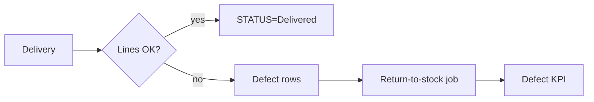

# `stock` module

Quantity-level operations: returns, exchanges between stores, write-offs,
purchase. Complements `warehouse` (which holds the documents).

## Controllers

`AddReturnController`, `BuyController`, `ExchangeStoresController`,
`ExcretionController`, `FinancialReportController`,
`StoreReportController`, `RoadmapStoreController`.

## Stock services

The shared `StockService` (`protected/components/StockService.php` if
present, otherwise embedded in controllers) is the single point that
mutates `stock` rows. Avoid hand-rolled SQL — concurrency bugs lurk there.

## Reservations

When an order moves to `Reserved`, `Stock::reserveForOrder()` decrements
available count and increments reserved count atomically.

## Key feature flow — Defect & Return

See **Feature — Defect & Return** in the
[FigJam board](../architecture/diagrams.md).

