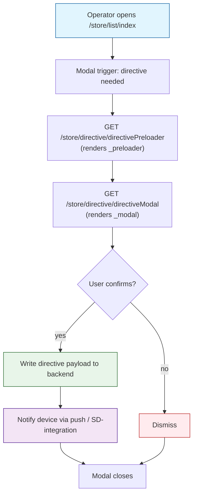

# `store` module

Retail store operations on top of `warehouse` — supplier **purchases**,
**directives** sent to retail stores, **material report** (consumption
ledger by warehouse) and the **list** view used by ops to find purchase
documents. 4 active controllers, 15 routes.

The `stock` module owns `Store` / `StoreDetail` / `StoreLog` (the
underlying tables). This module is the **operations UI** that writes
into them via supplier purchases and reads them for reports. The
multi-store-per-warehouse rules — including
`Store.VAN_SELLING = 0` and `Store.STORE_TYPE = 1` (line 14 of
`StorePurchase.php`) — are enforced here when listing eligible
destinations for a purchase.

## Key features

| Feature | What it does | Owner role(s) |
|---------|--------------|---------------|
| **Supplier purchase** | Operator creates a multi-line incoming purchase against a chosen warehouse, shipper and price type | 1 / 9 |
| **Purchase list**     | Paginated grid of purchase documents with status filters | 1 / 9 (`operation.stock.purchaseView`) |
| **Directive modal**   | Front-end modal (`_modal.php`) + preloader (`_preloader.php`) injected on stock pages to push instructions to the store | 1 |
| **Material report**   | Per-product / per-warehouse consumption ledger: opening balance + 13 movement columns (receipt, return, transfer, sale, bonus, write-off, etc.) | 1 / 9 (`operation.stock.materialReport`) |
| **Excel export**      | "Скачать" button on the material report exports the rendered grid | 1 / 9 |

## Folder

```
protected/modules/store/
├── controllers/
│   ├── DirectiveController.php       ← _modal / _preloader partials
│   ├── ListController.php            ← /store/list/index + fetchPurchases
│   ├── MaterialReportController.php  ← index / data / prices
│   └── PurchaseController.php        ← 8 actions, fetch* + savePurchase
├── models/
│   ├── Helper.php                    ← Helper::ParseGet / ParsePost
│   ├── Material.php                  ← material-report aggregator
│   └── StorePurchase.php             ← static methods used by PurchaseController
├── views/
└── assets/
```

## Key entities

This module does not own its own tables — it reads / writes through
the `stock` (warehouse) and shared models. Schema rows below come from
`schema-extract.json`.

| Entity | Model | Table | Notes |
|--------|-------|-------|-------|
| Store (warehouse) | `Store` | `d0_store` | 22 cols. `VAN_SELLING=0 AND STORE_TYPE=1` filter is the "retail store" rule used by purchase create |
| Store balance | `StoreDetail` | `d0_store_detail` | Per-product on-hand qty |
| Store log | `StoreLog` | `d0_store_log` | 11 cols. The material report joins this for every "Приход / Расход / Перемещение" row |
| Store stats | `StoreStats` | `d0_store_stats` | 15 cols. Periodic snapshot |
| Store history | `StoreHistory` | `d0_store_history` | 4 cols. Audit trail |
| Purchase doc | `Purchase` | `d0_purchase` | 30 cols. Header for incoming supplier purchase |
| Purchase line | `PurchaseDetail` | `d0_purchase_detail` | 21 cols. Per-product line with COST / COUNT / SUMMA |
| Purchase draft | `PurchaseDraft` | `d0_purchase_draft` | 17 cols. WIP purchase before submit |
| Purchase refund | `PurchaseRefund` | `d0_purchase_refund` | 27 cols. Return to supplier |
| Purchase refund line | `PurchaseRefundDetail` | `d0_purchase_refund_detail` | 17 cols |
| Shipper | `Shipper` | `d0_shipper` | Supplier dictionary, filtered by `ACTIVE='Y'` |
| Price type | `PriceType` | `d0_price_type` | Used to pick the purchase price list |
| Created stores | `CreatedStores` | `d0_created_stores` | 11 cols. Stores created from the UI |

## Controllers

| Controller | Purpose | Actions |
|-----------|---------|---------|
| `DirectiveController` | Renders the directive overlay partials used by the front-end across stock screens | `directiveModal`, `directivePreloader` |
| `ListController` | Purchase document list page + paginated JSON for the grid | `index`, `fetchPurchases` |
| `MaterialReportController` | Material consumption report. `actionData` re-aggregates `StoreLog` between `start_date` and `end_date` per warehouse | `index`, `data`, `prices` |
| `PurchaseController` | Supplier purchase creation: 6 fetch endpoints feed the UI dropdowns, `savePurchase` writes the doc | `index`, `fetchStores`, `fetchShippers`, `fetchProducts`, `fetchPriceTypes`, `fetchPrices`, `fetchOrder`, `savePurchase` |

## Directive issuance flow

The directive flow is the small but UX-critical "send an instruction
to the in-store device" overlay. Front-end pages on the stock module
include the partials and trigger them when an action is required.



## Supplier purchase flow

```mermaid
sequenceDiagram
  participant U as Operator
  participant W as Web (/store/purchase)
  participant P as PurchaseController
  participant SP as StorePurchase (model)
  participant DB as MySQL
  U->>W: open /store/purchase/index
  W->>P: actionIndex → render('index')
  W->>P: GET fetchStores / fetchShippers / fetchPriceTypes / fetchProducts
  P->>SP: FetchStores / FetchShippers / FetchPriceTypes / FetchProducts
  SP->>DB: SELECT … FROM d0_store / d0_shipper / d0_price_type / d0_product
  SP-->>W: JSON for dropdowns
  U->>W: POST line items
  W->>P: actionSavePurchase
  P->>SP: SavePurchase(post)
  SP->>DB: BEGIN; INSERT Purchase header; INSERT PurchaseDetail x N; UPDATE StoreDetail; INSERT StoreLog; COMMIT
  SP-->>W: {ok: true, purchase_id}
```

## Material report

`/store/materialReport` (harvested live — title "Материальный отчёт")
shows a 16-column grid with these movements:

| Column | Source movement |
|--------|-----------------|
| Товар | product reference |
| Остаток на &lt;start&gt; | computed opening balance |
| Приход | sum of incoming `StoreLog` rows |
| Расход | sum of outgoing rows |
| Остаток на &lt;end&gt; | computed closing balance |
| Поступление | supplier purchase (`Purchase`) |
| Корректировка+ / Корректировка- | `StoreCorrector` adjustments |
| Возврат с полки | shelf returns |
| Перемещение + / Перемещение - | inter-store transfers |
| Продажа | order detail movements |
| Возврат поставщику | `PurchaseRefund` |
| Бонус | bonus order movements |
| Списание | write-off |
| Обмен | exchange |

Filters: `start_date`, `end_date`, `warehouses[]`, `status` (`Y` / `N`).
Source: `MaterialReportController::actionData` (lines 18–45).

## API endpoints

The store module exposes only `/store/*` web endpoints. There is no
api2 / api3 / api4 surface in `routes.json` for store operations —
purchase creation goes through the web `savePurchase` action.

| Route | Method | Purpose |
|-------|--------|---------|
| `/store/list/index` | GET (HTML) | purchase grid page |
| `/store/list/fetchPurchases` | GET (JSON) | paginated grid data |
| `/store/purchase/index` | GET (HTML) | purchase editor page |
| `/store/purchase/savePurchase` | POST (JSON) | persist a new purchase |
| `/store/purchase/fetchStores` etc. | GET (JSON) | dropdown population |
| `/store/materialReport/index` | GET (HTML) | report page |
| `/store/materialReport/data` | GET (JSON) | report rows |
| `/store/materialReport/prices` | GET (JSON) | price helper |
| `/store/directive/directiveModal` | GET (HTML) | overlay partial |
| `/store/directive/directivePreloader` | GET (HTML) | overlay partial |

## Permissions

| Action | RBAC operation | Default roles |
|--------|----------------|--------------|
| `/store/list/*` | `operation.stock.purchaseView` | 1, 9 |
| `/store/materialReport/index`, `/data` | `operation.stock.materialReport` | 1, 9 |
| `/store/purchase/*` | _none in routes.json_ — controller-level | 1, 9 |
| `/store/directive/*` | _none_ — partial-renderers, no RBAC | called from authenticated pages only |

`PurchaseController` extends `Controller` (not `ApiController`), so it
inherits the global access filter. To lock it down further, add an
`operation.stock.purchase.save` RBAC rule and check it inside
`actionSavePurchase`.

## Gotchas

- **Multi-store rule.** `StorePurchase::FetchStores` only returns stores
  with `VAN_SELLING = 0` AND `STORE_TYPE = 1`. Van stores (mobile
  expeditor stores) and other store types are deliberately hidden from
  the purchase form. If a new store doesn't appear in the dropdown,
  check these two columns first.
- **Material report opening balance is computed, not stored.** The
  `start_date` balance comes from `calculateStockBalance` which sums
  every `StoreLog` row before the date. Large date ranges are slow —
  there is no covering index, only a per-warehouse + day filter.
- **Directive partials are not pages.** `directiveModal` and
  `directivePreloader` render fragments via `renderPartial` and are
  meant to be loaded by Ajax into another page. Hitting them directly
  shows an unstyled HTML stub.
- **`ReportController.php.obsolete`.** An older "store report" lives
  next to the active controllers but is deactivated by the `.obsolete`
  suffix. Do not revive it without checking the material report's
  feature parity first.

## Cross-module touchpoints

- **Reads `stock.Store`** with the retail filter
  (`VAN_SELLING = 0 AND STORE_TYPE = 1`) — see
  `StorePurchase::FetchStores` line 14.
- **Reads `stock.StoreDetail`** to display per-product on-hand counts
  in the purchase editor.
- **Writes `stock.StoreLog`** on every successful purchase /
  correction — that is also what the material report sums up.
- **Reads `agents.Shipper`** with `ACTIVE='Y'` filter — supplier
  dropdown source.
- **Reads `price.PriceType`** via `PriceType::model()->getFilialData()`
  — only price types active in the current filial.
- **Reads `product.Product` + `product.ProductCategory` + `product.Unit`** —
  product picker dropdown (`FetchProducts`).
- **Reads `product.FilialProduct::getConditionProducts`** — the
  "red product" inclusion rule.
- **Reads `client.Diler`** — implicitly via `BaseFilial` scoping on
  every model.

## Entry points

| Trigger | Controller / Action | Notes |
|---------|---------------------|-------|
| Web — Operator opens the purchase list | `ListController::actionIndex` | Renders `index`, RBAC `operation.stock.purchaseView` |
| Web — Grid paging | `ListController::actionFetchPurchases` | JSON, same RBAC gate |
| Web — Operator opens new purchase form | `PurchaseController::actionIndex` | Renders `index` (no RBAC at route level — controller-level only) |
| Web — Dropdown population | `PurchaseController::actionFetchStores` / `actionFetchShippers` / `actionFetchProducts` / `actionFetchPriceTypes` / `actionFetchPrices` | One AJAX call per dropdown; helpers in `StorePurchase` |
| Web — Find an existing order to receipt | `PurchaseController::actionFetchOrder` | Forwards to `StorePurchase::FetchPurchases` |
| Web — Submit the new purchase | `PurchaseController::actionSavePurchase` | Calls `StorePurchase::SavePurchase(post)`; writes `Purchase` + `PurchaseDetail` + `StoreLog` |
| Web — Material report page | `MaterialReportController::actionIndex` | RBAC `operation.stock.materialReport` |
| Web — Material report data | `MaterialReportController::actionData` | JSON, same RBAC gate |
| Web — Material report prices helper | `MaterialReportController::actionPrices` | JSON, no RBAC at route level |
| Front-end — Directive overlay open | `DirectiveController::actionDirectiveModal` | `renderPartial('_modal')` |
| Front-end — Directive overlay loading state | `DirectiveController::actionDirectivePreloader` | `renderPartial('_preloader')` |

## See also

- [`stock`](./stock.md) — owns `Store`, `StoreDetail`, `StoreLog`
- [`warehouse`](./warehouse.md) — purchase / inventory life-cycle
- [`inventory`](./inventory.md) — periodic stock-take that also writes `StoreLog`
- [`orders`](./orders.md) — sales side of the same ledger
