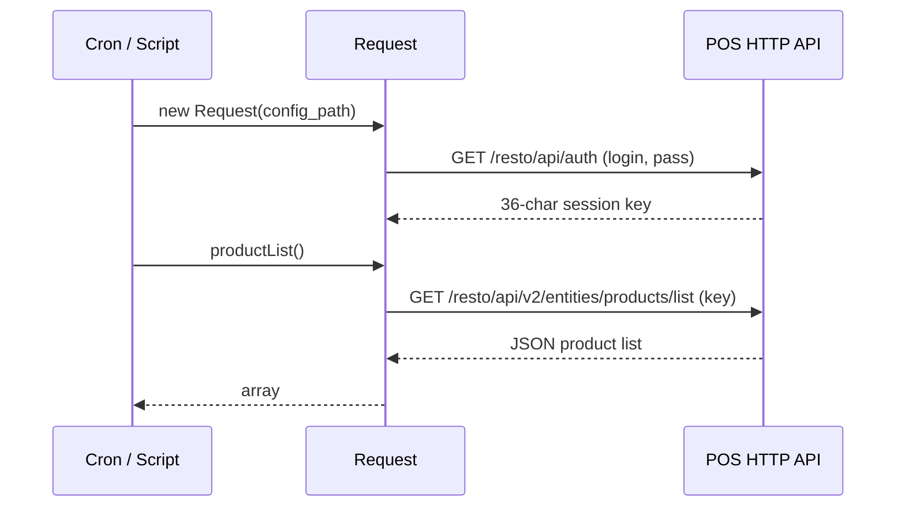

# `sync` module

Bi-directional data synchronisation. Despite being a Yii module, the
`sync` directory itself has **no active controllers** — every active
file under `controllers/` is `.obsolete`. The actual sync work is
distributed:

- **Mobile pull / push** is served by per-resource endpoints under
  `api3/*` (clients, products, orders, prices, etc.) — not by a
  single `/sync` endpoint.
- **Per-row audit** is written to the `sync_log` table by the mobile
  back-end whenever an order or related artefact is pulled / pushed.
- **POS bridge** (e.g. iiko) lives in `sync/components/Request.php`
  and is used by background scripts, not by an HTTP controller.
- **Outbound integration** (1C / Faktura / Didox / TraceIQ) lives in
  the [`integration`](./integration.md) module — `sync` does not own
  the export jobs.

## Key features

| Feature | What it does | Owner |
|---------|--------------|-------|
| **Mobile pull (agent / expeditor / auditor)** | Each resource has its own `api3` endpoint that returns rows newer than the device's last cursor | api3 controllers |
| **Mobile push (orders, payments, visits, audit results)** | Mobile uploads new artefacts; server resolves dup via `ModelLog` GUID | api3 controllers |
| **Sync audit** | Every device pull / push writes to `sync_log` (12 cols) — used by support to reconstruct what a device saw | `SyncLog` model |
| **Sync watermark** | Per-table `Sync` row holds `{DILER_ID, TABLE, TIME, STATUS}` — last-known-good cursor for back-end batchers | `Sync` model |
| **POS bridge** | `Request` component authenticates to a POS HTTP API (iiko-style) and pulls product / category lists | `sync/components/Request.php` |
| **Module shell** | `SyncModule.php` imports `sync.models.*` and `sync.components.*` and forces HTTPS via `Distr::goToHttps()` | `SyncModule` |

## Folder

```
protected/modules/sync/
├── SyncModule.php                ← module bootstrap (imports models + components)
├── components/
│   └── Request.php               ← POS HTTP client (iiko-style auth + productList)
├── controllers/                  ← every file is .obsolete
│   ├── DefaultController.php.obsolete
│   ├── DilerController.php.obsolete
│   ├── ProductController.php.obsolete
│   ├── PurchaseController.php.obsolete
│   ├── ServerController.php.obsolete
│   └── SettingController.php.obsolete
└── views/
    └── (every view is .obsolete)
```

## Key entities

The two model files live in `protected/models/` (not in
`sync/models/`) because they pre-date the module folder layout.

| Entity | Model | Table | Cols | Notes |
|--------|-------|-------|------|-------|
| Sync watermark | `Sync` | `d0_sync` | 5 | `{ID, DILER_ID, TIME, TABLE, STATUS}` — per-table last-sync cursor |
| Sync audit row | `SyncLog` | `d0_sync_log` | 12 | `{ID, DILER_ID, AGENT_ID, USER_ID, CLIENT_ID, ORDER_ID, MOBILE_ORDER_ID, TYPE, STATUS, DEVICE_TOKEN, DAY, TIMESTAMP_X}` — one row per mobile pull / push event |

Both extend `BaseFilial` so they are scoped per tenant (per `DILER_ID`).

## What's in `Sync` vs `SyncLog`

- `Sync.TIME` is a **string up to 12 chars** holding the most recent
  `TIMESTAMP_X` the back-end pushed for that `TABLE`. It is read on
  the next batch to skip rows already known to be sent.
- `SyncLog.MOBILE_ORDER_ID` is the **GUID generated on the device**.
  Server stores it on first push so that retried pushes can be
  de-duplicated. This is the same idea as `ModelLog` for the orders
  module — the two tables co-exist for historic reasons.
- `SyncLog.TYPE` is a string and is set by the mobile back-end to
  identify what kind of sync happened (e.g. `pullOrders`,
  `pushOrder`, `pullClients`). Not all values are enumerated in code
  — investigate `protected/modules/api3/` for callers.

## Mobile sync handshake

There is no single `/api3/sync` endpoint. Each resource the mobile
client needs is fetched from its own `api3/<controller>/<action>`
endpoint, gated by `LoginController::login` issuing a session token.

```mermaid
sequenceDiagram
  participant M as Mobile
  participant API as api3
  participant DB as MySQL
  M->>API: POST /api3/login/login (auth)
  API-->>M: session token + device_token
  M->>API: GET /api3/auditor/config?from=&lt;cursor&gt;
  API->>DB: SELECT config rows WHERE TIMESTAMP_X &gt; cursor
  API-->>M: rows + new cursor
  M->>API: GET /api3/auditor/clientsV3?from=&lt;cursor&gt;
  API-->>M: rows + new cursor
  M->>API: GET /api3/priceType/all
  API-->>M: rows
  Note over M,API: many parallel pulls — one per resource
  M->>API: POST /api3/orders/create/order (guid, items[])
  API->>DB: check ModelLog for duplicate guid
  alt duplicate
    API-->>M: ERROR_CODE_ORDER_IS_IN_PROCESS (client treats as success)
  end
  API->>DB: INSERT Order + OrderDetail + SyncLog row
  API-->>M: {order_id, server_id}
```

## Conflict resolution

The system relies on three rules instead of a generic CRDT:

1. **Server wins for catalog / pricing / config.** Anything pulled
   from `api3/product/*`, `api3/priceType/*`, `api3/auditor/config`
   etc. overwrites the mobile copy. The device is treated as a thin
   client for read data.
2. **Client wins for new offline artefacts.** Orders, payments,
   visits, audit results created on-device carry a client-generated
   GUID (`MOBILE_ORDER_ID` for orders, equivalent fields elsewhere).
   The server inserts them on first push and rejects later duplicates
   with `ERROR_CODE_ORDER_IS_IN_PROCESS`. The mobile app treats this
   as success so retries are idempotent.
3. **Last-write-wins for client / outlet edits.** When a field agent
   edits a client (name, GPS, contacts), the server timestamp is
   compared to the device's; the newest payload sticks.

The cursor itself (`Sync.TIME` on the server side and `lastSyncAt`
in mobile local storage) is a `TIMESTAMP_X` value, not a sequence
number. Devices send `from=2026-05-15 12:34:56` on the next pull.

## Retry / backoff

- Mobile retry is **handled in the mobile app**, not in this module.
  The convention is exponential back-off (1s, 2s, 4s, 8s, 16s, cap
  30s) with the same payload + GUID.
- The server-side de-dup that makes that safe is the `ModelLog` /
  `MOBILE_ORDER_ID` lookup before insert.
- HTTP failures inside the POS bridge (`Request::auth`) are surfaced
  to the caller — there is no inline retry in `Request.php`.
- Look at `protected/modules/api3/components/*` for the actual error
  envelope and any throttling — *[TBD — investigate
  protected/modules/api3/components/]*.

## POS bridge — `components/Request.php`



The class authenticates with HTTP Basic-style `login`/`pass` (read
from a JSON config file) against a POS service whose URL family
`/resto/api/*` matches iiko's external API. It is invoked from
maintenance scripts; there are no Yii routes pointing at it.

## API endpoints (relevant to sync)

There is no `/sync/*` route. Sync work flows over these api3
controllers (each is documented in the
[api-v3-mobile reference](../api/api-v3-mobile/index.md)):

| Path family | Direction | Owner controller |
|-------------|-----------|------------------|
| `/api3/login/*` | session start | `LoginController` |
| `/api3/auditor/*` | pull (clients, channel, config, GPS visits, comments, audit) | `AuditorController` |
| `/api3/expeditor/*` and `/api3/expeditor2/*` | pull (client / akt / bonus / discount) and push (delivery results) | `ExpeditorController` / `Expeditor2Controller` |
| `/api3/orders/*` | push (create / payment) | `OrderController` |
| `/api3/visit/*` | push (start / end / GPS) | `VisitController` |
| `/api3/product/*` | pull (catalog) | `ProductController` |
| `/api3/priceType/*` | pull | `PriceTypeController` |
| `/api3/photo/*` | push (photo report) | `PhotoController` |
| `/api3/stock/*` | pull (van stock) | `StockController` |
| `/api3/finans/*` | pull (client balance) | `FinansController` |
| `/api3/gps/*` | push | `GpsController` |
| `/api3/history/*` | pull (order history) | `HistoryController` |
| `/api3/logout/logout` | session end | `LogoutController` |

Cross-system **outbound** sync (1C / Faktura / Didox / TraceIQ) is
in [`integration`](./integration.md). Look for the
`sync-incoming-invoices` and `sync-products` routes there.

## Permissions

This module has no controllers, so it has no RBAC operations of its
own. Access is enforced by the underlying api3 controllers via the
`H::access(...)` helper and by `LoginController` issuing or refusing
a session token. The web-app login is enforced by Yii's
`accessControl` filter on each api3 controller.

## Gotchas

- **No `/sync` URL.** Engineers occasionally look for a single sync
  endpoint and add new sync logic in `sync/controllers/`. There is no
  active controller in this folder — add new mobile endpoints under
  `api3` and write to `SyncLog`.
- **`Sync.TIME` is a string.** It is a textual `TIMESTAMP_X` value
  (max 12 chars). When comparing on the back-end, cast to `DATETIME`
  or compare lexicographically with care.
- **`SyncLog` grows unbounded.** There is no archival job in this
  module. Add a cron in `protected/commands/InternalCommand` if it
  becomes too large.
- **The `Request` component is iiko-shaped.** It assumes a POS
  service exposing `/resto/api/auth` and `/resto/api/v2/entities/products/list`.
  Re-use only when integrating an iiko-compatible POS.
- **Inbound 1C / Faktura / Didox sync lives elsewhere.** Look at the
  [`integration`](./integration.md) module — `sync` does not call
  those services.

## Cross-module touchpoints

- **`orders.ModelLog`** — the de-dup record for `MOBILE_ORDER_ID`.
  The api3 order-create path checks it first and short-circuits with
  `ERROR_CODE_ORDER_IS_IN_PROCESS` on a duplicate GUID.
- **`api3.LoginController`** — issues the session token + device
  token used by every subsequent pull / push.
- **`stock.StoreDetail`** — read by `api3/stock/*` for van-stock
  display on the mobile.
- **`finans.ClientTransaction`** — read by `api3/finans/*` for
  client-balance display before recording a payment.
- **`audit.AuditResult`** — pushed by `api3/auditor/auditResult` from
  the auditor app.
- **`integration` module** — outbound 1C / Faktura / Didox / TraceIQ
  sync; do **not** add 1C calls here.
- **`Distr::goToHttps()`** — module bootstrap forces HTTPS so any
  attempted HTTP call to `/sync/*` is 301-ed.

## Sync log shape

A single `SyncLog` row identifies a device interaction:

```
{
  ID,                  // pk
  DILER_ID,            // tenant
  AGENT_ID,            // who is logged in
  USER_ID,             // server-side user id
  CLIENT_ID,           // which client this sync was about (nullable)
  ORDER_ID,            // server order id once assigned
  MOBILE_ORDER_ID,     // client-generated GUID — pre-assignment identifier
  TYPE,                // free-form: pullOrders / pushOrder / pullClients / ...
  STATUS,              // success / error string
  DEVICE_TOKEN,        // device fingerprint
  DAY,                 // YYYY-MM-DD shard key
  TIMESTAMP_X          // exact event timestamp
}
```

When support asks "did the device see this order yesterday?", the
answer is in `SyncLog` — join on `MOBILE_ORDER_ID = ?` for unsent
artefacts or `ORDER_ID = ?` for ones the server has acknowledged.

## Entry points

| Trigger | Where it runs | Notes |
|---------|---------------|-------|
| Mobile authenticates | `api3/LoginController::login` | Returns session token |
| Mobile pulls config | `api3/auditor/config` / `api3/expeditor/clientConfig` | Returns per-role flags |
| Mobile pulls catalog | `api3/product/*`, `api3/priceType/all` | Server-wins |
| Mobile pulls clients / outlets | `api3/auditor/clientsV3` / `api3/outlet/*` | Cursor-based |
| Mobile pulls van stock | `api3/stock/*` | Read-only |
| Mobile pushes order | `api3/orders/create/order` | GUID de-dup; writes `SyncLog` row |
| Mobile pushes payment | `api3/orders/payment/set` | Writes `ClientTransaction` |
| Mobile pushes visit | `api3/visit/*` | Writes `Visit` |
| Mobile pushes audit result | `api3/auditor/auditResult` | Writes `AuditResult` |
| Mobile pushes photos | `api3/photo/*` | Writes `PhotoReport` |
| Mobile pushes GPS track | `api3/gps/*` | Writes `Gps*` rows |
| POS bridge — auth | `Request::auth` | iiko-style |
| POS bridge — pull products | `Request::productList` | iiko `entities/products/list` |

## See also

- [`integration`](./integration.md) — outbound 1C / EDI / TraceIQ sync
- [api-v3-mobile reference](../api/api-v3-mobile/index.md) — the actual sync surface
- [`orders`](./orders.md) — `ModelLog` GUID de-dup
- [`gps`](./gps.md) — GPS-track push and visit-GPS pull
