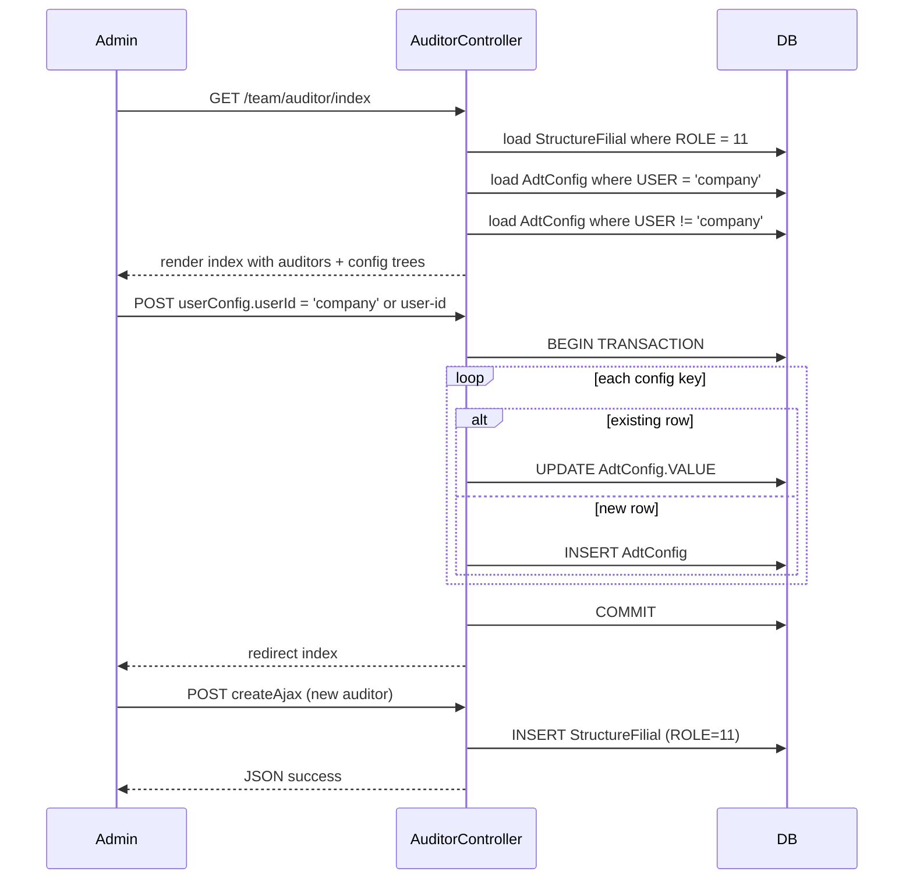
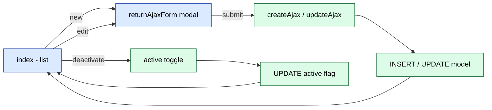

# `team` module

`team` is the admin-side trading-team manager. It groups together four
CRUD-style controllers — auditors, agents, supervisors and users — under one
URL namespace, mostly so a single tenant admin can configure the whole field
force from one place. It overlaps with `staff` and `agents` but is distinct:

- **`staff`** (in the `settings-access-staff` module) — the internal HR
  module for back-office employees.
- **`agents`** — the field-force module with daily plans, KPI, GPS, etc.
- **`team`** — the trading-team admin surface, primarily for the **auditor**
  role and the **ADT (Audit Doctor Team)** configuration that lives behind
  the auditor screen.

The team-auditor screen is also the home of the per-company ADT configuration
panel (`AdtConfig`) — the same config that the audit-v2 mobile flows read.

## Key features

| Feature | What it does | Owner role(s) |
|---------|--------------|---------------|
| **Auditor list / CRUD** | Create, update, deactivate auditors; configure their ADT settings | 1, 3 |
| **Agent list / CRUD** | Mirror of `agents` module — add agents to the trading team | 1, 3 |
| **Supervisor list / CRUD** | Create, update, deactivate supervisors | 1, 3 |
| **User list / CRUD** | Generic user CRUD scoped to the trading-team namespace | 1, 3 |
| **ADT company config** | Per-tenant audit settings (audit type, photo rules, etc.) | 1 |
| **ADT per-user config** | Override ADT settings for individual users | 1 |
| **Active toggle** | Soft-disable a team member (set inactive without delete) | 1, 3 |
| **AJAX modal forms** | All four controllers use the shared `AjaxCrudBehavior` for inline edit | – |

## Folder

```
protected/modules/team/
├── controllers/
│   ├── AuditorController.php    # 6 actions — primary screen
│   ├── AgentController.php      # 6 actions — agent CRUD (delegates to /agents/agent/)
│   ├── SupervisorController.php # 6 actions
│   └── UserController.php       # 5 actions
├── models/
└── views/
```

## Key entities

| Entity | Model | Notes |
|--------|-------|-------|
| Trading-team member | `StructureFilial` | Generic team-member row; auditor rows have `ROLE = 11` |
| ADT default config | `AdtConfig::$settings` (constants) | Hard-coded default ADT setting catalogue |
| ADT company config | `AdtConfig (USER = 'company')` | Per-tenant overrides of the defaults |
| ADT user config | `AdtConfig (USER <> 'company')` | Per-user overrides |
| Agent | `Agent` | From the `agents` module — auditor screen also lists agent rows |
| Supervisor | `Supervayzer` | From the `agents` module |
| User | `User` | Core auth + RBAC user record |

## Controllers

| Controller | Purpose | # actions |
|------------|---------|-----------|
| `AuditorController` | Auditor list + form + ADT config (the only screen with non-trivial logic) | 6 |
| `AgentController` | Agent list/form — `url_controll = /agents/agent/` (delegates to agents module URLs) | 6 |
| `SupervisorController` | Supervisor list/form | 6 |
| `UserController` | Generic user list/form | 5 |

The four controllers share the same shape — all extend the AjaxCrudBehavior
and expose `index`, `create`, `update`, `createAjax`, `returnAjaxForm`,
`active` (toggle), plus a `getData` helper on `UserController`.

## Routes

All 23 routes; only the `index` actions are RBAC-gated:

| Route | RBAC | Render | Purpose |
|-------|------|--------|---------|
| `/team/auditor/index` | `operation.settings.tradingTeam` | `index` | Auditor list + ADT config panel |
| `/team/auditor/create` | – | `auditor` | New auditor form |
| `/team/auditor/update` | – | `auditor` | Edit auditor form |
| `/team/auditor/createAjax` | – | – | AJAX create |
| `/team/auditor/active` | – | – | Toggle active flag |
| `/team/auditor/returnAjaxForm` | – | – | Return form HTML for modal |
| `/team/agent/index` | `operation.settings.tradingTeam` | `index` | Agent list |
| `/team/agent/create` | – | `form` | New agent form |
| `/team/agent/update` | – | `form` | Edit agent form |
| `/team/agent/createAjax` | – | – | AJAX create |
| `/team/agent/active` | – | – | Toggle active flag |
| `/team/agent/returnAjaxForm` | – | – | Return form HTML for modal |
| `/team/supervisor/index` | `operation.settings.tradingTeam` | `index` | Supervisor list |
| `/team/supervisor/create` | – | `form` | New supervisor form |
| `/team/supervisor/update` | – | `form` | Edit supervisor form |
| `/team/supervisor/createAjax` | – | – | AJAX create |
| `/team/supervisor/active` | – | – | Toggle active flag |
| `/team/supervisor/returnAjaxForm` | – | – | Return form HTML for modal |
| `/team/user/index` | – | `index` | Generic user list |
| `/team/user/createAjax` | – | – | AJAX create |
| `/team/user/getData` | – | – | JSON data fetch |
| `/team/user/active` | – | – | Toggle active flag |
| `/team/user/returnAjaxForm` | – | – | Return form HTML for modal |

## Auditor CRUD flow



## Team CRUD pattern

All four controllers share a single CRUD pattern via the shared
`AjaxCrudBehavior`. The differences are in the model class and view template:



## ADT config panel

The auditor screen is unusual because it doubles as the ADT
(Audit Doctor Team) configuration panel. `AdtConfig::$settings` defines a
catalogue of ADT setting groups (audit type, photo rules, walk-in rules,
etc.) with field types `TYPE_CHECKBOX`, `TYPE_TEXT`, `TYPE_SELECT`. The
controller renders the catalogue, merges company + per-user overrides, and
persists submitted changes in a single DB transaction.

The per-tenant `company` row is the canonical config — per-user rows only
exist when an admin overrides a value for one specific user. When loading,
the controller fills missing values from the defaults so the panel is always
fully populated.

## Harvested page

`/team/auditor` was harvested by the Playwright crawler. Captured signal:

| Item | Value |
|------|-------|
| Title | "Sales Doctor - Auditor" |
| Status | 200 |
| Screenshot | `static/screens/admin/team_auditor.jpg` |
| Columns | User, Login, APK version, Last sync |
| Toolbar buttons | Find pages, Save, Cancel, Close, Add, Configuration for company, Finish, Block, Allow |

The "Configuration for company" button is the ADT config panel entry point.
The "APK version" and "Last sync" columns confirm the screen is the operator
view for managing the audit mobile-app users.

## Cross-module touchpoints

- **`agents` module.** `/team/agent/*` delegates URLs to `/agents/agent/` —
  the team module is a thin admin wrapper around the agents-module surface.
- **`audit` module.** The ADT configuration written here is read by the
  audit-v2 mobile flows. See `modules/audit-adt.md`.
- **`access` / `staff`.** Compare with `settings-access-staff.md` for the
  back-office HR side.

## Permissions

| Action | RBAC operation |
|--------|----------------|
| Open any team list (`index`) | `operation.settings.tradingTeam` |
| Create / update / deactivate | inherited from controller `accessRules` — typically roles 3 (operator), 5 (supervisor), 9 (warehouse) |
| ADT config write | gated at the auditor `index` view |

## Gotchas

- **`AgentController::$url_controll = '/agents/agent/'`.** The team-side
  AgentController hijacks the agents-module URL prefix via the
  `AjaxCrudBehavior`. Any UI changes here affect the agents-module screen
  as well.
- **`StructureFilial::ROLE = 11` is hard-coded for auditors.** Other team
  roles use different `ROLE` values; the auditor screen filters on `11`
  explicitly in `AuditorController::getData()` (line ~65).
- **Per-user ADT override matching.** When a user has any per-user
  `AdtConfig` row, the controller treats them as opted-in and seeds the
  rest of their settings from defaults. There is no "company-only" mode for
  a user once any override exists.
- **AJAX modal HTML returned raw.** `returnAjaxForm` renders the form via
  `renderPartial` and returns the HTML directly — do not call from outside
  the admin UI.
- **`UserController::actionIndex` has no RBAC string.** It relies on the
  controller-level `accessRules` to keep non-team admins out.

## See also

- [`agents`](./agents.md) — agent master data, KPI, GPS, daily plans
- [`audit-adt`](./audit-adt.md) — audit-v2 mobile flows that consume ADT config
- [`settings-access-staff`](./settings-access-staff.md) — back-office HR module
- [Team QA workflows](../quality/team/index.md)
