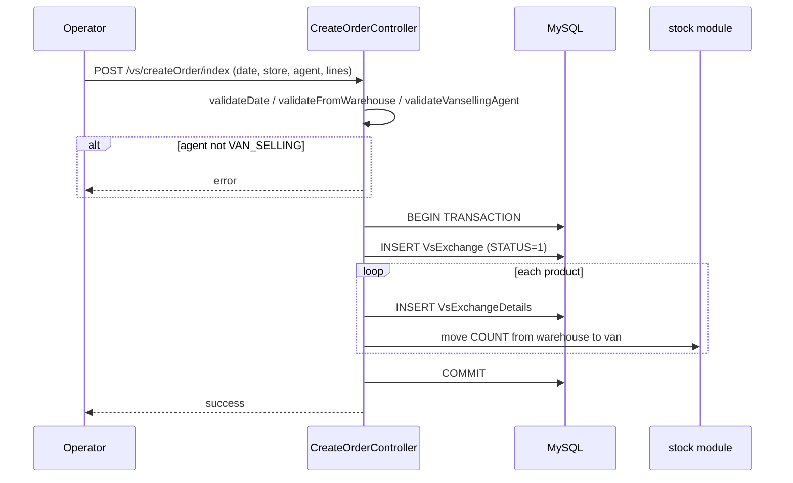
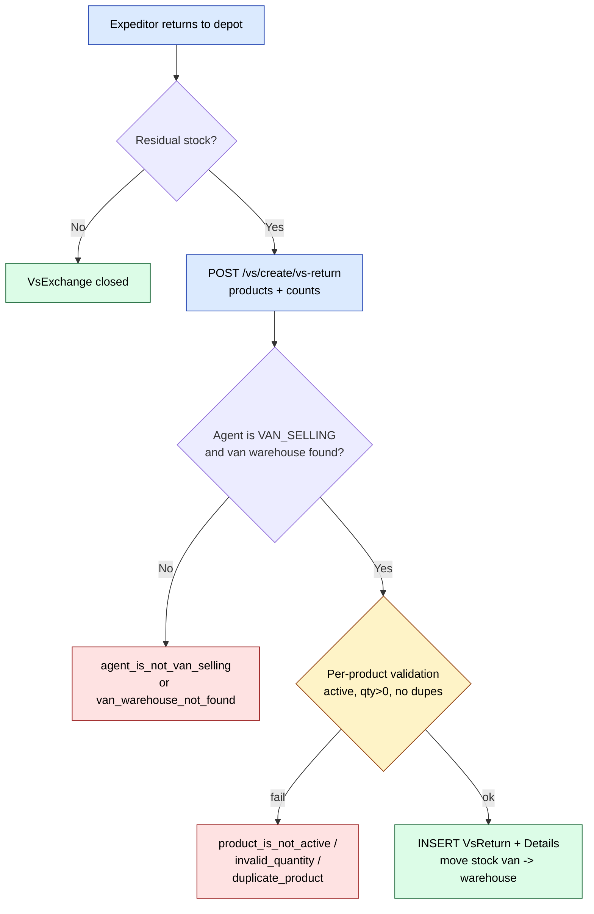

# `vs` module

Van-selling (Russian "vansell" / "ванселлинг"). The expeditor drives
a stocked van out into the field, sells directly to clients, and
returns leftovers to the warehouse at end-of-day. Unlike regular
[`orders`](./orders.md), there is **no separate delivery step** —
the sale and delivery happen as a single transaction at the
client's door.

The module owns the **van load**, **mobile cash sale**, and
**residual-stock return** screens. Stock movements themselves live
in the [`stock`](./stock.md) module (`VsExchangeController`,
`VsReturnController`) — this module owns the front-of-house UI and
the mobile API surface.

## Key features

| Feature | What it does | Owner role(s) |
|---------|--------------|---------------|
| **Van load (vsExchange)** | Operator builds a load order: warehouse → van transfer with price-type fixed | 1 / 2 / 3 / 9 |
| **Status workflow** | Van-load orders move through configurable statuses (`vsAvailableStatus` flag gates mobile visibility) | system |
| **Mobile sale** | Expeditor sells from van stock via api3; balance check via `GetStockBalanceAction` | 10 |
| **Van return (vsReturn)** | Residual stock comes back to the warehouse; per-product count & amount | 1 / 9 / 10 |
| **Return Act report** | Excel / print export of the return ledger via `ListActReportAction` | 1 / 9 |
| **Status downgrade gate** | `operation.vs.deny.status.to.lower` blocks status rollback once committed | 1 |
| **Configurable available status** | `params['vsAvailableStatus']` — only at/after this status is the van's stock visible in the mobile app | system |

## Folder

```
protected/modules/vs/
├── VsModule.php                       # defaultController = Order
├── actions/
│   ├── CreateVsReturnAction.php       # api3 — create return doc
│   ├── EditVsReturnAction.php
│   ├── EditVsReturnDateAction.php
│   ├── EditVsReturnStatusAction.php
│   ├── GetVsReturnAction.php
│   ├── ListVsReturnAction.php
│   ├── ListActReportAction.php
│   └── stock/
│       └── GetStockBalanceAction.php  # api — current van balance
├── controllers/
│   ├── ApiController.php              # 1 mobile API action
│   ├── CreateController.php           # mounts CreateVsReturnAction
│   ├── CreateOrderController.php      # web — create van-load
│   ├── EditController.php             # mounts EditVsReturn* actions
│   ├── EditOrderController.php        # web — edit van-load
│   ├── GetController.php              # mounts GetVsReturnAction
│   ├── ListController.php             # mounts ListVsReturn / ListActReport
│   ├── OrderController.php            # web — van-load list (defaultController)
│   └── ViewController.php             # web — return list & view pages
└── views/
    ├── createOrder/
    ├── editOrder/
    ├── order/                         # /vs/order
    └── view/return/                   # /vs/view/return
```

## Key entities

| Entity | Model | Owned by module | Notes |
|--------|-------|-----------------|-------|
| Van-load header | `VsExchange` (`d0_vs_exchange`) | `stock` (model) — UI driven by `vs` | Cols: `ID`, `STATUS`, `FROM_STORE_ID` (warehouse), `TO_STORE_ID` (van), `AGENT_ID` (expeditor), `PRICE_TYPE_ID`, `DATE`, `DATE_LOAD`, `COUNT`, `AMOUNT`, `COMMENT`. |
| Van-load line | `VsExchangeDetails` (`d0_vs_exchange_details`) | `stock` | `PRODUCT_ID`, `COUNT`, `PRICE`, `AMOUNT`. |
| Return header | `VsReturn` (`d0_vs_return`) | `stock` | Cols: `ID`, `STATUS`, `AGENT_ID`, `PRICE_TYPE_ID`, `FROM_STORE_ID` (van), `TO_STORE_ID` (warehouse), `DATE`, `DATE_RETURN`, `COUNT`, `AMOUNT`. |
| Return line | `VsReturnDetails` (`d0_vs_return_details`) | `stock` | `PRODUCT_ID`, `COUNT`, `PRICE`, `AMOUNT`. |

The `vs` module **does not** own its own AR models — they sit in
`application.models.*` and are shared with the `stock` module's
`VsExchangeController` / `VsReturnController`. The `vs` module is
purely a controller / action / view package on top of those tables.

## Controllers

| Controller | Actions | Purpose |
|------------|---------|---------|
| `OrderController` | `index`, `preload`, `getData`, `filter`, `changeStatus`, `vsOrderDetails` | Van-load list page (`/vs/order`) — filtered grid + JSON data feeds + status change |
| `CreateOrderController` | `index` (GET + POST) | Web van-load creation (warehouse → van transfer) |
| `EditOrderController` | `index` (GET + POST), `getDetail` | Web van-load edit + JSON detail feed |
| `ViewController` | `return`, `add`, `edit`, `view` | Van-return page family (`/vs/view/return` and sub-pages) |
| `ApiController` | `get-stock-balance` | Mobile — current van balance per product |
| `CreateController` | `vs-return` action class | Mobile — create return document |
| `EditController` | `vs-return`, `vs-return-status`, `vs-return-date` | Mobile — edit return / change status / change date |
| `GetController` | `vs-return` | Mobile — read one return |
| `ListController` | `vs-return`, `act-report` | Mobile / web — list returns; Act report Excel |

## Harvested admin URLs

| URL | Title | Source |
|-----|-------|--------|
| `/vs/order` | Заявки (Vansell) | `OrderController::actionIndex` |
| `/vs/view/return` | Возврат ванселлов | `ViewController::actionReturn` |
| `/vs/view/add` | Возврат ванселлов добовление | `ViewController::actionAdd` |
| `/vs/view/edit` | Возврат ванселлов редактирование | `ViewController::actionEdit` |
| `/vs/view/view` | Возврат ванселлов просмотр | `ViewController::actionView` |

Both list pages were harvested live; see [`/vs/order` page atom](../ui/pages/vs/vs_order.md) and [`/vs/view/return` page atom](../ui/pages/vs/vs_view_return.md) for grid columns and filter shape.

## Status & stock flow

```mermaid
flowchart LR
  WH["Warehouse<br/>FROM_STORE_ID"]:::external
  OP[Operator builds<br/>van-load]:::action
  VS[VsExchange<br/>STATUS draft]:::action
  VAV[VsExchange<br/>STATUS >= vsAvailableStatus]:::approval
  VAN["Van warehouse<br/>TO_STORE_ID"]:::external
  EXP[Expeditor sells<br/>door-to-door via api3]:::success
  RET[VsReturn<br/>created on dock]:::action
  WHB["Warehouse<br/>residual returned"]:::success

  WH --> OP --> VS --> VAV --> VAN --> EXP
  EXP --> RET --> WHB

  classDef action   fill:#dbeafe,stroke:#1e40af,color:#000
  classDef approval fill:#fef3c7,stroke:#92400e,color:#000
  classDef success  fill:#dcfce7,stroke:#166534,color:#000
  classDef reject   fill:#fee2e2,stroke:#991b1b,color:#000
  classDef external fill:#f3f4f6,stroke:#374151,color:#000
  classDef cron     fill:#ede9fe,stroke:#6d28d9,color:#000
```



Van stock is **invisible to the mobile app** until `VsExchange.STATUS`
reaches the value configured in `params['vsAvailableStatus']`. The
`actionPreload` endpoint exposes this gate to the web UI.

## API endpoints

| Endpoint | Module | Purpose |
|----------|--------|---------|
| `GET /vs/api/get-stock-balance` | `vs` | Mobile — current van balance per product (called by expeditor app before a sale) |
| `POST /vs/create/vs-return` | `vs` | Mobile — create a return document |
| `POST /vs/edit/vs-return` | `vs` | Mobile — edit return lines |
| `POST /vs/edit/vs-return-status` | `vs` | Mobile — change return status |
| `POST /vs/edit/vs-return-date` | `vs` | Mobile — change return date |
| `GET /vs/get/vs-return` | `vs` | Mobile — read a return |
| `GET /vs/list/vs-return` | `vs` | Mobile / web — list returns |
| `GET /vs/list/act-report` | `vs` | Web — Act report Excel/print |

`CreateVsReturnAction` enforces five domain errors (see source):

- `agent_is_not_van_selling`
- `van_warehouse_not_found`
- `product_is_not_active`
- `invalid_quantity`
- `duplicate_product`

[TBD — confirm transaction boundaries in `CreateVsReturnAction::run()`]

## Permissions

| Action | Routes | Roles (gate) |
|--------|--------|--------------|
| View van-load list | `/vs/order/index`, `/vs/order/getData`, `/vs/order/vsOrderDetails` | `operation.stock.vsExchange` |
| Create van-load | `/vs/createOrder/index` | `operation.stock.vsExchangeAdd` |
| Edit van-load | `/vs/editOrder/index`, `/vs/editOrder/getDetail` | `operation.stock.vsExchangeEdit` |
| Status downgrade | `/vs/order/changeStatus` | `operation.vs.deny.status.to.lower` (deny gate) |
| View returns | `/vs/view/return`, `/vs/view/view` | `operation.stock.vsReturn` |
| Add / edit returns | `/vs/view/add`, `/vs/view/edit` | `operation.stock.vsReturn` |

Typical role mapping (per the `access` module):

| Action | Roles |
|--------|-------|
| Load van | 1, 2, 3, 9 |
| Sell from van (mobile) | 10 (expeditor) |
| Return & settle | 1, 9, 10 |

## See also

- [`stock`](./stock.md) — `VsExchangeController` / `VsReturnController` own the stock-side accounting
- [`orders`](./orders.md) — regular order flow (separate delivery step)
- [`agents`](./agents.md) — `AGENT.VAN_SELLING` flag marks an expeditor as eligible
- [`api/api-v3-mobile`](../api/api-v3-mobile/index.md) — mobile cash-sale calls

## Workflows

### Entry points

| Trigger | Controller / Action | Notes |
|---|---|---|
| Web — list van-loads | `OrderController::actionIndex` | Renders `/vs/order` |
| Web — list-grid JSON | `OrderController::actionGetData` | Date-range filter (DATE or DATE_LOAD); reads `d0_vs_exchange` |
| Web — open detail | `OrderController::actionVsOrderDetails` | JSON detail rows |
| Web — change status | `OrderController::actionChangeStatus` | Gated by `operation.vs.deny.status.to.lower` |
| Web — create van-load | `CreateOrderController::actionIndex` (POST) | Validates date, warehouse, agent (must be VAN_SELLING), price type |
| Web — edit van-load | `EditOrderController::actionIndex` (POST) | Same validation path as create |
| Web — return list | `ViewController::actionReturn` | Renders `/vs/view/return` |
| Web — return add / edit / view | `ViewController::actionAdd` / `actionEdit` / `actionView` | All gated by `operation.stock.vsReturn` |
| Mobile — van balance check | `ApiController` → `GetStockBalanceAction` | Called before each mobile sale |
| Mobile — create return | `CreateController` → `CreateVsReturnAction::run` | Wraps DB transaction; 5 domain error codes |

---

### Workflow VS.1 — Van-load creation

The operator opens `/vs/createOrder`, picks a source warehouse, target
van warehouse, expeditor (must be `AGENT.VAN_SELLING = 1`), price type
and product lines. `CreateOrderController::createOrder` validates each
input, then calls into the stock-side service to move stock from the
warehouse to the van and write the `VsExchange` header.



---

### Workflow VS.2 — Mobile sale from van

While the van is on-route, the expeditor's mobile app calls
`/vs/api/get-stock-balance` before each sale, then uses the regular
`orders/create` flow (api3) — but with the van's `TO_STORE_ID` as the
order's stock source. Stock decrements from the van, not the
warehouse. Once `VsExchange.STATUS` reaches the configured
`vsAvailableStatus`, the van's contents become visible to the mobile
app.

---

### Workflow VS.3 — End-of-day return



---

### Cross-module touchpoints

- Reads: `agents.Agent.VAN_SELLING` (must be 1 to load or return)
- Reads: `stock.Store` (FROM/TO warehouses)
- Reads: `settings.PriceType` (price snapshot at load time)
- Writes: `stock.VsExchange` / `VsExchangeDetails`
- Writes: `stock.VsReturn` / `VsReturnDetails`
- Reads: `settings.params['vsAvailableStatus']` (mobile-visibility gate)
- APIs: `api3` — mobile cash-sale calls use regular `orders/create` with van as stock source

---

### Gotchas

- **Two controllers per concern.** `Create` / `Edit` mount mobile API
  actions, while `CreateOrder` / `EditOrder` are the web pages. They
  are not the same path — do not confuse the two.
- **Status downgrade is denied by default.** The
  `operation.vs.deny.status.to.lower` gate is a *deny* permission —
  granting it to a role **prevents** that role from lowering the
  status. Treat it as a guardrail, not a feature flag.
- **`vsAvailableStatus` is a global tenant param, not a per-load
  setting.** Toggling it mid-day changes mobile visibility for **all**
  loads simultaneously.
- **VsExchange / VsReturn AR models live in `application.models`,
  not in this module's `models/` folder.** This module has no
  `models/` directory at all — the AR classes are shared with the
  `stock` module.
- **Van-selling orders bypass the regular reservation/loaded/delivered
  state machine.** A van order is created and settled in one mobile
  request; there is no "Loaded" step because the van *is* the load.
