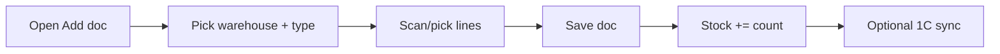

# `warehouse` module

Multi-warehouse operations: receipts, transfers, picking, dispatch and
inter-filial movements.

## Controllers

| Controller | Purpose |
|------------|---------|
| `AddController` | Goods receipt |
| `EditController` | Edit receipt / transfer docs |
| `ListController` | Warehouse documents listing |
| `ViewController` | Detail view |
| `ExchangeController` | Transfer between warehouses |
| `FilialMovementController` | Move stock between filials |
| `ApiController` | Internal JSON endpoints |

## Concepts

- **Warehouse** — a physical or logical stock location.
- **Document** — the legal/operational paper trail of a stock movement
  (receipt / transfer / writeoff / inventory).
- **Stock row** — `(warehouse_id, product_id, lot, batch, count)`.
- **Reservation** — count blocked by an `Order` in status `Reserved`.

## Key feature flow — Goods receipt

See **Feature — Warehouse Receipt** and **Feature — Stock Transfer**
in the [FigJam board](../architecture/diagrams.md).

## See also

- [`stock`](./stock.md) — pure quantity operations
- [`inventory`](./inventory.md) — physical inventory counts
- [`store`](./store.md) — retail store-side operations
