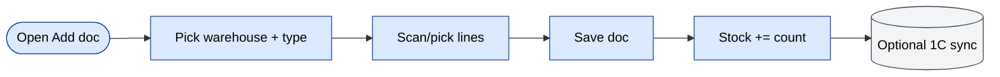
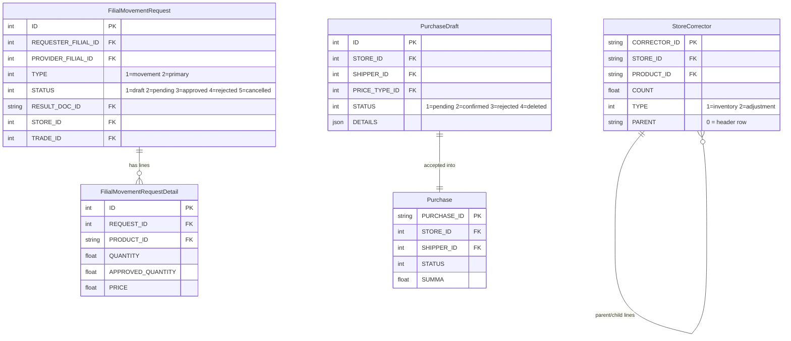
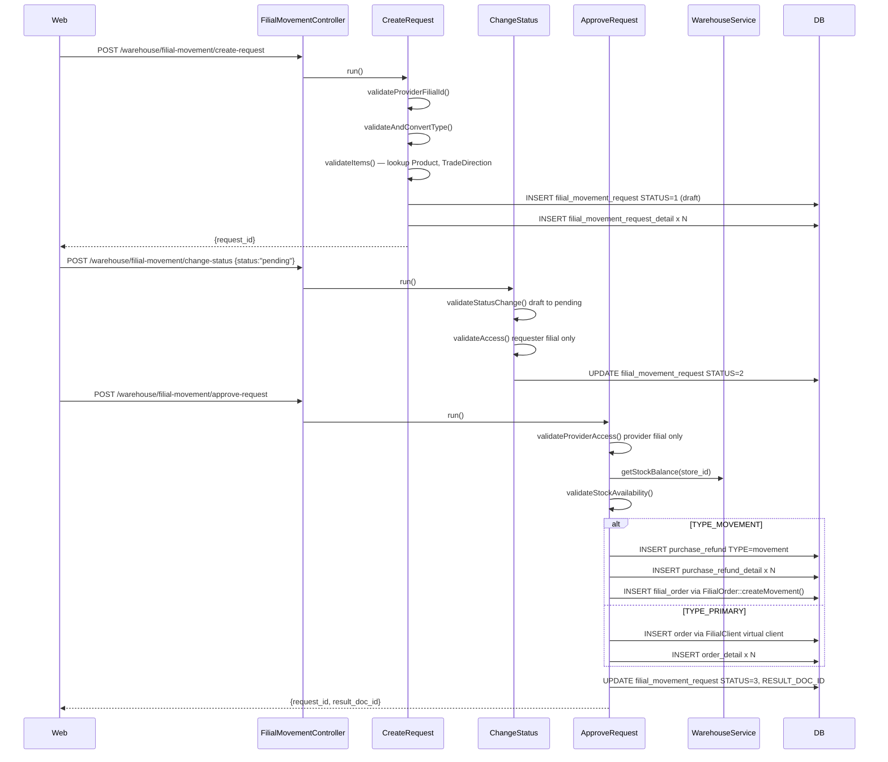
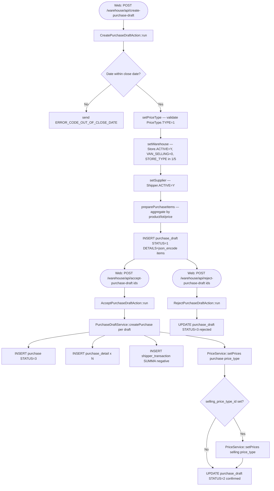
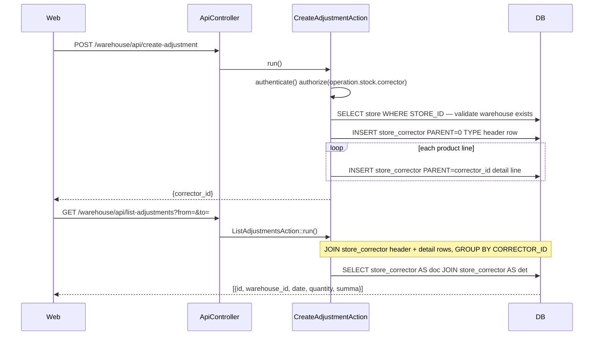

# `warehouse` module

Multi-warehouse operations: **receipts** (goods in), **transfers**
(between warehouses or filials), **picking / dispatch** (for orders),
and **inter-filial movements**.

## Key features

| Feature | What it does | Owner role(s) |
|---------|--------------|---------------|
| Goods receipt | Add a new receipt document; stock += count | 1 / 2 / 9 / warehouse staff |
| Receipt types | `sales` / `defect` / `reserve` (different downstream effects) | 1 / 9 |
| Stock transfer | Move stock between two warehouses inside one filial | 1 / 9 |
| Filial movement | Move stock between filials (inter-branch) | 1 |
| Pick & pack | Reserve and load lines for an order during fulfilment | 1 / 9 / warehouse staff |
| Audit trail | Every doc has create/approve/post timestamps | system |
| 1C sync | Optional outbound XML/JSON of receipts and movements | system |

## Folder

```
protected/modules/warehouse/
├── controllers/
│   ├── AddController.php
│   ├── EditController.php
│   ├── ListController.php
│   ├── ViewController.php
│   ├── ExchangeController.php           # transfer
│   ├── FilialMovementController.php     # inter-filial
│   └── ApiController.php
└── views/
```

## Concepts

- **Warehouse** — a physical or logical stock location.
- **Document** — the legal/operational paper trail of a stock movement
  (receipt / transfer / writeoff / inventory).
- **Stock row** — `(warehouse_id, product_id, lot, batch, count)`.
- **Reservation** — count blocked by an `Order` in status `Reserved`.

## Key feature flow — Goods receipt

See **Feature · Warehouse + Stock + Inventory** in
[FigJam · sd-main · Feature Flows](https://www.figma.com/board/MyvyaeEluqvHofH4E2qIoU).

<!-- TODO: missing reject/error branch — see workflow-design.md principle #9 -->


## Permissions

| Action | Roles |
|--------|-------|
| Create receipt | 1 / 2 / 9 |
| Approve transfer | 1 / 2 / 9 |
| Inter-filial movement | 1 |

## See also

- [`stock`](./stock.md) — pure quantity operations
- [`inventory`](./inventory.md) — physical inventory counts
- [`store`](./store.md) — retail store-side operations

## Workflows

### Entry points

| Trigger | Controller / Action / Job | Notes |
|---|---|---|
| Web | `AddController::actionIndex` | Create a new `Store` (warehouse) — POST JSON |
| Web | `FilialMovementController` via `CreateRequest` | Requester filial submits inter-filial stock request |
| Web | `FilialMovementController` via `ApproveRequest` | Provider filial approves pending request and creates downstream doc |
| Web | `FilialMovementController` via `ChangeStatus` | Draft → Pending → Cancelled / Rejected lifecycle |
| Web | `ApiController` via `CreatePurchaseDraftAction` | Mobile/web submits a purchase draft for manager review |
| Web | `ApiController` via `AcceptPurchaseDraftAction` | Manager accepts draft; `PurchaseDraftService::createPurchase` converts to `Purchase` |
| Web | `ApiController` via `CreateAdjustmentAction` | Stockman creates a stock adjustment (`StoreCorrector`) |

### Domain entities



### Workflow 1.1 — Inter-filial stock movement request lifecycle

A requester branch creates a stock request, the provider branch approves it, and a `PurchaseRefund` (type=movement) or `Order` (type=primary) is written atomically.



### Workflow 1.2 — Purchase draft review and acceptance

A purchase draft is submitted (typically from the mobile app or web) and sits in status=pending until a manager accepts or rejects it. Acceptance calls `PurchaseDraftService::createPurchase` which writes the canonical `Purchase` + `PurchaseDetail` + `ShipperTransaction` and updates prices.



### Workflow 1.3 — Stock adjustment (StoreCorrector)

A stockman or warehouse manager records a manual stock correction via `CreateAdjustmentAction`. The `StoreCorrector` table uses a parent/child row structure: the header row has `PARENT='0'`, detail lines reference it by `CORRECTOR_ID`.



### Cross-module touchpoints

- Reads: `models.FilialClient` (virtual client lookup during primary-type approval in `ApproveRequest::createPrimaryDocument`)
- Reads: `models.PriceType`, `PriceService::getPrices` (price resolution in `PurchaseDraftService` and `ApproveRequest`)
- Reads: `models.TradeDirection` (trade-direction validation in `CreateRequest`)
- Writes: `models.Order` + `models.OrderDetail` (filial primary request → new sale order in `ApproveRequest::createPrimaryDocument`)
- Writes: `models.PurchaseRefund` + `models.PurchaseRefundDetail` (filial movement request → stock refund in `ApproveRequest::createMovementDocument`)
- Writes: `models.FilialOrder` via `FilialOrder::createMovement` (bridges movement document to requester filial)
- Writes: `models.ShipperTransaction` (supplier debt ledger entry in `PurchaseDraftService::createDocument`)
- APIs: `warehouse/api/get-stock-balance` — called internally by `ApproveRequest` via `WarehouseService::getStockBalance`

### Gotchas

- `FilialMovementRequest::STATUS_APPROVED` is terminal — `ChangeStatus` hard-blocks any further status change. Attempting to cancel or reject an approved request returns `ERROR_CODE_INVALID_STATUS`.
- `ApproveRequest::createMovementDocument` hard-codes `DILER_ID = "d0_1"` and `FILIAL_ID = 1` on the `PurchaseRefund`; this will break in multi-diler deployments.
- `PurchaseDraftService::createPurchase` calls `$purchaseModel->tgNotify()` — a Telegram notification side-effect; ensure the bot token is configured or the call silently fails but does not roll back the transaction.
- `CreateAdjustmentAction.php` was found empty (1 line) in the current branch (`btx-51207`). The list and get actions reference `StoreCorrector` correctly, but creation may be a work-in-progress.
- The `delete-purchase-draft` action is intentionally disabled in `ApiController` (commented out with "disabled by now").
- `WarehouseService::getStockBalance` does not lock rows; a race condition is possible between availability check and `PurchaseRefund` insert inside `ApproveRequest`.
