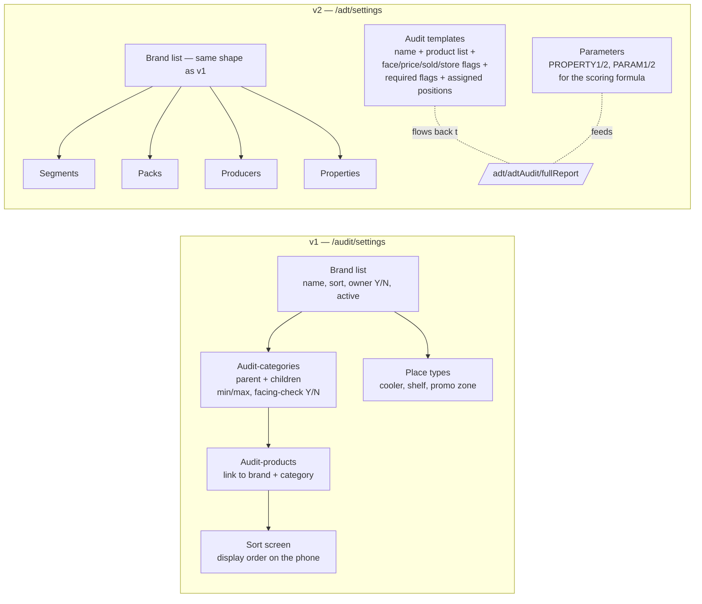

# Audit settings — brands, categories, templates, scoring rules

## What this feature is for

This is the **back-of-house configuration screen** that decides what the field force is asked to capture, what categories the captured data is bucketed into, and (on v2) how the score is computed. Nothing on the audit dashboards or facing/SKU reports makes sense unless the settings here are right — bad settings here turn into "missing data" or "shelf-share calculates to a weird number" bug reports later.

Two settings screens exist, mirroring the two implementations:

- **v1 — `/audit/settings`** — flat list of *brands*, *audit-categories* (parent + child), *audit-products* (the products the agent is asked to look for), *place types* (cooler / shelf / promo zone), and a sorting screen.
- **v2 — `/adt/settings`** — same brand list but enriched: *segments*, *packs*, *producers*, *properties*, *audit templates* (which products + which measures are required per audit), and a *parameters* screen (`PARAM1`, `PARAM2`) for the scoring formula.

## Who uses it and where they find it

| Role | What they do here | How they get to the screen |
|---|---|---|
| Operator (3) / KAM (9) | Maintains the brand list, adds new audit-categories, links products to audit-categories | Web → Аудит → **Настройки** (v1, `/audit/settings`) or Аудит 2 → **Настройки** (v2, `/adt/settings`) |
| Admin / Manager | Full configuration access | Same URL |
| Other roles | No access — settings screens are hidden | — |

> ⚠ This is a **destructive** area. Editing a brand or deactivating an audit-category will silently change *every existing audit report*. Any test on these screens must be paired with a check of the audit dashboards before and after.

## The workflow — at a glance

## Step by step

### Brand list (`/audit/settings`, v1) and (`/adt/settings`, v2)

1. The operator opens the **Brands** screen — both v1 and v2 land here by default.
2. The grid shows every brand: name, sort order, *Owner* flag (Y/N — whether this is "our brand" or a competitor), *Active* (Y/N).
3. The operator clicks **Add** → enters name, sort, ticks **Active**, ticks **Owner** if it's "ours" → saves.
4. The operator clicks an existing row to edit → changes a field → saves.
5. **Deactivating a brand** does **not** remove it from past audits, but it **stops appearing** in mobile pickers from the next sync onward.

### Audit-categories (v1 only — `/audit/settings/audGroupCategory` and `/audit/settings/audCategory`)

1. The operator opens **Категории** in the v1 settings.
2. *Parent categories* are flat — name, sort, *Facing-check* (Y/N — whether facing counts apply), Active.
3. *Child categories* sit under a parent and additionally carry: a linked **Brand**, **min** and **max** thresholds (used to colour the shelf-share grid green / yellow / red), and the parent reference.
4. Save → the category appears in the agent's audit picker on next sync.

### Audit-products (v1 — `/audit/settings/audProduct` and `/audit/settings/addProducts`)

1. The operator opens the **Products** screen.
2. They pick an audit-category from a dropdown.
3. They add products one row at a time, picking each from the main product list and naming it (the audit-product name can differ from the catalogue name).
4. The bulk-add screen lets them add many products to one category at once.
5. The **Sort** screen (`/audit/settings/sort`) is a drag-and-drop reorder — affects the display order on the agent's phone.

### Place types (v1 — `/audit/settings/audPlaceType`)

1. Flat list of *places* where facings can be counted — *Shelf*, *Cooler*, *Promo zone*, *Counter*, etc.
2. Maintained as name + Active.
3. The agent picks one of these when entering facing data; the web facing report filters by this.

### Audit templates (v2 — `/adt/adtAudit`)

This is the v2 equivalent of "what does the agent get asked about". A template is created with:

1. **Name** (e.g. "Beverages Q2 audit").
2. **Active** Y/N, **Public** Y/N, **Required** Y/N (whether the agent must complete this audit on every visit).
3. **Show on store-check** Y/N — whether the template is bundled into the store-check sweep.
4. Four pairs of **measure flags**:
   - **Face check** Y/N + **Face required** Y/N
   - **Price check** Y/N + **Price required** Y/N
   - **Sold check** Y/N + **Sold required** Y/N
   - **Store check** Y/N + **Store required** Y/N
5. A **product list** — the products the agent must check (both own products and competitor products are allowed).
6. A **poll link** — optionally a poll template that fires with this audit.
7. A list of **assigned positions** (organisational positions / users) — only these can run this template.

### Polls (v2 — `/adt/adtPoll`)

1. Each poll has a name, sort, description, required flag, and a *Show on report* flag.
2. Each poll has a list of *questions*. A question has a type (yes/no, single-choice, multi-choice, free-text, photo, numeric) and a list of *variants* (for choice types).
3. ⚠ A question that **already has answers** cannot have its type changed — the editor enforces this. Test this guard.

### Parameters (v2 — `/adt/settings/params`)

1. The operator picks `PROPERTY1` and `PROPERTY2` (typically two custom product attributes — e.g. *Region* and *Price band*).
2. They set `PARAM1` and `PARAM2` (the numeric weights used in the scoring formula).
3. Save → the v2 retail-audit report uses these to compute the per-outlet score.

## What can go wrong

| Trigger | Where | What the user sees |
|---|---|---|
| Save brand with empty name | v1/v2 brands | Form rejected — name required. |
| Deactivate a brand that is in current use | v1/v2 brands | Save succeeds. Existing audit reports keep referring to it; new audits stop seeing it. ⚠ No warning. |
| Change a question's type when answers exist | v2 polls | Save fails — *"This question already has results, type cannot be changed."* |
| Delete a category that has child categories | v1 category | Save succeeds but children become orphans (no parent). ⚠ Test — orphans break the facing report. |
| Assign a product to two audit-categories | v1 audit products | The product appears in both audit pickers. The agent will be asked about it twice. |
| Configure an audit template with no products | v2 audit template | Save succeeds — but the agent's phone shows the audit as empty. |
| Configure a template with `STORE_REQUIRED = 'Y'` but no `STORE_CHECK = 'Y'` | v2 audit template | The required flag is meaningless. UI does not block it. |
| Open `/adt/settings/property1` when `PROPERTY1` is empty | v2 properties | HTTP 404. The properties screens only render when their parameter is configured. |

## Rules and limits

- **Active/inactive is a soft toggle.** Nothing is hard-deleted from the settings screens — only flagged inactive.
- **Brand `OWNER`** = 1 means "this is one of our brands". This drives the shelf-share calculation — *our share* is the sum of OWNER-brand facings divided by the category total.
- **Audit-category `MIN` / `MAX`** are used as colour thresholds on the shelf-share grid:
  - Below MIN → red.
  - MIN to MAX → yellow.
  - Above MAX → green.
- **`FACING_CHECK`** Y on an audit-category tells the mobile app to require a facing count. N means the category is SKU-only.
- **The four v2 check flags (`FACE_CHECK`, `PRICE_CHECK`, `SOLD_CHECK`, `STORE_CHECK`)** decide *what is captured*. The `*_REQUIRED` siblings decide *whether the agent can submit without it*.
- **`IS_PUBLIC = 0`** on a v2 template means the template is restricted to specifically assigned positions. `IS_PUBLIC = 1` means any user with the audit role can run it.
- **Audit settings have no close date.** Changes are immediate and global.
- **Mobile picks the changes up on next sync** (usually within minutes). Test plans should always include a *"sync the phone, verify the change reached the app"* step.

## What to test

### v1 brand list

- Add a new brand with all fields → appears in the grid.
- Edit a brand → sort changes reflected.
- Deactivate an owner brand → it disappears from new mobile syncs but old audits still show it.
- Empty name save → blocked.

### v1 audit-categories

- Create a parent category → appears as a top-level row.
- Create a child under it → linked correctly.
- Set MIN = 30, MAX = 70 → run a facing report → cells reflect colour bands.
- Toggle `FACING_CHECK` Y → mobile app asks for facing; Toggle N → mobile app does not.
- Deactivate a parent that has active children → children orphaned (test, document).

### v1 audit-products

- Add a product to a category → it appears in the agent's audit picker after sync.
- Sort screen → drag a product to position 1 → mobile picker reflects the order.
- Bulk-add 10 products in one go → all 10 appear.

### v2 templates

- Create a template with face + price + store checks all on, no required flags → save → agent can submit any subset.
- Create the same with all required flags on → agent must fill all measures or the submit is rejected on the phone.
- Assign the template to one organisational position → only users in that position see it.
- Set `IS_PUBLIC = 1` on a public-flagged template → assignment is ignored.
- Create a template with zero products → agent's phone shows it empty (or hidden, depending on app version).

### v2 polls

- Add a poll with one yes/no question and two free-text questions.
- Submit answers via mobile, then go to the settings page and try to change the question type → save blocked with the "results exist" message.
- Delete a poll → answers remain in the database but the poll is no longer pickable.

### v2 parameters

- Set PROPERTY1 to a product attribute, leave PROPERTY2 empty → the property2 page returns 404.
- Configure both PROPERTY1 and PROPERTY2 + PARAM1 + PARAM2 → run a retail audit → verify the score formula uses both.
- Change PARAM1 mid-month → existing audit scores recompute on next page load (no archive).

### Role gating

- Operator (3), KAM (9) — can edit.
- Admin / Manager (1, 2) — can edit.
- Field agent (4) — settings URLs are blocked.
- Any other web role — settings URLs are blocked.

### Side effects to verify (always re-run audit dashboards after changes)

- After a brand becomes inactive, the shelf-share report is unaffected for old data but new audits skip that brand.
- After a child category is moved to a different parent, the rollup recalculates — *the percentage shifts immediately*.
- After product reordering, the agent's mobile picker reflects the new order on next sync.
- After an audit template's required flag is added, in-flight visits on the phone may behave inconsistently — test by syncing mid-visit.

## Where this leads next

- See the effect of these settings on the actual reports: [Facing & SKU presence](./facing-and-sku.md).
- See how a v2 template drives the retail audit: [Visit audit](./visit-audit.md).
- For the photo-category list (a separate but related configuration): [Photo reports](./photo-reports.md).

## For developers

v1:

- `protected/modules/audit/controllers/SettingsController.php` — six actions: `actionIndex` (brands), `actionAudGroupCategory` (parents), `actionAudCategory` (children), `actionAudProduct`, `actionAddProducts`, `actionAudPlaceType`, `actionSort`.
- Tables: `aud_brands`, `aud_category` (with `PARENT`, `BRAND`, `MIN`, `MAX`, `FACING_CHECK`), `aud_product`, `aud_place_type`.

v2:

- `protected/modules/adt/controllers/SettingsController.php` — `actionIndex` (brands), plus `actionPack`, `actionSegment`, `actionProducer`, `actionProperty`, `actionProduct`, `actionProductCompetitor`, `actionProperty1`, `actionProperty2`, `actionParams`, `actionComment`.
- `protected/modules/adt/controllers/AdtAuditController.php` — `actionIndex`, `actionUpdate`, `actionGetProducts`, `actionGetUsers` manage the audit templates and their bound products/positions.
- `protected/modules/adt/controllers/AdtPollController.php` — `actionIndex`, `actionUpdate` for poll templates and their questions (with the `hasResult()` guard against type changes when answers exist).
- Tables: `adt_brands`, `adt_pack`, `adt_segment`, `adt_producer`, `adt_property`, `adt_property1`, `adt_property2`, `adt_params`, `adt_audit`, `adt_audit_products`, `adt_audit_users`, `adt_poll`, `adt_poll_question`, `adt_poll_variant`.
