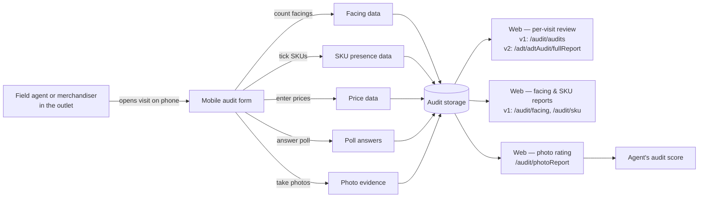

# Audit module — QA test guide

> **Who this is for.** QA engineers who need to test everything under the **Аудит** (or **Аудит 2**) menu in the web admin. The audit menu covers everything an agent or merchandiser captures **while standing in front of the shelf** — photos, shelf-share counts, product presence, prices, polls and structured retail audits — plus the web screens where the office reviews and rates that captured data.
>
> **Why this guide is split into v1 and v2.** sd-main carries two parallel implementations of this feature set. Each dealer has exactly **one of them** turned on. Before you write a single test case, you must know which one your dealer is on — the screens, URLs and even the words on the menu are different.

---

## First things first — which version does my dealer have?

The cleanest way to tell is to log in and look at the **left sidebar**:

| What you see in the sidebar | The version your dealer is on |
|---|---|
| **Аудит** — with the following sub-items: *Дневной отчет, Проверки, Доля полки, Присутствие, Анализ цен, Мерчандайзинг, Опрос, Сторчек, Настройки, Рейтинг* | **Audit v1** (URLs start with `/audit/…`) |
| **Аудит 2** — with the following sub-items: *Дневной отчет, Ритейл аудит, Контроль мерчендайзеров, Отчет по дневному посещению, Клиенты, Настройки, Отчёты, Рейтинг фото-отчётов, Отчет по визиту мерчандайзеров* | **Audit v2** (URLs start with `/adt/…` for most pages; **photo rating still lives under `/audit/photoReport`** even on v2) |

**Only one of these two sections will ever be visible to a given user.** The dealer's admin flips a configuration flag (`audit2.enabled` in the dealer's *Settings → Config*) and the menu shows v1 or v2 — never both. If you see Аудит 2, the v1 *Аудит* section is hidden, and vice versa.

> ⚠ **Photo-report ratings live under v1 even when the dealer is on v2.** The menu entry *Рейтинг фото-отчётов* on the v2 menu still points to `/audit/photoReport`. This is the one corner of v1 that survives on a v2 dealer. Test plans for photo ratings (see [Photo reports](./photo-reports.md)) work the same regardless of version.

If you cannot tell from the menu — for example, because you only have read-only access to a screenshot — check the URLs of the audit screens:

- `/audit/audits`, `/audit/facing`, `/audit/sku`, `/audit/price` → v1
- `/adt/adtAudit/fullReport`, `/adt/dashboard`, `/adt/mixReport`, `/adt/client`, `/adt/settings` → v2

---

## How to use this guide

Each feature has its own page. Read this index first, then jump into the feature you need to test.

| When you want to test… | Open this page |
|---|---|
| The per-visit audit recording — what the agent captures and what the office reviews | [Visit audit](./visit-audit.md) |
| Shelf-share (Доля полки) and SKU presence (Присутствие) reports on the web | [Facing & SKU presence](./facing-and-sku.md) |
| Photo-evidence collection from the field and the rating workflow on the web | [Photo reports](./photo-reports.md) |
| Configuring brand lists, audit templates, scoring rules | [Audit settings](./audit-settings.md) |

---

## The business meaning of the words you'll see

The audit area uses six business concepts that mean roughly the same thing on v1 and v2 — only the screens and the storage shape differ. Memorise these; the menu labels are localised but the **concepts** are universal.

| Concept | Plain-language meaning | Where it shows up |
|---|---|---|
| **Facing (Доля полки / Shelf share)** | "How many of *our* product faces does this shelf show, compared to total faces on the shelf?" The agent counts physical facings — the front-row units visible to a shopper — bucketed by brand and category. The web rolls these up to a *shelf-share %* per category per outlet. | v1: `/audit/facing`; v2: inside the retail audit at `/adt/adtAudit/fullReport` |
| **SKU presence (Присутствие)** | "Of the products that *should be* on this shelf, how many are actually here today?" Captured as a yes/no list per product. The web reports it as an assortment count and a distribution %. | v1: `/audit/sku`; v2: inside the retail audit |
| **Price check (Анализ цен)** | "What price tag is on the shelf today?" Captured per product. Used to monitor that the dealer's recommended retail price is being honoured and to track competitor prices. | v1: `/audit/price`; v2: inside the retail audit (and `/adt/price`) |
| **Poll (Опрос) / Merchandising poll (Мерчандайзинг)** | A structured questionnaire the agent answers in the outlet: yes/no, single-choice, multi-choice, free-text, photo. Used for promo checks, equipment audits, planogram compliance. | v1: `/audit/pollResult`; v2: `/adt/adtPoll` (template) + answers inside the visit |
| **Store-check (Сторчек)** | A grouped checklist run inside a visit — typically a periodic SKU + facing + price sweep done across all products of a brand. Differs from a free audit in that it forces the agent to answer **every line**, not just the products they happen to see. | v1: `/audit/storecheck`; v2: handled inside the retail audit template (`STORE_CHECK = 'Y'`) |
| **Photo report (Фото-отчёт / Рейтинг)** | The agent (or expeditor/merchandiser) takes photos at the outlet — a "before" shelf, an "after" shelf, an equipment placement, a planogram check. The office rates each set 1–5 stars. The rating drives the agent's score. | Both v1 and v2: `/audit/photoReport` |

---

## Who does what — the workflow at a glance

The mobile capture half is **the same kind of work** on v1 and v2. What changes is the web review:

- **v1** has one summary table per concept (facing here, SKU there, prices on the third tab).
- **v2** has one unified *Ритейл аудит* (retail audit) report that bundles facing, SKU, prices and store-check into a single per-visit row, and uses a configurable audit template to decide what gets asked.

---

## Roles in this area

| Role number | Name in the UI | What they do here |
|---|---|---|
| 3 — Operator | Operator | Reviews per-visit audit data on the web. Can edit some captured values (e.g. fix a typo'd price). |
| 4 — Field agent | Agent | Captures audits on the phone during visits. Does **not** see the web audit screens. |
| 5 — Operations | Operations | Same web access as operator. |
| 6 — Auditor / Merchandiser | Auditor | The dedicated audit role — on some dealers this role exists; runs structured retail audits. v1 read-only on `/audit/audits`. |
| 8 — Auditor (alt) / Supervisor's auditor | Supervisor audit | Read access to facing/SKU/price/storecheck reports. |
| 9 — Key-account manager | KAM | Same audit access as operator on most screens. |
| 10 / 11 — Expeditor / Merchandiser | Driver / Merchandiser | Can submit photo reports from their app — included in the photo-rating workflow. |

---

## What every audit test plan should record

For each scenario you run from these pages, the test case should capture:

1. **Which version** — v1 (`/audit`) or v2 (`/adt`). Always say it explicitly. A test that passes on v1 may fail on v2 and vice versa.
2. **Pre-conditions** — the agent must be assigned to the client, the audit template / brand list must be active, the date must be inside the audit reporting window (usually last 30 days for facing/SKU reports).
3. **Mobile steps** — which screen on the phone created the data. Use the same names as the agent app.
4. **Web steps** — which review screen you opened.
5. **Expected captured data** — exact counts, exact prices, exact poll answers. Audit bugs almost always come from rounding, summing across categories, or shelf-share math.
6. **Cleanup** — audit data is generally not deletable from the web (some lines can be deleted from the per-visit detail). Note what your test leaves behind.

---

## Common pitfalls when writing audit test cases

- **Don't compare v1 totals to v2 totals.** They are different tables and different calculations.
- **Shelf-share is per-category, not per-product.** A category with one product at 100% facing share is not the same as a brand with 100% across all categories.
- **Empty result is a valid result** in audit reports — a date range with no audits returns *"Nothing found for your query"*, not an error.
- **Date filter defaults differ by screen.** Facing and SKU default to *last 30 days*. Visit audit (`/audit/audits`) defaults to *today*. Photo report defaults to *current month-to-date*. Always set the date filter explicitly in test steps.
- **The 1–5 rating on photo reports rolls up to the agent's score**, not the client's. Distinct from the client's audit score that the visit audit produces.

---

## Where this leads next

Pick the page that matches the surface you need to test:

- [Visit audit](./visit-audit.md) — the per-visit, per-client record (both v1 and v2)
- [Facing & SKU presence](./facing-and-sku.md) — the two flagship v1 reports
- [Photo reports](./photo-reports.md) — photo evidence and the 1–5 rating
- [Audit settings](./audit-settings.md) — brand lists, audit templates, scoring rules

---

## For developers

Code locations:

- v1 implementation: `protected/modules/audit/` (skip `.obsolete`).
- v2 implementation: `protected/modules/adt/` (skip `.obsolete`).
- Menu toggle: `protected/components/SideMenu2.php` — see the `audit` / `audit2` entries and the `Config::getConfig('audit2')->enabled` check around line 203.
- Data tables: `aud_*` for v1 (e.g. `aud_sku`, `aud_facing`, `poll_result`, `photo_report`), `adt_*` for v2 (`adt_audit`, `adt_audit_products`, `adt_poll`, `adt_poll_question`).
