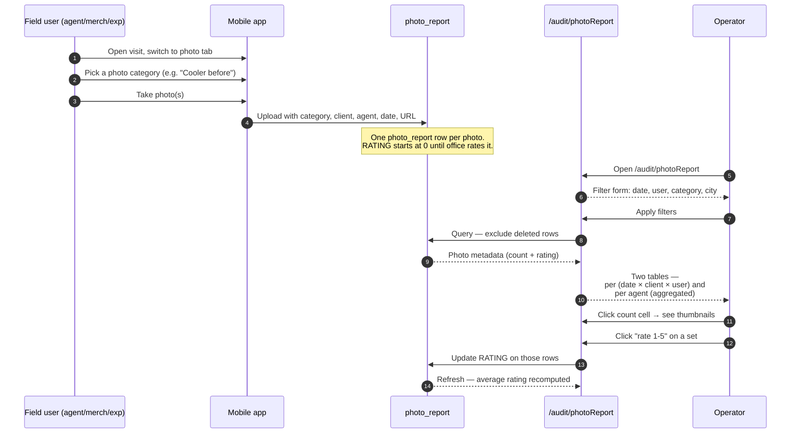

# Photo reports — evidence collection and rating

## What this feature is for

Photo reports are the **visual evidence** half of the audit world. A field user (agent, merchandiser, expeditor) takes one or more photos at the outlet — a "before" shelf, an "after" merchandising fix, equipment placement, planogram compliance, promo execution — and uploads them with metadata: who took them, when, at which client, and what category of photo it is.

The office side does two things on the web:

1. **Browse the photos** by date / agent / city / category.
2. **Rate each photo set 1–5 stars.** The rating rolls up to a *per-agent score* and a *per-outlet score*, used for performance reviews and bonuses.

This is **one of the only audit features that works the same on v1 and v2 dealers.** Both menus point to the same URL: `/audit/photoReport`. The v2 menu calls it *"Рейтинг фото-отчётов"*; v1 calls it *"Рейтинг"*. Same screen.

## Who uses it and where they find it

| Role | What they do here | How they get to the screen |
|---|---|---|
| Field agent (4) | Takes photos at the outlet, uploads them with category | Mobile app → during a visit → photo report tab |
| Merchandiser (11) | Same | Mobile app |
| Expeditor (10) | Sometimes captures photos on delivery | Driver app |
| Auditor (8) | Captures photos during audit visits | Mobile app |
| Operator (3) / Operations (5) / KAM (9) | Reviews the gallery, rates 1–5 | Web → Аудит → **Рейтинг** (v1) or Аудит 2 → **Рейтинг фото-отчётов** (v2). Both → `/audit/photoReport` |

## The workflow — at a glance

## Step by step

### Mobile capture

1. The field user opens a visit.
2. They switch to the **photo report** tab inside the visit.
3. They pick the photo category — the dealer configures the list, typically *"Cooler before"*, *"Cooler after"*, *"Shelf"*, *"Promo zone"*, *"Equipment"*, etc.
4. They take one or more photos (the dealer can require a minimum count per category).
5. They submit — the phone uploads each photo with its metadata.
6. Each uploaded photo becomes a single `photo_report` row with `RATING = 0` (not yet rated).

### Web review and rating

1. The operator opens **Аудит → Рейтинг** (or **Аудит 2 → Рейтинг фото-отчётов**).
2. The screen shows a filter form: date range (default = current month-to-date), user (with role filter), city, category.
3. The operator picks filters and presses **Apply**.
4. *The system queries* photo records where `DELETED = 0`, grouped by *(date × client × user)*, and produces two tables:
   - **Per-set table** — one row per *(date, client, agent)*. Columns: date, client name, telephone, agent, city, photo count, sum of ratings, average rating, rounded average.
   - **Per-agent table** — one row per agent. Columns: agent name, count of distinct clients, count of photos rated ≤ 3, count rated = 4, count rated = 5, each with a percentage of the agent's total.
5. The operator clicks a row to expand → thumbnails of all photos in that set.
6. The operator picks a rating 1–5 for the set (or per-photo, depending on configuration).
7. *The system updates the RATING* on the underlying photo_report rows.
8. *On the next refresh*, the per-set table shows the new average; the per-agent table shifts the photo into the right bucket (≤ 3 / 4 / 5).
9. Bad ratings (≤ 3) drag the agent's percentage down; this percentage is the headline number used in reviews.

### Performance rollup

- Per-agent: the dashboard at the top of the page shows each agent's *distribution* of ratings as percentages — what share of their photos was rated low / medium / high.
- The same data also feeds into the daily audit dashboard (`/audit/dashboard/daily`) and the agent's KPI screens.

## What can go wrong (errors the user sees)

| Trigger | Where | What the user sees |
|---|---|---|
| Filters return nothing | Web | Empty grid. No error. |
| Photo upload fails on the phone | Mobile | Retry banner; the photo is queued for the next sync. |
| Operator rates a photo, then the agent re-uploads a fresh one in the same set | Web | New photo joins the set with rating 0. The set's average is recomputed and drops accordingly. |
| Photo is soft-deleted (`DELETED = 1`) | Web | Drops out of both tables; the agent's score is not affected by the deleted photo. |
| Same photo uploaded twice (rare — duplicate upload) | Web | Two rows. Both rated independently. Test plans should call this out. |
| User type filter applied but no users match | Web | Empty result. |
| Category filter set to a category nobody used | Web | Empty result. |
| RATING set to 0 by accident | Web | Counts as rating zero — drags the agent's average down to zero. ⚠ There is no "un-rate" button, only re-rate. |

## Rules and limits

- **Rating is 1–5.** A rating of 0 means "not yet rated" but a rated 0 will pollute the rollup. The UI normally constrains to 1–5; QA should test the API direct path that allows 0.
- **Deleted photos (`DELETED = 1`) are excluded** from both tables and from the rating rollup.
- **Each photo carries its own rating.** When a set is rated as a group, every photo in the set gets the same rating.
- **The per-agent rollup buckets are: rating ≤ 3, rating = 4, rating = 5.** Ratings 1, 2 and 3 are *all* in the "low" bucket. A 1 and a 3 are not distinguished in the per-agent table.
- **Date filter default is current month-to-date.** Not the last 30 days. Different default from facing/SKU.
- **User filter has a role prefilter** — by default the list shows roles 4 (agent), 8 (auditor), 10 (expeditor), 11 (merchandiser). A user not in those roles will not appear even if they uploaded photos.
- **Photo storage URLs are stored in the row** (`URL` field). Test that links open correctly and that no broken links exist after a storage migration.
- **No close date.** Old photos remain rateable forever.

## What to test

### Mobile capture

- Take one photo in a single category → one row appears on the web with rating 0.
- Take three photos in the same category in one visit → grouped as one set in the per-set table.
- Take photos in two different categories in one visit → two sets in the per-set table.
- Submit with no internet, then come back online → the queued photos sync and appear on the web within a few minutes.
- Same agent visits the same client twice on the same day → both groups appear under the same *(date, client, agent)* row, summed.

### Web filtering

- Default open → current-month photos visible.
- Date range = yesterday → only yesterday's photos.
- City filter narrows correctly.
- Category filter narrows correctly.
- User filter — pick one agent → only their photos appear.
- User type filter = expeditor only → only role-10 uploads appear.
- Empty filter set → no result, no error.

### Rating workflow

- Rate a fresh set 5 → per-set avg = 5; per-agent table shows that count in the "5" bucket.
- Rate the same set 2 (re-rate) → avg drops to 2; bucket shifts from 5 to ≤ 3.
- Rate one photo in a set 5 and another in the same set 1 → set avg is 3; rounded average shown.
- Rate a deleted photo (if the URL permits it) → no effect on the visible report.
- Rate all of an agent's photos 5 → agent's "5" bucket = 100%.
- Mix ratings across an agent's portfolio — verify the bucket percentages add to 100%.

### Edge cases

- A photo with `PR_ID = 0` (legacy / out-of-flow) — the v2 query excludes these. The v1 query does not. Decide which is right for your dealer and document it.
- An agent who has photos but no client assigned — they will appear in the per-agent table with a `count of distinct clients` of zero.
- A merchandiser who took photos in a role they no longer have — historical photos remain attributed to the historical role.
- Two operators rate the same set simultaneously — last write wins. ⚠ No conflict warning.

### Role gating

- Field roles (4, 8, 10, 11) — cannot open the web page.
- Operator (3), Operations (5), KAM (9) — can open and rate.
- A read-only viewer — can open but rating controls are hidden.

### Side effects to verify

- Rating a photo updates the `RATING` column on the photo_report row directly. No history row.
- Deleting a photo flips `DELETED = 1` rather than removing the row.
- The per-agent rollup is re-computed on each page load — there is no cache.
- The daily audit dashboard (`/audit/dashboard/daily`) shows photo activity — verify it matches the same date's data on `/audit/photoReport`.

## Where this leads next

- The per-visit context the photos were captured in: [Visit audit](./visit-audit.md).
- How the photo categories are configured (the dealer's list of "Cooler before", "Shelf", etc.): [Audit settings](./audit-settings.md).
- For the dealer's larger reporting picture — the audit dashboard at `/audit/dashboard/daily`.

## For developers

- `protected/modules/audit/controllers/PhotoReportController.php` — `actionIndex` renders the v2-friendly `index2` view by default; `actionIndexOld` keeps the v1 view. `actionAjax`, `actionAjax2`, `actionAjax3` return JSON for the per-set, per-agent and per-photo-list (drill-in) panels respectively.
- Table: `photo_report` with `RATING`, `DELETED`, `PR_ID`, `URL`, `USER_ID`, `AGENT_ID`, `CLIENT_ID`, `CITY`, `PARENT` (the category) and `DATE`.
- The `PR_ID <> 0` filter on `actionAjax2` is the v2 gate — legacy rows without a parent category are excluded from the rollup.
- Look-up table for the photo categories: `parent_photo_report`.
