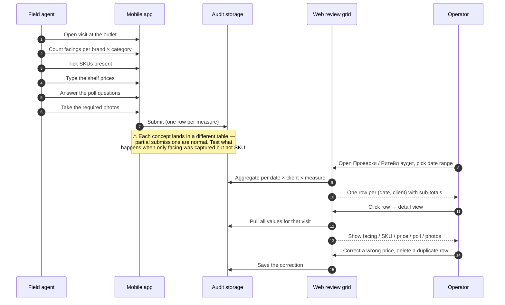

# Visit audit — the per-visit, per-client record

## What this feature is for

When the field agent (or a merchandiser, or an auditor) walks into an outlet, the mobile app prompts them to fill in an **audit**: count facings, tick which SKUs are on the shelf, capture prices, answer a poll, snap a few photos. Everything that one person captures during one visit on one date for one client is the **visit audit**.

The web side of the visit audit is where the office **reads back what the agent captured** — one row per *(date, client)* pair, with sub-totals for each captured concept (facing count, SKU count, poll-answer count, photo count). From that summary the operator drills into the detail and can correct or delete individual values.

On a v1 dealer the screen is at `/audit/audits`. On a v2 dealer the same idea lives at `/adt/adtAudit/fullReport` ("Ритейл аудит" — retail audit).

## Who uses it and where they find it

| Role | What they do here | How they get to the screen |
|---|---|---|
| Field agent (4) | Captures the audit on the phone — does not see the web grid | Mobile app → opens a visit → audit tabs |
| Auditor / Merchandiser (6) | Same as agent — captures audits on the phone | Mobile app |
| Operator (3) / Operations (5) / KAM (9) | Reviews submitted audits, drills into details, edits prices and counts | v1: Web → Аудит → **Проверки** (`/audit/audits`); v2: Web → Аудит 2 → **Ритейл аудит** (`/adt/adtAudit/fullReport`) |
| Read-only viewer (6 in some configs) | View only | Same URL — buttons are hidden |

## The workflow — at a glance

## Step by step

### Mobile capture

1. The agent opens a visit on the phone (location is auto-stamped — but the audit record itself stamps the *date* of capture, not the GPS).
2. The agent walks through the audit tabs the dealer has configured for them — *facing*, *SKU*, *price*, *poll*, *photo*.
3. The agent **may submit only some of them.** Capturing only facing without SKU is allowed. The web visit row will simply show zero in the SKU column.
4. The agent presses **Submit** at the end of the visit. The phone uploads each measure to its own table.

### Web review

1. The operator opens **Аудит → Проверки** (v1) or **Аудит 2 → Ритейл аудит** (v2).
2. *The system loads the dropdowns:* cities, client categories, audit categories, agents.
3. The operator picks the date range. **Default is today** for v1 *Проверки*. **Default is the current month** for v2 *Ритейл аудит*. ⛔ Forgetting to widen the date range is the most common reason a tester reports *"my submitted audit is missing"*.
4. The operator picks filters: city, agent, client category, audit category.
5. The operator presses **Поиск / Search**.
6. *The system queries* facing data, SKU data, poll results and photo reports for the range, joins them by *(date × client)*, and counts each.
7. The grid shows one row per (date, client) with five sub-totals: facing count, SKU count, poll-answer count, photo count, and (v2 only) a price count.
8. The operator clicks a row → the detail view loads everything captured for that visit, grouped by audit category and brand.
9. *On the detail screen* the operator can:
   - Type a corrected price for a SKU line and press **Save** — the SKU record is updated.
   - Delete a single SKU line ("Удалить") — that SKU line is removed.
   - Type a corrected facing count and press **Save** — the facing record is updated.
   - Delete a facing line — that facing line is removed.
   - **Re-save the poll** by re-submitting the form — old poll answers for that date+client are deleted and replaced with the form's new values.
10. The operator presses back and the grid still shows the row, with the corrected sub-totals.

## What can go wrong (errors the operator or agent sees)

| Trigger | Where it happens | What the user sees |
|---|---|---|
| Date range with no audits | Web grid | *"По вашему запросу ничего не найдено"* (Nothing found for your query). Not an error — a valid empty result. |
| Agent submits a price that is non-numeric | Mobile | Form-level error on the phone; submit blocked. |
| Operator edits a SKU price to a blank value | Web detail | Save still succeeds but the row's PRICE is empty. ⚠ This is a known soft-spot — the web does not validate the field. Always test the empty-price corner case. |
| Operator opens detail for a date with no audits | Web | Empty grid — no rows, no error. |
| Two agents submit audits for the same client on the same date | Web | The grid sums their data into one row. The detail view shows the latest agent's name only. Test this — it surprises QA. |
| Operator deletes a SKU/facing line that the agent then re-submits | Web/Mobile | The re-submitted line creates a fresh row. No conflict, no warning. |
| Re-saving the poll after answers exist | Web detail | Old answers for the *(date, client)* pair are deleted before new ones are inserted. ⚠ Cannot be undone. |

## Rules and limits

- **One row per (date, client) pair in the grid**, regardless of how many agents contributed.
- **Audits are stamped with the date the agent submitted**, not the date of any subsequent edit. Editing a price does not change the audit's date.
- **Counts on the grid are over the date range, not the chosen day.** A "5" in the SKU column for a 30-day range means 5 SKU records across all days in that range.
- **No "delete the whole visit" button.** The operator can only delete individual SKU or facing lines. The audit row will keep appearing as long as any captured measure exists.
- **Audit records survive client deletion / deactivation.** A deleted client will still show their old audit rows. The grid uses the cached client name from the time of capture.
- **There is no close-date wall for audits.** Old audits are editable indefinitely. (Contrast with orders, which have a 21-day close date.)
- **Filter by agent uses the agent ID, not the user ID** — if the same person was reassigned to a different agent profile, their old audits stay under the old agent profile.

## What to test

### Happy paths

- Agent captures facing + SKU + price + poll + photos for one client → one row in the grid with non-zero in all five sub-totals.
- Agent captures only facing → row shows facing count, zeros elsewhere.
- Agent captures only a photo → row shows photo count, zeros elsewhere.
- Operator clicks the row, opens detail, sees the captured values grouped by brand and category.
- Operator corrects a price → save → re-open the row → corrected price persists.
- Operator deletes one SKU line → row's SKU count drops by 1.
- Two agents capture the same client on the same day → grid shows one row with combined sub-totals.

### Filter and date-range cases

- Default date range (today / month) returns the right rows.
- Wide range (last 90 days) returns all rows; pagination/scroll works.
- City filter returns only clients in that city.
- Client-category filter narrows to that category.
- Agent filter — pick one agent, verify only their visits show.
- Two filters combined — city + client category — verify the intersection.
- An impossible filter combination → empty grid, *"Nothing found"* message.

### Edge cases

- Audit submitted by a now-deactivated agent — still appears in the grid with the agent's name from capture time.
- Audit submitted for a now-deactivated client — still appears.
- Poll re-save: open the detail, change one poll answer, save. Re-open. ✅ Only the new answer is stored; old answers are gone.
- Delete a SKU line, then have the agent re-submit. ✅ Fresh row appears.
- Open the detail page on a date with photo-only captures — verify the photos block renders but facing/SKU/poll blocks are empty.

### v1 vs v2 specifics

- On v1 (`/audit/audits`): the *Проверки* grid is the single source of per-visit audit truth.
- On v2 (`/adt/adtAudit/fullReport`): the same data is rolled up with extras — the "store-check" lines (where every audited product must have an answer, not just observed ones) and the per-audit-template required flags.
- On v2 the audit template (the list of products the agent must check) is configured in **Settings → Аудит** — see [Audit settings](./audit-settings.md). ⚠ A v2 dealer's grid will report a visit as *incomplete* if the template flagged a measure as required but the agent skipped it.

### Role gating

- Operator (3), Operations (5), KAM (9) can open the grid and edit.
- Read-only auditor (6) can open the grid but cannot edit prices or delete lines.
- Field agent (4) — verify the menu entry is not visible / the URL is blocked.
- Cross-filial access: a user from filial B opens the URL with a client from filial A — verify they get no data or an access denial.

### Side effects to verify

- Edit a price on the detail → the underlying SKU record's PRICE is updated; nothing else changes (the date stays, the agent stays).
- Delete a facing line → the facing record disappears from the database; the grid recount drops by 1.
- Re-saving the poll deletes the **whole day's** prior answers for that *(date, client)* before inserting the new ones. There is no per-question merge.

## Where this leads next

- The same data, but aggregated for the whole company across many visits: [Facing & SKU presence](./facing-and-sku.md).
- The photo-evidence half of the same visit, with its rating workflow: [Photo reports](./photo-reports.md).
- Where the audit categories, brands and (v2) audit templates are configured: [Audit settings](./audit-settings.md).

## For developers

v1 reference:

- `protected/modules/audit/controllers/AuditsController.php` — `actionIndex` (the grid) and `actionViewDetail` (the per-visit detail with the edit + re-save-poll logic).
- Tables: `aud_sku`, `aud_facing`, `poll_result`, `photo_report`.
- The grid joins those four tables on (`CLIENT_ID`, `DATE`).

v2 reference:

- `protected/modules/adt/controllers/AdtAuditController.php` — `actionFullReport` renders the retail audit; `actionIndex`/`actionUpdate` manage audit templates with the `FACE_CHECK`/`PRICE_CHECK`/`SOLD_CHECK`/`STORE_CHECK` flags and their `*_REQUIRED` counterparts.
- Tables: `adt_audit`, `adt_audit_products`, `adt_audit_users`, `adt_poll`, `adt_poll_question`.
