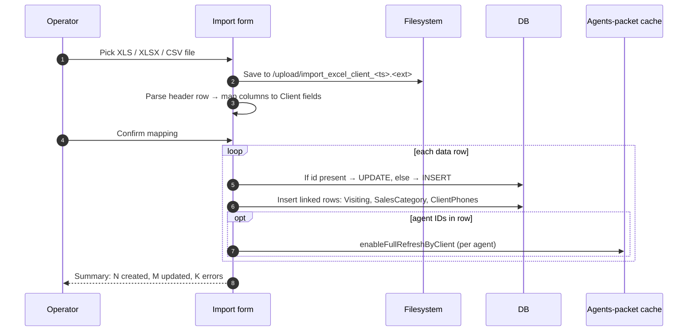

# Bulk client import — Excel / CSV upload

## What this feature is for

Loading many outlets at once from a spreadsheet — used on dealer onboarding, after a territory expansion, or when migrating from another system. Skips the per-client form for hundreds of rows.

## Who uses it and where they find it

| Role | Action | Path |
|---|---|---|
| Operator (3, 5, 9), Manager (2), Admin (1) | Upload XLS / XLSX / CSV | Web → Clients → Import |
| Others | No access | — |

Gate: `operation.clients.create`.

## The workflow

## Step by step

1. Operator clicks **Import** and uploads a file. Accepted extensions: `xls`, `xlsx`, `XLS`, `XLSX`, plus the auditor-specific path for merchandiser uploads.
2. *The file is saved to `/upload/import_excel_client_<timestamp>.<ext>`* on the server.
3. *The header row is parsed* and each column is matched to a Client field. Recognised column names: `id`, `name`, `firm_name`, `phone`, `address`, `category`, `city`, `region`, `orient`, `inn`, `contract`, `contact_person`, `channel`, `type`, `active`, `agent`, `auditor`, `days`, `price_type`, plus more.
4. The operator confirms the mapping (or sets defaults for missing columns).
5. *For each data row*:
   - **If `id` column present and the id exists** → UPDATE the existing client.
   - **Else** → INSERT a new client.
   - Required fields validated: NAME, CATEGORY, CITY, REGION. Missing → row skipped, error logged.
   - **Phone numbers** are regex-cleaned to digits-only.
   - **`agent` column** is resolved by xml_id or id; if found, `Visiting` rows are created from `days` column (comma-separated weekday numbers).
   - **`auditor` column** is resolved similarly into `VisitingAud` rows.
   - **SalesCategory / Channel / Type** are resolved to dictionary ids.
6. *After the loop, every involved agent's packet cache is invalidated* — `AgentPaket::enableFullRefreshByClient()` per agent.
7. *Result summary* displays: number created, number updated, list of failed rows with reasons.

## What can go wrong

| Trigger | Visible? | Plain-language meaning |
|---|---|---|
| Wrong extension (e.g., `.txt`, `.pdf`) | "viberite xls file" error | Only XLS / XLSX / CSV accepted. |
| Missing required column (NAME / CATEGORY / CITY / REGION) | Row skipped, error in summary | Add the column or set a default. |
| Agent xml_id not matching any existing agent | Row imports as client, but no Visiting row | **Silent** — easy to miss. |
| Auditor xml_id not matching | Same — Visiting Aud skipped silently | Same risk. |
| Duplicate `id` in the same file | Last occurrence wins (UPDATE applies last value) | First N occurrences are processed, then over-written. |
| Phone with leading zeros / formatting | Stored as digits only — leading zero lost | Use plain-digit phones to avoid surprise. |
| Encoding issues (Latin-1 file, Cyrillic data) | Mojibake names in DB | Use UTF-8. |
| Very large file (10k+ rows) | Server timeout (no pagination — full parse in memory) | Test with realistic max-size files. |
| `days` column with invalid weekday number | Visiting row not created for that day | Use 1–7 (Mon–Sun). |
| INN duplicate within the file or vs existing DB | Both rows save | No dedup at import — see [Duplicate and merge](./duplicate-merge.md). |

## Rules and limits

- **No row-count limit enforced.** The whole file is parsed into memory; very large files may exhaust PHP memory_limit or hit the request timeout. Test the upper bound on the actual dealer's server.
- **No size limit visible in code** — relies on PHP's `upload_max_filesize`.
- **Update mode** (when `id` is present and matches) does not run the deactivation-ban gates — `ACTIVE` can be flipped via import even if the operator's role is normally locked out. **High-priority QA test.**
- **Files stay on disk in `/upload/`** after the import. The filesystem fills up over time; operations should clean them periodically.
- **AgentPaket cache invalidation may not run if the `agent` column had no matches.** Test that, after import, agents who were *supposed* to have a new client on their route actually see it.

## What to test

### Happy paths

- Upload a 10-row file with all required columns + one agent + days. Verify: 10 Client rows, Visiting rows for each (row × day), packet caches invalidated.
- Upload a file with `id` column where 3 ids match existing clients. Verify: those 3 updated, others inserted.
- Upload a CSV (not XLS). Verify it imports the same.
- Encoding test: UTF-8 with Cyrillic characters. Verify names appear correctly in the Client list.

### Validation

- File with `.txt` extension. Rejected.
- Row missing NAME — skipped, listed in errors.
- Row with bad day number (8 or 0) — Visiting not created for that day.
- Row with unknown agent xml_id — client imported, Visiting silently skipped.

### Edge cases

- Update mode flips `ACTIVE` on a client where the operator's role is normally banned from doing so. Verify whether the import respects the ban or bypasses it. **Document the answer either way.**
- Two rows with the same `id`. Last one wins.
- 10,000-row file. Verify it doesn't timeout (or if it does, measure where).
- Filesystem hygiene: confirm the import file is still on disk after import.

### Cross-module

- After import, agents who got new clients on their route should see them after their next mobile sync. Force-sync and verify.
- After update mode flipped ACTIVE to N, the agent's route loses the outlet.
- Auto-bonus / auto-discount rules that match by category — imported clients with that category should be eligible immediately.

## Where this leads next

- For finding duplicates introduced by the import, see [Duplicate and merge](./duplicate-merge.md).
- For the per-client edit flow, see [Create-edit client](./create-edit-client.md).

## For developers

Developer reference: `protected/modules/clients/controllers/ClientController.php::actionImportcsv`, `actionImportxls`, `actionImportaud`.
