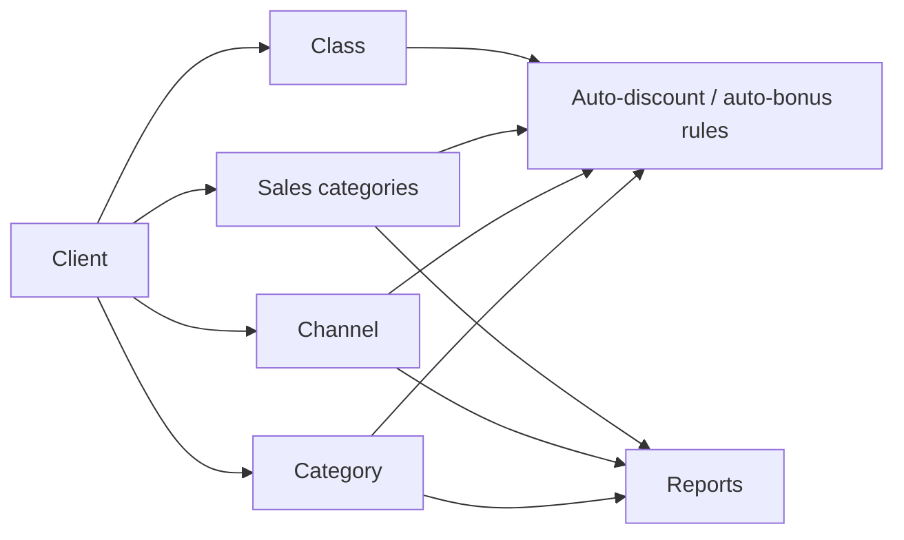

# Client categorisation — category, type, channel, class

## What this feature is for

Every outlet is tagged with several orthogonal categorisations:

| Dimension | Stored as | Plain meaning |
|---|---|---|
| **Category** (CLIENT_CAT) | FK to `client_category` | What kind of outlet — pharmacy, supermarket, kiosk, restaurant. Required at create time. |
| **Type** (TYPE) | FK to `client_type` | Legal entity type — sole trader, LLC, JSC. |
| **Channel** (CHANNEL) | FK to `client_channel` | Sales channel — B2B, retail, distributor, online. |
| **Class** (CLASS) | Free-form string on Client row | Priority tier — VIP, premium, standard, budget. No separate dictionary. |
| **Sales category** (SALES_CAT) | Many-to-many via `sales_category` join | Which product lines this client buys — multi-select. |
| **Tags** (TAG) | Many-to-many via `model_tag` | Free-form labels for analytics / filters. |

These dimensions drive auto-bonus / auto-discount matching, reports segmentation, route filters, and the visibility of clients on certain screens.

## Who maintains the dictionaries

| Dictionary | Edit role | Path |
|---|---|---|
| Category | Admin / Manager | Settings → Client categories (or `/clients/clientCategory/`) |
| Type | Admin / Manager | Settings → Client types |
| Channel | Admin / Manager | Settings → Channels |
| Class | (no dictionary — free text) | — |
| Sales category | Admin / Manager | Settings → Sales categories |
| Tags | Admin / Manager | Settings → Model tags |

## How they're used downstream

## Rules and limits

- **Category is required.** Every Client row must have a CLIENT_CAT.
- **Type, channel, class** are optional. Many dealers don't populate them.
- **Sales categories and tags are many-to-many.** A client can have any number, zero included.
- **No foreign-key enforcement for any of these.** A typo in the form's hidden field could store a non-existent CLIENT_CAT id. The list dropdowns prevent it via the UI, but API callers don't have that safety.
- **Soft-delete** on dictionary rows (`ACTIVE='N'`) — clients still reference the deactivated row. Test plans must verify the UI handles a "ghost" category sensibly.
- **Class is plain text.** Different operators may type *"VIP"*, *"vip"*, *"V.I.P."* and treat them as different. Use a dictionary in your test plan if reports filter by class.

## What to test

### Dictionary CRUD

- Create / rename / deactivate a category. Verify it appears / disappears in the Client edit dropdown.
- Deactivate a category that has existing clients. The clients still reference it. Edit one of those clients — what does the dropdown show?

### Matching

- Configure an auto-discount rule that matches `CHANNEL = retail`. Create a retail client and a B2B client. Take an order on each; verify the retail one gets the discount and the B2B one doesn't.
- Same for an auto-bonus rule matching on `SALES_CAT`.

### Bulk effects

- Change a client's category from pharmacy → kiosk. Verify the auto-discount / auto-bonus rules now match differently on the next order.

### Sales-category multi-select

- Pick three sales-categories for a client. Verify three `sales_category` rows. Remove one; verify the row is deleted. Add a new one; verify it's inserted.

### Tags

- Add tags. Verify `model_tag` rows. Remove a tag. Row deleted.

### Class (free text)

- Two clients with class *"VIP"* and *"vip"*. Filter the report by `CLASS = VIP`. Document whether the filter is case-sensitive — if it is, this is a bug.

## Where this leads next

- For how categorisation drives auto-discount / auto-bonus, see [Discounts](../orders/discounts.md) and [Bonuses](../orders/bonuses.md).
- For client creation flow, see [Create-edit client](./create-edit-client.md).

## For developers

Developer reference: `protected/modules/clients/controllers/ClientCategoryController.php`, `ClientChannelController.php`, `ClientTypeController.php` and models in `protected/models/`.
