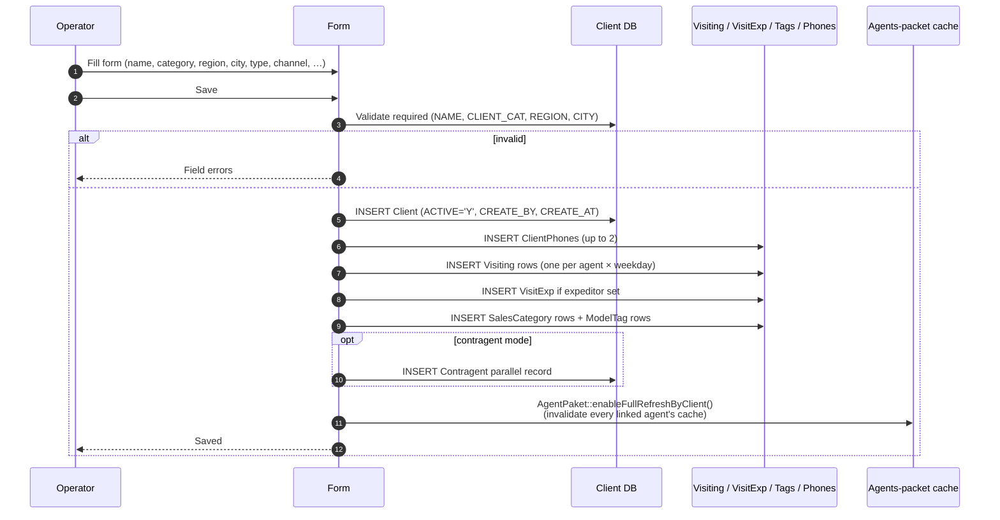

# Create / edit / deactivate / delete a client (web)

## What this feature is for

The web admin path for managing outlets. Operators do this all day — adding new outlets that a manager called in, fixing wrong addresses, deactivating closed shops. The flow is straightforward but has many fields, several validators, and a long list of side effects that test plans must verify.

## Who uses it and where they find it

| Role | Action | Path |
|---|---|---|
| Operator (3), Operations (5) | Full create / edit / deactivate; hard-delete almost never works once history exists | Web → Clients → New / Edit |
| Manager (2), Key-account (9), Admin (1) | Same | Same |
| Supervisor (8) | Read-only (cannot edit) | Same |
| Agent (4), Expeditor (10) | No web access | — |

Gates: `operation.clients.create`, `operation.clients.update`, `operation.clients.delete`, plus the toggle-locking flags `operation.clients.banMakingClientActive` / `banMakingClientInactive`.

## The workflow

## Step by step — Create

1. Operator opens **Clients → New** and fills the form. Required fields: NAME, CLIENT_CAT, REGION, CITY. Many optional fields (phone, address, channel, type, contact person, INN, coordinates, contract, tags, sales categories, expeditor, agents and visiting days).
2. Operator saves.
3. *Required-field validation runs.* ⛔ Any missing required field produces a field error.
4. *The system inserts the Client row.*
5. *Phones are normalised* (every non-digit stripped) and written to `client_phones` — up to two rows.
6. *Visiting rows* are inserted for each (agent, weekday) the form picked — see [agents module — routes](../team/index.md).
7. *VisitExp row* is inserted if an expeditor was chosen.
8. *Tags and sales-category* link rows are inserted.
9. **If contragent mode is on**, a parallel Contragent record is created and the Client's `CONTRAGENT` field is set to point at it.
10. *Every agent linked via Visiting has their packet cache flagged for full refresh* — `AgentPaket::enableFullRefreshByClient()`. The agents will re-download their full client list on next sync.

## Step by step — Edit

Same path with a few additions:

- **Phone-number cleanup:** if you remove a phone, the orphan `ClientPhones` row is deleted.
- **`ACTIVE` toggle is locked** when the dealer has set `banMakingClientActive` / `banMakingClientInactive` for the operator's role. Try to flip → the change reverts on save.
- **Audit log:** every changed field writes a `client_log` row.

## Step by step — Deactivate (soft delete)

1. Set `ACTIVE='N'` on the client.
2. Save.
3. *All linked `Visiting` rows are mirrored to `ACTIVE='N'`* — the client disappears from agents' routes.
4. *Re-activate later* — flipping back to `Y` restores everything.

## Step by step — Hard delete

Rarely possible. The system runs a deletion-safety check; if the client has any orders, debt, visits, photos, or pending records, deletion is blocked. Even when it succeeds, the orders / debt / payment rows referencing the client are **orphaned** — there is no FK constraint, so they remain in the database pointing at a non-existent id.

## What can go wrong

| Trigger | Error | Plain-language meaning |
|---|---|---|
| Missing NAME / CLIENT_CAT / REGION / CITY | Field error | Required. |
| FORM_SOB (INN) duplicate within dealer | No error (system allows) | Duplicates are not enforced — use the dedupe flow afterwards. |
| Phone with letters / formatting | Stored as digits-only | Non-digits stripped. Verify the resulting string. |
| Operator tries to flip ACTIVE while ban-flag is set | Toggle reverts on save, no error | The save *succeeds* but with the toggle reverted. |
| Hard-delete blocked | "Client has linked orders / visits / debt" | Use deactivation instead. |

## Rules and limits

- **No hard uniqueness on INN / phone / name** — duplicates are possible. Use [Duplicate and merge](./duplicate-merge.md) to clean them up.
- **No foreign-key constraints on the client.** Deleting the client orphans every dependent row. *Most deployments lock hard-delete behind admin-only RBAC*.
- **Phone normalisation is destructive.** `+998 (90) 123-45-67` becomes `998901234567`. Test that test plans use plain digits to predict the stored value.
- **AgentPaket cache invalidation cascades:** every agent who has this client on their route will re-sync their full client list on next login. Test plans for the agents module must account for this fresh-sync state.
- **Contragent mode is dealer-wide.** It doesn't toggle per-client. Test plans for contragent dealers must always check both Client + Contragent rows.

## What to test

### Happy paths

- Create a minimal client (required fields only). Verify row, no side effects beyond Visiting (none, since no agents picked).
- Create a full client with agents, expeditor, tags, sales categories. Verify every linked table has the expected rows.
- Edit each field. Each change should produce a `client_log` entry.
- Deactivate → re-activate. Verify Visiting rows mirror the toggle.

### Validation

- Each required field missing in turn — field error.
- Phone with non-digits — stored as digits only.
- INN duplicate within the dealer — verify it saves (and is flagged for dedupe).

### Permissions

- Operator with `banMakingClientInactive` set — toggle revert on save.
- Supervisor opens edit form — should be read-only.
- Hard-delete blocked because of linked orders — verify the blocking message lists the linked types.

### Cross-module side effects

- After save, the client appears in the agents' mobile route on next sync.
- After save, the expeditor's delivery list shows the client (if assigned).
- After deactivation, the agent's mobile no longer shows the client.

## Where this leads next

- For the mobile-app creation path, see [Mobile client creation](./mobile-client-creation.md).
- For approving an agent's mobile-created client, see [Verification](./verification.md).
- For cleaning up duplicates, see [Duplicate and merge](./duplicate-merge.md).

## For developers

Developer reference: `protected/modules/clients/controllers/ClientController.php`, `protected/models/Client.php`.
