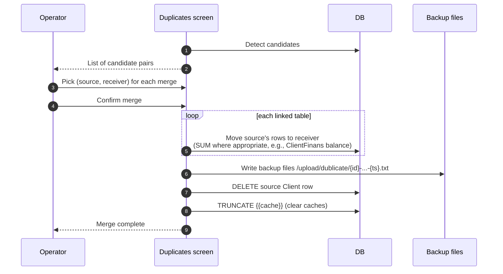

# Duplicate detection and merge

## What this feature is for

Two (or more) Client records that are really the same outlet. Common causes: agent created on mobile while operator created on web; bulk import added a duplicate; same outlet across two filials with the same INN. The system has a *detection* screen that lists candidate pairs, and a *merge* action that copies / sums data from one record into another and deletes the source.

## Who uses it and where they find it

| Role | Action | Path |
|---|---|---|
| Admin (1), Manager (2) | Detect, review pairs, merge | Web → Clients → Duplicates |
| Operator (3) | Often allowed by RBAC; depends on dealer | Same |
| Others | No | — |

Gate: `operation.clients.duplicate`.

## The detection step

Candidates are flagged by similarity in one or more of:

- `NAME` (exact match within dealer)
- `TEL` (phone digits-only match)
- `FORM_SOB` (INN match)
- `PINFL` (taxpayer id match)
- `FIRM_NAME` (legal-entity name match)
- **Geographic proximity** — `LAT` / `LON` within a small radius

The detection result is read-only. The operator decides which pairs are real duplicates.

## The merge workflow

## What gets merged

| Table | Behaviour |
|---|---|
| `Client` (main) | Receiver kept; source deleted at end. |
| `ClientFinans` | Balances SUMMED per currency. Source rows deleted. |
| `ClientTransaction` | All rows re-pointed to receiver via `UPDATE CLIENT_ID = <receiver>`. |
| `Visiting`, `VisitingAud`, `VisitExp` | All rows re-pointed. |
| `ClientPhoto`, `ModelTag`, `SalesCategory`, `ClientPhones` | All rows re-pointed. |
| `Order`, `OrderDetail` | **Not re-pointed.** Orders keep their old `CLIENT_ID` value, pointing at the now-deleted source. **Orphaned rows.** |
| `Contragent` (contragent mode) | Source's contragent also deleted; receiver's contragent kept. |

## Step by step

1. Admin opens **Duplicates**.
2. *The system runs the similarity query* and shows candidate pairs.
3. Admin picks the *source* (to delete) and *receiver* (to keep) for each pair they want to merge.
4. Admin confirms.
5. *For each linked table, the system moves source's rows to receiver* — UPDATE for re-pointing, SUM-and-delete for `ClientFinans` balances.
6. *Backup files* are written to `/upload/dublicate/` — one per affected table, with `source` and `receiver` filenames.
7. *The source Client row is deleted.*
8. *The cache table is truncated* to refresh any cached client lookups.
9. The receiver now has the combined data.

## What can go wrong

| Trigger | What you see | Plain-language meaning |
|---|---|---|
| Orders / OrderDetail rows reference the source | Orphaned after merge | **High-impact** — orders point at a dead CLIENT_ID. Reports filtered by client miss them. |
| Concurrent merges on overlapping pairs | One merge overwrites the other | The system has no lock on the merge pipeline. Avoid running merges in parallel. |
| Wrong source / receiver choice | Receiver has source's old name (if not edited after merge) | The source is gone — recovery requires restoring from `/upload/dublicate/` backup or from a database backup. |
| `/upload/dublicate/` directory full | Backup writes may fail silently | Periodic cleanup is manual. |
| `Contragent` mode mismatch (receiver has a contragent but source doesn't) | Contragent linkage may be incomplete on the receiver | Test both modes. |

## Rules and limits

- **Manual process — no auto-merge.** The operator explicitly picks pairs.
- **Backup files accumulate** in `/upload/dublicate/` indefinitely. Operations must clean them.
- **No FK constraint between Client and Order** — order re-pointing is the operator's responsibility after merge. The current system does not migrate orders.
- **Cache is truncated, not selectively invalidated** — heavy ops impact.
- **Merging across filials may or may not be allowed** — depends on dealer config. Verify the operator's scope.

## What to test

### Happy paths

- Two real duplicates (same outlet, two Client rows). Merge. Verify the receiver has the union of both rows' data; the source is deleted; backups exist; `ClientFinans` balances are summed.
- Pick the *wrong* receiver (say, the older one with less data). Merge. Verify the receiver is left with less data. **This is intentional behaviour — flag in docs.**

### Side-effect verification

- Receiver's `ClientTransaction` rows include all of source's transactions after merge.
- Receiver's `Visiting` rows include all of source's visiting plans.
- Source's photos are now attached to receiver.
- Receiver's `ClientFinans` balance = source.BALANS + receiver.BALANS (per currency).

### Orphan-orders test (critical)

- Source has 5 orders pre-merge.
- After merge, query orders by receiver's CLIENT_ID → only the receiver's original orders return.
- Query orders by source's old CLIENT_ID → still returns the 5 orders. **Orphan state confirmed.**
- Flag this as a known limitation that requires post-merge order reassignment.

### Backups

- After merge, verify `/upload/dublicate/{source}-deleted-Client-...txt` exists. Open it and verify it contains the source's serialised data.
- Same for each linked table — one backup file per table affected.

### Cache

- Just after merge, the receiver's data reflects the union. Open a fresh tab — verify cache truncation took effect.

### Contragent mode

- Run a merge in contragent mode. Verify the source's contragent row is also deleted; the receiver's contragent is kept.

## Where this leads next

- For the per-client edit flow, see [Create-edit client](./create-edit-client.md).
- For the bulk import that often introduces duplicates, see [Bulk import](./bulk-import.md).

## For developers

Developer reference: `protected/modules/clients/controllers/ClientController.php::actionDuplicate`, `Client::delete_dublicate`.
