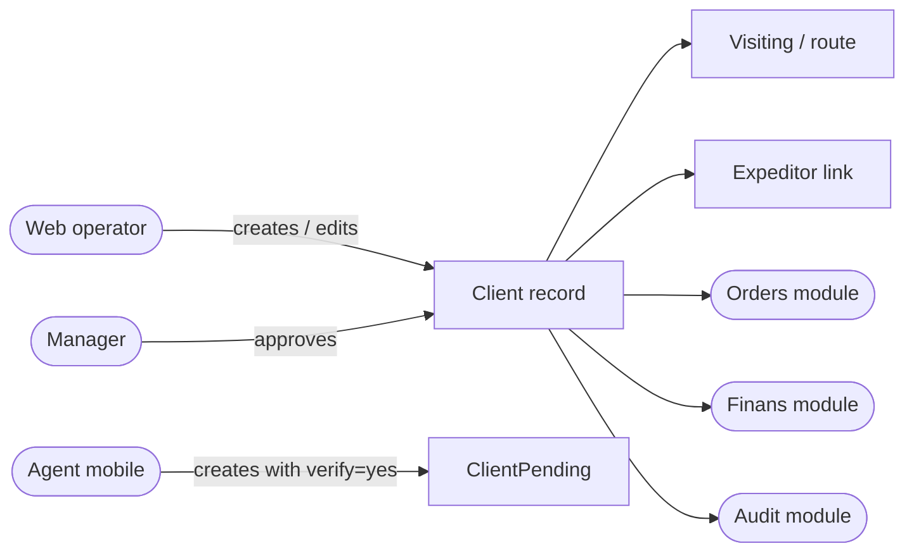

# Clients module — QA test guide

> **Reader.** A QA engineer who tests the *outlet directory* — every shop, pharmacy, restaurant or kiosk the dealer sells to.
>
> **What this module emphasises.** **Data integrity.** Uniqueness, deletion safety, cross-filial scoping, the verification flow for new clients added by agents on the road.

## What the module does

Clients are the dealer's customers — usually retail outlets, sometimes B2B businesses. The clients module owns:

- Creating and editing clients from the web admin.
- Mobile-app creation by field agents (gated by their packet's `client.create` toggle).
- A *verification* / *approval* flow: when an agent creates a new outlet on the road, the record can be parked in a *pending* table until a manager approves.
- Client categorisation: category (pharmacy / supermarket / kiosk), type (legal form), channel (B2B/retail/online), class (VIP / standard).
- Coordinates, expeditor assignment, visiting-plan slots, debt summary readback.
- Bulk import from Excel.
- Duplicate detection / merge.

Most other modules **read** Client (orders, agents, finans, audit, report). The clients module is the source of truth.

## How to use this guide

| When you want to test… | Open this page |
|---|---|
| The web operator's create / edit / deactivate path | [Create-edit client](./create-edit-client.md) |
| Mobile agent creates a new outlet during a visit | [Mobile client creation](./mobile-client-creation.md) |
| Manager approves (or rejects) a pending client | [Verification flow](./verification.md) |
| Categorisation dictionaries: category / type / channel / class | [Categorisation](./categorisation.md) |
| Bulk Excel import of many clients | [Bulk import](./bulk-import.md) |
| Duplicate detection and merging two records into one | [Duplicate and merge](./duplicate-merge.md) |

## Glossary shortlist (full list in [QA glossary](../glossary.md))

| Term | Meaning |
|---|---|
| **Client** | One outlet record. Has a unique CLIENT_ID, plus categorisation, coordinates, expeditor link. |
| **ClientPending** | The temporary table for unverified clients created by agents. |
| **Verification** | The flow where a manager approves or rejects a pending client. |
| **Visiting** | Per-client, per-agent, per-weekday route slot. Owned by agents module, written from here too. |
| **VisitExp** | Per-client expeditor delivery assignment. |
| **CLIENT_CAT** | Category — pharmacy, supermarket, kiosk, etc. Required at create time. |
| **CHANNEL** | Sales channel — B2B, retail, distributor, etc. |
| **CONTRAGENT** | Optional separate legal-entity record some dealers maintain alongside the client. |

## Master view

## What every clients-module test plan should record

1. **The dealer mode** — contragent or not. Contragent dealers auto-create parallel records.
2. **The actor's role** and which permission gates that role hits.
3. **Existing-data state** — duplicates that exist, pending rows already in the queue, etc.
4. **Side effects across modules** — visiting plan, agents-packet cache invalidation, expeditor assignment, debt rollup.

## For developers

Developer reference: `protected/modules/clients/controllers/`, `protected/modules/clients/actions/`, model: `protected/models/Client.php`.
