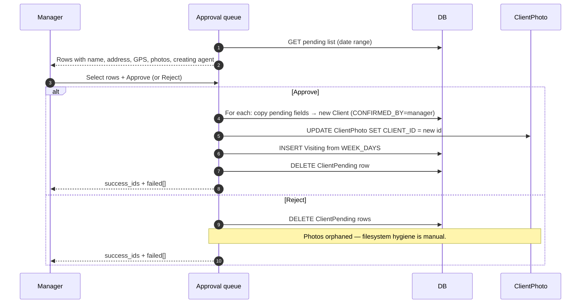

# Verification — approving pending clients

## What this feature is for

When agents create outlets on the road and the dealer's packet has `client.verify=1`, the new outlets land in a *pending* queue. This page covers the manager's web screen that approves or rejects pending entries in bulk.

If the packet has `client.verify=0`, this entire flow is skipped — see [Mobile client creation](./mobile-client-creation.md).

## Who uses it and where they find it

| Role | Action | Path |
|---|---|---|
| Operator (3, 5, 9), Manager (2), Admin (1) | View, approve, reject | Web → Clients → Approval queue |
| Agent (4), Supervisor (8), Expeditor (10) | No access | — |

Gates: `operation.clients.approval` (save), `operation.clients.approval.delete` (reject).

## The workflow

## Step by step — Approve

1. Manager opens the **Approval** screen with a date range.
2. *The system fetches every `ClientPending` row in the range.*
3. For each pending row the manager wants to accept, they tick a box and press **Approve**.
4. *For each approved row*:
   - The system copies the pending fields into a fresh `Client` row.
   - `CONFIRMED_BY` is set to the manager, `CONFIRMED_AT` to now, `ACTIVE='Y'`.
   - `ClientPhoto` rows are re-pointed by SQL UPDATE.
   - `Visiting` rows are inserted from the comma-separated `WEEK_DAYS` field — one Visiting row per (agent, weekday).
   - `SalesCategory` rows are inserted if any sales-category ids were on the pending row.
   - The `ClientPending` row is deleted.
5. *The response lists `success_ids` and `failed[]`* — per-row outcome.

## Step by step — Reject

1. Manager selects the rows to reject, presses **Reject**.
2. *The ClientPending rows are deleted.*
3. *ClientPhoto rows are NOT auto-cleaned* — they become orphaned on the filesystem and in the database table. (Test plans should call this out as a known issue.)

## What can go wrong

| Trigger | What you see | Plain-language meaning |
|---|---|---|
| Pending row's CREATE_BY user no longer exists | `failed[]` with *"Creator user not found"* | Agent was deleted between submission and approval. |
| Required field missing on pending row | `failed[]` with *"Error saving client"* | The pending row was malformed. |
| WEEK_DAYS empty or malformed | Client saves, no Visiting rows | The outlet has no route. Manager must edit afterwards. |
| Same pending id submitted twice (race) | Second call returns *"not found"* | Working as designed — the first delete clears it. |
| Approve on row whose creating agent is no longer linked to the agents the manager supervises | Approval proceeds normally | Approval is dealer-scoped, not supervisor-scoped. |
| Photo re-point UPDATE fails after Client INSERT | Client exists; photos remain orphaned | Not transactional; manual fix needed. |

## Rules and limits

- **Approval is one-way.** There is no "un-approve" — to revert, deactivate the new client. The pending row is gone.
- **Rejection deletes the pending row** — there's no archived rejected-pending table.
- **WEEK_DAYS expansion** — on approval, a `WEEK_DAYS="1,3,5"` value creates three Visiting rows per linked agent.
- **No timeout on pending rows.** They sit indefinitely until acted on.
- **No notification to the creating agent** by default — they discover their outlet exists when it appears on their route after sync.

## What to test

### Approval happy path

- One pending row → Approve. New Client appears, photos re-pointed, Visiting rows inserted from WEEK_DAYS, pending row gone. Agent's next sync shows the outlet on their route.
- Five pending rows → Bulk approve. All five become Clients in one save; success_ids has all five.
- Pending row with photos → after approval, photos appear on the new Client's photo gallery.
- Pending row with WEEK_DAYS="2,4,6" → three Visiting rows per linked agent.

### Rejection

- One pending row → Reject. Row gone. Photos remain — verify the orphan state.
- Bulk reject five rows. All gone in one save.

### Failure paths

- Pending row with non-existent CREATE_BY user → failed[] entry; pending row stays.
- Pending row with missing required field → failed[] entry; pending row stays.
- Race: two managers approve the same row simultaneously. One succeeds, the other gets "not found".

### Cross-module

- After approval, the creating agent's mobile sync should show the outlet on their route.
- After approval, the outlet appears in the Clients list, in the relevant supervisor's scope (if their team includes the creating agent).
- After approval, an order can be taken on the outlet.

## Where this leads next

- For the mobile submit side of this flow, see [Mobile client creation](./mobile-client-creation.md).
- For the packet that gates verification, see [agents-packet](../team/agents-packet.md).

## For developers

Developer reference: `protected/modules/clients/controllers/ApprovalController.php` — `actionGetData`, `actionSave`, `actionDelete`.
