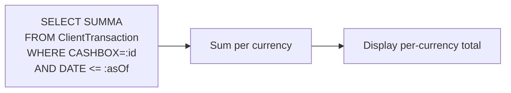

# Cashbox balance — per-till running totals

## What this feature is for

A *cashbox* is a named payment channel — a cash drawer, a card terminal, a bank account. Every payment row carries a cashbox so reports can answer *"how much cash did till #3 take today?"*. The cashbox balance screen sums payment rows for a chosen cashbox and date range.

This is also the screen where role-6 (cashier) scoping matters most: a cashier only sees their own cashbox; an operator sees all.

## Who uses it and where they find it

| Role | Sees | Path |
|---|---|---|
| Operator (3), Operations (5), Key-account (9), Supervisor (8) | All cashboxes | Web → Finance → Cashbox balance |
| Cashier (6) | Only cashboxes where `Cashbox.KASSIR = my user id` | Same |
| Any user with `ACCESS_CASHBOX=1` | All cashboxes regardless of role | Same |

## How the balance is computed

The balance is not stored — it is summed live from `ClientTransaction` rows. Every new write changes the displayed total on next refresh.

## Step by step (operator view)

1. User opens **Finance → Cashbox balance** and picks a cashbox + as-of date.
2. *The system sums all `ClientTransaction.SUMMA`* where `CASHBOX = chosen-id` and `DATE <= as-of`.
3. *Rows in different currencies are summed independently.*
4. The view displays one total per currency.

## What can go wrong

| Trigger | What you see | Plain-language meaning |
|---|---|---|
| Role 6 user navigates to a cashbox not theirs | The cashbox is missing from the dropdown | Scoping in effect. URL hacking should also be blocked — test it. |
| Cashbox holds rows in two currencies | Two totals, one per currency | Cashboxes should normally be single-currency. If you see this, the cashbox was misconfigured or used with the wrong currency. |
| Negative balance | Payouts (TRANS_TYPE=7) exceed receipts | Real situation if the dealer pre-funded payouts. Should not happen accidentally. |
| Closed period | Period close gates writes but not reads — older totals still visible | Working as designed. |

## Rules and limits

- **`ACCESS_CASHBOX=1` is a powerful override.** Document who has it; it bypasses scoping.
- **The displayed balance is real-time** — no caching layer. Heavy filters can be slow on busy cashboxes.
- **Cashboxes have a `KASSIR` field** — the user who owns the cashbox. One cashbox can have at most one KASSIR (one-to-one).
- **Deactivating a cashbox** hides it from the dropdown but does not delete historical rows. Reports filtered by deactivated cashboxes still work.

## What to test

- Operator picks each cashbox and confirms the running total matches `SUM(ClientTransaction.SUMMA WHERE CASHBOX=id AND DATE<=today)`.
- Cashier (role 6) sees only their own cashbox in the dropdown; URL-hacking another cashbox id is blocked or returns empty.
- Cashbox with the `ACCESS_CASHBOX=1` override: cashier sees every cashbox.
- New payment is recorded; the cashbox total increases by the payment amount on next refresh.
- Manual payout (TRANS_TYPE=7) is recorded; the cashbox total decreases.
- Multi-currency cashbox (if any): each currency shows its own running total.
- Deactivate a cashbox; verify it disappears from new-payment forms but old payments in it still report correctly.

## Where this leads next

- For per-client running balance, see [Client debt view](./client-debt-view.md).
- For currency handling, see [Multi-currency](./multi-currency.md).

## For developers

Developer reference: `protected/modules/clients/controllers/FinansController.php::actionCashboxBalans`, `protected/models/Cashbox.php`.
