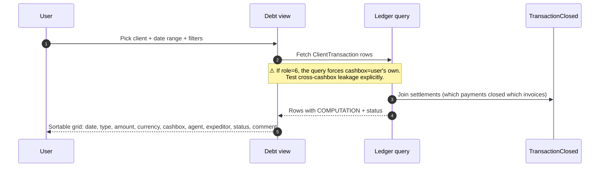

# Client debt view — the per-client ledger screen

## What this feature is for

The screen an operator, supervisor or cashier opens to see every ledger row tied to one client over a chosen date range. It is the primary tool for resolving *"why does this client still show debt?"* questions.

## Who uses it and where they find it

| Role | What they see | Path |
|---|---|---|
| Operator (3), Operations (5), Key-account (9) | Every client, every cashbox, every currency | Web → Finance → Client debt |
| Cashier (6) | Only **their own cashbox's** rows (filtered server-side) | Same |
| Supervisor (8) | Scoped to their team's agents/clients | Same |
| Agent (4), Expeditor (10) | No access on web | — |

## The workflow

## Step by step

1. The user opens the screen and picks a client.
2. The user sets a date range (the system does **not** enforce a default — wide ranges work but are slow).
3. *The system fetches every `ClientTransaction` row for the client in the range*, filtered by the user's role-scoping (especially role 6).
4. *The system joins `TransactionClosed`* so each row shows whether it has been settled and against which counterpart.
5. *The grid renders.* The user can sort, filter client-side, drill into a row, export.

## What can go wrong

| Trigger | What you see | Plain-language meaning |
|---|---|---|
| Role 6 cashier views a row from a colleague's cashbox | Row hidden | Working as designed — the scope filter applied. |
| Wide date range | Slow load | The fetch returns everything; no pagination on the server side. |
| Currency filter not applied | All currencies displayed in same grid | Multi-currency view is intentional — see [Multi-currency](./multi-currency.md). |
| `COMPUTATION` is non-zero on a closed invoice | Partial settlement | One or more payments covered it only partially. |

## Rules and limits

- **Role 6 (cashier) scoping is server-side**; URL-hacking does not bypass it.
- **No default date range** — pick one explicitly. Wide ranges are unrestricted.
- **Read-only screen** — edits happen through dedicated actions ([Manual correction](./manual-correction.md), [Settlement](./settlement.md)).
- **Period lock applies to writes, not reads** — closed-period rows are visible.

## What to test

- Operator sees every cashbox's row for a client; cashier sees only their own. Run as both roles, same client, same range; the cashier's row count must be ≤ operator's.
- Mixed-currency client: open the view; verify each currency's rows are grouped or labelled correctly.
- Open-debt scenario: an invoice with `COMPUTATION` not zero must be visible and visibly flagged as partial / open.
- Date-range boundaries: pick range = `[2026-01-01, 2026-01-01]`. Verify rows dated exactly on the boundary day appear (inclusive).
- Supervisor: confirm they see only clients of agents on their team.
- Performance: 90-day range on a busy client should still render. If it hangs, flag as a regression.

## Where this leads next

- For row-level meaning, see [Transaction types](./transaction-types.md).
- For how settlement links work, see [Settlement](./settlement.md).

## For developers

Developer reference: `protected/modules/clients/controllers/FinansController.php::actionIndex`.
