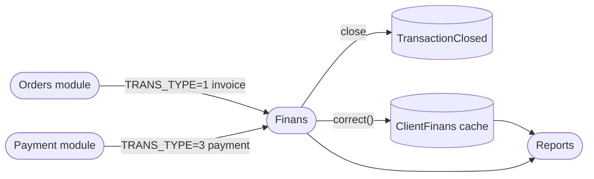

# Finans module — QA test guide

> **Reader.** A QA engineer who tests anything that produces or moves money — debt, payments, settlements, cashbox totals, multi-currency.
>
> **Why it matters more than most modules.** Numbers must reconcile exactly. Off-by-one or off-by-rounding here = real money lost. Every test plan in this section yields arithmetic checks.

## What the module does

The Finans module is the dealer's **ledger**. Every order saved into the system writes an *invoice row*; every payment collected writes a *payment row*. The settlement engine links them: a payment closes one or more invoices, and the leftover (overpayment) sits as a credit. Across all of this, the module also tracks per-client balances, per-cashbox running totals, and multi-currency state.

The finans module mostly **reads** rows that other modules wrote. Orders writes invoices (`TRANS_TYPE=1`), Payment writes receipts (`TRANS_TYPE=3`). The finans module's own writes are manual adjustments, settlements, and initial balances.

## How to use this guide

| When you want to test… | Open this page |
|---|---|
| The per-client debt screen and its filters | [Client debt view](./client-debt-view.md) |
| What each `TRANS_TYPE` means and where it comes from | [Transaction types](./transaction-types.md) |
| Manual ledger adjustments (TRANS_TYPE=3/6/7/8 by the operator) | [Manual correction](./manual-correction.md) |
| How payments close invoices (FIFO settlement) | [Settlement](./settlement.md) |
| Multi-currency boundaries and the TRANS_TYPE=4 conversion row | [Multi-currency](./multi-currency.md) |
| Per-cashbox balances and role-6 scoping | [Cashbox balance](./cashbox-balance.md) |

## Glossary shortlist (full glossary in [QA glossary](../glossary.md))

| Term | Meaning |
|---|---|
| **ClientTransaction** | The ledger row table. Every debt or payment is one row. |
| **TRANS_TYPE** | Stamped on each row: **1**=invoice, **3**=payment, **4**=conversion, **6**=initial balance, **7**=payout, **8**=writeoff, **9**=shelf-return. |
| **TransactionClosed** | The settlement table — links one payment row to the invoice rows it closed. |
| **ClientFinans** | The cached per-client, per-currency running balance. Updated on every transaction save via `correct()`. |
| **COMPUTATION** | The undistributed portion of a transaction. On a payment, it's how much hasn't yet been applied to an invoice. On an invoice, it's how much is still owed. |
| **Close period** | A rolling lock — once set, transactions dated before it can no longer be entered or edited (except by users in the exception role list). Separate from the orders module's *close date*. |
| **Cashbox / KASSIR** | A till. Each cashbox optionally has a `KASSIR` (cashier user); role 6 sees only their own cashbox. |

## Master view

## Common test patterns

Every test in this section should at minimum:

1. Record the affected client's `BALANS` and `COMPUTATION` **before** the action.
2. Execute the action.
3. Record both fields **after**.
4. Verify the delta matches the action's expected effect (signed, in the correct currency).

## For developers

Developer reference: `protected/modules/clients/controllers/FinansController.php`, `protected/models/ClientTransaction.php`, `protected/models/TransactionClosed.php`, `protected/models/ClientFinans.php`.
