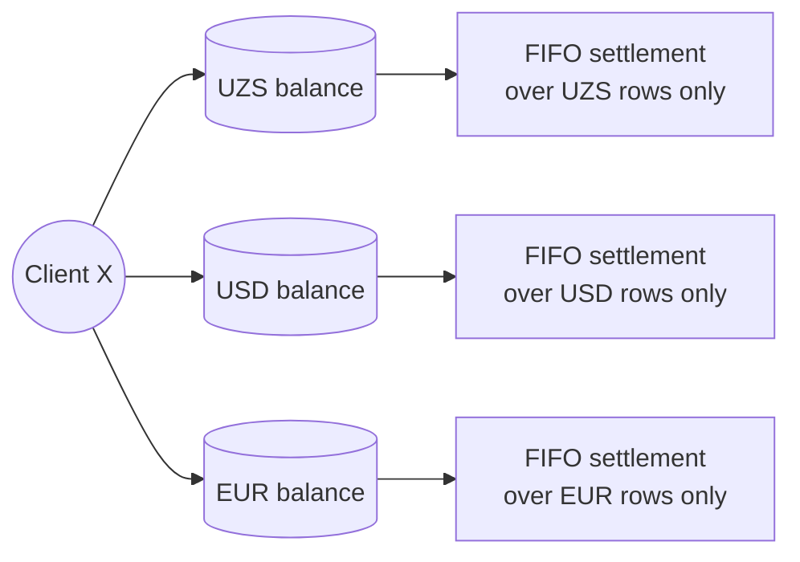

# Multi-currency — running ledgers in more than one currency

## What this feature is for

A dealer may accept payments in more than one currency — most commonly UZS + USD, sometimes plus EUR or RUB. Each ledger row carries a `CURRENCY` and the system keeps **separate balance buckets per (client × currency)**. Settlement does not cross currencies; if a payment is in USD and the invoice is in UZS, neither row settles against the other.

This page covers the boundaries: how currencies are configured, how each currency runs its own settlement chain, and how the TRANS_TYPE=4 conversion row creates an audit trail when an operator does swap money between buckets.

## Who configures it

| Action | Role | Path |
|---|---|---|
| Add / activate currencies | Admin (1) | Web → Settings → Currencies |
| Set the dealer's default currency | Admin (1) | Web → Settings → Dealer config (`Diler.CURRENCY_ID`) |
| Record a conversion (TRANS_TYPE=4) | Operator (3, 5, 9) | Web → Finance → Add transaction → pick conversion |

## How balances split per currency

The same client can owe in one currency while having a credit in another. The view shows them side-by-side.

## What can go wrong

| Trigger | What you see | Plain-language meaning |
|---|---|---|
| Customer pays in USD against a UZS-only invoice | No settlement; both rows stay open | Currencies don't cross automatically. Operator must record a conversion. |
| Currency is deactivated mid-life | New rows in that currency are rejected; existing rows remain | Active flag gates writes, not reads. |
| Exchange rate not stored on the row | Conversion rows have a `CURRENCY_RATE` field, but it may be left null | If you need the historical rate for reporting, verify it's populated. |
| Conversion row exists but settlement still doesn't cross | Correct behaviour — TRANS_TYPE=4 is excluded from settlement | The conversion is purely audit. The two affected rows on either side of the conversion are *new* TRANS_TYPE=1 or 3 rows in the respective currencies. |

## The conversion workflow in detail

Recording an FX conversion is a **multi-row** operation, not a single ledger entry:

1. Operator records *"client paid 100 USD which we treat as 1,250,000 UZS"*.
2. *The system creates three rows*:
    - One TRANS_TYPE=3 payment in USD (positive 100).
    - One TRANS_TYPE=4 conversion in USD (negative 100) — pure audit.
    - One TRANS_TYPE=4 conversion in UZS (positive 1,250,000) — pure audit.
    - And a TRANS_TYPE=3 payment in UZS (positive 1,250,000) — this is what actually settles against UZS invoices.

The audit trail captures *"these dollars became these soms at this rate"*. The settlement engine then operates within each currency bucket as normal.

(The exact flow varies by dealer config — confirm against the actual UI for each tenant; some dealers use simpler 2-row flows.)

## Rules and limits

- **TRANS_TYPE=4 rows are invisible to settlement** — they participate in audit only.
- **`ClientFinans.BALANS` is per-currency** (one cache row per client × currency).
- **`Client.BALANS` is a sum across all the client's currencies** — converted at some rate. If the rate is unstable, this single number may shift even when no money moved. Reports that show a single-number-per-client must specify a conversion basis.
- **No automatic FX rate lookup.** The operator types the rate (or the conversion amount); the system does not call an external rate API.
- **Cashboxes are single-currency.** A USD cashbox cannot hold UZS rows.

## What to test

- One client, two open invoices: UZS 1,000,000 and USD 100. Pay 1,000,000 UZS. Verify only the UZS invoice closes; the USD invoice stays open.
- Add a TRANS_TYPE=4 conversion. Verify it appears in the audit view and is **not** counted in `ClientFinans.BALANS`.
- Deactivate a currency. Verify new rows in that currency are rejected; existing rows remain accessible.
- Sum-of-balances test: `SUM(ClientTransaction.SUMMA WHERE CLIENT_ID=X AND CURRENCY=Y AND TRANS_TYPE<>4) = ClientFinans.BALANS[X, Y]`.
- Client.BALANS rollup test: the single number must match the sum of per-currency balances *converted at the configured rate*. If no rate is configured for a currency present on the client, flag.

## Where this leads next

- For the settlement algorithm details, see [Settlement](./settlement.md).
- For cashbox-level per-currency totals, see [Cashbox balance](./cashbox-balance.md).

## For developers

Developer reference: `protected/models/ClientTransaction.php` (CURRENCY, CURRENCY_RATE, CONVERTATION fields); `protected/models/TransactionClosed.php::close_by_client_currency`.
