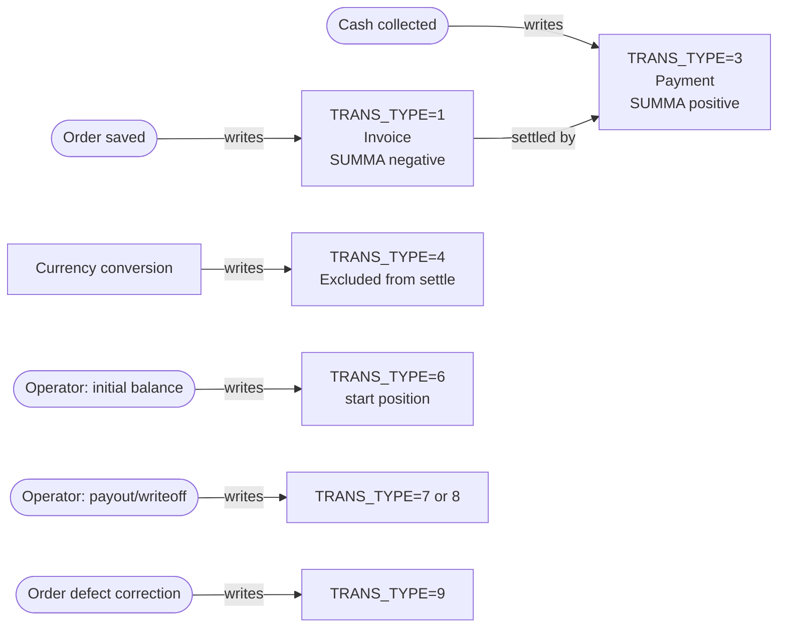

# Transaction types — what each `TRANS_TYPE` means

## What this feature is for

Every ledger row carries a single numeric stamp called `TRANS_TYPE` that says *what kind of row it is*. QA cannot test debt and payment flows without knowing what each value means and which module writes it.

This page is the cheat-sheet QA returns to whenever a bug report names a stored number ("the TRANS_TYPE 9 row didn't appear").

## The full enum

| Stored | Name | Plain meaning | Written by |
|---|---|---|---|
| **1** | Invoice | The amount the client owes for one order. Created when an order is saved into a state that means "the client now owes money for this". | Orders module on order save (via `ClientTransaction::newOrderTransaction` or `orderTransaction`) |
| **2** | Manual debt | Legacy — not used by current code. If you see one, it predates the current workflow. | (unused) |
| **3** | Payment receipt | Cash (or card / bank) collected from the client. Reduces what they owe. | Payment module on mobile payment-set, or Finans module on manual entry. |
| **4** | Currency conversion | An audit row showing money moved between two currencies. **Excluded from settlement matching.** | Manual or special conversion flow |
| **5** | Converted payment | Intermediate row used during a multi-step currency conversion. | Internal — payment conversion flow |
| **6** | Initial balance | The starting debt or credit a client had when they were first onboarded into the system. Always dated to the `startFinans` cutoff. | Operator manual entry on client onboarding |
| **7** | Payout to client | The dealer gave money *to* the client (refund, prepayment back). | Operator manual entry |
| **8** | Debt writeoff | The dealer formally forgave an outstanding debt. | Operator manual entry |
| **9** | Shelf return / defect correction | Adjustment row created when an order's quantity is corrected upward after delivery (a defect was un-defected, or extra goods accepted). | Orders module |

## How they balance

The sign convention: **negative** `SUMMA` = the client owes; **positive** `SUMMA` = the client paid / was credited.

## Rules and limits

- **TRANS_TYPE is not validated at write time.** Any integer can be stored; QA should test that exotic values are rejected or ignored cleanly.
- **TRANS_TYPE=4 rows do not participate in settlement.** All `close_by_client*` queries hard-coded with `TRANS_TYPE <> 4`.
- **TRANS_TYPE=1 and =3 are the only two that the *orders* and *payment* modules write automatically.** Everything else is an operator's manual action.
- **The `STATUS` column is independent.** `STATUS='Y'` means the row is finalised; `'N'` means pending. Most automatic writes are `Y`. Manual writes are sometimes `N` until a manager approves.

## What to test

- Save an order, deliver it, watch the ledger. Verify a `TRANS_TYPE=1` row appears with negative SUMMA equal to the order total.
- Collect cash via the mobile payment. Verify a `TRANS_TYPE=3` row appears with positive SUMMA.
- Manual correction screen — pick each of TRANS_TYPE 3/6/7/8 and verify the resulting row has the expected sign and STATUS.
- Currency conversion — verify a `TRANS_TYPE=4` row appears and does **not** show up in settlement queries.
- Defect-correction on a delivered order — verify a `TRANS_TYPE=9` row appears with the delta amount.
- Manual entry of `TRANS_TYPE=2` (legacy) — should be blocked or simply not writable by the UI.

## Where this leads next

- For the manual entry path, see [Manual correction](./manual-correction.md).
- For how invoice and payment rows settle, see [Settlement](./settlement.md).

## For developers

Developer reference: `protected/models/ClientTransaction.php`. Search for `TRANS_TYPE` to see every site that writes one.
