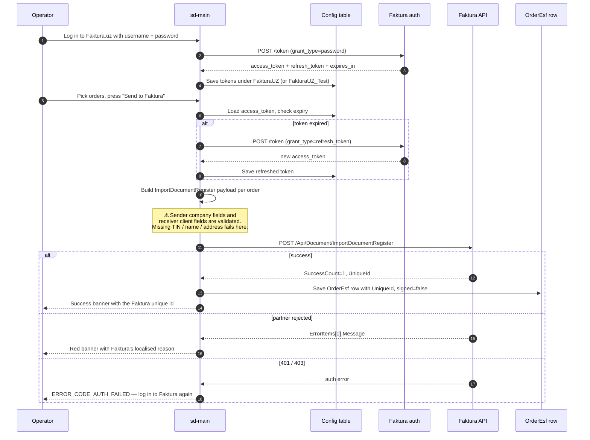

# Faktura.uz — electronic invoice export

## What this feature is for

Faktura.uz is one of Uzbekistan's authorised **electronic-invoice operators**. The state requires that B2B sales over a threshold are accompanied by an *Электронный счёт-фактура* (ESF). This feature pushes the dealer's orders into Faktura.uz as ESF drafts, so the dealer's accountant can review and sign them in the Faktura.uz portal. After signing, the invoice is irreversible.

There are two endpoints — a **test (staging)** and a **production** one. The dealer toggles between them with a server parameter (`testFakturaUZ`). Real production traffic from `.salesdoc.io` hosts in Uzbekistan automatically uses the production credentials; everything else defaults to staging.

## Who uses it and where they find it

| Role | What they do here | Surface |
|---|---|---|
| Operator (3), KAM (9) | Push selected orders to Faktura.uz, check status, delete unsigned drafts | Web admin → **Orders** → multi-select → **Send to Faktura** |
| Manager (2) | Same as operator | Web admin → **Orders** |
| Admin (1) | Configure credentials, switch test/prod, manage company-level fields | Settings → **Integrations** → **Faktura.uz** |
| Accountant | Reviews and signs the pushed drafts | Faktura.uz portal — outside sd-main |

End customers never see this feature directly. They may receive the signed PDF afterwards, but that is handled by the Faktura.uz portal.

## The workflow — at a glance

## Step by step

1. Admin opens **Settings → Integrations → Faktura.uz** and enters the dealer's Faktura username and password.
2. *The server posts those credentials* to the Faktura auth URL (`stagingaccount.faktura.uz` in test, `account.faktura.uz` in production) with the dealer's client id and secret.
3. *On success, Faktura returns an access token, a refresh token, and an expiry.* The server saves all three in the **Config** table under the category **FakturaUZ** (production) or **FakturaUZ_Test** (staging). Expiry is stamped as `expires_in + now - 600` to leave a 10-minute buffer.
4. The operator opens the orders grid, multi-selects orders to invoice, and presses **Send to Faktura**.
5. *The server fetches the saved token.* If `now > expires_at`, the server transparently calls the auth endpoint with the refresh token (`grant_type=refresh_token`) and updates the Config rows. On refresh failure, the operator is prompted to log in again.
6. For each selected order, *the server builds a document payload*:
   - **Header.** Dealer's TIN, firm name, VAT code, address, phone, bank details, OKED.
   - **Receiver.** Client's TIN, name, address, contract number, contract date. If the order has a contragent, the contragent's details are used instead.
   - **Items.** One per order line, with IKPU code, unit, quantity, unit price, VAT base, VAT value, and (for marked goods) attached CIS marks grouped by GTIN.
   - **Excise.** If the dealer's products carry an excise rate, it is subtracted from the VAT base on a per-line basis. The presence of excise switches the file name from `universal-vat-invoice` to `universal-tax-invoice`.
   - **Summary.** Column totals for subtotal, VAT and excise.
7. *The server posts the payload* to `/Api/Document/ImportDocumentRegister` with the bearer token.
8. *Faktura validates the payload* and returns either `SuccessCount=1` with a `UniqueId`, or `ErrorItems` with a localised reason.
9. On success, *the server stores an OrderEsf row* with the order id, the unique id, the operator stamp (`ESF_OPERATOR_FAKTURA`), document type (`STANDARD`), and `SIGNED=false`. From this point the order is linked to a Faktura draft.
10. The accountant opens the Faktura.uz portal, finds the draft by its number (`SD-<orderNumber>`), reviews and signs it. After signing, sd-main's `SIGNED` flag is updated by the next status-check call.
11. The operator can press **Check status** to refresh the signed/unsigned state of selected orders.
12. The operator can **delete an unsigned draft** — this calls Faktura's delete endpoint and removes the OrderEsf row. Signed drafts cannot be deleted; the operator is told *"This order already has an invoice document"*.

## What can go wrong (errors the operator sees)

| Trigger | Message |
|---|---|
| Username or password wrong at login | *"Invalid login or password"* / *"Account not found"* (translated) |
| Login fields blank | *"Please fill in Login and Password"* |
| Token expired and refresh also failed | `ERROR_CODE_AUTH_FAILED` — operator must log in again |
| Dealer's TIN, name, or address missing | *"Missing required fields of company"* with a list of fields |
| Client's TIN, name, or address missing | *"Missing required fields of client"* with a list of fields |
| Marked goods order with no CIS attached | *"No CIS codes attached"* — must be fixed in [CIS code check](../orders/cis-code-check.md) |
| CIS codes not yet validated | *"Codes have not been validated"* |
| A CIS came back invalid from XTrace | *"&lt;CIS&gt; has an error"* — operator must replace that code |
| Re-pushing an already-signed order | *"This order already has an ESF"* |
| Faktura returns a 200 with `ErrorItems` | Banner shows the partner's `Message` text verbatim |
| Faktura returns a 500 / network timeout | Banner shows *"Faktura.uz code &lt;status&gt;"* with the raw response |

## Rules and limits

- **Two environments, one switch.** `testFakturaUZ=true` routes everything to `stagingaccount.faktura.uz` + `stagingapi.faktura.uz` with the staging client id (15). `testFakturaUZ=false` (or unset) routes to production (`account.faktura.uz` + `api.faktura.uz`, client id 933283). The production credentials only apply on `.salesdoc.io` hosts in Uzbekistan; everywhere else falls back to staging.
- **Test and production tokens are stored separately.** Test tokens live under `FakturaUZ_Test`, production under `FakturaUZ`. Switching the flag does not invalidate the other set.
- **Document number is `SD-<orderNumber>`.** This is the operator-visible Faktura ID. It must be unique within Faktura's namespace — re-pushing the same order does not change the number.
- **Document date is the order's load date** (fallback: order date).
- **Currency is hardcoded to UZS (860) with rate 1.** Multi-currency orders are not supported by this integration; for those, the dealer raises a separate paper invoice.
- **VAT rate is read from the dealer config** (default 12%). It is applied per-line; the per-line `summa` field stored against orders is treated as VAT-inclusive and decomposed into base + VAT.
- **CIS marks are grouped by GTIN** in the payload. Three pack types are supported: unit (`kiz`), group (`nom_upak`), pallet (`ident_trans_upak`).
- **Re-push policy.** If an unsigned draft already exists for the order, the previous OrderEsf row is deleted before pushing again. If a signed draft exists, re-push is rejected with `esf-already-exists`.
- **Token-refresh buffer.** Tokens are treated as expired 10 minutes before their actual expiry, so a long operator action does not get hit by mid-flight expiry.
- **Excise handling.** Products with `EXCISE_RATE_TYPE_FIXED` add the excise as a flat per-unit amount; `EXCISE_RATE_TYPE_COMBINED` extracts excise from the total. Either flavour switches the invoice file type to `tax`.

## What to test

### Happy paths

- Push a single-line order, no excise, no CIS. Verify Faktura returns a unique id, an OrderEsf row is created, the banner shows the id.
- Push a multi-line order with mixed VAT-only and excise products. Verify the `tax` invoice type is used and excise totals match the summary.
- Push a marked-goods order. Verify CIS marks are grouped by GTIN with the right pack-type field.
- Push an order, sign it in the Faktura portal, press **Check status** in sd-main. Verify `SIGNED` flips to true.
- Re-push an unsigned draft after editing the order. Verify the previous OrderEsf row is deleted and a fresh unique id is stored.

### Credentials & external failure

- **Credentials missing:** Operator presses Send before logging in to Faktura. Expect: a banner directing them to **Settings → Integrations → Faktura.uz** to log in.
- **Network failure:** Faktura host unreachable during the push. Expect: banner showing *"Faktura.uz code &lt;status&gt;"* with no OrderEsf row created. Re-press the button to retry — verify no duplicate row.
- **Invalid response:** Faktura returns 200 with `{"SuccessCount":0,"ErrorItems":[{"Message":"INN format is wrong"}]}`. Verify the operator sees *"INN format is wrong"* and no OrderEsf row is created.
- **Partial success:** Operator selects 5 orders and presses Send. Three succeed, two fail. Verify three OrderEsf rows are saved with their unique ids; the two failed rows have nothing saved. Verify the per-order result is reported to the operator.
- **Retry behaviour:** Resend the two failed orders after fixing the underlying issue (e.g. filled in the client TIN). Verify only those two are re-sent and the three already-saved orders are not duplicated.

### Token refresh

- Push an order with a token expiring in less than 10 minutes. Verify the integration auto-refreshes and the push still succeeds.
- Push an order with an expired refresh token (manually expire it in Config). Verify the operator gets `ERROR_CODE_AUTH_FAILED` and is prompted to log in.
- Push an order from a test environment first, then switch `testFakturaUZ` to false and push another order. Verify two separate token sets exist in Config and the right one is used.
- Press **Check status** rapidly 5 times. Verify token reads come from cache, not from a refresh call each time.

### Validation failures

- Dealer config has no TIN. Push any order. Expect: *"Missing required fields of company: tin"*.
- Client has no name and no firm name. Expect: *"Missing required fields of client: name"*.
- Marked-goods order with `CISES_STATUS_NO_CISES`. Expect: *"No CIS codes attached"*.
- An attached CIS is `GTIN=invalid`. Expect: *"&lt;CIS&gt; has an error"*.
- An attached CIS has not yet been validated (`GTIN IS NULL`). Expect: *"Codes have not been validated"*.

### Edge cases

- Order on a contragent with a contract date in DD.MM.YYYY format. Verify the date is forwarded correctly.
- Order line where unit_price * quantity rounds differently than `summa` field. Verify the decomposition uses the stored `summa` as truth and back-derives the unit price.
- VAT rate switched in `diler_config.txt` mid-day. Verify the next push uses the new rate.
- Test mode flag flipped while a push is in progress. Verify nothing crashes; the in-flight push completes against whichever endpoint was selected at start.
- Push an order, delete it in sd-main, push again. Verify the second push fails with *"Document not found"* (the source order is gone).
- Re-push the same order twice in parallel from two browser tabs. Verify only one OrderEsf row is created; the second tab gets *"esf-already-exists"* or a fresh re-push of the unsigned draft, never two parallel drafts.

### Role gating

- Operator (3), KAM (9), manager (2), admin (1): can push, check, delete.
- Agent (4), expeditor (10): the **Send to Faktura** button must be hidden; direct URL must 403.
- A user from filial A cannot push orders of filial B (filtering is enforced by the orders grid).

### Side effects to verify

- Successful push writes exactly one OrderEsf row per order: `ORDER_ID`, `ESF_DOCUMENT_ID`, `ESF_OPERATOR=FAKTURA`, `ESF_DOCUMENT_TYPE=STANDARD`, `SIGNED=false`.
- Token refresh writes/updates three Config rows: `access_token`, `refresh_token`, `expires_at`.
- Status check on a signed draft updates `SIGNED=true` on the existing OrderEsf row.
- Delete of an unsigned draft removes the OrderEsf row and posts a delete to Faktura.

## Where this leads next

After a draft is created in Faktura, the rest of the lifecycle (sign, archive, audit) happens in the Faktura.uz portal. sd-main only tracks the signed/unsigned flag. For the alternative ESF operator with similar mechanics see the *Didox* paragraph in the [index](./index.md).

## For developers

Developer reference: `protected/modules/orders/controllers/FakturaUZController.php` (test/prod switch, OAuth refresh, document prepare), `protected/modules/integration/controllers/FakturaController.php` (action map), `protected/modules/integration/actions/faktura/*` (LoginAction, CreateInvoiceAction, CheckInvoiceAction, DeleteInvoiceAction, SyncIncomingInvoicesAction), model `OrderEsf`. The `testFakturaUZ` parameter lives in `Yii::app()->params`.
