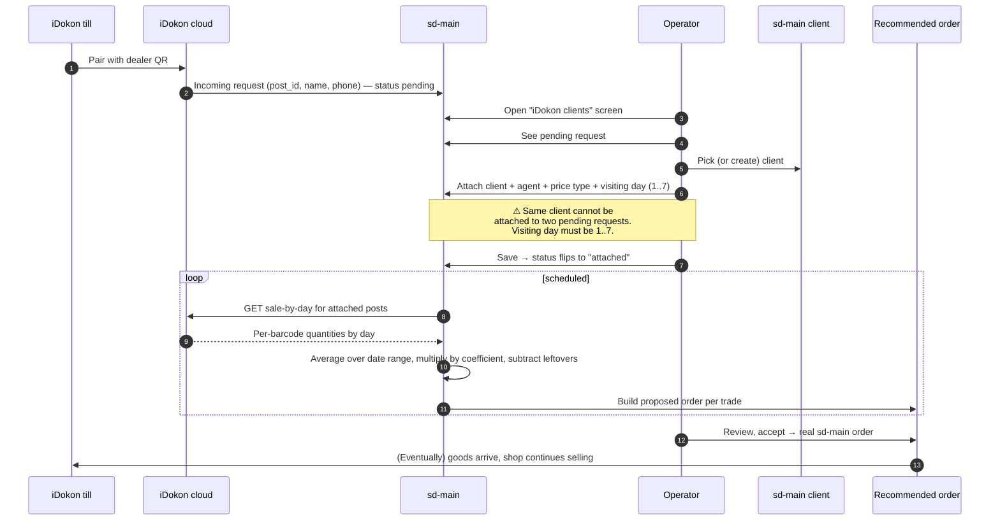

# iDokon POS sync

## What this feature is for

iDokon is a chain of **point-of-sale terminals** used in small Uzbek retail outlets. The dealer ships products to these outlets; each iDokon till sells them at the counter by scanning barcodes. This feature bridges the two sides: every till is mapped to an sd-main client, and sd-main learns from the till's daily sales how much to re-stock. The output is a list of **recommended sale orders** — pre-filled order proposals the operator can convert into real orders with one click.

It is also the only place in sd-main where the **iDokon QR code** for a dealer is displayed (so a new till can scan it and pair with the dealer's account), and the only place where **incoming pairing requests** from tills are reviewed and approved.

## Who uses it and where they find it

| Role | What they do here | Surface |
|---|---|---|
| Operator (3), Manager (2), Dealer/admin (1) | Approve incoming till pairing requests, attach a client + agent + visiting day, view recommended sales, reject pairings | Web admin → **Integrations** → **iDokon (POS) clients** |
| Operator | Convert recommended sales to real orders, change rejected idokon orders back to pending | Same screen |
| Till operator (at the shop) | Scans the dealer's QR code on the till to start pairing | iDokon hardware — outside sd-main |

The till operator never sees sd-main directly.

## The workflow — at a glance

## Step by step

1. The till operator at the shop scans the dealer's QR code displayed inside iDokon. *The QR encodes the dealer's identifier* (read from sd-main's dealer record).
2. *iDokon sends an incoming request to sd-main* with the post id, shop name and phone. Status is `pending`.
3. The operator opens **Integrations → iDokon (POS) clients**. The grid lists every incoming request — pending, attached and rejected.
4. To **approve** a pending request the operator selects an sd-main client, an agent, a price type and a visiting day (1=Monday … 7=Sunday).
5. *The server validates the inputs:*
   - The request must still be in `pending` status.
   - The client must exist and not already be attached to another pending request.
   - The agent and price type must exist.
   - The day must be between 1 and 7.
6. On save, *the request status flips to `attached`* and the four fields (`client_id`, `agent_id`, `price_type_id`, `day`) are stored on the request row.
7. To **reject** a pending request the operator presses Reject. The row stays in the grid with status `rejected`. To **detach** an already-approved request, the operator clears it back to `pending`.
8. The operator now picks one or more posts and a date range (e.g. last 14 days) and presses **Get recommended sales**.
9. *The server pulls daily sales by barcode from iDokon* (`GET /services/web/api/sd/sale-by-day`) for each selected post. The call carries an `x-api-key` header that is the SHA-1 of a fixed string.
10. *The server maps barcodes to sd-main products.* Barcodes that do not match any product are silently skipped.
11. *The server fetches the most recent client-stock snapshot* (the till's leftover stock at our last visit).
12. *If the snapshot is older than today, the server "ages" it* by subtracting all sales between the snapshot date and today (a second iDokon call to `/sale` per post).
13. *The server computes the recommendation:* per product, `recommendedQuantity = average_daily_sales * coefficient * 7 - current_leftover`. Negative values are floored to zero.
14. *The server groups products by trade direction.* If a post has products spanning two trades, two separate proposed orders are produced.
15. *The server returns a list of proposed orders* with client id, agent id, price type id, date (today), and the calculated line items.
16. The operator reviews each proposal, optionally edits quantities, and accepts. *Each accepted proposal becomes a real sd-main order* (status **New**) marked with `RELATED_TO_TYPE=IDOKON` so it can be traced back.
17. If a real order has been auto-created for an iDokon post and was rejected by the operator, the operator can re-open it: the linked `OrderIdokon.status=REJECTED` flips back to `PENDING`, making the post eligible for new proposals.

## What can go wrong (errors the operator sees)

| Trigger | Message |
|---|---|
| Dealer record missing or QR data not encodable | *"Dealer not found"* / *"QR code data invalid"* |
| Approving a request that is already attached | *"Document status is not pending"* |
| Approving with a client already attached elsewhere | *"This client is already attached to another incoming request"* |
| Visiting day outside 1..7 | *"Invalid visiting day. Must be 1..7."* |
| Agent / price type / client not found | The corresponding `…NOT_FOUND` error |
| Required params missing on the recommendation call | *"post_ids is required"* / *"date_range is invalid"* |
| iDokon API call returns non-200 | *"Error sending request to iDokon"* — operation aborted |
| iDokon API call throws | Same banner; the exception text is logged for the dev team |
| Re-opening an order that is not iDokon-related | *"Order not related to iDokon"* |

## Rules and limits

- **Pairing is one-to-one.** One sd-main client can be attached to at most one pending or attached iDokon request. Attempting to attach the same client a second time is rejected.
- **Visiting day is integer 1..7.** Not a date, not a weekday name.
- **Status set:** `pending` → `attached` → (optional `pending` again on detach, or `rejected`).
- **Coefficient is optional.** Default 1. The operator can tune it (e.g. 1.2 for an upcoming holiday). It multiplies the daily average before subtracting leftovers.
- **The window is one week of demand.** The formula is `avg * coefficient * 7`. There is no setting to change the 7.
- **Trade splitting is automatic.** Products in trade A and trade B on the same post produce two proposed orders, not one mixed order — because each order can only carry one trade direction.
- **Aging the leftover is best-effort.** If the older sale-call returns a 500, the leftover is not aged and the recommendation is computed against stale stock. The operator must spot this.
- **Barcodes without a product match are dropped silently.** No banner, no log entry visible to the operator. New products on the till that have not been onboarded in sd-main will not be re-stocked.
- **The dedicated client-stock snapshot is shared with mobile audits.** This sync does not write to it — it only reads. Updating the snapshot is a separate field-agent workflow.
- **Authorization** for both directions uses a static `x-api-key` derived from a fixed string. There is no rotation. Treat any leak as a credential rotation event.
- **Re-opening rejected iDokon orders.** Only orders flagged `RELATED_TO_TYPE=IDOKON` whose linked `OrderIdokon` row is in `REJECTED` state can be flipped back to `PENDING`. All other shapes are no-ops.

## What to test

### Happy paths

- New pending request arrives. Operator attaches client + agent + price type + day=3. Verify status flips to `attached` and the four fields are saved.
- Operator picks two attached posts and a 14-day window. Presses **Get recommended sales**. Verify proposed orders are returned, one per trade direction encountered.
- Operator accepts a proposed order. Verify a real sd-main order is created with status **New**, lines matching the proposal, and `RELATED_TO_TYPE=IDOKON`.
- Operator rejects a proposed order. Later re-opens it. Verify `OrderIdokon` row flips `REJECTED → PENDING` and the post can be re-recommended.
- Approve a request, detach it, approve again with a different client. Verify the four fields are cleared on detach and re-filled on the second approval.

### Validation failures

- Approve a request that is already `attached`. Expect: *"Document status is not pending"*.
- Approve with a client that is already attached to another request. Expect: *"This client is already attached"*.
- Approve with day=0 or day=8. Expect: *"Invalid visiting day"*.
- Approve with a non-existent client id. Expect: *"Client not found"*.
- Approve with a non-existent agent id. Expect: *"Agent not found"*.
- Approve with a non-existent price type id. Expect: *"Price type not found"*.
- Request recommendations with `post_ids` missing or `date_range` invalid. Expect: the corresponding error code.
- Detach a request that does not exist. Expect: *"Document not found"*.

### Credentials & external failure

- **Credentials missing:** iDokon `x-api-key` not configured (or wrong). Expect: every recommendation pull surfaces *"Error sending request to iDokon"*.
- **Network failure:** iDokon host unreachable when recommendations are requested. Verify the operator sees the standard error banner and no partial proposed orders are returned.
- **Invalid response:** iDokon returns 200 with HTML or malformed JSON. Verify the integration treats it as a failure and does not crash trying to dereference fields.
- **Partial success:** Operator requests recommendations for 5 posts; the sale-by-day call succeeds, but for 1 of the 5 posts the leftover-aging sub-call fails. Verify the other 4 posts produce proposed orders; the failing post is reported via the error banner.
- **Retry behaviour:** Re-press **Get recommended sales** immediately after a network failure. Verify the integration calls iDokon again and produces fresh proposals — there is no caching of the previous failed response.

### Edge cases

- A post sells a barcode that does not match any sd-main product. Verify the barcode is silently dropped and other lines compute correctly.
- The leftover snapshot date equals today. Verify the aging step is skipped.
- The leftover snapshot is older than today by 30 days. Verify the aging step runs but capped to today (no future-dated sale calls).
- Coefficient = 0. Verify all recommended quantities become zero.
- Coefficient = 2.5. Verify quantities scale accordingly.
- A post is attached to a client that has no orders yet. Verify the recommendation still works against zero leftover.
- A post is attached to a client deactivated mid-day. Verify the recommendation either skips the post or surfaces an actionable error (whichever the dealer chose).
- Two posts on the same client (rare). Verify both posts produce independent proposals; the client appears twice in the result list.
- Re-pair flow: post detached, then re-paired with a different agent. Verify subsequent recommendations use the new agent.

### Role gating

- Operator (3), Manager (2), Dealer/admin (1): full access.
- Agent (4), Expeditor (10), KAM (9): the **iDokon (POS) clients** menu must be hidden; URL must 403.
- A user from filial A cannot see iDokon requests of filial B.

### Side effects to verify

- New pending request creates a row in the `idokon_incoming_request` table with `status=pending`, no client/agent/price-type/day.
- Approving an attached request updates the same row, fills the four fields, sets `status=attached`.
- Detaching clears the four fields and sets `status=pending` (or `rejected` if explicitly rejected).
- Accepting a proposal creates an order row and an `OrderIdokon` row linking them with `status=pending`.
- Re-opening a rejected iDokon order updates only the `OrderIdokon` row, never the order row itself.
- A recommendation call does **not** write any row in sd-main for the iDokon side — it is a read-only computation against the request table and the stock snapshot.

## Where this leads next

A proposal accepted by the operator is a normal sd-main order from that point on — [Status transitions](../orders/status-transitions.md), [Mobile payment](../orders/mobile-payment.md), and so on. The `RELATED_TO_TYPE=IDOKON` flag is the only durable link back to the till that triggered it.

## For developers

Developer reference: `protected/modules/integration/controllers/ViewController.php` (`actionIdokon`), `protected/modules/integration/actions/idokon/*` (ListIdokonIncomingRequestsAction, EditIdokonAttachRequestAction, EditIdokonDetachRequestAction, GetIdokonQRCodeAction, ListIdokonRecomendedSalesAction, EditIdokonPendingOrdersAction), models `IdokonIncomingRequest`, `OrderIdokon`. Upstream endpoints: `https://my.idokon.uz/services/web/api/sd/sale-by-day` and `/sale`. The `x-api-key` is `sha1("idokon-integration")`.
