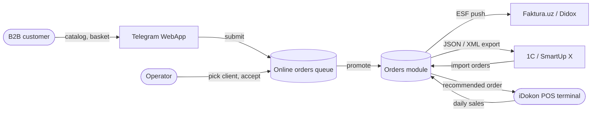

# Integrations & B2B online — QA test guide

> **Reader.** A QA engineer who tests any feature that crosses the boundary of sd-main — outbound calls to a tax authority, inbound calls from a POS device, customer-facing self-service portals, or a Telegram bot that signs a user in.
>
> **Why this section is different.** Every page here describes a feature that **talks to something we do not own**. That means every test plan must cover the unhappy path: the partner is down, the partner is slow, the partner answered but with garbage, the partner answered correctly but our side mis-saved the result. Credential handling and retry behaviour are first-class concerns, not afterthoughts.

## What sits behind this section

The dealer's core workflow — operator builds an order, agent ships it, expeditor delivers it — lives in the [Orders module](../orders/index.md). The pages in **this** section cover what happens *around* that core:

1. **B2B online orders.** The dealer's own customers self-serve through a Telegram web-app: they browse a catalog, drop products into a basket, sign in by phone, and submit an order. That order shows up in the operator's online-orders queue. The operator picks the right client, accepts the order, and from that point it is a normal order in the Orders module.
2. **External integrations.** sd-main exchanges documents and data with several third parties. Some are mandated by the state (electronic-invoice operators), some are POS partners (every payment at the till should affect our stock), and some are upstream ERPs (1C, SmartUp X) that own the master data.

## How to use this guide

| Feature | Page |
|---|---|
| The B2B portal — catalog, basket, submit (Telegram WebApp) | [Online orders](./online-orders.md) |
| Operator queue — Telegram contact CRUD and client linking | [Online contacts](./online-contacts.md) |
| Faktura.uz electronic-invoice export | [Faktura.uz](./faktura-uz.md) |
| iDokon POS sync — recommended sales from till data | [iDokon POS](./idokon-pos.md) |

## Every integration in sd-main, at a glance

The table below is the canonical list of integrations sd-main currently ships. Pages above cover the four where QA has the most exposure; the remaining ones are noted here so QA can recognise them in logs and bug reports.

| Integration | Direction | What flows | Where it lives |
|---|---|---|---|
| **Faktura.uz** | Outbound | Electronic invoices (ESF) for orders are pushed to Uzbekistan's tax-authority operator. OAuth-based credentials per dealer. Test and production endpoints. | [Faktura.uz](./faktura-uz.md) |
| **Didox** | Outbound + inbound | Alternative ESF operator (also Uzbekistan). Partner-token auth. Stages incoming invoices from suppliers. | Section overview only — see *Didox-specific quirks* below. |
| **1C (Json1C / E1C / Esale)** | Outbound | Orders, products, clients and bonuses are exported as JSON or XML for the dealer's accounting team to import into 1C. Token-based auth (`Sync1Cuser` param). | Operator-driven export from the orders grid. |
| **iDokon POS** | Outbound + inbound | Each iDokon till sells products by barcode; sd-main pulls daily sales by post, calculates recommended re-stock orders, and pushes orders back. Pending re-stock orders can be approved/rejected per till. | [iDokon POS](./idokon-pos.md) |
| **SmartUp X** | Inbound | Orders captured in SmartUp's mobile app are imported into sd-main. Client and product can be auto-created if not found. Mapping configured per dealer. | Settings → Integration → SmartUp X. |
| **Telegram bot init (WebApp)** | Inbound | The catalog and basket UI run inside a Telegram WebApp. Users are identified by Telegram-signed init data — sd-main verifies the HMAC before trusting any contact. | [Online orders](./online-orders.md), [Online contacts](./online-contacts.md) |
| **iiko / Ritm5 / iBox / TraceIQ** | Mixed | Niche dealer-specific integrations. Out of scope for this section — open a Slack thread before testing. | n/a |

## The big picture

## Vocabulary you will see

| Term | Meaning |
|---|---|
| **B2B portal** | The Telegram WebApp catalog the dealer's customers use to self-serve. Not a normal browser page — it loads only inside Telegram. |
| **Contact** | A row representing a Telegram user. One contact may be linked to zero, one, or many sd-main clients. |
| **Online order** | A row in the online-orders queue. It is **not yet** a real order — it becomes one only after an operator accepts it and picks a client. |
| **ESF** | *Электронный счёт-фактура* — Uzbekistan's electronic invoice. Required for B2B sales over a threshold. Faktura.uz and Didox are two ESF operators; the dealer chooses one. |
| **Unique ID (ESF)** | The opaque string the operator returns after we push an invoice. Stored against the order so we can poll status later. |
| **Test endpoint** | A staging URL exposed by Faktura.uz / Didox. The dealer toggles `testFakturaUZ` in server params to flip the integration between staging and production. |
| **iDokon post** | A single till / cash-register inside an iDokon-equipped shop. One client (shop) can have several posts. |
| **Recommended sale** | A re-stock order proposal computed from the last 7-day sales averaged across a date range, minus the till's current stock, optionally multiplied by a coefficient. |
| **Token expiry** | OAuth tokens received from Faktura.uz expire (typically minutes to hours). The integration must auto-refresh or re-login before the next call. |

## What "credentials missing" actually looks like

Most third-party endpoints reject our call when our token is wrong, expired, or never obtained. The pattern across every integration is:

1. We send the request.
2. Partner returns **401** or **403**.
3. Our code maps that to `ERROR_CODE_AUTH_FAILED` (or `auth-failed`, depending on the integration).
4. The user sees a localised message *"Не удалось авторизоваться"* / *"Login failed"* / *"Avtorizatsiya muvaffaqiyatsiz"*.

QA test cases must include both flavours: **never had credentials** (the dealer skipped setup) and **had credentials, expired** (the dealer set it up months ago and the refresh-token chain broke).

## What every QA test case in this section should record

In addition to the standard fields, every integration test plan must also capture:

1. **Endpoint hit.** Test or production. If unsure, the URL is logged.
2. **Request payload.** What we sent — especially TIN, INN, document number, amounts.
3. **Response payload.** What the partner returned, including status code.
4. **Side effect on sd-main side.** A row in `OrderEsf` (Faktura/Didox), a row in `IdokonIncomingRequest` (iDokon), an updated `Config` row (token refresh).
5. **What the operator saw.** Banner text. Test scripts often miss this and the bug "wrong error message" gets through.

## A note on retry behaviour

Two patterns appear across integrations:

- **Synchronous, one-shot.** The operator presses a button, we call the partner, we return the result. No retry. If it fails, the operator presses the button again. This is how the Faktura.uz invoice push works.
- **Idempotent re-send.** If the document already exists for this order, the integration deletes the old one before creating a new one — *unless* the existing one is already signed, in which case we refuse and tell the operator. QA must test both: re-pushing an unsigned invoice should succeed and replace; re-pushing a signed invoice should fail with `esf-already-exists`.

Background pulls (iDokon daily sales, Didox incoming invoices) run on a schedule. They have no built-in retry; if a pull fails, the next scheduled pull picks up where this one left off — *provided* the cursor is advanced correctly. Test that the next-pull-after-failure does not lose or duplicate rows.

## Didox-specific quirks (no dedicated page)

Didox follows the same shape as Faktura.uz — login, create-invoice, check-invoice, delete-invoice, sync-incoming — but auth is partner-token-based rather than OAuth. There is one shared partner token per environment. Switch between staging (`stage.goodsign.biz`) and production (`api-partners.didox.uz`) by hostname, not by a settings flag. Most QA scenarios from the [Faktura.uz](./faktura-uz.md) page transfer directly; the credential-refresh paragraph does not apply.

## What this section deliberately does **not** cover

- The Telegram bot's reply formatting and inline-keyboard layouts. Treated as cosmetic and tested by the bot team separately.
- The internal mechanics of CIS marking codes (XTrace). See [CIS code check](../orders/cis-code-check.md) — it touches the ESF push but lives in Orders.
- Webhook signature verification at the framework level — handled in the security review track, not here.

## For developers

Developer references:
- `protected/modules/onlineOrder/` — B2B portal and Telegram contact CRUD.
- `protected/modules/integration/` — iDokon, SmartUp X, Faktura, Didox, iiko, Ritm5, iBox, TraceIQ entry points.
- `protected/modules/orders/controllers/FakturaUZController.php` — the original Faktura.uz integration (test/production flag, OAuth refresh, document prepare).
- `protected/components/Esale.php` and `protected/components/E1C.php` — 1C export serializers.
- `protected/modules/api/controllers/Json1CController.php` — JSON1C endpoint for 1C pulls.
