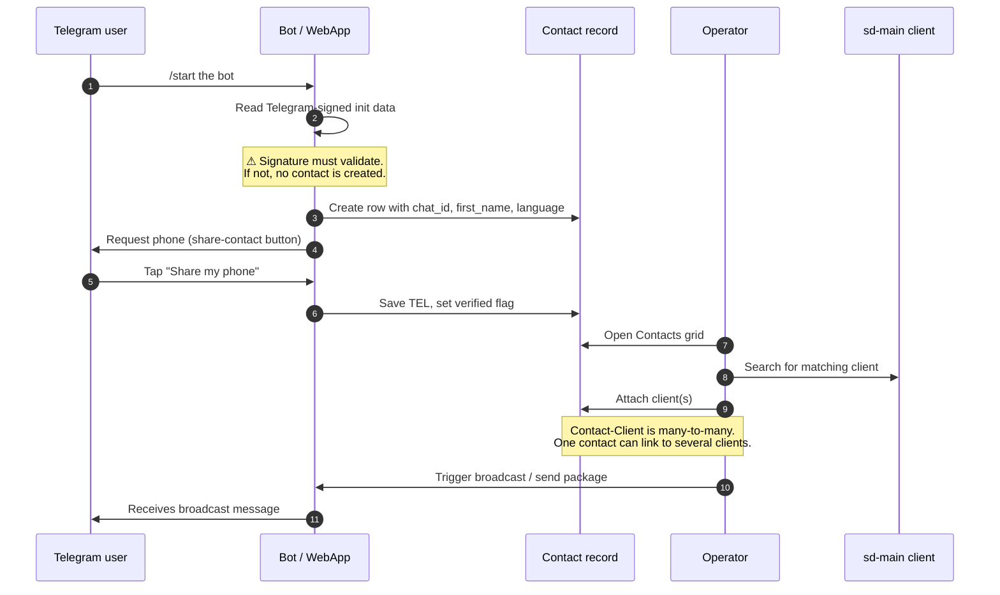

# Online contacts (Telegram CRUD)

## What this feature is for

A **contact** is sd-main's record of a Telegram user who has interacted with the dealer's bot. It is *not* the same as a client. One contact can be linked to **zero, one, or several** sd-main clients — for example, a procurement manager who orders for three different store branches. The contact CRUD screen is where the operator views the dealer's Telegram audience, links the right clients to each contact, runs targeted broadcasts, and groups contacts into **packages** for marketing.

Contacts are how the [B2B online orders](./online-orders.md) feature knows which customer is submitting an order — the order row carries a contact id, and the operator turns that into a real client at acceptance time.

## Who uses it and where they find it

| Role | What they do here | Surface |
|---|---|---|
| Operator (3), operations (5), KAM (9) | View contacts, attach clients, edit phone/name, broadcast messages | Web admin → **Online orders** → **Contacts** |
| Admin (1), Manager (2) | Same, plus manage packages and template messages | Web admin → **Online orders** → **Contacts** |
| End customer (Telegram user) | Triggers contact creation by starting the bot and confirming their phone | Telegram bot chat |

End customers never see this screen. They only see the *"Share your phone"* prompt sent by the bot.

## The workflow — at a glance

## Step by step

1. The Telegram user types `/start` (or opens the bot for the first time).
2. *The bot inspects the Telegram-signed init data* — `user_id`, `first_name`, `username`, `language_code` and a hash signed with the bot token.
3. *The server validates the signature.* If the signature is missing or wrong, no contact is created and the bot refuses further interaction.
4. *The server creates a contact row* keyed by Telegram `chat_id`, stamping first name, username and the language code (`ru` / `uz`). The contact has no phone yet and no linked clients.
5. The bot sends a *"Share your phone"* prompt with a *Share contact* button. The user taps it.
6. *The server updates the contact's TEL* and marks it confirmed. If the user types a phone instead of using the button, the server stores it but does not mark it as confirmed.
7. The operator opens **Online orders → Contacts**. The grid lists every contact with first name, username, phone, order count, referrer name (if any) and linked clients.
8. The operator clicks a row. A side panel shows the contact's details, package memberships, and a client-link control.
9. The operator types in the client search and picks one or more sd-main clients to link.
10. *The server saves the contact-client links* in a join table. Existing links not in the new set are removed; new links are inserted.
11. The operator can edit the contact's first name, last name and phone inline. *Edits are immediate.*
12. The operator can group contacts into **packages** — named bundles of products that double as marketing segments. The grid supports multi-select and bulk attach.
13. To broadcast, the operator opens a message composer, types Russian and Uzbek versions, optionally uploads photos, and sends. *The server forwards the message to every contact in the target set*, picking the language version per contact, and records each delivery in the sent-messages table so the next broadcast does not double-deliver.
14. The operator can re-request a phone from a contact who never shared one — this re-sends the share-contact prompt.

## What can go wrong (errors the operator sees)

| Trigger | Message |
|---|---|
| The dealer has no Telegram bot configured | *"Bot is not connected"* — every broadcast / preview / request-contact action returns this banner. |
| The preview-group chat is not set | *"No group for preview"* — the operator cannot test a draft before sending. |
| A contact has blocked the bot | The broadcast result row for that contact says *"forbidden: bot was blocked by the user"*. |
| Forwarding from the preview chat fails | The broadcast result row carries the Telegram error text verbatim. |
| The operator tries to attach a client from a different filial | The client is not in the search results (filtered server-side). |
| The contact has no `chat_id` | *Request contact* is a no-op — the operator must wait for the user to talk to the bot first. |

The Telegram WebApp itself does not show error banners to the customer. If the bot is mis-configured the customer simply gets no reply; QA must check the dealer-side admin to detect this.

## Rules and limits

- **A contact is created the moment a Telegram user opens the bot.** Even before any order, even before sharing a phone, the row exists.
- **Phone is optional but downstream features require it.** Submitting an order forces a confirmed phone. Broadcasts do not.
- **Contact-Client is many-to-many.** Removing a link does **not** delete the contact or the client. It only breaks the association.
- **Language is per-contact.** The bot picks `message_ru` or `message_uz` for every broadcast based on `LANG`.
- **Sent-messages dedup is by chat_id + message_id.** Re-running the same broadcast against the same contact will not re-send.
- **Preview must go to a chat group, not a single user.** The dealer configures a *preview group*; if missing, preview fails.
- **Packages are organisational.** Putting a contact in a package does not change permissions — only filters and broadcasts.
- **Referrer tracking is optional.** If the bot was opened via a referral link, the contact's `REFERRER_ID` is filled; the *only referrals* filter on the grid uses this.
- **Photo upload is best-effort.** If the operator attaches a 10 MB image, Telegram may reject it; the operator sees the error text but other recipients can still get the text-only version.

## What to test

### Happy paths

- A new Telegram user `/starts` the bot. Open the Contacts grid — verify a fresh row with `chat_id`, first name and language code appears within seconds.
- The user shares their phone. Verify `TEL` is filled and the verified flag is set.
- Attach two clients to one contact. Verify the contact-client table has two rows. Remove one. Verify only one remains.
- Send a broadcast in both languages to a 10-contact package. Verify each contact got the language-appropriate version.
- Edit a contact's first name. Verify the change is visible immediately, including in any open queue rows that reference this contact.

### Validation failures

- Try to broadcast when the bot is not configured. Expect: *"Bot is not connected"*.
- Try to preview when no preview group is set. Expect: *"No group for preview"*.
- Try to attach a client with an id that does not exist (manipulated request). Expect: silent rejection, link not created.
- Attempt to bulk-attach a package to 0 contacts. Expect: action no-ops.

### Credentials & external failure

- **Credentials missing:** Bot token blank in the dealer settings. Verify every Telegram-touching action surfaces the *"Bot is not connected"* banner instead of crashing.
- **Network failure:** Telegram API host unreachable during a broadcast. Verify the sent-messages table is **not** updated for the failed sends, so a retry can complete them.
- **Invalid response:** Telegram returns a 200 with a body like `{"ok":false,"description":"chat not found"}`. Verify that specific contact's result row shows *"chat not found"* and the contact is not marked delivered.
- **Partial success:** Broadcast to 50 contacts — 47 succeed, 3 fail with *bot was blocked*. Verify the 47 are in the dedup table and a follow-up broadcast skips them; verify the 3 are not in the dedup table so a retry remains possible.
- **Retry behaviour:** Re-run the same broadcast immediately. Verify zero new messages are sent to the 47 successful contacts (dedup hit) and a fresh attempt is made for the 3 failed ones.

### Init-signature validation

- A request to the WebApp arrives with a malformed init-data string. Verify no contact is created and no basket action succeeds. Verify a server-side error report is generated.
- A request arrives with valid init data but tampered after signing (a parameter changed). Verify the signature check rejects it.
- A request arrives with init data from a different bot's token. Verify rejection — bots cannot impersonate each other.
- A request arrives with init data older than the freshness window. Verify the system treats it as suspicious (logged at minimum; may reject depending on configuration).

### Role gating

- Operator (3), operations (5), KAM (9), admin (1), manager (2): full access.
- Agent (4), expeditor (10): the **Contacts** tab must be hidden and the URL must 403.
- Operator of filial A cannot see contacts from filial B in any grid.

### Edge cases

- A contact with `chat_id` and no `TEL` submits an online order anyway (via WebApp). Verify the queue row shows `TEL_WEBAPP` instead.
- One Telegram user talks to two of the dealer's bots — verify each bot creates its own contact row (they are not merged).
- Delete a client that has linked contacts. Verify the client deletion is blocked or the contact-link is cleaned up — whichever the dealer chose, the behaviour must be consistent.
- A contact's referrer is itself deleted. Verify the contact still loads and the referrer-name column is empty (not crashing).
- Send a broadcast with only a Russian photo (no Uzbek photo). Verify Uzbek-speaking recipients get the text-only Uzbek message and Russian-speakers get the photo + text.

### Side effects to verify

- A new bot interaction writes one row in the contacts table.
- Sharing a phone writes back `TEL` and the verified flag in the same row.
- Attaching clients writes rows in the contact-client table; detaching removes them.
- Broadcasts write rows in the sent-messages table for each successful delivery only.
- Editing the contact's name updates the row directly — no audit history, by design.
- Packages are stored separately; package membership does not touch the contact row itself.

## Where this leads next

A contact with at least one linked client and a confirmed phone is the prerequisite for self-service ordering. The submit flow is described in [Online orders](./online-orders.md). The operator's queue work is also there.

## For developers

Developer reference: `protected/modules/onlineOrder/controllers/ContactController.php`, `protected/modules/onlineOrder/controllers/TelegramController.php`, `protected/modules/onlineOrder/controllers/WebappBotController.php`, models `Contact`, `ContactClient`, `TgPackage`, `TgPackageContact`, `TelegramSentMessages`. WebApp init-data verification lives in `application.modules.api.controllers.OnlineOrderController` and `WebappHandler`.
