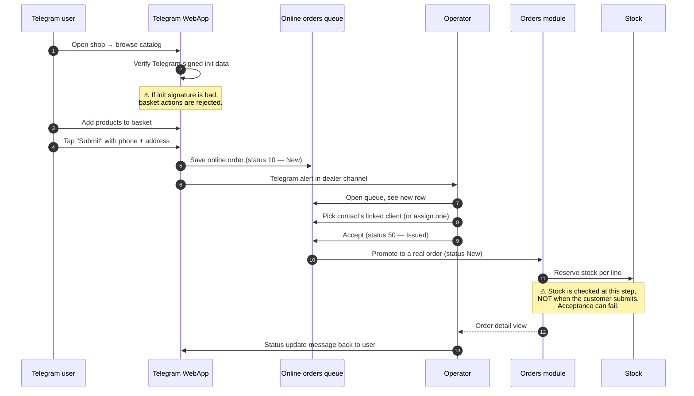

# Online orders (B2B portal)

## What this feature is for

This is the **self-service path** for the dealer's own customers. The dealer publishes a Telegram bot; the customer opens the bot, taps **Open shop**, browses a catalog inside the Telegram WebApp, adds products to a basket, and submits the order with their phone number and a delivery address. The order lands in an **online-orders queue** on the operator's side. The operator picks the right sd-main client (or creates one), accepts the order, and from that moment it becomes a normal order in the [Orders module](../orders/index.md) — shipped, delivered and settled in exactly the same way as an operator-built order.

The B2B portal is **not** a public webshop. The user must be a Telegram contact known to the bot, and the operator must accept the order — there is no automatic conversion.

## Who uses it and where they find it

| Role | What they do here | Surface |
|---|---|---|
| End customer (Telegram user) | Opens the bot, browses, places an order | Telegram WebApp inside the bot chat |
| Operator (role 3) | Watches the online-orders queue, picks a client, accepts the order | Web admin → **Online orders** → **Orders** tab |
| Operations (role 5), KAM (role 9) | Same as operator | Web admin → **Online orders** → **Orders** tab |
| Admin (role 1), Manager (role 2) | Same, plus configure the bot, contact packages, broadcasts | Web admin → **Online orders** |

End customers never see sd-main directly — only the Telegram WebApp.

## The workflow — at a glance

## Step by step

1. The customer opens the dealer's Telegram bot and taps **Open shop**.
2. *The bot loads the WebApp* and passes a signed init-data blob describing the Telegram user.
3. *The server verifies the signature.* If the signature is missing or wrong, no basket action is accepted.
4. The customer browses categories and product cards. Prices are taken from the dealer's default B2B price type.
5. The customer adds products to the basket. Each add adjusts the basket on the server, not just locally.
6. *The server validates each quantity against stock* at the moment of save — empty basket and zero quantities are rejected.
7. The customer opens the basket, enters their **phone**, **delivery address** and an optional **comment**, picks a **payment type**, and submits.
8. *The server creates an online-order row* with status **10 — New**, links it to the customer's contact, stamps the WebApp identifiers (`NAME_WEBAPP`, `TEL_WEBAPP`).
9. *The dealer's reporting Telegram channel receives an alert* with the order summary.
10. The operator opens **Online orders → Orders** and sees the row. The grid shows the customer name, phone, basket total, list of linked clients, and a *processed* flag.
11. The operator picks one of the customer's linked sd-main clients from a dropdown. If the customer has no link yet, the operator can attach one inline (see [Online contacts](./online-contacts.md)).
12. The operator presses **Accept**. Internally the status flips to **50 — Issued** and the system creates a real sd-main order with the basket lines.
13. *Stock is reserved at this acceptance step* using the warehouse configured for the dealer's online channel. ⛔ If any line cannot be filled, the acceptance fails and the queue row stays at **New** with an error banner.
14. *A bonus order is generated* if the customer or client qualifies for an online-channel bonus rule.
15. *The customer receives a Telegram message* — *"Your order #N has been accepted"* — and follows the order's progress through Telegram.
16. The operator can leave a comment on the queue row; the comment is delivered to the customer's chat (*"Operator commented on your order…"*).
17. The order continues its lifecycle from **New** as described in [Status transitions](../orders/status-transitions.md).

## What can go wrong (errors the operator or customer sees)

| Trigger | Who sees it | Message |
|---|---|---|
| Telegram init signature is missing or wrong | Customer | The WebApp refuses to load or basket operations fail silently. |
| Customer's basket has zero items | Customer | *"Basket is empty"* — submit button is disabled. |
| Stock dropped between submission and acceptance | Operator | Red banner with the offending product list. The queue row stays **New**. |
| The operator did not pick a client | Operator | The **Accept** button stays disabled. |
| The picked client is in another filial | Operator | The dropdown will not have offered it — the system filters by current filial. |
| Bonus engine fails on acceptance | Operator | The order is saved, but the bonus order may be missing. A warning row is written to the order history. |
| Telegram bot is offline | Both | The customer gets no status updates after acceptance. The order in sd-main is still correct. |
| The customer's phone in WebApp was never confirmed | Operator | The phone column on the queue row shows the WebApp-supplied value (not the verified one); operator must double-check. |

## Rules and limits

- **An online order is not an order until accepted.** Status 10 (New) and 20 (Processing) are queue states. Only status 50 (Issued) and later have a corresponding row in the orders table.
- **One online order produces one sd-main order.** Splitting across multiple clients is not supported — accept once, with one client.
- **Stock is checked only at acceptance, not at submission.** The customer can submit an order for items that go out of stock before the operator gets to it.
- **Payment type is captured but not collected.** The customer chooses *cash* / *card* / *transfer*; the actual money is collected through the normal delivery flow ([Mobile payment](../orders/mobile-payment.md)).
- **Status flow on the queue side:** 10 New → 20 Processing → 30 Changed → 40 Rejected → 50 Issued → 60 Shipped → 70 Delivered → 80 Cancelled → 90 Returned. Status 0 is a draft that never reaches the operator.
- **Contact must exist before the order.** The customer can only submit if the bot has already created a contact row for their Telegram user. Anonymous walk-ups are not supported.
- **Telegram comment delivery is best-effort.** If the bot is down, the comment is saved on the queue row but not delivered. Re-sending is not automatic.
- **Filial scoping is strict.** Only operators of the filial that owns the contact see the order.

## What to test

### Happy paths

- Customer adds three products, submits. Operator picks the only linked client, accepts. Verify a real order exists with three lines, correct prices and totals.
- Customer submits with a brand-new contact that has zero linked clients. Operator attaches a fresh client via the inline form, then accepts. Verify the contact-client link is saved.
- Operator leaves a comment on the queue row. Verify the customer's Telegram chat receives the *"Operator commented…"* message.
- Customer who qualifies for an auto-bonus rule submits an order. After acceptance, verify a bonus order exists linked to the main one.

### Validation failures

- Submit an empty basket. Expect: submit button disabled.
- Submit a basket where one product just went to zero stock. Operator presses Accept. Expect: out-of-stock banner naming the product, queue row stays at **New**.
- Operator picks a client that does not belong to the contact, then realises and re-picks. Verify the contact-client link reflects only the chosen one.
- Operator presses Accept twice quickly. Expect: only one sd-main order is created; second click is a no-op or shows *already processed*.

### Credentials & external failure

- **Credentials missing:** The bot has no token configured. Verify the WebApp never loads. Verify the operator's broadcast and *Request contact* buttons say *"Bot is not connected"*.
- **Network failure:** Bot host is unreachable when the operator accepts an order. Verify the order still saves into sd-main and the Telegram notification is dropped silently (best-effort) — there must be no rollback.
- **Invalid response:** The bot returns a 200 but the body is malformed JSON. Verify nothing crashes; the comment/broadcast call returns *"unknown response"* but the queue row is not corrupted.
- **Partial success:** A broadcast targets 10 contacts; 7 succeed, 3 fail (chat blocked / user removed bot). Verify the dispatcher records who got the message via the sent-messages table so the next broadcast skips them.
- **Retry behaviour:** After a failed bot send, re-running the same send (forward by message id) must not double-deliver. The sent-messages dedup table must short-circuit.

### Role gating

- Operator (3), operations (5), KAM (9): full access. ✅
- Manager (2), admin (1): full access. ✅
- Agent (4), expeditor (10): the **Online orders** menu must be hidden and the URL must redirect or 403.
- Operator of filial A cannot accept an online order whose contact belongs to filial B.

### Edge cases

- Two operators open the same queue row at the same time and both press Accept. Expect: one wins, the other gets *already processed*.
- Customer re-submits the same basket within a minute. Expect: two queue rows, not one (no client-side dedup is guaranteed).
- Contact has 5 linked clients. Verify the dropdown shows all 5 and the operator can pick any.
- Customer submits with delivery location pinned on a map. Verify lat/lon land on the order row.
- Customer's phone field is empty on the contact but `TEL_WEBAPP` is populated. Verify the queue row shows the WebApp phone with a small marker.
- Cancel a queue row before acceptance. Verify no sd-main order is created; the row's status becomes **80 — Cancelled**.

### Side effects to verify

- New row in the online-orders table at submit.
- Telegram alert lands in the dealer's reporting channel.
- On accept: new row in the orders table; one row per product line; stock dropped on the configured warehouse; debt row created against the chosen client.
- Contact-client link table updated if the operator picked a new client mapping.
- Order-history row *"created from online-order #N"*.
- If a bonus rule matched: a bonus order linked to the parent.

## Where this leads next

After acceptance, the order is a normal sd-main order. From here:
- The shipment goes through [Status transitions](../orders/status-transitions.md).
- Payment is collected via [Mobile payment](../orders/mobile-payment.md) or via the cashbox.
- The customer's Telegram chat is the primary status-update channel — see [Online contacts](./online-contacts.md) for how the contact is set up in the first place.

## For developers

Developer reference: `protected/modules/onlineOrder/controllers/OrderController.php`, `protected/modules/onlineOrder/controllers/WebAppController.php`, `protected/modules/onlineOrder/controllers/WebappBotController.php`, `protected/models/OnlineOrder.php`. The acceptance flow re-uses `application.modules.api.controllers.OnlineOrderController` for status changes and Telegram messaging.
