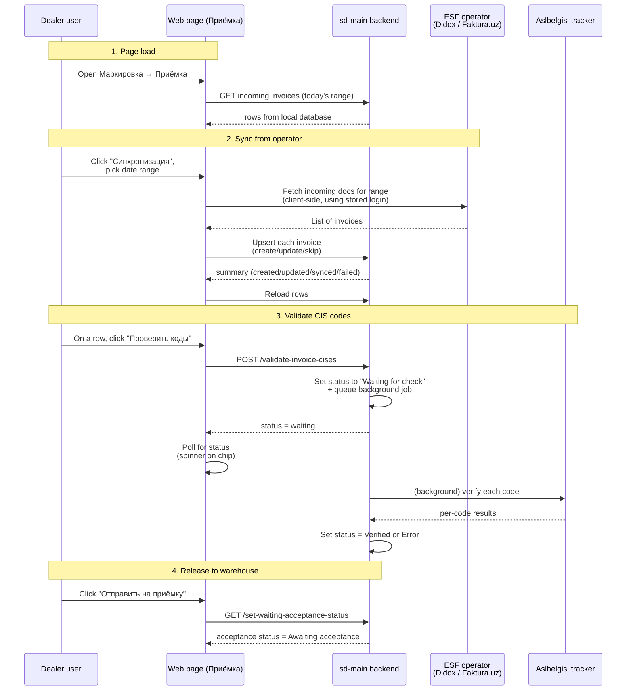

# Incoming invoices — Приёмка

## What this feature is for

When a supplier ships regulated goods to the dealer, the supplier also issues an **electronic invoice** through one of the licensed operators (Didox or Faktura.uz). That invoice arrives in the dealer's inbox at the operator. The Markirovka *Приёмка* (Acceptance) screen is where the dealer pulls those incoming invoices into sd-main, sees their state, validates the CIS codes printed on the goods against the state tracker, and finally pushes the document down to the warehouse so staff can scan the boxes during physical receipt.

In plain terms: this screen is the **paperwork inbox** for marked goods that are about to enter the warehouse. Nothing here moves stock or money — it prepares a document so the warehouse acceptance and stock-receipt workflows can run cleanly.

## Who uses it and where they find it

| Role | Action | Path |
|---|---|---|
| Accountant / operator | Syncs incoming invoices from Didox or Faktura.uz for a date range | Web → Маркировка → Приёмка → toolbar *Синхронизация* |
| Compliance officer | Verifies that CIS codes on each incoming invoice pass the state tracker | Same page → CIS status chip on each row → *Проверить коды* |
| Warehouse coordinator | Marks a verified invoice as ready for warehouse acceptance, releasing it to scanners | Same page → acceptance status chip → *Отправить на приёмку* |
| All of the above | Drill into one invoice's line items | Same page → click invoice number / roaming ID |

RBAC permission required: **operation.marking.incoming**. Users without this permission see no menu entry and get a 403 on the URL.

## The workflow

## Step by step

1. *The user opens **Маркировка → Приёмка***. The system loads invoices already stored locally for today's date range and displays them as a table.
2. *The system shows for every row*: invoice number and date, contract number and date, roaming ID, the operator (Didox/Faktura), the document status, the CIS-codes status, the acceptance status, sender name and TIN/PINFL, and the total sum.
3. The user can change the date range using the **date-range picker** in the header and press *Загрузить* to reload. ⛔ if the date range is empty, the *Загрузить* button is disabled.
4. **To pull invoices from the operator:** *the user clicks **Синхронизация*** in the toolbar. The button label changes to show which operator the company is configured for (*Синхронизация с Didox* / *Синхронизация с Faktura.UZ*).
5. *The system shows a small dialog* asking for a *С* (from) and *По* (to) date. The user picks the range and clicks *Синхронизировать*.
6. *The system contacts the chosen operator using the saved login* and pulls down every incoming document in the date range. ⛔ if the user has not logged in to that operator yet, the system shows the operator-login dialog first and the sync only starts once login succeeds.
7. *The system upserts each fetched document* into the local table — new ones are created, existing ones are refreshed with the operator's latest fields, and unchanged ones are skipped.
8. *The system shows a summary dialog*: how many created, updated, synced, and failed. ⛔ if any failed, the count is shown; the failures are not listed by ID in this dialog.
9. *The system reloads the table* so newly synced rows appear.
10. **To validate the CIS codes on one invoice:** the user opens the chip in the **Состояние кодов** column and clicks *Проверить коды*. ⛔ if the row's invoice has no marked goods, the chip simply reads *Без маркировки* with no menu — there is nothing to check.
11. *The system marks the invoice as "Ожидает проверки"* (waiting for check), queues a background validation job, and shows a spinning chip while it polls for the final status. ⛔ if the user does not have a valid Aslbelgisi API key on file, the request fails with an authentication error and the row stays unchanged.
12. *The background job calls the state tracker* for each code on the invoice and writes the final status back: *Проверен* if every code is recognised, *Ошибка* if at least one is rejected.
13. **To release the invoice to the warehouse:** *the user clicks the **Отправить на приёмку*** chip in the acceptance-status column. ⛔ if the acceptance status is already past zero (already released, completed, or had errors), the chip is read-only and shows the current state.
14. *The system flips the acceptance status from "Awaiting send" to "Awaiting acceptance"* and reloads the table. From that point on the warehouse-acceptance workflow takes over (out of scope of this page).
15. **To inspect one invoice's line items**: the user clicks the invoice number, roaming ID, document ID, or the row's ID. The page navigates to the invoice details screen (separate from this QA page).
16. **To refresh the Aslbelgisi API key**: the user clicks *Обновить API-ключ для маркировки* in the toolbar. A dialog opens where they paste a new key. ⛔ if the key is blank or malformed, save fails with an inline error.

## What can go wrong (errors the user sees)

| Trigger | Error / behaviour | Plain-language meaning |
|---|---|---|
| Date range empty when pressing *Загрузить* | Button is disabled | No range chosen — pick from/to. |
| Operator login expired during sync | Operator-login dialog opens automatically | The user must re-enter their Didox / Faktura.uz credentials before the sync can proceed. |
| Aslbelgisi API key missing or expired during validation | Snackbar: *Ошибка авторизации* (or similar) | The dealer's link to the state tracker is not configured. Set or refresh the API key from the toolbar. |
| Invoice has no marked goods | Chip reads *Без маркировки*, no action menu | This is informational — there is literally nothing to validate. |
| Validation timed out or never resolved | Chip stays *Ожидает проверки* indefinitely | The background worker did not finish. The user can re-trigger the check. |
| Code rejected by the state tracker | Chip turns *Ошибка* | At least one CIS code on the invoice was unknown, in a wrong state, or owned by the wrong company. |
| User clicks *Отправить на приёмку* twice rapidly | Second click is a no-op (status already moved) | The acceptance can only move once from the "Awaiting send" state. |
| User without `operation.marking.incoming` opens the URL | 403 Access Denied page | The role is not allowed to see incoming invoices. |
| Sync returns zero invoices for the chosen range | Dialog shows "0 created, 0 updated, 0 synced, 0 failed" | Either no invoices exist for that range, or all already match locally. |
| Operator returns an error mid-sync | The failed invoices are counted in *failed* in the dialog | A specific document could not be fetched or parsed; the rest still proceeded. |

## Rules and limits

- **The screen reads from sd-main's local table, not directly from the operator.** What you see on the screen reflects the last sync. To see newly issued invoices on the operator side, you must run the sync.
- **Date range applies to the invoice's own date (INVOICE_DATE), not the sync time.** Syncing March data and then filtering to April will show nothing.
- **Validation is asynchronous.** Clicking *Проверить коды* does not block — the chip immediately becomes *Ожидает проверки* and the page polls for the result.
- **CIS validation requires both an Aslbelgisi API key and at least one CIS code on the invoice.** Either missing produces no useful result.
- **Operator selection is global to the company.** The dealer picks Didox **or** Faktura.uz in the company profile. The sync button reads from that profile and behaves differently per operator.
- **Acceptance status only moves forward.** Once an invoice has been "sent to acceptance", the screen cannot pull it back to "awaiting send" — that must be done from the warehouse side or by an administrator.
- **No bulk operations are exposed on this screen.** Validation and acceptance-release are per-row only.
- **Operator-side document IDs and roaming IDs are stored verbatim and shown as clickable links** that drill into the invoice detail. They are *not* hyperlinks back to the operator's web UI on this screen.

## What to test

### Happy paths

- Sync a known date range from each operator (Didox, Faktura.uz). Verify the summary counts match the operator's own count.
- On a synced invoice that contains regulated goods, click *Проверить коды*. Verify the chip flips through *Ожидает проверки* → *Проверен*.
- On a verified invoice, click *Отправить на приёмку*. Verify the acceptance chip becomes *Ожидает завершения*.
- Click into an invoice's details from the number/roaming/document columns. Verify the detail page loads with the correct invoice context.

### Validation failures

- Validate an invoice containing a CIS code that the state tracker doesn't recognise. Expect chip = *Ошибка*.
- Validate an invoice with an expired Aslbelgisi API key. Expect a clear "auth failed" snackbar.
- Trigger sync with an expired operator login. Expect the operator-login dialog.

### Role gating

- Open `/markirovka/view/incomingInvoices` as a user without `operation.marking.incoming`. Expect 403.
- Open it as a user with the permission but no configured operator. Verify the sync button still appears (labelled generically *Синхронизация*) but operating it shows a "please pick an operator" warning.

### Edge cases

- Sync a date range with zero invoices on the operator. Verify a friendly "0 / 0 / 0 / 0" summary.
- Sync a range where every invoice was already synced previously. Verify *updated* / *skipped* counts behave as expected and no row is double-created.
- Click *Проверить коды* on a *Без маркировки* row — verify there is no menu (the chip is informational).
- Open a row with a corrected roaming ID (roaming ID + corrected roaming ID both populated). Verify both columns display.
- Apply column-search filters in the data table. Verify search by sender name, TIN, invoice number, etc. works.
- Toggle the column-picker in the data table to show/hide *Оператор*, *ID документа*, *ПИНФЛ отправителя*. Verify the choice persists in local storage across reloads.

### Side effects to verify

- After successful validation, the `IncomingInvoice.CISES_STATUS` reflects the new state.
- After successful *Отправить на приёмку*, the `IncomingInvoice.ACCEPTANCE_STATUS` becomes 1 and is visible to the warehouse acceptance workflow.
- After sync, the invoice line items (suppliers, products, CIS codes per line) are stored against the parent invoice for the details page to consume.
- No stock has moved and no money rows have been written — this screen is a paperwork inbox only.

## Where this leads next

- The validation logic and its full result-set: [CIS code check](../orders/cis-code-check.md)
- The companion sell-side screen: [Outgoing invoices (Реализация)](./outgoing-invoices.md)
- For the navigation map and RBAC paths: [Page-to-module map](../page-to-module-map.md)

## For developers

Developer reference: page rendered by `protected/modules/markirovka/controllers/ViewController.php::actionIncomingInvoices`; data feeds in `protected/modules/markirovka/actions/GetIncomingInvoicesAction.php`, `ValidateInvoiceCises.php`, `SetWaitingAcceptStatusAction.php`, `VerifyInvoiceCises.php`, `CancelInvoiceCisesValidation.php`; views under `protected/modules/markirovka/views/incoming-invoices/`; model `protected/models/IncomingInvoice.php`; external glue `protected/modules/markirovka/components/Aslbelgisi.php`.
