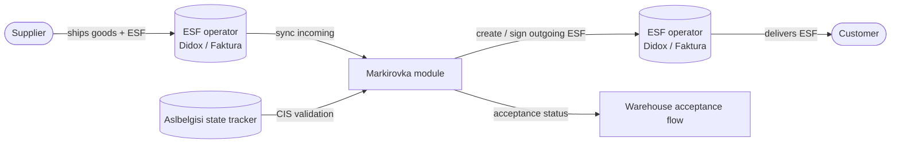

# Markirovka module — QA test guide

> **Reader.** A QA engineer who tests anything that involves **regulated, marked goods** — tobacco, alcohol, mineral water, dairy, household chemicals, and any other product category that Uzbekistan's state tracking system requires to carry a unique CIS code.
>
> **Why it matters.** This module is the bridge between the dealer's daily sales/receipts and **two government-level systems**: the state CIS-code tracker (the *Aslbelgisi* / *True API* service) and the electronic invoice operators (*Didox*, *Faktura.uz*, *Soliq servis*). If anything here is wrong, the dealer either ships goods illegally or fails to clear an audit.

## What the module does

The Markirovka module gives the dealer two screens — one for incoming electronic invoices (goods arriving from suppliers) and one for outgoing electronic invoices (goods being sold to customers). On both, the dealer can:

- Pull invoices down from the chosen electronic-invoice operator (Didox or Faktura.uz) for a chosen date range.
- See, per invoice, whether the CIS codes on it have been validated against the state tracker.
- Trigger or re-trigger a CIS-code check.
- For outgoing invoices: create or delete the electronic invoice (ESF) on the operator side, sign it, or run the whole flow for many orders at once.
- For incoming invoices: mark a delivery as ready for warehouse acceptance, so warehouse staff can begin scanning the codes that arrived.

The module itself **does not own goods, money, or stock movements** — those live in Orders, Stock, and Finans. Markirovka is the *compliance-and-paperwork layer* that runs alongside them.

## How to use this guide

| When you want to test… | Open this page |
|---|---|
| The screen where dealers see invoices arriving from suppliers | [Incoming invoices (Приёмка)](./incoming-invoices.md) |
| The screen where dealers prepare and sign electronic invoices for their own sales | [Outgoing invoices (Реализация)](./outgoing-invoices.md) |
| The background CIS-code validation logic itself (run before the screens, owned by Orders) | [CIS code check](../orders/cis-code-check.md) |
| Which navigation path a sidebar entry leads to | [Page-to-module map](../page-to-module-map.md) |

## Glossary shortlist (full glossary in [QA glossary](../glossary.md))

| Term | Meaning |
|---|---|
| **CIS code** (КИ, *kod identifikatsii*) | A unique mark printed on each pack of regulated goods. Recorded in the state tracker. |
| **DataMatrix** | The 2D barcode format used to print a CIS code on the pack. Scanners read it as a long string. |
| **GTIN** | A 14-digit product identifier embedded in the CIS code. Identifies *what the product is*, while the CIS code identifies *this specific pack*. |
| **Aslbelgisi / True API / XTrace** | Different names for the same thing — the state CIS-code tracking service. The dealer talks to it via an API key. |
| **ESF** (Электронная счёт-фактура) | An electronic invoice. Required by law for any sale of regulated goods. Issued through an *ESF operator*. |
| **ESF operator** | A licensed intermediary that hosts the electronic invoice on its platform. The dealer picks **one** of three: *didox*, *faktura* (faktura.uz), or *soliqservis*. Chosen once in the company profile. |
| **Roaming ID** | The unique identifier the ESF operator assigns to a document so it can be exchanged between operators. Acts like an envelope number. |
| **Приёмка** (Acceptance) | The warehouse-side workflow where staff scan incoming CIS codes one by one and the system confirms each code matches the supplier's invoice line. |
| **Реализация** (Sale) | The dealer-side workflow where outgoing orders, once their CIS codes pass the state check, are wrapped into an ESF and signed. |
| **EIMZO** | The browser plugin / electronic signature device used to sign ESFs. A digital certificate held by the company's accountant or director. |

## The two-system surface

The Markirovka module sits in front of two external systems:

**Test plans must remember:** anything Markirovka does is a *call to an external system*. Network errors, expired API keys, missing EIMZO certificates, and operator-side outages are normal, not edge cases. Every happy-path test needs an equivalent network-failure test.

## CIS status — the chip that appears everywhere

Both screens display a coloured chip per row showing where the goods on that document stand against the state tracker. The chip is the same concept in both screens, but the underlying lists are slightly different.

**On incoming invoices** (validating codes the supplier sent us):

| Chip | Meaning |
|---|---|
| **Без маркировки** (No marking) | The invoice contains only non-regulated goods. No check applies. |
| **Ожидает проверки** (Waiting for check) | A check has been queued and is running in the background. |
| **Проверен** (Verified) | All codes on the invoice were recognised by the state tracker. |
| **Ошибка** (Error) | The state tracker rejected at least one code, or the check timed out. |

**On outgoing invoices** (validating codes we're about to sell):

| Chip | Meaning |
|---|---|
| **Отсутствует КИ** (No CIS codes) | The order has no scanned CIS codes attached. Cannot be sold as regulated. |
| **Ожидает проверку** (Waiting) | Background job not yet finished. |
| **Проверка…** (Checking) | Job is in flight right now — spinner. |
| **Проверен** (Verified) | All codes pass. Ready to be wrapped into an ESF. |
| **Содержит ошибку** (Has an error) | The state tracker rejected at least one code. |
| **Кол. не совп.** (Quantity mismatch) | All codes are valid, but the count of codes does not match the order's product quantities. |

## ESF status — the second chip on the outgoing screen only

Per outgoing order:

| Chip | Meaning |
|---|---|
| **Ожидает отправку ЭСФ** (Awaiting send) | No ESF has been created yet for this order. |
| **Ожидает вашей подписи** (Awaiting your signature) | ESF was created on the operator side but the dealer hasn't signed it with their EIMZO certificate. |
| **Подписан** (Signed) | The ESF is signed and final. |

## Common test patterns

Every test in this section should at minimum:

1. Note the chosen ESF operator in the company profile (Didox or Faktura.uz). The flow differs between them in subtle ways — at least one test per operator.
2. Pick a real date range with known data, or seed it.
3. Trigger the screen's action (sync, check, create, sign, delete).
4. Confirm the chip flips to the expected next state and that the row reloads from the server, not just the local cache.
5. For destructive actions (delete ESF, mark acceptance), confirm the secondary "are you sure" dialog actually fires.

## Where this leads next

- [Incoming invoices QA page](./incoming-invoices.md)
- [Outgoing invoices QA page](./outgoing-invoices.md)
- The CIS-code-check workflow itself: [CIS code check](../orders/cis-code-check.md)
- The full sidebar map: [Page-to-module map](../page-to-module-map.md)

## For developers

Developer reference: `protected/modules/markirovka/` (Yii 1.x module). Entry points: `controllers/ViewController.php` (renders the two Vue 3 screens), `controllers/ApiController.php` (REST endpoints under `/markirovka/api/*`). External-service glue: `components/Aslbelgisi.php`, `components/TrueAPI.php`. Background jobs: `protected/components/jobs/CheckOrderCisesJob.php`, `protected/components/jobs/ValidateInvoiceCisesJob.php`. Models: `protected/models/IncomingInvoice.php`, `protected/models/OrderCises.php`, `protected/models/OrderEsf.php`, `protected/models/CisesInfo.php`.
