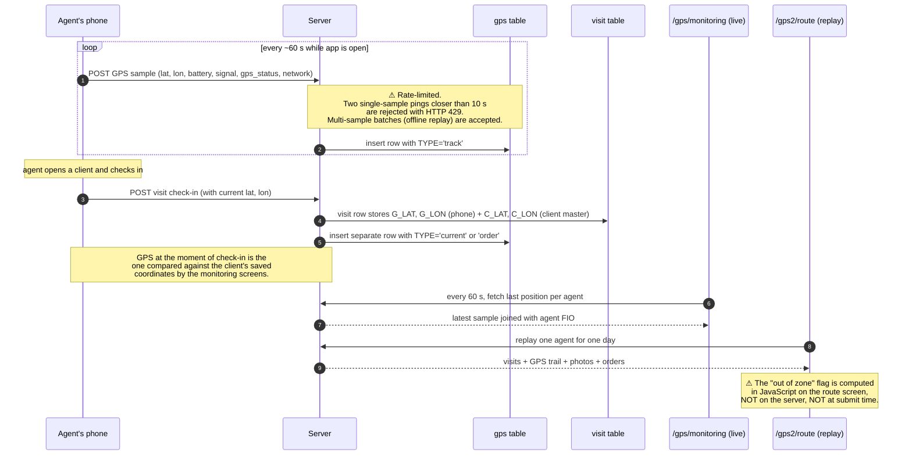

# GPS tracking — phone → server → monitoring map

## What this feature is for

Every agent and expeditor walking around with the mobile app reports their **GPS coordinates** to the server. The office uses those coordinates two ways:

- A **live map** at `/gps/monitoring` and `/gps2/monitoring` shows where every active agent is **right now**.
- A **route replay** at `/gps2/route?user=…` shows where one agent was **on a given day**, overlaid with each visit, each photo and each order, and flags visits that were checked in **further from the client** than the configured geofence radius (*"out of zone"*).

The phone also stamps GPS coordinates onto every event it sends — every order, every defect, every photo, every visit check-in — so even if the live track is patchy, individual events still know where they happened.

## Who uses it and where they find it

| Role | What they do here | How they get to the screen |
|---|---|---|
| Operator (3) | Watch the live map; replay an agent's day | Web → GPS → Monitoring; Web → GPS → Route |
| Manager (9) | Same | Same |
| Supervisor (8) | Only sees their assigned agents on the map | Same — list is filtered by `supervayzer` table |
| Admin (1) | Full access | Same |
| Field agent (4) | **Sends** GPS; does not see the map | Mobile app (silently in the background) |
| Expeditor (10) | Same | Mobile app |
| Merchandiser (11), Supervisor (8) on phone | Same (uses the GpsAdt table instead of Gps) | Mobile app |

Web access is gated by `operation.other.gps` for the live map and the route replay. Without it the menu item is hidden.

## The workflow

## Step by step

### What the phone uploads

1. *The mobile app captures a coordinate roughly once a minute while the screen is on.* The exact cadence is controlled by toggles in the agents-packet (`gps` category).
2. *Each sample carries:* latitude, longitude, GPS accuracy (`SIGNAL`), battery level, GPS state (`on / off / denied / bad_network / not_accurate`), network type and online/offline flag, device name, and a millisecond timestamp from the phone's clock.
3. *Samples are uploaded:* immediately if online; queued and replayed as a batch if the phone is offline. The server's rate-limit only kicks in for **single-sample** uploads less than 10 seconds apart — a batch from an offline phone is always accepted.
4. *Every saved sample carries a `TYPE`:*
    - `track` — routine background ping.
    - `current` — the phone is checking its own location *right now* (e.g. before a visit).
    - `order` — recorded at the moment an order was submitted.
    - `reject` — recorded at the moment a reject (no-sale) was submitted.
    - `sync` — recorded as a side effect of fetching the config packet (api3 only).

### What the live map shows

5. *The map polls the server roughly every minute* and asks for the **latest position per active agent** up to the chosen timestamp.
6. *Each pin shows:* agent name, latest sample time, battery level, GPS accuracy, online/offline flag and a colour based on freshness. Pins for agents whose last sample is more than a few minutes old are dimmed.
7. *Supervisors only see their own agents* — the map's underlying query joins `supervayzer` to filter.

### What the route replay shows

8. *The replay screen draws the day's GPS trail* as a polyline, with the visits, photos and orders marked along the route.
9. *For every visit, a coloured icon is computed in the browser:*
    - **Green check** — visit check-in within the geofence (≤ `VISIT_DISTANCE` metres from the client's saved coordinates).
    - **Yellow question mark** — within `VISIT_DISTANCE + 50 m` (borderline) **OR** the client's coordinates were edited on the day of the visit (`GPS_CHANGED = 1`).
    - **Red cross / "times"** — more than `VISIT_DISTANCE + 50 m` away. This is the **"out of zone"** flag.
10. *`VISIT_DISTANCE` is a server-side setting* (key: `visitDistance`, default 50 m, valid range 50–250 m). If the value is missing or outside that range, the screen falls back to **50 m**.

## What can go wrong

| Trigger | What the user / operator sees | Plain meaning |
|---|---|---|
| Phone has GPS off | Pin stays where it was last seen; pin colour says "offline / no GPS" | Tell the agent to enable GPS. |
| Phone has location permission denied | `GPS_STATUS = 2 (denied)` on every sample; pin sticks | Permission needs to be granted in the OS settings. |
| Phone clock is wrong | Sample's `MOB_TIMESTAMP` is in the past / future; replay draws the trail in wrong order | Phone must use network time. |
| Phone offline for hours, then comes back | Big batch upload; pins jump forward several positions at once on the live map | Expected. Verify the batch is accepted and ordered correctly. |
| Two single-sample uploads less than 10 s apart | HTTP 429 returned to the phone; second one not stored | Anti-spam protection, intentional. |
| Sample with `LAT = 0` or `LON = 0` | Stored but excluded from the route replay query | Defensive filter — both the route and the report screens explicitly skip `(0, 0)`. |
| Client coordinates edited on visit day | Visit icon flips to yellow regardless of actual distance | The route screen treats a same-day coordinate edit as a yellow flag (`GPS_CHANGED = 1`). |
| Agent visited a different building 80 m away (with `VISIT_DISTANCE = 50`) | Visit icon goes red ("out of zone") | The visit was still saved; the system never refuses a check-in for distance. |
| Active agent with no samples today | Not on the live map at all | Map query left-joins on `gps`, so missing samples mean missing pin. |

## Rules and limits

- **The geofence check is informational, not gating.** The mobile app may show a warning, but a "far away" check-in is always accepted by the server. Verify in test: even an obviously wrong check-in at 5 km from the client succeeds.
- **`VISIT_DISTANCE` lives on the server.** It is set in **Settings → System parameters** (key `visitDistance`) and ranges 50–250 m. The default is 50 m. Bad values clamp to 50.
- **The 50 m yellow band is hard-coded in the route-replay script.** Borderline = `VISIT_DISTANCE` to `VISIT_DISTANCE + 50`. Anything above that is red.
- **The replay distance calculation is in the browser.** Two consequences worth testing: a screen-refresh recomputes the icons; and a server-side report (e.g. KPI) may disagree if it computes distance differently. KPI uses its own logic.
- **Live map is supervisor-scoped.** A supervisor only sees their own agents; an operator sees everyone in the filial. Verify role isolation.
- **The 10-second rate limit is per-user single-sample.** Offline-replay batches (≥ 2 samples) bypass it. Real-world phones occasionally produce duplicate single-sample requests because of retry logic; expect to see 429 in logs.
- **Field agents use the `Gps` table; supervisors / merchandisers use `GpsAdt`.** The live map and the replay pick the right table based on the user's role.
- **GPS samples are kept indefinitely.** No archival job runs; the `gps` table grows large at every dealer. Performance regressions on the monitoring screens may simply be table size.

## What to test

### Happy paths

- Agent logs in on a fully online phone. Within two minutes a pin appears on `/gps/monitoring`.
- Agent walks 200 m; pin moves within one poll cycle on the map.
- Agent submits an order; replay shows the order's marker on the trail at the right time.
- Agent visits a client within 30 m of the client's saved coordinates with `VISIT_DISTANCE = 50`. Replay shows a green icon.

### Out-of-zone scenarios

- `VISIT_DISTANCE = 50`. Visit at 70 m. Expect yellow icon (within `+50` band).
- `VISIT_DISTANCE = 50`. Visit at 150 m. Expect red icon ("out of zone").
- `VISIT_DISTANCE = 150`. Same visit at 150 m. Expect green icon. **Verify the setting actually changed the map.**
- `VISIT_DISTANCE = 0` (invalid). Expect the screen to clamp to 50 m and render accordingly.
- Visit at 60 m, but the client's coordinates were edited on the same day. Expect yellow regardless of distance.

### Offline / poor network

- Put the phone in airplane mode for one hour while the app is open. Re-connect. Verify the entire batch uploads, all samples appear on the replay, ordered by `MOB_TIMESTAMP`.
- Throttle the network to 56 kbit/s. Verify samples still upload and pins update (latency-tolerant).
- Send two single-sample pings 5 seconds apart through the API. Expect HTTP 429 on the second.

### Special TYPE values

- Submit an order. Expect a separate GPS row with `TYPE = 'order'` saved alongside the order, with the moment-of-submit coordinates.
- Submit a reject. Expect `TYPE = 'reject'` row.
- Refresh the config packet on the phone (api3). Expect a `TYPE = 'sync'` row.

### Role and filial isolation

- Supervisor logs in. Expect to see only their agents on the map (`/gps2/monitoring`).
- Operator from filial A. Expect not to see agents from filial B.
- A user without `operation.other.gps` access. Expect the menu item to be hidden and direct URL access denied.

### Edge cases

- Agent with GPS denied: every sample stored has `GPS_STATUS = 2`, `LAT = 0`, `LON = 0`. Replay shows no trail. Live map shows the pin (or omits it — verify the actual rendering).
- Two phones logged in as the same agent at the same time. Both upload samples; replay interleaves them. Verify this looks sane (and is reported as an incident — multi-device on one agent is unusual).
- Sample arrives with a phone-side timestamp older than the previous sample (e.g. wall-clock changed). Verify the replay still orders by `DATE` ascending.

### Side effects to verify

- One row per sample in the `gps` table (or `gps_adt` for supervisors / merchandisers).
- The agent's row in the live-map query reflects the latest sample within one poll cycle.
- The replay's icon colour exactly matches the distance band predicted from `VISIT_DISTANCE`.
- No background job (Telegram, push) is fired by routine GPS samples — they are silent.

## Where this leads next

The KPI module uses these samples to compute *"hours on route"*, *"visits within zone"* and *"distance covered"*. If a GPS regression here breaks tests, also re-test the daily KPI dashboard. The visit check-in itself is covered under [Visits](../clients/index.md) and order capture under [Create order — mobile](../orders/create-order-mobile.md).

## For developers

Developer reference: `docs/modules/gps.md` and `docs/modules/gps2.md` — see the GPS upload endpoint, the rate-limit logic in `CreateGpsAction`, and the JavaScript distance calculation in `controller.route.js`.
