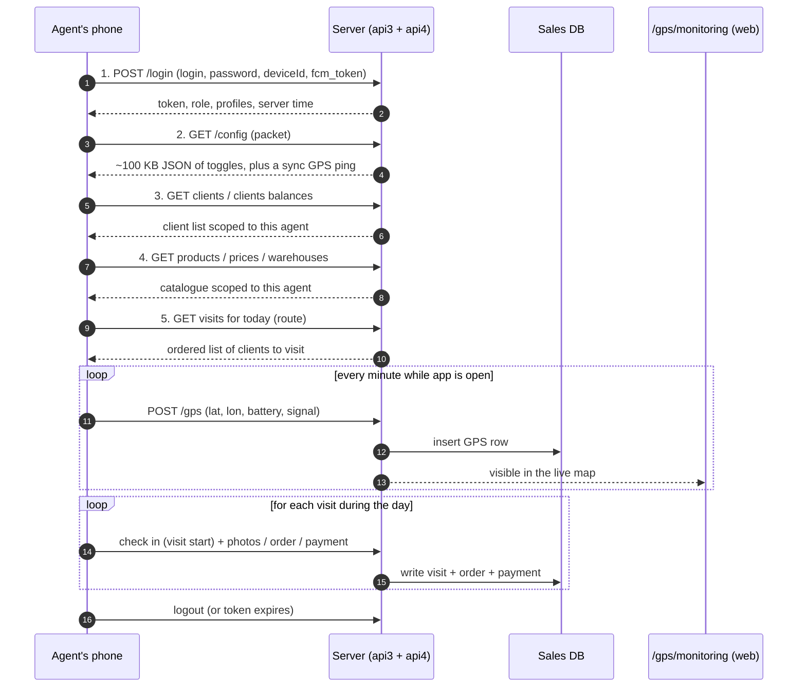

# Mobile module — QA test guide

> **Who this is for.** QA team members who need to write test plans against any of the mobile-facing surfaces of sd-main: the agent phone app, the expeditor phone app, the merchandiser app, GPS monitoring screens on the web, and the SMS broadcast tool.
>
> **Who this is *not* for.** Mobile-app developers — the corresponding developer reference lives at `docs/modules/sync.md` plus the API references at `docs/api/api-v3-mobile.md` and `docs/api/api-v4-mobile.md`.

---

## What "the mobile module" actually means

There is no single mobile module on the server — instead, the mobile apps interact with sd-main through a cluster of related concerns that this section covers as one group:

- **Authentication** — login, device tokens, FCM push tokens, device-limit enforcement.
- **Sync flow** — what happens between tapping *Login* on the phone and the phone being ready to take orders.
- **GPS tracking** — how the phone reports its position and how the office watches it.
- **SMS broadcast** — the *"СМС рассылка"* (SMS mailing) tool used only on the Uzbekistan tenancy.
- **Notifications** — Telegram alerts, Firebase push, and outbound SMS fired by other modules.
- **Configuration packets** — the JSON bundles the phone receives at login that decide what the app can do. Covered in [agents-packet](../team/agents-packet.md).

For test plans about *what the agent does on the phone in a visit* (capturing an order, taking a photo, recording a defect), see the relevant feature pages in [Orders](../orders/index.md) and [Clients](../clients/index.md). This section is specifically about the **transport, configuration and telemetry** between the phone and the server.

---

## How to use this guide

| When you want to test… | Open this page |
|---|---|
| The full login → config → clients → products → routes handshake on agent login | [Sync flow](./sync-flow.md) |
| Position reporting from the phone, the monitoring map, and the geofence "out-of-zone" indicator | [GPS tracking](./gps-tracking.md) |
| The SMS broadcast screen and its templates / recipients / sending pipeline | [SMS broadcast](./sms-broadcast.md) |
| Telegram, push and SMS that other modules fire | [Notifications](./notifications.md) |
| Configuration switches the phone respects | [agents-packet](../team/agents-packet.md) |

---

## The mobile-facing surfaces at a glance

| Surface | Who uses it | What it does | Server channel |
|---|---|---|---|
| **sd-agents** mobile app | Field agent (4) | Captures visits, orders, payments, photos, defects | api3 + api4 |
| **sd-delivery** mobile app | Expeditor (10) | Records deliveries and cash collected | api4 |
| **sd-audit** mobile app | Supervisor (8), Merchandiser (11) | Audits / market research | api3 + api4 |
| **sd-stockman** mobile app | Stockman (20) | Picks goods at the warehouse | api4 |
| Web → GPS monitoring (`/gps/monitoring`) | Operator, Manager, Supervisor | Live map of where agents are right now | Browser → server |
| Web → GPS routes (`/gps2/route?user=…`) | Operator, Manager, Supervisor | Replay of one agent's day with visits, photos, orders | Browser → server |
| Web → SMS broadcast (`/sms/view/list`) | Operator, Manager (Uzbekistan only) | Bulk SMS to clients | Browser → server → external SMS gateway |

---

## The two API versions you will run into

The mobile apps speak to **two API surfaces** that coexist on the server: **api3** (older, used by older builds and some lingering screens) and **api4** (newer, used by recent app builds). The same install of the sd-agents app may use a mix — for example, GPS upload moved to api4 long before order submission did.

| Concern | api3 | api4 |
|---|---|---|
| Auth header | `deviceToken` in query string | `deviceToken` header + signed token from `/api4/login` |
| Login response shape | Flat object with `success`, `agent_id`, `fio` | `{status, result: {token, role, profiles, server_time, …}}` |
| Device-limit check | None — up to 4 tokens kept rolling | Explicit limit (3 devices) when `enableDeviceControl` is on |
| GPS upload | `/api3/gps` (one big endpoint) | `/api4/create/gps` |
| Order submit | `/api3/order` with `SyncLog` duplicate check (20 s window per device + mobile order id) | `/api4/create/order` with **`mobile_uuid`** GUID per order |
| Error format | `{success: false, error: "..."}` | `{status: false, error: "ERROR_CODE_…", errorMessage: "..."}` |

**Most QA test cases must say which channel the app under test uses.** A retest after a phone or app upgrade may flip channels.

---

## Glossary — mobile-specific terms

> The full cross-module glossary is at [QA glossary](../glossary.md). The shortlist below covers the mobile-specific bits.

| Term | Plain-language meaning |
|---|---|
| **deviceToken** | A long random string the phone receives at login and includes in every subsequent request. Identifies the phone, not the human. |
| **FCM token** | A Firebase Cloud Messaging token, also tied to the phone. Used by the server to push notifications to the phone. |
| **GUID / mobile_uuid** | A unique ID the app generates **per order** before submitting. Survives retries, kills, and reinstalls of the same draft. |
| **SyncLog** | The api3 server-side log of mobile order submissions, keyed by `deviceToken + mobile_order_id + day`. Used as the api3 duplicate gate. |
| **Out of zone** | The visit was checked in further from the client's saved coordinates than the configured geofence radius. Flagged on monitoring screens. |
| **VISIT_DISTANCE** | The configured geofence radius in metres, server setting `visitDistance`, default 50, valid range 50–250. |
| **Tracking interval** | How often the phone uploads its location while idle. Configurable per dealer / per agent through agents-packet. |
| **Config packet** | The big JSON bundle returned by `/api3/config` or `/api4/config/*`. Decides app behaviour. |
| **License expired** | The dealer has not paid; mobile login is refused at the auth stage. The license check is separate from password. |

---

## The big picture — a typical agent workday on the phone

The light arrows are usually invisible to the agent — they are the silent housekeeping. Most test failures QA writes up are in those silent arrows.

---

## What every QA test plan should record for a mobile feature

1. **Channel** — api3 or api4.
2. **App build** — the version label on the about screen.
3. **Network condition** — full Wi-Fi, 3G, throttled, fully offline, intermittent.
4. **Pre-conditions on the server** — agent active, license paid, clients exist, products exist, visiting calendar populated.
5. **Steps from the relevant feature page.**
6. **Expected on the phone** — what the agent sees.
7. **Expected on the server** — rows that should exist (visit, order, GPS sample, SyncLog).
8. **Expected side effects elsewhere** — Telegram alert in the dealer's group, push notification to another role, SMS to a client.

---

## For developers

The developer-facing equivalent of this section lives under `docs/modules/sync.md` (sync flow), `docs/api/api-v3-mobile.md` and `docs/api/api-v4-mobile.md` (endpoint references), and `docs/modules/gps.md` (server-side GPS handling).
