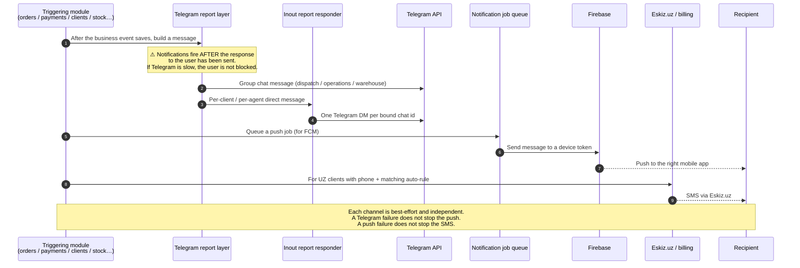

# Notifications — Telegram, push and SMS fired by other modules

## What this feature is for

Many events inside sd-main send a notification to somebody outside the web admin: the field agent, the expeditor, the client themselves, the dealer's dispatch group on Telegram, the operations Telegram channel, the warehouse stockman's phone. There is no single "notifications module" — every event fires its own outbound message. This page is a **quick reference** of what fires what, who receives it, on which channel, and what QA should expect to see end-to-end.

Three channels are in play:

- **Telegram** — most common. Either a personal direct message to a user who has bound their account to the bot, or a message to a group chat the dealer has configured.
- **Firebase Cloud Messaging (FCM)** push — to a specific mobile app (stockman, agent, expeditor).
- **SMS** — outbound text to a client's saved phone number, via the same Eskiz.uz pipeline as the [SMS broadcast](./sms-broadcast.md) tool.

## Who uses it and where they find it

Notifications are mostly **received**, not "used". The setup is admin-only:

| Role | What they do here | How they get to the screen |
|---|---|---|
| Admin (1) | Configures Telegram bot tokens, group chat IDs, FCM service-account files | Web → Settings → Applications → Bot settings |
| Admin (1) | Toggles which events fire which message types | Web → Settings → System parameters |
| End users | Bind their personal Telegram account to the bot once; thereafter just receive | Telegram chat with the dealer's bot |
| Stockman, agent, expeditor (mobile) | Receives push notifications | Mobile app foreground / background |
| Clients | Receive Telegram messages (if bound) and/or SMS (UZ only) | Their own phone |

## The workflow

## Event → notification quick reference

| Business event | Message kind | Who receives | Channel |
|---|---|---|---|
| **Agent submits a new order** | *"New order"* | Dealer's order group; client (if bound) | Telegram |
| **Operator creates an order on the web** | *"New order"* (same path as above) | Same | Telegram |
| **Out-of-stock attempt on a mobile order** | *"Not enough stock"* | Dealer's stock-alerts group | Telegram |
| **Agent submits a reject (no-sale)** | *"Reject"* | Dealer's order group | Telegram |
| **First-ever visit to a client** | *"First visit"* | Dealer's clients group; supervisor of that agent | Telegram |
| **First visit by a supervisor** | *"First visit (supervisor)"* | Dealer's supervision group | Telegram |
| **Agent creates a new client** | *"New client"* | Clients group; assigned supervisor | Telegram |
| **Photo report from the agent at the client** | *"Photo report"* | Dealer's photo-report group; client (if bound) | Telegram |
| **Photo report from a supervisor / merchandiser** | *"Photo report (audit)"* | Supervision group | Telegram |
| **Expeditor delivers and collects cash from a client** | *"Payment to expeditor"* | Operations group; client (if bound) | Telegram |
| **Agent collects cash from a client (van-selling / seller)** | *"Payment to agent"* | Operations group; client | Telegram |
| **Client confirms payment to expeditor via the client bot** | *"Payment confirmed by client"* | Operations group | Telegram |
| **Whole order return** | *"New return"* | Operations group; client | Telegram |
| **Defect recorded against an order** | *"Defect"* | Operations group | Telegram |
| **Consumption movement (internal warehouse use)** | *"New consumption"* | Stock group | Telegram |
| **Client makes a direct payment in the office** | *"New client payment"* | Operations group; client | Telegram |
| **Royalty / franchise debit** | *"Royalty"* | Affected client (bound chat ids) | Telegram |
| **Warehouse stockman needs to fulfil orders** | *"Pick-up needed"* | Stockman's phone | FCM push |
| **Periodic minimal-stock alert** | *"Minimal stock"* | Stock group, scheduled by cron | Telegram |
| **Monthly warehouse-receipts digest** | *"Warehouse receipts digest"* | Configured chats, scheduled | Telegram |
| **Pending-clients reminder** | *"Pending clients"* | Configured chats, scheduled | Telegram |
| **New task assigned to an agent** | *"New task"* | Agent's bound Telegram | Telegram |
| **Operator-initiated SMS broadcast** | [SMS broadcast](./sms-broadcast.md) | Selected clients | SMS (Eskiz.uz, UZ only) |
| **Client bot — sync ack** | *"Sync"* | Client's bound chat | Telegram |
| **Login push token registered** | (none — just stores the FCM token) | n/a | n/a |

## Step by step — how a single notification reaches the recipient

1. *The business event commits.* A new order row, a new payment row, a new visit row — whatever — is saved successfully.
2. *The triggering module asks the Telegram report layer to build a message.* On the order-create path, for example, both the dispatch group and the bound client are notified separately.
3. *The Telegram layer builds the message text.* The text is localised (ru / uz / en) by the dealer's setting, formatted in Telegram's HTML mode, and is paired with a list of chat ids to send it to.
4. *Each chat id is a separate API call to Telegram.* The Telegram API is synchronous, so the order-create flow **defers** this past the HTTP response to the phone — the agent does not wait for Telegram before seeing *"order saved"*.
5. *Push goes through the job queue.* A push job is queued with a JSON service-account path, the device's FCM token and the message body. The worker picks it up, calls the FCM endpoint, and on failure retries up to 5 times with a 10-second back-off.
6. *SMS to a client is exceptional.* SMS today is initiated **only** by the operator at `/sms/view/list`. There is no automatic event-driven SMS in the current code path — debt-reminder flows that look like they should send SMS actually create a Telegram message to the client's bound chat.

## What can go wrong

| Trigger | Symptom | Plain meaning |
|---|---|---|
| Telegram bot token wrong or revoked | Every notification silently disappears | The dispatch / operations groups go quiet. Check **Settings → Applications → Bot settings**. |
| Client has not bound to the bot | The "to-client" Telegram message is skipped | Expected; only group messages still go through. |
| Group chat id wrong | One specific group goes quiet; others fine | One mis-configured chat id. |
| FCM service-account JSON missing or expired | Push job retries 5 times then dies in the failed-job table | Stockman gets no order alerts. |
| Worker queue not running | The push job sits in the queue indefinitely | The push queue is not the same process as the order-submit code — it needs its own runner. |
| Recipient's FCM token revoked (app uninstalled) | Send returns false; job fails after 5 retries | Re-login on the new install generates a fresh token. |
| Telegram message too long | The Telegram API returns an error; the message is lost (no auto-truncation) | A defect with many lines is more likely to overflow. |
| Localisation key missing | The message goes out in a fallback language | Cosmetic; not a delivery failure. |
| Order submit fails validation | None of the order-create notifications fire | Notifications are post-commit only. |
| Telegram rate limit hit | First ~30 messages go; the rest may be silently dropped | Usually only at scale (e.g. midnight digest to 100 chats). |
| Push during background mode | Notification arrives but the app may not show a toast until next foreground | OS-specific; not a server bug. |

## Rules and limits

- **All notifications are post-commit and best-effort.** The user's HTTP response has already returned before the notification code runs. A notification failure never undoes business data.
- **Telegram and push are independent.** Two separate code paths; either one can succeed while the other fails.
- **Recipients fall in three groups:** (1) **operators / supervisors** via group chats configured by the dealer; (2) **end users on mobile** via FCM push to a specific service account; (3) **clients** via Telegram DM, only if the client has bound their phone to the dealer's bot.
- **There is no audit log of "what notification went out".** If a recipient complains "I didn't get the message", QA's options are: re-run the scenario and watch in real time, or read the dealer's bot logs externally.
- **FCM uses one service-account JSON per mobile app.** Today only the stockman service account is in tree — that means only the stockman app gets push from the server right now. Other apps register FCM tokens on login but the server does not actively push to them.
- **Telegram bot tokens are per-dealer.** A test environment with its own bot must have its own token configured.
- **Country gating for SMS-style auto-notifications** — none currently fire automatically. Only operator-initiated broadcasts (UZ only) actually send SMS today.
- **The agent's FCM token is stored on the user record.** It is overwritten on every login. A user with two phones overwrites the token of the older one — push will only reach the latest login.
- **Bot binding for clients** is a separate flow (the client opens the dealer's bot, sends a phone number, the bot verifies and stores the Telegram chat id against the client). Without that binding the per-client Telegram messages silently skip.

## What to test

### Happy paths

- Configure a test Telegram bot and a test group; create an order; verify the group receives the *"new order"* message within ~5 seconds.
- Same but the client is bound to the bot; verify the client also receives a personal DM.
- Stockman has a fresh FCM token; operator marks an order shipped and assigns the stockman; verify the push reaches the stockman's phone.
- SMS broadcast on a UZ dealer; verify the actual SMS arrives on a real test phone.

### Failure isolation

- Mis-configure the order-group chat id; create an order. Verify the per-client DM still goes through and the order itself is saved.
- Remove the stockman's FCM token; verify push fails after 5 retries and lands in the failed-job table, but the order itself is unaffected.
- Revoke the bot token; verify all Telegram silently fails and the order business path is unaffected.

### Edge cases

- Order with 50 lines; defect message body crosses Telegram's 4096-character limit. Verify what happens (silent failure or truncation).
- Client bound to **two** Telegram chat ids (e.g. owner and accountant). Both should receive the per-client messages.
- Stockman with an unbound phone — no FCM token; verify push job is **not** dispatched (the trigger should short-circuit on empty token).
- Two near-simultaneous order creates from the same agent. Two separate Telegram messages; not one merged one.
- Push retries 5 times. Each retry should be 10 seconds apart and visible in the worker log.

### Channel routing

- An event fires Telegram + push. Disable the worker queue. Telegram still goes; push waits. Re-enable the worker; verify the push catches up.
- An event that has only Telegram (e.g. `newClient`). Verify no push job is queued at all.
- An event that is push-only (the order-edit *"pick-up needed"* alert to the stockman). Verify no Telegram fires.

### Localisation

- Switch dealer language to **uz**. Trigger any Telegram-firing event. Verify the message text is in Uzbek.
- Same for **ru** and **en**.
- Force an unknown language code. Verify a sensible fallback (usually ru).

### Side effects to verify

- A successful Telegram send leaves no row anywhere local — there is no Telegram message log on the server.
- A successful FCM send leaves one row in the completed-job table (or no row, depending on queue configuration).
- A failing FCM send leaves a row in the failed-job table after the 5th attempt.
- No row in `sms_message` for any of these events — that table is only written by the operator's broadcast tool.

## Where this leads next

- For the operator-initiated bulk-SMS pipeline, see [SMS broadcast](./sms-broadcast.md).
- For event-level configuration of what fires what, see the Telegram bot settings page under the Settings module (covered separately).
- For agent-side mobile UX of receiving a push (e.g. stockman screen popping a new-order banner), test through the relevant feature page in [Orders](../orders/index.md).

## For developers

Developer reference: the bulk of the Telegram pipeline is in `protected/models/TelegramReport.php`. Push goes through `SendNotificationJob` and `FcmV1`. The Telegram "to bound client" path is in `InoutReportResponder::notifyClient`. The settings UI for tokens and chat ids is under `protected/modules/settings/views/applications/bot-settings.php`.
