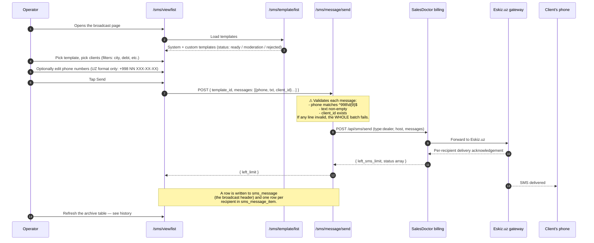

# SMS broadcast — *СМС рассылка* (Uzbekistan only)

## What this feature is for

A back-office tool for operators to **send bulk SMS to clients**. The use case is debt reminders, payment confirmations and general notifications (campaigns, holidays, new product launches). The dealer buys SMS packages from the SalesDoctor billing platform; the broadcast tool draws on that balance.

This feature is **gated to the Uzbekistan tenancy only.** On any other country the menu item is hidden and the URL is unreachable. The reason is that the underlying SMS provider — Eskiz.uz — only operates inside Uzbekistan and requires every message text to be pre-moderated.

## Who uses it and where they find it

| Role | What they do here | How they get to the screen |
|---|---|---|
| Operator (3) | Pick a template, pick recipients, hit Send | Web → Клиенты → СМС рассылка |
| Manager (9), Admin (1) | Same | Same |
| Other roles | No access | Menu item hidden |

The whole sub-section is gated by:

- `operation.sms.list` — see broadcasts and send them.
- `operation.sms.template` — create / edit templates.
- `operation.sms.package.buying` — buy more SMS credit.

Plus the country gate: the server-settings country code must be `UZ`.

## The workflow

## Step by step

1. *The operator opens **Клиенты → СМС рассылка** (URL `/sms/view/list`).* The page shows a date-range filter, a list of past broadcasts (the **archive**) and a panel of templates.
2. *The operator picks (or creates) a template.* Templates have three editorial statuses and three business types:
    - **Statuses:** `default` (system, can't be deleted), `moderation` (awaiting Eskiz approval), `ready` (approved), `rejected` (Eskiz refused it).
    - **Types:** `debt`, `payment`, `notification`. Just classification — does not change behaviour.
    - A template body may use placeholders like `[CLIENT_NAME]`, `[BALANCE]`, etc. The placeholder list comes from the server (`getVariableList`).
3. *The operator picks recipients.* The clients screen on the SMS page filters by city, debt status, client category, etc. Each chosen client supplies its phone number(s) (`+998 NN XXX-XX-XX`).
4. *Manual phone additions.* The operator can also add a phone number by hand, which is validated against the Uzbek mask `^\+998 (90|91|93|94|95|97|98|99|50|88|77|33|20) \d{3}-\d{2}-\d{2}$`.
5. *The operator reviews the message preview* — placeholders are substituted with each recipient's data — and taps **Send**.
6. *The server validates each line:*
    - Phone matches `^998\d{9}$` (the leading `+` is stripped).
    - `txt` is non-empty.
    - `client_id` is non-empty and refers to a real client.
    - If any line fails, the **entire batch is rejected** with the list of bad lines. Nothing is sent.
7. *The server counts the total SMS units.* A single long Cyrillic message costs more than one unit; the helper `SmsTemplate::countSms` splits by length / encoding.
8. *The server writes one `sms_message` row* (the broadcast header) and one `sms_message_item` row per recipient. The header captures the total `sms_count` and `client_count`.
9. *The server forwards the batch to the SalesDoctor billing platform* (`POST /api/sms/send`). Billing is the gateway to Eskiz.uz.
10. *The billing platform returns the new SMS balance* (`left_sms_limit`) and the per-recipient acknowledgement. The transaction is committed.
11. *The archive table refreshes* to show the new broadcast, its template, its SMS count, its client count and its status.

## Buying SMS credit

A separate page at `/sms/view/buyingPackage` (URL `Купить смс пакет`) lists the available packages from the billing platform. Tapping **Buy** triggers `/sms/package/buying?id=…`, which calls into the billing platform to charge the dealer. The new credit appears on the balance card next time the operator visits the broadcast page.

## What can go wrong

| Trigger | What the operator sees | Plain meaning |
|---|---|---|
| Operator picks a template still in `moderation` | Send button disabled / template hidden from the picker | Eskiz has not approved it yet; wait. |
| Operator picks a `rejected` template | Same — hidden / disabled | Edit and resubmit for moderation. |
| One phone number fails the format check | Whole batch rejected; modal lists offending rows | Fix the bad numbers; press Send again. |
| Dealer has insufficient SMS balance | Backend rejects with the billing platform's error | Buy a package first. |
| Eskiz returns `waiting` for some recipients | Stored as `sent` locally; checked later by `/sms/message/checking` | Eskiz needed to re-route; status will flip. |
| Country is not UZ | Menu item missing, direct URL returns 404 / access denied | Feature is geographically scoped. |
| Two operators try to send the same template at the same minute | Both succeed — independent broadcasts | Both rows exist in archive; clients get two SMS. |
| Eskiz rate-limits the gateway | Billing returns an error and the local transaction rolls back | Retry in a minute. |

## Rules and limits

- **Country gate is hard.** The menu item is added only when the dealer's country code is `UZ`. On a Kazakh / Kyrgyz install it is not available even to admins.
- **Phone format is strict.** Only Uzbek mobile prefixes are accepted (`90, 91, 93, 94, 95, 97, 98, 99, 50, 88, 77, 33, 20`). Landlines are rejected.
- **Whole-batch validation.** A single bad line invalidates the whole send. There is **no partial send** in this UI — the operator must fix the data and retry.
- **Templates moderate through Eskiz.** Custom templates start in `moderation`; they are usable only when they move to `ready`. The `/sms/template/checking` endpoint is called on page load to refresh moderation statuses.
- **Default templates can't be deleted.** The system ships with a small set (`status: default`) — these are always available.
- **SMS units cost.** A long Cyrillic message uses several units. The `sms_count` saved on `sms_message` is the total units charged, not the number of recipients.
- **Balance is on the billing platform, not local.** The local `sms_message` rows are the audit; the actual credit ledger is on `Distr::billingDomain()`. A test that checks the new balance must call `/sms/message/balance` after the send.
- **The transaction wraps everything.** If anything (validation, billing call, header save, item save) fails, the whole transaction rolls back and no `sms_message` rows remain.
- **The archive shows everyone's broadcasts** — there is no per-operator filtering. The `created_user` column shows who sent each one.
- **No filial scoping on the archive query** — broadcasts from any filial are visible. Verify whether this matches the dealer's intended privacy model.

## What to test

### Happy paths

- Operator picks a `ready` template, picks 10 clients, taps Send. All 10 SMS go out. Archive shows 1 broadcast with `client_count = 10`.
- Long Cyrillic template (200+ characters). Verify `sms_count` is higher than `client_count`.
- Mix of clients with and without saved phones — picker skips those without phones. Verify the missing ones do not appear in the recipient list.
- Operator buys a package, then sends. New balance reflects the package - the message cost.

### Validation failures

- One recipient has phone `+998 12 345-67-89` (invalid prefix). Expect whole batch rejected with that row flagged.
- One recipient has phone `998901234567` (no leading `+`, no spaces). Still passes the server check (`^998\d{9}$`). Verify Eskiz accepts it.
- Template body emptied (text becomes whitespace only). Expect rejection.
- `client_id` tampered with to point at a non-existent client. Expect rejection.

### Template lifecycle

- Create a new template. It enters `moderation`. Refresh — verify it stays in `moderation` until Eskiz approves.
- Eskiz approves → template becomes `ready` → appears in the picker.
- Eskiz rejects → template becomes `rejected` → hidden from picker but visible in the template list with rejection reason.
- Try to delete a `default` template. Expect refusal.
- Try to delete a custom template that has been used in a broadcast. Expect refusal (`deletable = false`).

### Country gate

- Switch tenancy country to **KZ** (test environment). Menu item disappears. Direct URL `/sms/view/list` returns access-denied.
- Same for **KG**.
- Switch back to **UZ**. Menu item reappears.

### Role gating

- Operator with `operation.sms.list` → sees the page.
- Operator with `operation.sms.template` removed → cannot create templates but can send using existing ones.
- Operator with `operation.sms.package.buying` removed → cannot see *Купить смс пакет*.
- Agent / Expeditor / Supervisor → no access at all.

### Balance and packages

- Dealer with 0 SMS balance attempts a send → billing returns insufficient-funds error → transaction rolls back → no row in `sms_message`.
- Buy a 1 000-SMS package → balance jumps by 1 000 → send 50 → balance is 950 next refresh.
- Eskiz returns a partial-success batch → verify all the message items are saved locally regardless (with whatever status Eskiz reported).

### Side effects to verify

- One row in `sms_message` per broadcast, with the right `template_id`, `sms_count`, `client_count`, `created_by`.
- One row per recipient in `sms_message_item` with the substituted text, the phone and the client.
- `Distr::billingDomain()` returned a non-error response.
- Refreshing the balance shows the new `left_sms_limit`.
- The client actually receives the SMS within a few minutes (manual / end-to-end check).

## Where this leads next

The SMS feature is mostly self-contained. Two adjacencies to keep in mind:

- The same Eskiz.uz channel is also used by **automatic** SMS firing from other modules (debt reminders fired by the operations module, payment confirmations from finans). Those are covered in [Notifications](./notifications.md).
- The package-buying flow charges the dealer's main account at the billing platform. For QA against the billing platform itself, see the **sd-billing** docs.

## For developers

Developer reference: `protected/modules/sms/README.md` for the endpoint map. The model files (`SmsMessage`, `SmsMessageItem`, `SmsTemplate`) define the statuses and types. The send pipeline is in `MessageController::actionSend`. The country gate that adds the menu item is in `SideMenu2.php`.
