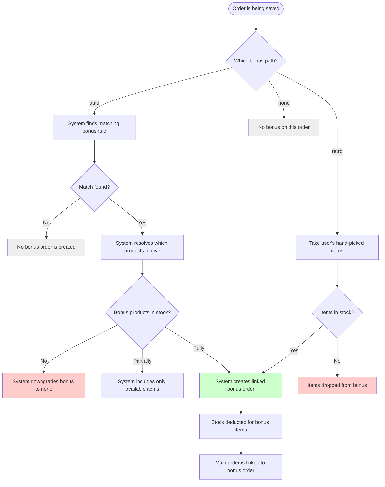

# Bonus orders — free goods linked to a main order

## What this feature is for

A **bonus order** is a separate, free-of-charge "sister order" that travels with a main sale order. The sister order carries the products the client gets free as a promotion. For example: *"Buy 100 boxes of soap, get 5 boxes free."* The 100 boxes go on the main order; the 5 free boxes are on the linked bonus order.

The bonus is implemented as a second order rather than a discount because it has its own products with their own stock movements — the company needs to track that the 5 free boxes physically left the warehouse.

There are three bonus paths and QA should think of them as distinct features sharing a screen:

| Path | Who picks the bonus products | When the path fires |
|---|---|---|
| **Auto-bonus** | The system, based on a rule | If the user submits with `bonus_type=auto` (or `manual` on mobile) and a matching rule exists |
| **Retro-bonus** | The user (agent on mobile), at order time | If the user submits with `bonus_type=retro` and a list of bonus items |
| **Manual bonus edit** | The user (operator on web), after the order is saved | If the operator opens the bonus edit screen on an existing order |

## Who uses it and where they find it

| Role | Path | Where |
|---|---|---|
| System | Auto-bonus | Fires automatically on order save (web or mobile) |
| Field agent (4) | Retro-bonus | Mobile app → Take order → toggle to retro-bonus → pick items |
| Operator (3), Operations (5), Key-account (9), Expeditor (10) | Manual bonus edit | Web → Order detail → **Bonus** button → edit form |
| Manager (2), Admin (1) | Same as above | Same |

## The workflow — at a glance

## Step by step — auto-bonus

1. The order is being saved (web or mobile).
2. *The system asks the bonus engine:* is there a bonus rule matching this order's client / agent / city / trade / price type?
3. **No match:** no bonus order is created. Save continues normally.
4. **Match found:** *the system resolves which products to give for free* based on the rule.
5. *The system checks stock* for each bonus product (unless the warehouse has stock-check disabled).
6. **No bonus products available:** the bonus is downgraded — the main order saves, but with no bonus.
7. **Some available, some not:** only the available items become bonus lines.
8. **All available:** the full bonus is created.
9. *The system creates the bonus order* and links the main order to it.
10. *Stock for the bonus products is deducted* from the same warehouse as the main order.
11. *Both orders are saved* in the same logical operation; main fails → bonus rolls back too.

## Step by step — retro-bonus (mobile, user-picked)

1. The agent flips the bonus toggle to **Retro** during order taking on the mobile app.
2. The agent picks the bonus products themselves (quantity, products from a list the system shows).
3. The agent submits the order.
4. *The server uses a special retro-bonus identifier* (a system-level "retro" rule) for the bonus order, instead of a matched real rule.
5. *The server checks stock per bonus item.* Items out of stock are dropped silently; if **all** are dropped, the bonus is downgraded to none.
6. *The bonus order is created and linked.*

## Step by step — manual bonus edit (web, after save)

1. The operator opens an existing order's detail page.
2. The operator clicks **Bonus** and lands on the bonus edit form.
3. The form shows the current bonus order's lines (or empty, if none yet).
4. The operator adds, removes, or changes quantities.
5. The operator presses **Save**.
6. *The system checks stock for all bonus items across all bonuses* (the dealer may have stock-check disabled on this warehouse — in that case the check is skipped).
7. *The system upserts the bonus order lines.*
8. *The bonus order's total count and volume are recomputed.*
9. ⚠ The manual edit screen only allows edits while the main order is in **New** or **Shipped**.

## What can go wrong

| Trigger | What the user sees | Plain-language meaning |
|---|---|---|
| Auto-bonus rule matches but every bonus product is out of stock | The order saves silently with no bonus | Common — the test must verify that the order succeeds and the bonus is empty / absent. |
| Retro-bonus with all items out of stock | The order saves silently with no bonus | Same as above. |
| Retro-bonus with some items out of stock | The order saves with a partial bonus | Tester must verify which items survived. |
| Manual bonus edit when main order is past **Shipped** | Save rejected | The edit screen blocks editing once the order is past the editable window. |
| Manual bonus edit insufficient stock | Flash message: "Insufficient goods" | The bonus update is rejected. Main order is untouched. |
| Bonus order's stock at delivery time differs from order-time | (No active feedback) | The order may have been created when stock was OK; if stock dropped between create and ship, partial-defect / return on the bonus order itself is required to unwind it. |

## Rules and limits

- **One main order has at most one bonus order.** The link is one-to-one. There's no "two bonus orders on the same main order".
- **The bonus order's stock comes out of the same warehouse as the main order.** Different bonus product? Same warehouse.
- **An auto-bonus rule is matched by attributes**, not by total value alone — client tier, agent, city, trade and price type all play.
- **Retro-bonus uses a system-level "retro" rule identifier**, not a real bonus rule from the catalog.
- **A retro-bonus with no available items downgrades to no bonus, silently.** This is a behaviour worth flagging — agents may not notice their selected bonus didn't actually ship.
- **Stock-check-disabled warehouses skip the stock check** for bonus items the same way they do for sale items.
- **Manual bonus edit applies only while the main order is in New or Shipped.** Once Delivered, bonus content is read-only on this screen.
- **Editing a main order's lines can shrink the bonus order** indirectly — see [Edit order](./edit-order.md) and the bonus recalculation note there.
- **Deleting the main order also affects the bonus order.** Test plans for [Status transitions](./status-transitions.md) (especially Cancelled and Returned) must also verify the bonus order's state.

## What to test

### Auto-bonus

- Create an order on a client/agent/trade combo that matches a rule. Verify a linked bonus order exists with the right products and quantities.
- Same scenario but with one of the bonus products completely out of stock. Expect: bonus is downgraded — main saves without that product on the bonus.
- Same scenario but with **every** bonus product out of stock. Expect: bonus is empty / absent.
- A combo that matches no rule. Expect: no bonus.
- An order whose **value** is just below the rule's threshold. Expect: no bonus.
- An order whose **value** is just at / above the threshold. Expect: bonus.

### Retro-bonus

- Agent picks two bonus products at order time. Both in stock. Expect: bonus saved with those two.
- Agent picks two; one is out of stock. Expect: bonus saved with one (the in-stock one).
- Agent picks two; both out of stock. Expect: no bonus order created, main order succeeds.
- Agent flips to retro-bonus but picks zero products. Verify behaviour (likely no bonus).

### Manual bonus edit (web)

- Open a New order's bonus form, add three products with quantities. Save. Verify they're saved.
- Open a Shipped order's bonus form. Verify save still works.
- Open a Delivered order's bonus form. Verify save is blocked.
- Edit existing bonus to remove a product. Save. Verify the line is gone.
- Edit existing bonus to bump a quantity past available stock. Expect: rejection.
- Edit bonus with stock check disabled on this warehouse. Expect: bump past stock is accepted.

### Interaction with main-order changes

- Add a line to the main order that would now meet a new bonus rule's threshold. Save. Verify the auto-bonus rule fires on next save (this is a corner — verify behaviour and document it).
- Mark a line on the main order as defective. Verify the bonus order's quantities are adjusted (or that the bonus order is left alone — verify which).
- Cancel a main order that has a bonus order. Verify the bonus order is also cancelled and its stock is returned.
- Return a main order that has a bonus order. Verify both are returned and stock is restored on both.

### Side effects to verify

- Bonus order row exists (or doesn't) per the path's outcome.
- Main order has the bonus order's id stored.
- Bonus order's product lines match what the user / engine picked.
- Bonus order's stock has been deducted from the warehouse.
- Bonus order's total count and volume reflect the lines.
- A history row records the bonus creation / edit.

## Where this leads next

- For non-bonus discounts (per-line, header auto-discount), see [Discounts](./discounts.md).
- For how editing affects the bonus, see [Edit order](./edit-order.md).
- For how status changes affect the bonus, see [Status transitions](./status-transitions.md) and [Whole-order return](./whole-return.md).

## For developers

Developer reference: `docs/modules/orders.md` — see *Cross-module touchpoints* and the bonus helpers section.
