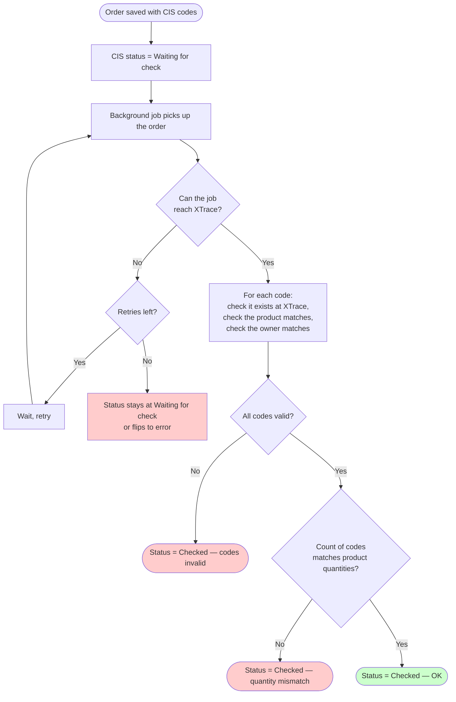

# CIS code check — verifying regulated-goods marking codes

## What this feature is for

Some product categories — tobacco, alcohol, mineral water, dairy and a few others — are regulated by the state. Each pack carries a unique mark (a **CIS code**) that the state's tracking system (here called **XTrace** internally, also known by trade names like *Aslbelgisi*) records. When goods change hands — supplier to dealer, dealer to retailer — the system needs to confirm each CIS code is real, belongs to the right product, and is owned by the right party.

This check runs **automatically in the background** after an order is created. It does not block order creation — the order saves and ships normally — but the order carries a CIS status that tells the dealer whether the codes were OK. If the check finds problems, the dealer support team has to investigate before the regulator does.

## Who uses it and where they find it

| Role | What they do here | Where they see it |
|---|---|---|
| System (background job) | Runs the CIS check on every order with CIS codes | Behind the scenes — no user clicks anything |
| Dealer support team | Watches CIS status on orders | Web → Orders → status column / detail badge |
| Compliance / accounting | Investigates orders flagged as failed | Same |

End-clients and field agents do **not** interact with this feature directly.

## The four CIS statuses

This is the most important thing for QA to memorise — every order with CIS codes ends in one of these states.

| Status | Meaning | Typical cause |
|---|---|---|
| **Waiting for check** | The job hasn't run yet, or is currently running, or failed temporarily and will retry | Order was just created; transient API error |
| **Checked — OK** | Every CIS code passed every check | Normal happy-path outcome |
| **Checked — codes invalid** | At least one CIS code is unknown to XTrace, or has the wrong product, or is owned by the wrong party | The CIS code was mistyped or stolen, or the company isn't authorised to sell it |
| **Checked — quantity mismatch** | All codes are valid, but the count of codes does not equal the order's product quantities | Goods were over- or under-coded compared to the order |

A test plan should produce one test per status — including the "waiting" state by checking the order right after creation.

## The workflow — at a glance

## Step by step

1. *An order is saved with CIS codes attached to one or more lines.* (The codes can come from the mobile app, a barcode scanner on the web form, or an upload.)
2. *The order's CIS status is set to **Waiting for check***.
3. *The system queues a background job* to verify the codes.
4. *The job picks up the order* (typically within seconds, but can be longer under load).
5. *The job authenticates to the XTrace API* using the dealer's API token.
6. *For each CIS code on the order, the job asks XTrace:*
    - Does this code exist?
    - Is the product on the code the same as the product on this order line?
    - Is the code currently owned by the dealer's company (correct seller INN)?
    - Is the code in a state that allows sale (typically *APPLIED*, *INTRODUCED*, or *INTRODUCED_RETURNED*)?
7. **If any code fails:** *the order's CIS status is set to **Checked — codes invalid***. The job stops here.
8. **If all codes pass:** *the job sums the codes per product and compares to the order's line quantities.*
9. **If the count doesn't match:** *the order's CIS status is set to **Checked — quantity mismatch***.
10. **If everything matches:** *the order's CIS status is set to **Checked — OK***.
11. **If the job hits a network or API error:** it retries (up to a small number of times). On final failure, the status stays at **Waiting for check** so a later retry can pick it up.
12. *The job logs everything* but does not send a user notification — the dealer's support team is expected to watch the status column.

## What can go wrong (visible to compliance / support)

| Trigger | Status the order ends in | Plain-language meaning |
|---|---|---|
| One or more CIS codes are not in XTrace | Checked — codes invalid | A code was mistyped or doesn't exist. |
| A CIS code's product doesn't match the order's product | Checked — codes invalid | The scan or the line is wrong — they're scanning the wrong box. |
| A CIS code is owned by a different company (wrong INN) | Checked — codes invalid | The dealer doesn't actually have those goods on their books. |
| A CIS code is in a wrong state (already sold, withdrawn, etc.) | Checked — codes invalid | This code has already been used or is otherwise blocked. |
| Codes are all valid but their total doesn't equal the line's quantity | Checked — quantity mismatch | They coded 95 of 100 boxes, or coded 105 of 100. |
| XTrace is unreachable | Stays at Waiting for check | Network issue. Job retries; if final failure, status stays "waiting" until manual retry. |
| Dealer's XTrace API token is missing or expired | Stays at Waiting for check; error in job log | The dealer's integration is misconfigured. |
| Order has no CIS codes at all | The CIS status is "no codes" / not applicable | This isn't an error — orders without CIS goods don't get a status. |

## Rules and limits

- **The CIS check does not block creating or shipping the order.** The order's normal lifecycle runs in parallel. A QA test plan should always verify that an order with broken CIS codes can still be Shipped and Delivered.
- **The check is asynchronous and retries are limited.** A few retries; if all fail, the status stays at *Waiting for check*. Operations must monitor for stuck orders.
- **The check uses the dealer's own INN.** Codes owned by other companies are not authorised. Test plans must use the right dealer's INN.
- **The status is per-order, not per-line.** Even if just one code on one line is bad, the whole order is flagged.
- **Test mode (`testFakturaUZ` / staging) is shared with other regulated integrations.** If the test setup uses staging, the CIS check may use different XTrace endpoints — confirm with the integration team which environment is being tested.
- **The job has a long timeout.** Slow XTrace responses are tolerated up to a generous limit.
- **There is no user-facing notification when the status changes.** Compliance and support staff are expected to filter the orders list by CIS status.

## What to test

### Happy path

- Create an order with valid CIS codes, all matching products and the dealer's INN, valid states. Within ~30 seconds (or the job's typical lag), verify the order's CIS status flips from *Waiting for check* to *Checked — OK*.

### Code-level failures

- Submit a code that doesn't exist in XTrace (e.g. random string). Expect: *Checked — codes invalid*.
- Submit a code that exists but whose product is different from the order line's product. Expect: *Checked — codes invalid*.
- Submit a code that exists but whose owner is a different company. Expect: *Checked — codes invalid*.
- Submit a code that exists but is in a wrong state (already sold). Expect: *Checked — codes invalid*.

### Quantity mismatch

- Order line is 100 boxes; submit 95 codes. Expect: *Checked — quantity mismatch*.
- Order line is 100 boxes; submit 105 codes. Expect: *Checked — quantity mismatch*.
- Order line is 100 boxes; submit 100 codes — verify status is OK.

### Transient failures

- Block the XTrace service URL at the network level. Save an order with codes. Verify the order's status stays at *Waiting for check* and the job log records the retries.
- Restore network. Either retry manually, or verify the next scheduled run picks it up and the status updates.

### Configuration

- Remove the dealer's XTrace API token. Save an order with codes. Verify the order stays at *Waiting for check* and an integration-config error is logged.
- Restore the token; rerun; verify the order checks correctly.

### Edge cases

- Order without any CIS codes. Verify the CIS status is "no codes" / not applicable, and that the order's lifecycle is otherwise unaffected.
- Order with codes on some lines but not others. Verify the check covers only the lines with codes and that the quantity comparison uses those lines' quantities.
- Two orders submitted in rapid succession; both touching XTrace. Verify both end up with their own CIS status correctly.
- Re-open an order from Delivered to New, edit the codes, save. Verify the CIS status returns to *Waiting for check* and re-runs.

### Side effects to verify

- The order's CIS status field reflects the outcome.
- The individual CIS codes are updated with the data returned from XTrace (product code / GTIN, status etc.).
- The job's logs record both happy and failure paths.
- The order's lifecycle (Shipped / Delivered) is unaffected by CIS status.
- The orders-list filter by CIS status returns the expected set.

## Where this leads next

- For other order data (lines, totals, history), see [Order list & history](./order-list-and-history.md).
- For broader integration concerns (1C, Faktura.uz, Didox), see the integrations docs (Phase-2).

## For developers

Developer reference: `docs/modules/orders.md` — see the *Workflows* entry for *"Cron / Queue – CIS code check"* and the deferred-integration note in *Cross-module touchpoints*.
