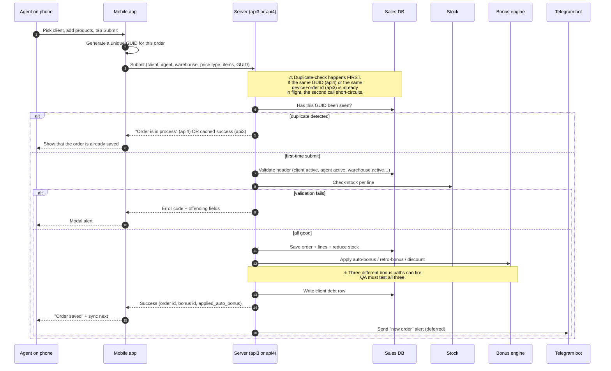

# Create order — mobile (field agent)

## What this feature is for

A **field agent** visits a client, takes the order on the spot, and submits it from the mobile app. The phone may be offline at the moment of taking the order — the app holds the order and submits it later when network returns. The system has to be careful here: it must accept the order exactly once, even if the agent presses Submit twice or the phone retries after a flaky connection.

This page is about orders coming from the mobile app. For desk-based creation, see [Create order — web](./create-order-web.md).

## Who uses it and where they find it

| Role | What they do here | How they get to the screen |
|---|---|---|
| Field agent (4) | Captures most orders during client visits | Mobile app → Visits → Take order |
| Van-selling agent (4 with van-selling enabled) | Same flow, with stock taken directly from the van's warehouse | Mobile app → Visits → Take order |

The customer themselves do **not** use this screen — for B2B online ordering see the online order channel (covered separately).

## Two versions exist — api3 and api4

The mobile app submits orders to one of two server channels: **api3** (the older one) or **api4** (the newer one). Both produce a normal sale order in the system. The differences QA cares about:

| Feature | api3 (older) | api4 (newer) |
|---|---|---|
| Duplicate-submit protection | Tracks the phone's submit attempts in a 20-second window per device | Tracks a unique order ID (GUID) the app generates per order |
| Error returned if a duplicate is detected | The second submit returns the same success response as the first (cached) | The second submit returns *"Order is in process"* |
| Response shape | Older legacy shape | Newer shape including the auto-bonus result |
| When you'll see it | Older app builds | Current app builds |

**Test plans should cover whichever channel the version of the mobile app under test actually uses.** If a tester is running a new build, expect api4; an older test phone may still hit api3.

## The workflow — at a glance

## Step by step

1. The agent finishes the visit's questionnaire, opens **Take order**, picks products and quantities.
2. The agent taps **Submit**.
3. *The mobile app generates a unique order ID (GUID) for this order* and includes it in the submit.
4. *The server checks whether the same GUID (api4) or the same device's order ID (api3) has already been received.* ⛔ If yes — the second call short-circuits and does not save the order twice.
5. *The server validates the header:*
    - Order date format and not past the close date.
    - Client exists and is active.
    - Agent exists and is active.
    - For non-van-selling agents: the expeditor assigned to them is active.
    - Warehouse exists, is active, is a sale-warehouse and is assigned to the agent (van-selling agents see only their van's warehouse).
    - Trade direction exists and is active.
    - Price type exists, is active and is allowed.
6. *The server checks stock per line.* For warehouses with stock-checking disabled, this step is skipped. ⛔ If any line is short, the response is **out of stock** with the offending products.
7. *The server saves the order with status **New***, saves each line, and reduces stock.
8. *The server applies the right bonus path:*
    - **Auto-bonus** — system picks free products from a rule. Triggered when the agent passed `bonus_type=auto` or `manual`.
    - **Retro-bonus** — the agent picked the bonus products manually before submitting. Triggered when the agent passed `bonus_type=retro` with a list of bonus items.
    - **Manual discount** — the agent picked discount entries per line.
9. *The server writes a debt row for the client.* For van-selling and seller agents, when *"debt per order"* is on, a fresh debt row is created; otherwise the running balance is updated.
10. *The server returns success* to the phone (order id, bonus id, whether an auto-bonus was applied).
11. *The mobile app marks the order as synced.*
12. *In the background, the server sends a Telegram alert and forwards the order to external integrations.* Both happen after the response is already sent to the phone.

## What can go wrong (errors the agent sees)

| Trigger | Error code (in the modal alert) | Plain-language meaning |
|---|---|---|
| Same order GUID already submitted (api4) | `ERROR_CODE_ORDER_IS_IN_PROCESS` | A previous tap on Submit is still being processed, or has already saved. The agent should wait and refresh, not re-submit. |
| Order date past the close date | `ERROR_CODE_OUT_OF_CLOSE_DATE` | The order's date is older than the rolling close date (default 21 days). |
| Order date wrong format | `ERROR_CODE_INVALID_DATE_FORMAT` | The app sent an unparseable date. Usually a clock or locale bug on the phone. |
| Client not found | `ERROR_CODE_CLIENT_NOT_FOUND` | Either the client was deleted, or the agent submitted with a stale client id. |
| Client inactive | `ERROR_CODE_CLIENT_NOT_FOUND` (subcode: inactive) | The client was deactivated since the last app sync. |
| Agent not found / inactive | `ERROR_CODE_AGENT_NOT_FOUND` | The agent account was deactivated. |
| Warehouse not found / inactive / wrong type | `ERROR_CODE_WAREHOUSE_NOT_FOUND` | The chosen warehouse is missing, off, or not a sale-warehouse. |
| Price type not found / inactive / wrong type | `ERROR_CODE_PRICE_TYPE_NOT_FOUND` | The chosen price type is no longer valid. |
| Trade direction not found / inactive | `ERROR_CODE_TRADE_NOT_FOUND` | Trade direction is missing or off. |
| Stock too low on at least one line | `ERROR_CODE_OUT_OF_STOCK` (with details) | Each offending product is listed with how many are missing. |
| All lines filtered out (e.g. all zero quantity) | `ERROR_CODE_EMPTY_ORDER` | After validation, no real lines remain. |

## Rules and limits

- **GUID is the duplicate key for api4.** Even if the agent kills the app and resubmits, the same GUID is reused — the second submit returns *"in process"*. Verify this in test cases.
- **api3 uses a 20-second window** per device + mobile order id. Inside that window, the second call is short-circuited; after it expires, a re-submit can create a real duplicate. **This is a known edge case worth testing.**
- **Stock-check disabled warehouses skip the per-line stock check.** This is configured on the warehouse itself. Test on both a stock-checked warehouse and a non-stock-checked one.
- **Van-selling agents are scoped to their own van's warehouse.** The phone should not let them pick another warehouse, but verify the server rejects it if they bypass the UI.
- **The mobile app retries on poor network.** Combined with the duplicate-check rules, a retry should not create a duplicate order. Always test on a throttled network.
- **The price-edit lock applies on mobile too.** Whether the agent can override the price comes from the price type, not the app.
- **Auto-bonus, retro-bonus and discount are independent.** An order can have one, two, all three, or none. Test each combination at least once.
- **The Telegram alert and external integration are fire-and-forget.** A test passing on the phone but failing in Telegram should still mark the test "pass" for the create-order feature — it's a separate channel.

## What to test

### Happy paths

- Agent creates a one-line order on a stock-checked warehouse with available stock — success.
- Agent creates a multi-line order — success.
- Agent creates an order on a van-selling agent's own warehouse — success.
- Agent creates an order on a non-stock-checked warehouse (stock empty) — success (stock check is skipped).
- Agent creates an order whose client/agent/trade matches an auto-bonus rule — success **and** `applied_auto_bonus = true` in the response.
- Agent creates an order with `bonus_type=retro` and a hand-picked list of free items — success.
- Agent creates an order with per-line manual discounts — success and discounts saved.
- Agent submits offline, sync occurs minutes later — success on the first sync.

### Validation failures

- Empty list of products. Expect: `ERROR_CODE_EMPTY_ORDER`.
- Order date 22 days ago (past close date). Expect: `ERROR_CODE_OUT_OF_CLOSE_DATE`.
- Submit with an unknown / deactivated client. Expect: `ERROR_CODE_CLIENT_NOT_FOUND`.
- Submit with a deactivated agent account. Expect: `ERROR_CODE_AGENT_NOT_FOUND`.
- Submit pointing at a deactivated or non-sale warehouse. Expect: `ERROR_CODE_WAREHOUSE_NOT_FOUND`.
- Submit with an unknown trade direction. Expect: `ERROR_CODE_TRADE_NOT_FOUND`.
- Submit with an unknown price type. Expect: `ERROR_CODE_PRICE_TYPE_NOT_FOUND`.
- Submit with one line whose required quantity exceeds stock. Expect: `ERROR_CODE_OUT_OF_STOCK` listing that product.

### Duplicate-submit protection (api4)

- Tap Submit, immediately tap Submit again before the first response returns. Expect: second response is `ERROR_CODE_ORDER_IS_IN_PROCESS`. Only one order exists on the server.
- Kill the app immediately after tapping Submit. Re-open the app and let it resync. Expect: only one order on the server.
- Force a stale GUID (e.g. by replaying a request through a proxy). Expect: second call short-circuits.

### Duplicate-submit protection (api3)

- Tap Submit, immediately tap Submit again. Expect: second response is the cached success of the first; only one order on the server.
- Tap Submit, wait 21+ seconds, tap Submit again. Expect: depending on data, the second call may create a duplicate — flag if it does.

### Role gating

- Agent (4) can submit. ✅
- Verify that an operator (3), expeditor (10), or any other web role cannot reach this API path with their token.
- Verify that an agent from filial A cannot submit on a client / warehouse / agent in filial B.

### Edge cases and data integrity

- Submit on a van-selling agent's van — verify stock came out of the van's warehouse, not the central warehouse.
- Submit on an order whose total triggers an auto-bonus rule whose bonus product is out of stock — verify the bonus is downgraded (the order saves but the bonus is empty or marked as none).
- Submit a retro-bonus where some bonus items are out of stock — verify those items are excluded but the order still saves.
- Throttle the network to 56 kbit/s and submit a 20-line order — verify the app retries cleanly and only one order ends up on the server.
- Submit, then immediately fetch the order from the agent's order list — verify it appears with the same data.

### Side effects to verify

- One new order row with status **New** and source marked as the mobile API.
- One row per product line in the order details.
- Stock at the chosen warehouse has dropped by the ordered quantity (unless the warehouse has stock-check disabled — then stock is unchanged).
- A bonus order exists if and only if the order matched a bonus rule or the agent picked retro-bonus items.
- A client debt row exists with the right amount.
- A Telegram message arrives in the reporting channel within a few seconds.
- A row appears in the order history *"created via api3"* or *"created via api4"*.

## Where this leads next

After creation the order is **New**. The next move is usually changing its status to **Shipped** by the operator at the office — see [Status transitions](./status-transitions.md). If the agent or operator needs to fix something, see [Edit order](./edit-order.md).

## For developers

Developer reference: `docs/modules/orders.md` — see *Workflow 1.3 — Mobile order creation via api3 and debt accumulation*.
