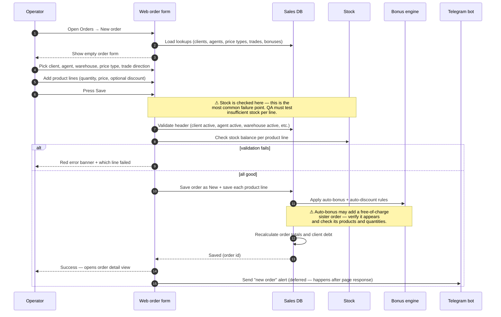

# Create order — web (operator)

## What this feature is for

This is the way an **operator** sitting at a desk in the office builds a customer order from scratch. The operator already has the client on the phone (or an order form on paper), opens the web admin, picks the client, picks the products and submits the order. After this step the order exists in the system as **New**, stock is reserved, and the rest of the lifecycle (shipping, delivery, payment) can begin.

This page is about the **web form** only. If you are testing an order coming from a phone, see [Create order — mobile](./create-order-mobile.md).

## Who uses it and where they find it

| Role | What they do here | How they get to the screen |
|---|---|---|
| Operator (3) | Builds most orders during the day | Web → Orders → **New order** button |
| Operations (5) | Same as operator | Web → Orders → **New order** button |
| Key-account manager (9) | Builds orders for large B2B clients | Web → Orders → **New order** button |
| Admin (1) / Manager (2) | Can also create, but usually don't | Web → Orders → **New order** button |

Field agents (4) and expeditors (10) **do not see** this screen — they create orders from the mobile app.

## The workflow — at a glance

## Step by step

1. The operator opens **Orders → New order**.
2. *The system loads the dropdowns:* clients (active only), agents (active only), price types (active, base price types only), trade directions, available bonuses and manual discounts.
3. The operator picks the **client**, **agent**, **warehouse** (which physical store the goods come from), **price type** and **trade direction**.
4. The operator picks the **order date** and the planned **load date** (when the order will be shipped). ⛔ If the order date is older than the close date, the form refuses to save it.
5. The operator adds product lines one by one. For each line they pick the product, set the quantity, optionally adjust the price (only if the chosen price type allows manual edits), and optionally pick a discount.
6. The operator presses **Save**.
7. *The system validates the header* — client exists and is active, agent exists and is active, warehouse exists and is active, price type and trade direction exist and are active. ⛔ If any of these is missing or inactive, the form rejects the order with the name of the missing item.
8. *The system checks stock* for each product line against the chosen warehouse. ⛔ If any line cannot be filled, the operator sees a red banner listing every offending product and how much is missing. The order is **not** saved.
9. *The system saves the order* as status **New** and saves each product line.
10. *The system applies auto-bonus rules.* If the order matches a bonus rule, a separate "bonus order" is created with the free products and linked to the main order.
11. *The system applies auto-discount rules* and recalculates the order's totals.
12. *The system writes a debt row* for the client (the running balance goes up, or a fresh debt row is created — see *"Debt path forks"* below).
13. *The system records a row in the order history* — *"Order created by [operator] at [time]"*.
14. The operator is redirected to the order detail view, which shows the new order as **New**.
15. *After the response is sent, a deferred Telegram message* announces the new order to the dealer's reporting channel.

## What can go wrong (errors the operator sees)

| Trigger | Error the operator sees | Plain-language meaning |
|---|---|---|
| No product lines | "Order is empty" | Operator pressed Save without adding products. |
| Order date older than close date | "Order date [date] is past the close date [closeDate]" | The order is too old to enter. The close date is rolling and is usually 21 days back. |
| Client missing or inactive | "Client not found" | The chosen client was deleted or deactivated between when the dropdown loaded and when Save was pressed. |
| Agent missing or inactive | "Agent not found" | Same as above, for the agent. |
| Warehouse missing, inactive or wrong type | "Warehouse not found" | The warehouse is gone, deactivated, or is not a sale-warehouse. |
| Trade direction missing or inactive | "Trade direction not found" | Same as above, for trade. |
| Price type missing or inactive | "Price type not found" | The chosen price type is no longer valid. |
| Out of stock | "Insufficient goods in warehouse" + per-product list | One or more lines need more than is available right now. |
| Negative or zero quantity on a line | Form-level field error | The quantity must be a positive number. |
| Manual price set on a line whose price type does not allow it | Form-level field error | The price field should be read-only for that price type. |

## Rules and limits

- **Empty orders are rejected.** Adding zero product lines is a save-time error, not a draft state.
- **Stock is checked at save time, not while the form is open.** Two operators racing to grab the last 5 boxes can both *see* 5 boxes available; whichever presses Save first wins, the other gets an Out-of-stock error.
- **Order date and load date are independent.** The order date is when the customer placed the order; the load date is when the warehouse will ship it. The load date can be later than the order date but the gap is capped — by default 21 days. A gap larger than that is rejected.
- **Close date is a hard wall.** Orders older than the close date cannot be created, edited or saved. The close date is rolling — orders that were editable yesterday may not be editable today.
- **Price-edit lock.** Whether the operator can change the price on a line is decided by the chosen price type. Some price types lock prices; others allow per-line overrides.
- **Auto-bonus and auto-discount happen only if the rule matches.** A test order on a client/agent/trade combination with no matching rule will save fine but will have no bonus and no header discount.
- **Telegram message is best-effort.** If the bot is down, the order still saves successfully — only the message is lost.
- **Debt path forks on agent type.** For most agents, the system *adds* the order amount to the client's running balance. For van-selling agents and seller agents, when the dealer's settings enable "debt per order", the system creates a **fresh debt row per order** instead. Test both flavours if your dealer has van-selling agents.

## What to test

### Happy paths

- Operator builds a one-line order, presses Save, lands on the order detail view with status **New**.
- Operator builds a multi-line order with three different products, all with stock available.
- Operator picks a client/agent/trade combination that matches an auto-bonus rule — verify the bonus order is created and linked.
- Operator picks a discount on a line — verify the line total reflects the discount and the order total too.
- Operator sets the load date to today, three days ahead, and exactly the maximum-allowed gap (default 21) — all three should save.

### Validation failures

- Empty order. Expect: *"Order is empty"*.
- Order date 22+ days ago (past the default close date). Expect: *"Order date past close date"*.
- Load date earlier than order date. Expect: rejection with a date-gap message.
- Load date more than the maximum-allowed gap (21 days by default) after order date. Expect: rejection.
- Pick a client, then deactivate the client in another tab, then press Save. Expect: *"Client not found"*.
- Same exercise for agent, warehouse, price type, trade direction.
- Add a line with quantity = 0. Expect: field error.
- Add a line whose product has zero stock. Expect: out-of-stock banner naming that product.
- Add two lines for the same product, total > available stock. Expect: out-of-stock banner.
- Race condition: open two forms with the same product, save both. Expect: second one rejected with out-of-stock.

### Role gating

- Operator (3) can open the form and save. ✅
- Operations (5) can open the form and save. ✅
- Key-account manager (9) can open the form and save. ✅
- Manager (2) and Admin (1) can also save (usually they don't, but the screen should accept it).
- Agent (4) and Expeditor (10) — verify the **New order** button is hidden or the URL is blocked.
- A user from a different filial — verify they cannot see clients/agents/warehouses from this filial.

### Edge cases and data integrity

- Save an order, then immediately re-open it from the orders list — verify all fields, lines, discount and totals are as entered.
- Save an order on a client that already has unpaid debt — verify the new order amount is reflected in the client's running balance.
- Save an order on a van-selling agent (if any) — verify a fresh debt row was created, not a running-balance update.
- Save an order, then check the order history — there must be one row *"created"*.
- Save an order with an auto-bonus, then look at the bonus order — verify both orders share the same parent ID and the bonus is marked accordingly.
- Save an order with a manual price override on a price-type that does not allow it — verify the form blocks the save.
- Save an order in filial A, then log in as a user of filial B — verify the order is invisible.

### Side effects to verify

- New row in the orders table.
- One row per product line in the order details.
- One row in the order history.
- Client debt row exists and has the right amount (either a new row or the running balance updated, depending on agent type).
- Stock on the chosen warehouse has dropped by the ordered quantity.
- If a bonus rule matched, a separate bonus order exists, the parent order is linked to it, and the bonus order's stock has also been deducted.
- A Telegram message arrives in the dealer's reporting channel within a few seconds (best-effort).

## Where this leads next

After creation the order is **New**. The next move is usually changing its status to **Shipped** — see [Status transitions](./status-transitions.md). If the operator needs to fix something before shipping, see [Edit order](./edit-order.md).

## For developers

Developer reference: `docs/modules/orders.md` — see *Workflow 1.1 — Web order creation*.
