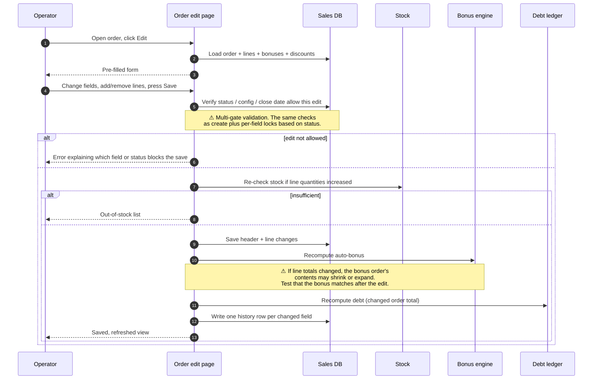

# Edit an existing order

## What this feature is for

After an order has been created, the operator may need to change it: add or remove a product line, fix a quantity, change the client or agent, adjust dates, apply a discount that was forgotten. This page covers **editing the contents** of an order from the web admin — not status changes (those are on [Status transitions](./status-transitions.md)).

Editing has cascading effects: line totals recalculate, the bonus order may shrink or grow, the client's debt is recomputed, and a row is added to the order history for every changed field. Some fields are locked depending on the order's current status — for example, you usually cannot change the line items of a Delivered order without first re-opening it to New.

## Who uses it and where they find it

| Role | What they do here | How they get to the screen |
|---|---|---|
| Operator (3) | Routine edits during the day | Web → Orders → click an order → **Edit** |
| Operations (5) | Same | Same |
| Key-account manager (9) | Edits on B2B orders | Same |
| Manager (2), Admin (1) | Can also edit | Same |
| Agent (4), Expeditor (10) | Cannot edit orders from the web | — |

## What you can edit, and when

The set of editable fields depends on the order's status. The dealer's configuration may further lock fields with these settings:

- **`denyEditOnDeliver`** — when on, the order is read-only once it reaches Delivered. Default behaviour for many dealers.
- **`denyEditOnSent`** — when on, the order is read-only once it reaches Shipped.
- **`denyEditOnCancelOrReturn`** — when on, the order is read-only once Cancelled or Returned.

| Field | New | Shipped | Delivered | Returned | Cancelled |
|---|---|---|---|---|---|
| Client | ✅ | depends on `denyEditOnSent` | depends on `denyEditOnDeliver` | usually no | usually no |
| Agent | ✅ | depends on `denyEditOnSent` | depends on `denyEditOnDeliver` | usually no | usually no |
| Expeditor | ✅ | ✅ | depends | usually no | usually no |
| Warehouse | ✅ | depends on `denyEditOnSent` | usually no | usually no | usually no |
| Price type | ✅ | ✅ | depends | usually no | usually no |
| Order date / load date | ✅ | ✅ | usually no | usually no | usually no |
| Product lines (add/remove/qty/price) | ✅ | ✅ | depends on `denyEditOnDeliver` | no | no |
| Manual discount on a line | ✅ | ✅ | depends | no | no |
| Bonus order content | ✅ (status New or Shipped) | ✅ | no | no | no |

If the order is older than the **close date** (default 21 days back), **no fields are editable** regardless of status.

## The workflow — at a glance

## Step by step

1. The operator opens the order's detail view and clicks **Edit**.
2. *The system loads the order, its lines, bonuses and discounts* into the edit form.
3. The operator makes changes — adds or removes product lines, changes quantities or prices (within what the price type allows), edits the client / agent / warehouse if the order's status allows.
4. The operator presses **Save**.
5. *The system runs the same header validations as create*: client active, agent active, warehouse active, price type active, trade direction active.
6. *The system enforces per-field locks based on the order's status* and the dealer's `denyEditOn*` settings. ⛔ Trying to change a locked field returns an error.
7. *The system enforces the close-date rule.* ⛔ Orders older than the close date cannot be saved at all.
8. *The system re-checks stock* for any line whose quantity increased or any new line. ⛔ Out-of-stock results in a per-product list.
9. *The system saves the edited order and lines.*
10. *The system recomputes the order's totals* — count, sum, volume, discount totals.
11. *The system recomputes the bonus order*, if any.
12. *The system recomputes the client's debt.* If the order's total went up, debt goes up; if it went down, debt drops.
13. *The system appends one row to the order history per changed field* — *"client changed"*, *"line added"*, *"quantity changed on line X"*, etc.

## What can go wrong (errors the operator sees)

| Trigger | Error message | Plain-language meaning |
|---|---|---|
| Trying to edit an order older than the close date | "Order date [date] is past the close date [closeDate]" | Read-only because of age. |
| Trying to change a field that's locked at the current status | Field-level error or banner naming the field | The dealer's settings forbid editing this field at this status. |
| Inactive client / agent / warehouse / price type / trade direction picked | "[Entity] not found" | The chosen item was deactivated between form load and save. |
| Quantity bumped up but stock unavailable | "Insufficient goods in warehouse" + product list | Same as on create. |
| Manual price set on a line whose price type forbids it | Field-level error | The price field should have been read-only. |

## Rules and limits

- **Editing creates history rows for every changed field.** This is intentional and provides the audit trail QA can rely on. Always include "verify history rows" in test plans.
- **Recalculation cascades.** A line edit can change the order total, which changes the auto-bonus (because the bonus rule may depend on threshold), which changes stock again (because the bonus order's items are also stocked). Test plans must verify the **whole chain**.
- **Re-opening a Delivered / Returned / Cancelled order is allowed** by moving status back to **New** first — see [Status transitions](./status-transitions.md). After that the full edit form is available.
- **Bonus orders may need a separate edit screen.** Inline edits on the parent order do not always update the bonus order's contents — see [Bonuses](./bonuses.md) for the manual bonus edit flow.
- **Manual discounts have a sticky flag.** A line that had a manual discount keeps its manual flag through the edit; recalculation honours the per-unit manual amount.
- **Changing the client.** Re-pointing an order to a different client must update the debt — the old client's debt drops, the new client's debt rises. Test this carefully.

## What to test

### Happy paths

- Edit a New order: change quantity on one line. Verify totals, debt and history update.
- Edit a New order: add a new line. Verify stock for the new line is reserved, totals update.
- Edit a New order: remove a line. Verify stock for the removed line is released.
- Edit a Shipped order: change the load date by a couple of days (within the gap limit). Verify save succeeds and history records it.
- Re-open a Delivered order to New, edit the line price, re-ship. Verify the whole chain works and history records each step.

### Field-lock checks

- With `denyEditOnDeliver` on, try to edit lines on a Delivered order. Expect: rejected.
- With `denyEditOnSent` on, try to change the warehouse on a Shipped order. Expect: rejected.
- With `denyEditOnCancelOrReturn` on, try to edit a Cancelled order. Expect: rejected.
- With all three off, verify edits are accepted on all four end states.

### Date and close-date checks

- Edit an order whose date is exactly at the close-date boundary (21 days back). Expect: success.
- Edit an order one day older than the close date. Expect: rejection.
- Change the load date to be earlier than the order date. Expect: rejection.

### Stock checks

- Bump a line quantity from 5 to 10 on a product with 7 in stock. Expect: out-of-stock error citing this product.
- Bump a line quantity from 5 to 10 on a warehouse with stock-check disabled. Expect: success regardless of stock.
- Remove a line then add it back at a smaller quantity. Verify stock is correctly returned and re-deducted.

### Bonus and discount recalculation

- Edit a line whose change crosses the threshold that triggered an auto-bonus. Verify the bonus is added or removed accordingly.
- Edit a line that had a manual discount. Verify the discount survives the edit.
- Edit a line that was the *bonus-triggering line*. Verify the bonus order updates appropriately.

### Client change

- Change the client on a New order. Verify old client's debt drops and new client's debt rises by the order amount.
- Change the agent. Verify the order is now visible to the new agent on the mobile app's history if applicable.

### Role gating

- Operator, Operations, Key-account — can edit. ✅
- Manager and Admin — can edit. ✅
- Agent (4) and Expeditor (10) — verify the **Edit** button is hidden or the URL is blocked.
- Filial isolation — a user from filial A cannot edit an order from filial B.

### Side effects to verify

- One history row per changed field — including before and after values where applicable.
- Order totals (count, sum, volume) reflect the edit.
- Bonus order's contents (if any) reflect the edit.
- Client debt reflects the edit.
- Stock reflects the edit.

## Where this leads next

- For status changes, see [Status transitions](./status-transitions.md).
- For the audit trail of what changed, see [Order list & history](./order-list-and-history.md).

## For developers

Developer reference: `docs/modules/orders.md` — see *Order lifecycle* and *Order model hook behaviors*.
