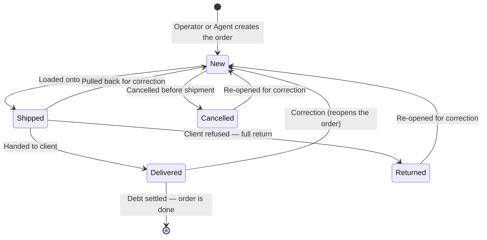

# Orders module — QA test guide

> **Who this is for.** Members of the QA team who need to write test cases for the Orders module without reading the source code. Every page in this guide is written in business language, anchored in workflow diagrams, and ends with a starter checklist of test scenarios.
>
> **Who this is *not* for.** Developers wanting to trace code paths — go to the developer guide at `docs/modules/orders.md` for controllers, models and line numbers.

---

## What the Orders module does, in one paragraph

The Orders module is the heart of sd-main. It captures every sale: the operator builds an order on the web, the field agent submits one from a mobile phone, or a B2B customer self-serves online. The module prices each line, validates stock and limits, moves the order through its lifecycle (**New → Shipped → Delivered**), records defects and returns on delivery, books the resulting debt against the client, and notifies all the right people along the way.

Almost every test plan you write for sd-main will touch this module — either directly (creating, editing or shipping orders) or indirectly (reports, payments, debts and bonuses all depend on orders existing in the right state).

---

## How to use this guide

Each feature has its own page. Read the **index page first** (this page), then jump into the feature you need to test.

| When you want to test… | Open this page |
|---|---|
| An operator creating an order in the web admin | [Create order — web](./create-order-web.md) |
| A field agent submitting an order from the mobile app | [Create order — mobile](./create-order-mobile.md) |
| Moving an order from New to Shipped to Delivered (or cancelling it) | [Status transitions](./status-transitions.md) |
| Marking some items as defective after delivery | [Partial defect](./partial-defect.md) |
| Returning the whole order back to stock | [Whole-order return](./whole-return.md) |
| Editing an existing order's lines, price or client | [Edit order](./edit-order.md) |
| The expeditor entering cash collected on delivery | [Mobile payment](./mobile-payment.md) |
| Anything to do with discounts (per-line, header, manual or auto) | [Discounts](./discounts.md) |
| Auto-bonus, retro-bonus, manual bonus editing | [Bonuses](./bonuses.md) |
| Verifying that marking codes (CIS) on goods are valid | [CIS code check](./cis-code-check.md) |
| Filtering the orders grid and reading the change history | [Order list & history](./order-list-and-history.md) |

---

## Glossary — the words and numbers you will see in screenshots, logs, and bug reports

### Order statuses

The order moves through five named statuses. Internally the system stores them as numbers; you will see those numbers in logs and database tools. **Always use the name in test cases.**

| Stored number | Name we use in tests | What it means |
|---|---|---|
| 1 | **New** | Order is captured but not yet sent out for delivery. Stock is reserved. |
| 2 | **Shipped** | Order has been loaded onto a vehicle and is on the way to the client. |
| 3 | **Delivered** | Goods have been handed to the client. Money may or may not have been collected. |
| 4 | **Returned** | The whole order came back to stock — usually because the client refused it. |
| 5 | **Cancelled** | Order was cancelled before shipment. Stock is released. |

There is also a **sub-status** — a finer-grained reason layered on top of the main status (e.g. *"awaiting cashier"* on a Delivered order). Sub-status options are configured per dealer and may be empty.

### Order types

Almost every order in the system is **Type 1 — Sale**. You will occasionally see:

| Stored number | Name we use | When it appears |
|---|---|---|
| 1 | Sale | The default. A normal customer order. |
| 2 | Recovery / shelf return | Goods coming back from a client to be put back on the shelf. |
| 3 | Defect order | A replacement order created from a defect record. |

### User roles

| Role number | Name | Where they work |
|---|---|---|
| 1 | Admin | Full access. Web admin. |
| 2 | Manager | Web admin. Approves orders, runs reports. |
| 3 | Operator | Web admin. Builds and edits orders all day. |
| 4 | Agent (field rep) | Mobile app. Visits clients and submits orders. |
| 5 | Operations | Web admin. Similar to operator. |
| 9 | Key-account manager | Web admin. Handles large B2B accounts. |
| 10 | Expeditor | Mobile/driver. Delivers orders and collects cash. |

### Common terms

| Term | What it means in plain language |
|---|---|
| **Filial** | A branch / sub-company under a dealer. Each filial has its own clients, agents, stock and orders. |
| **Close date** | A rolling cut-off date — by default 21 days back from today. Orders older than the close date are read-only: status, totals and lines cannot be changed. |
| **Price type** | A named price list (e.g. *"Retail UZS"*, *"Wholesale USD"*). Decides which price each product line uses. |
| **Trade direction** | A business segment or channel (e.g. *"HoReCa"*, *"Pharmacy"*, *"Modern Trade"*). |
| **Defect store** | A separate warehouse where defective/returned goods are parked. Only used if the expeditor has one configured. |
| **Bonus order** | A free-of-charge sister order linked to a main order. The line items are the "free gift" products. |
| **Retro-bonus** | A bonus where the agent **picked the bonus products manually** at order time. |
| **Auto-bonus** | A bonus where the system **picked the bonus products from a rule**. |
| **CIS code** | A unique mark printed on certain regulated goods (tobacco, alcohol, water…) that the state's *XTrace* system tracks. |
| **GUID** | A unique ID the mobile app generates for each order before sending it. Used to detect duplicate submissions. |
| **Cashbox** | A named till / payment channel (cash, card terminal, bank account). |

---

## The big picture — order lifecycle

This is the master state diagram for any order. Every QA test plan should start by checking *which arrow am I testing?*

Notice that **every status can be re-opened back to New**. This is intentional — the system supports correcting mistakes — but it's also a common QA gap: re-opening an order has side effects (debt is recalculated, stock is restored, history grows). Always include a "re-open after change" test case when you cover any status transition.

---

## Where the work happens

| Surface | Who is on it | What they can do here |
|---|---|---|
| Web admin (`/orders`) | Operator, Manager, Admin, Key-account | Build orders, edit them, change status, mark defects, view history, run lists |
| Mobile app for agents | Field agent | Capture orders during a visit, look up own orders, retry submissions |
| Mobile app for expeditors | Expeditor | Record cash collected from the client on delivery |
| B2B online portal | The client themselves | Self-service orders |
| Background jobs | Nobody | CIS code validation, deferred Telegram alerts, deferred integrations |

---

## When something is wrong, what does the user actually see?

Three different error styles appear depending on where the user is. Recognising them helps QA write the right "expected result" in a test case.

| Surface | What the user sees on error |
|---|---|
| Web form | A red banner at the top of the form or a red message under the offending field. The form is **not** submitted. |
| Mobile app | A modal alert with an error code (e.g. *"ERROR_CODE_OUT_OF_STOCK"*) and a list of offending products. Order is **not** saved on the phone yet. |
| Background job | No user sees anything in real time. The order's CIS status (or similar field) is updated; the dealer support team is expected to monitor it. |

The "errors the user sees" table on each feature page lists the exact text by surface so QA can copy it into expected-result fields.

---

## What every QA test case should record

For each scenario you run from these pages, the test case should capture:

1. **Pre-conditions** — which filial, role, what data must already exist (e.g. an active client, an active price type, stock on hand).
2. **Steps** — the user-visible steps from the *Step by step* section of the feature page.
3. **Expected primary result** — what the user sees.
4. **Expected side effects** — debt updated, stock moved, history row appended, notification fired (yes/no). The feature pages list these explicitly.
5. **Cleanup** — what state the test leaves the data in (cancel the order? leave it New?).

---

## For developers

The matching developer-facing doc is `docs/modules/orders.md` — that file has controller names, line numbers, model hooks, and links to the FigJam state machine board.
