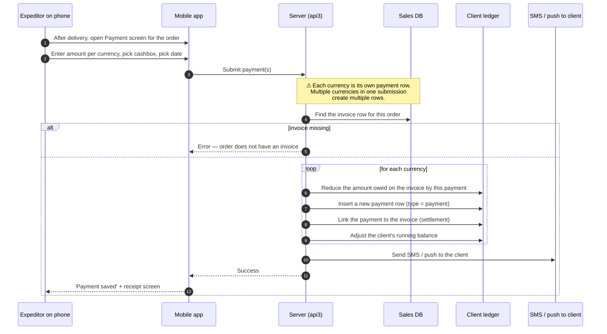

# Mobile payment — cash collected on delivery

## What this feature is for

The expeditor drops off the order at the client's place. The client pays — in cash, in different currencies, or via card. The expeditor records the payment on the mobile app, picks which till (cashbox) the money is going into, and submits. The system reduces the client's debt for that order, records a payment row in the ledger, and pushes a notification to the client.

This is the only feature in the Orders module that touches **money** (as opposed to debt). It's small but critical — bugs here mean either money goes missing in the ledger, or the client is wrongly notified that they paid when they didn't.

## Who uses it and where they find it

| Role | What they do here | How they get to the screen |
|---|---|---|
| Expeditor (10) | Records cash / card payment collected from the client | Mobile app → Delivery → Payment |
| Field agent (4) | If the agent also acts as expeditor (van-selling), same flow | Same |

Web users do **not** use this mobile screen. Payments entered on the web go through a different module — see the Payment module docs.

## The workflow — at a glance

## Step by step

1. The expeditor finishes the delivery on the mobile app.
2. The expeditor opens the **Payment** screen for the order.
3. The expeditor enters the amount(s) the client paid. If the client paid partly in different currencies (e.g. UZS plus USD), each currency is entered separately.
4. The expeditor picks the **cashbox** (which till / channel the money is going into) and the **payment date**.
5. The expeditor presses **Save**.
6. *The server looks up the invoice for this order.* ⛔ If no invoice exists for the order, the call fails.
7. *For each currency the client paid in:*
    - *The server reduces the amount owed on the invoice* by the payment amount in that currency.
    - *The server inserts a new payment row* in the client ledger — type = payment, with the cashbox, date and expeditor recorded.
    - *The server links the payment to the invoice* (settlement). If the client overpaid, the surplus is tracked separately.
    - *The server recomputes the client's running balance.*
8. *The server sends an SMS or push notification* to the client telling them their payment was recorded.
9. *The server returns success* to the phone.

## What can go wrong (errors the expeditor sees)

| Trigger | Error | Plain-language meaning |
|---|---|---|
| Order has no invoice row | Generic save failure | The order's debt was never created — usually means the order's status never moved past New, or a data inconsistency. |
| Amount = 0 or negative | Form-level error on phone | The amount field accepts only positive numbers. |
| Currency not configured for the dealer | Save failure | The currency code submitted is unknown. |
| Cashbox missing or not assigned to the expeditor | Save failure | The chosen cashbox was deactivated or doesn't belong to this expeditor. |
| Server cannot reach the SMS / push provider | Payment saves successfully, but no message arrives | This is fire-and-forget. The payment is recorded even if notification fails. |

## Rules and limits

- **One payment can cover multiple currencies.** A single submission may produce several payment rows in the ledger — one per currency. Test plans must check the row count.
- **Payment date is what the expeditor enters**, not the time the server received the submission. This matters for reports.
- **Cashbox assignment matters.** An expeditor can usually only pay into their own cashbox. Test that they cannot point a payment at a stranger's cashbox.
- **Overpayment is tracked, not refunded.** If the client pays more than the order owes, the surplus is recorded; it can later settle other invoices for the same client. The expeditor does **not** see a "you've overpaid" error.
- **The notification is best-effort.** A failed SMS or push does not roll back the payment.
- **Re-submitting the same payment.** The phone may retry. The server does not have a strong dedup for payments — a retry **can** create a duplicate. Test plans should call out this gap explicitly.
- **Currency must match the dealer's allowed currencies.** Submitting a payment in a currency the dealer doesn't accept will fail.

## What to test

### Happy paths

- Expeditor delivers a Delivered order, enters the full amount due in UZS, picks their cashbox, saves. Expect: invoice closed, payment row inserted, client debt drops to zero, SMS sent.
- Same but in USD on a USD-priced order.
- Partial payment: client owed 1,000,000 UZS, pays 600,000 UZS. Expect: invoice reduced, payment row inserted for 600,000, remaining 400,000 stays owed.
- Multi-currency: client pays 500,000 UZS + 50 USD on the same order. Expect: two payment rows in the ledger, both linked to the same order.
- Overpayment: client owed 1,000,000 UZS, pays 1,200,000 UZS. Expect: invoice closed, payment row for 1,200,000 inserted, 200,000 tracked as overpayment / credit.

### Validation failures

- Submit amount = 0. Expect: phone-side rejection.
- Submit a negative amount. Expect: rejection.
- Submit on an order that does not have an invoice (e.g. status still New). Expect: save failure.
- Submit on a deactivated cashbox. Expect: failure.
- Submit on a currency the dealer doesn't accept. Expect: failure.

### Role and ownership checks

- Expeditor A tries to submit a payment pointing at expeditor B's cashbox. Expect: failure (or the system silently uses expeditor A's cashbox — verify and flag if wrong).
- An expeditor from filial A submits on an order from filial B. Expect: failure.
- A web user tries to call this mobile API path directly. Expect: failure.

### Idempotency and retry tests

- Submit once, immediately tap Submit again. Verify whether the server creates a duplicate payment row. **If yes, this is a known limitation worth a bug ticket.**
- Submit on a flaky network where the phone retries. Verify whether two payment rows appear.
- Save in airplane mode (queued by the phone), turn airplane mode off, watch the phone retry. Verify exactly one payment lands.

### Notification

- Save a payment, verify the client receives an SMS or push within a few seconds.
- Disable the SMS provider for the dealer, save a payment, verify the payment is still recorded.
- Save a payment, verify the SMS message contains the correct order ID, amount and currency.

### Audit and side effects

- One new payment row per currency in the ledger, linked to the order's invoice.
- The order's invoice row's amount-due has dropped by the payment amount.
- The client's running balance reflects the payment.
- The cashbox's running total has increased by the payment amount.
- The order's history mentions the payment (or the linked records do).

## Where this leads next

- The status of the order itself is unchanged by payment — it stays **Delivered**. To close it out fully, see [Status transitions](./status-transitions.md).
- To see a client's running debt and payment history, the Finans / Payment module is the right reference.

## For developers

Developer reference: `docs/modules/orders.md` — see *Workflow 1.3* (the debt-row insert section).
