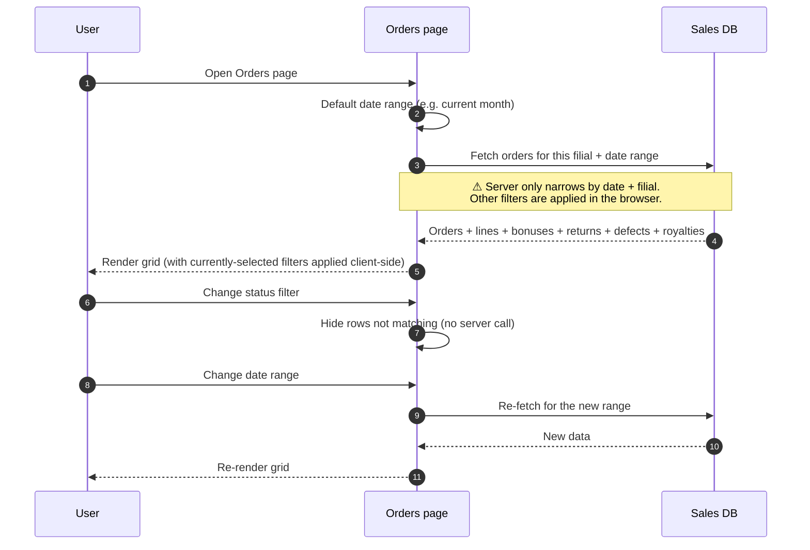

# Order list and order history

## What this feature is for

The **orders list** is the main grid users see when they open the Orders module — every order they're allowed to see, with filters by date, status, agent, client, city and price type. The **order history** is the per-order audit trail that records every field that ever changed on an order, by whom and when. Together these two screens are how non-creators (managers, support, compliance) work with orders day-to-day.

This page covers test coverage for both screens, with emphasis on **role-based visibility** (different roles see different orders) and **history correctness** (every change recorded should produce exactly one history row).

## Who uses it and where they find it

| Role | What they do here | How they get to the screen |
|---|---|---|
| Operator (3), Operations (5) | Browse the list to find orders to edit / ship | Web → Orders |
| Manager (2) | Browse the list to monitor team output | Web → Orders |
| Admin (1) | All orders, all filials | Web → Orders |
| Key-account (9) | Browse B2B orders | Web → Orders |
| Compliance / support | Filter by CIS status, defect, return | Web → Orders + filter chips |
| All web roles | Inspect the per-order history | Click an order → **History** tab |

Agents (4) and Expeditors (10) see a different, mobile-only view of *their own* orders — that view is part of the mobile app, not this screen.

## The list — what's on it

The grid shows one row per order. Columns the user can see:

- Order number
- Date and load date
- Client name / city
- Agent
- Warehouse
- Status (with sub-status badge if any)
- Total amount
- Total volume
- Debt remaining
- Defect / Bonus / Return flags
- CIS status

The dealer can configure which columns appear via the *custom views* feature (CVID). QA does not need to test every column combination, but should test at least the default view.

## Filtering — server-side vs client-side

This is an important distinction for QA:

| Filter | Where it's applied |
|---|---|
| **Date range** (from / to) | **Server-side** — the SQL only fetches orders in this range |
| **Order ID search** | **Server-side** |
| **Status, agent, client, city, price type** | **Client-side** — the page fetches the full date-range and filters in the browser |

This means:

- Wide date ranges can fetch a lot of data — the grid may feel slow.
- Status / agent filters do **not** reduce the data that crosses the network; they only hide rows visually.
- When testing for permission leaks, **always test the server-side date filter as the boundary** — the client-side filters are not security boundaries.

## The workflow — at a glance

## Order history — what gets recorded

Every save of an order writes one or more rows to the history. The system tracks:

- Order creation (one row, *"created by"*).
- Status changes (*"from X to Y"*).
- Any change to client, agent, expeditor, warehouse, price type.
- Any change to dates (order date, load date, delivered date).
- Any change to the line set (lines added / removed / quantity / price / discount changed).
- Defect declarations (each defect is a row).

Each history row carries:

- The actor (which user saved the change).
- The timestamp.
- The before-and-after values.
- The field name that changed.

## Step by step — using the list

1. The user opens **Orders**.
2. *The page picks a default date range* (typically the current month).
3. *The system fetches every order in the user's filial that falls inside the date range*, plus related details (lines, bonuses, defects, returns, royalties, debt).
4. *The page renders the grid* with default columns and any saved filter preferences.
5. The user changes filters (status, agent, etc.). *The grid hides rows on the fly* — no extra server call.
6. The user changes the date range. *The page re-fetches* for the new range.
7. The user clicks any order to drill into its detail and history.

## Step by step — viewing history

1. The user opens an order's detail page.
2. The user clicks the **History** tab.
3. *The page loads the audit trail*: status changes, field edits, line edits, defects.
4. *The page renders a timeline*: most recent at top, with actor name, timestamp and the before/after values.

## What can go wrong (errors the user sees)

| Trigger | Symptom | Plain-language meaning |
|---|---|---|
| Date range too wide on a busy dealer | Slow page; possible time-out | The query had to fetch too many rows. |
| User from filial A loads page, expects to see filial B's orders | Empty grid (filtered out by filial scoping) | Working as designed — filial isolation. |
| Order's history is missing an expected row | (No error, but the row is missing) | A change happened that didn't trigger a history write — flag as a bug. |
| Default columns out of sync with the dealer's CVID config | Wrong columns visible | The dealer's saved view is outdated. |

## Rules and limits

- **The page is filial-scoped by default.** A user only sees orders from filials they have access to. Admin users see all.
- **Date range is the only server-side narrowing.** Other filters do not protect against permission issues — never rely on a client filter to hide an order from a user.
- **The history is append-only.** Past rows are never edited or deleted — only new rows are written.
- **A re-opened order's history grows, it does not reset.** A Returned → New → Shipped cycle produces 2+ history rows, all visible.
- **History row counts are predictable.** Each field that changes produces exactly one row. QA test plans should specify the expected row count after each action.
- **Permissions to edit are checked separately** for each row's action buttons. The grid loads all orders the user can see, then individually hides Edit / Status buttons per row.

## What to test

### List filtering

- Open the page with a default date range. Verify the grid loads.
- Set the date range to today only. Verify only today's orders show.
- Set the date range to last 90 days. Verify the grid loads (test for performance regression too).
- Apply the status filter for **New**. Verify only New orders show — and confirm this is a client-side filter (the data fetched is unchanged).
- Apply the agent filter for one agent. Verify the visible rows.
- Search by order ID. Verify a single row shows.
- Reset all filters. Verify the full date-range data is back.

### Role-based visibility

- Operator (3) in filial A — verify they see only filial A's orders.
- Manager (2) with access to two filials — verify they see both filials' orders.
- Admin (1) — verify they see all filials.
- Key-account (9) — verify scope per their access definition.
- Compliance — verify they can filter by CIS status.

### History — basic

- Create an order. Open History — verify exactly one row: *"created"*.
- Change status from New to Shipped. Open History — verify a new row: *"status changed from New to Shipped"*.
- Change the load date. Verify a new row recording the before / after dates.
- Change the client. Verify a row recording the before / after clients.
- Add a line to the order. Verify a row recording the line addition.
- Remove a line. Verify a row recording the line removal.
- Change the quantity on a line. Verify a row recording the before / after quantity.

### History — combined changes

- In one Save, change three fields (client, load date, line quantity). Verify three rows in the history, each naming its field.
- Mark two lines as defective in a single Save. Verify the history reflects both defects.

### History — re-open cycles

- Create order → ship → deliver → re-open to New → re-ship → re-deliver. Verify the history shows the full chain (at least 5–6 rows).
- Return order → re-open to New. Verify the history shows both events.

### Edge cases

- Open an order with no history rows (i.e. a freshly created order). Verify the history tab shows one row.
- Open an order from another filial directly via URL hack. Verify the page rejects or redirects.

### Side effects to verify

- After any change, exactly the expected history rows appear.
- After re-opening / re-shipping, the history grows; it does not reset.
- Filtering by date range works correctly at the boundaries (first day, last day inclusive).

## Where this leads next

- For each specific kind of change, see the relevant feature page — [Edit order](./edit-order.md), [Status transitions](./status-transitions.md), [Partial defect](./partial-defect.md), [Whole-order return](./whole-return.md).
- For CIS status filtering and what each value means, see [CIS code check](./cis-code-check.md).

## For developers

Developer reference: `docs/modules/orders.md` — see *Workflows* (web order list view) and the *Key entities* table (OrderStatusHistory).
