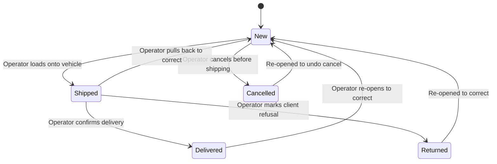
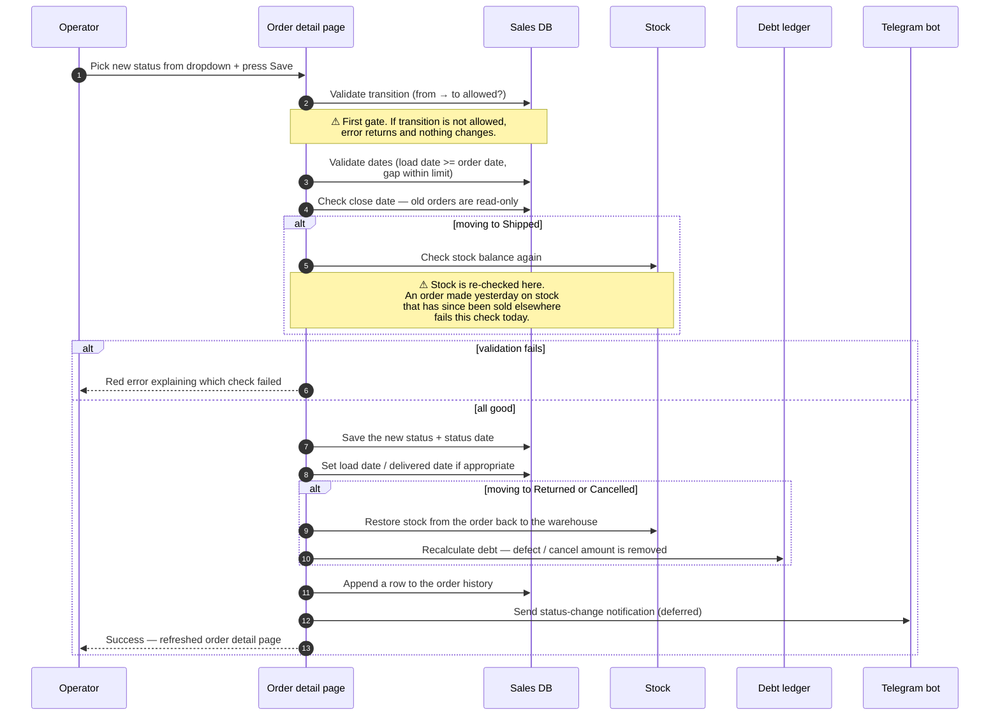

# Order status transitions

## What this feature is for

Every order starts as **New** and ends either **Delivered** (with debt settled) or **Cancelled**. In between, the status moves through stages — *Shipped*, *Delivered*, *Returned* — that drive what users are allowed to do next. The status itself is just a label, but moving the status triggers a chain of side effects: stock movement, debt updates, history rows, and notifications. **Most QA bugs in the Orders module are status-transition bugs**, so this feature gets very careful test coverage.

This page covers **moving the status of one order at a time** through the web admin. (Bulk status changes use a similar flow but suppress some notifications — covered separately in Phase 2.)

## Who uses it and where they find it

| Role | What they do here | How they get to the screen |
|---|---|---|
| Operator (3) | Routine status changes during the day | Web → Orders → click an order → status dropdown |
| Operations (5) | Same as operator | Same |
| Manager (2) | Approves, corrects, cancels | Same |
| Admin (1) | Full access | Same |
| Key-account manager (9) | Status changes on B2B orders | Same |
| Agent (4), Expeditor (10) | **Do not** see this. They cannot change order status from the mobile app. | — |

## What transitions are allowed

The system enforces the table below. **Any transition not on this table is rejected with an error.**

| From | → To | What this means in business language |
|---|---|---|
| **New** | **Shipped** | The warehouse has loaded the goods and is sending them out. |
| **New** | **Cancelled** | The order is cancelled before shipment (client changed their mind, mistake, etc.). |
| **Shipped** | **Delivered** | The expeditor confirmed handover to the client. |
| **Shipped** | **Returned** | The client refused the whole delivery — everything goes back to stock. |
| **Shipped** | **New** | A correction — the operator pulls the order back to fix something. |
| **Delivered** | **New** | A correction after delivery — re-opens the order. |
| **Returned** | **New** | The return is being re-opened to correct it. |
| **Cancelled** | **New** | The cancellation is being undone. |

**Not allowed** (the system will reject these):

- New → Delivered (must pass through Shipped first).
- New → Returned (the order must have been Shipped to be Returned).
- Delivered → Shipped, Delivered → Returned, Delivered → Cancelled.
- Returned → anything except New.
- Cancelled → anything except New.

## The workflow — at a glance

## The workflow — what happens on the wire

## Step by step (for any single-order status change)

1. The operator opens the order's detail page.
2. The operator picks the new status from the status dropdown and presses **Save**.
3. *The system checks the transition is allowed* using the table above. ⛔ If not, the error is *"Cannot change order status"*.
4. *The system checks dates:* the load date may not be earlier than the order date, and the gap between the two cannot exceed the configured limit (default 21 days). ⛔ If a date is out of range, the operator sees the corresponding date error.
5. *The system checks the close date.* ⛔ Orders older than the close date cannot have their status changed. The error names the order date and the close date so the operator can see the gap.
6. **If the new status is Shipped:** *the system re-checks stock per line.* ⛔ If any product is no longer available in the warehouse, the operator sees *"Insufficient goods in warehouse"*.
7. *The system saves the new status and the status-change date.*
8. **If the new status is Shipped:** the load date is set to today (or the user's chosen date).
9. **If the new status is Delivered:** the delivered date is set.
10. **If the new status is Returned or Cancelled:** *the system writes back stock* — the ordered quantities return to the warehouse — and the client's debt is reduced accordingly.
11. **If the status is moved from Returned / Cancelled back to New:** *the system removes the defect-or-cancel mark* on each line and restores the order's totals as if it were a fresh New.
12. *The system appends a row to the order history* — *"status changed from X to Y by [user]"*.
13. *After the response is sent*, a Telegram notification fires (unless this was part of a bulk operation).

## What can go wrong (errors the operator sees)

| Trigger | Error message | Plain-language meaning |
|---|---|---|
| Transition not in the allowed table | "Cannot change order status" | Tried e.g. *New → Delivered* directly. |
| Load date < order date | "Load date cannot be earlier than order date" | The load date moved backwards in time. |
| Load date too far from order date | "Gap between order date and load date cannot exceed [N] days" | Default 21. If set to 0 in the dealer's settings, the gap check is disabled. |
| Order date past close date | "Order date [date] is past the close date [closeDate]" | The order is too old to touch. |
| Moving to Shipped, stock too low | "Insufficient goods in warehouse" (per-product list) | Stock has been consumed by other orders since this order was created. |
| Order is locked by a pending filial-order decision | "Order is waiting for dealer acceptance / rejection" | A primary-sale "filial order" is still pending — only Cancel is allowed. |
| Order is locked by a pending Idokon decision | "Order is awaiting decision from the dealer side" | Same idea, for the Idokon channel. |

## Rules and limits

- **Validity is enforced server-side.** Even if a buggy UI shows an illegal transition in the dropdown, the server will reject the save.
- **Stock check happens on the Shipped move only.** The other transitions do not re-check stock. *Returned* and *Cancelled* restore stock; *Delivered* leaves it as-is.
- **Re-opening from any later status back to New is allowed**, but it has cascading effects: defect marks are cleared on Returned → New, line totals are restored, history is appended. **Always retest related reports after a re-open in any test plan.**
- **Sub-status is cleared on status change.** If the order had a sub-status like *"awaiting cashier"* and the operator moves it from Delivered → New, the sub-status disappears.
- **Bulk vs single mode.** When the same change is made via the bulk-update screen, the system suppresses the per-order Telegram message and only sends one summary at the end. Single-mode always sends one per order.
- **External integrations are deferred.** Status changes trigger an asynchronous push to integrations (e.g. SDIntegration) — this happens **after** the response is sent. A failure there does not roll back the status change.
- **Filial-order and Idokon locks.** Some orders are routed through approval channels and cannot have status changed (except Cancel) until the dealer decides. Test plans for those channels must cover both decisions.

## What to test

### Happy paths (one per allowed transition)

- New → Shipped, with stock available.
- New → Cancelled.
- Shipped → Delivered.
- Shipped → Returned.
- Shipped → New (correction).
- Delivered → New (post-delivery correction).
- Returned → New (re-open return).
- Cancelled → New (un-cancel).

### Forbidden transitions

- Try New → Delivered. Expect: "Cannot change order status".
- Try New → Returned. Expect: rejection.
- Try Delivered → Shipped. Expect: rejection.
- Try Delivered → Returned. Expect: rejection.
- Try Cancelled → Shipped. Expect: rejection.
- Try Returned → Delivered. Expect: rejection.

### Date checks

- Pick load date one day before the order date. Expect: rejection.
- Pick load date exactly 21 days after order date (the default limit). Expect: success.
- Pick load date 22 days after order date. Expect: rejection.
- With the gap limit set to 0 (disabled) for this dealer, pick load date 90 days later. Expect: success.

### Close-date checks

- On an order dated 21 days ago, change status. Expect: success.
- On an order dated 22 days ago, change status. Expect: rejection.

### Stock checks on Shipped

- An order with stock currently available — move to Shipped. Expect: success and stock decremented.
- An order on a product whose stock was consumed by a later order — try to move to Shipped. Expect: out-of-stock error.
- The same order on a warehouse with stock-check disabled — move to Shipped. Expect: success regardless of stock.

### Stock restoration on Returned and Cancelled

- Shipped order → Returned. Expect: stock is returned to the warehouse and the client's debt is reduced to zero for this order.
- New order → Cancelled. Expect: stock is released back into available pool.
- Returned → New. Expect: stock is consumed again, debt is re-created.

### Sub-status

- On a Delivered order, set sub-status to *"awaiting cashier"*. Move to New. Expect: sub-status is cleared automatically.

### Role gating

- Operator, Manager, Admin, Operations, Key-account — can save status changes. ✅
- Agent (4) and Expeditor (10) — verify they cannot reach this screen.
- A user from a different filial — verify they cannot save changes on this filial's orders.

### Audit and side effects

- After any successful change, verify exactly one new row appears in the order history *"status changed from X to Y by [user] at [time]"*.
- After any successful change, verify the debt ledger reflects the new state (especially after Returned and Cancelled).
- After any successful change to a non-bulk single order, verify a single Telegram notification arrives.
- After a status change, verify the order detail page reflects the new status, dates and totals immediately.

## Where this leads next

- For partial defects on a Delivered order, see [Partial defect](./partial-defect.md).
- For whole-order returns, see [Whole-order return](./whole-return.md).
- For editing an order's contents (not just its status), see [Edit order](./edit-order.md).

## For developers

Developer reference: `docs/modules/orders.md` — see *Workflow 1.2 — Order lifecycle (status transitions)*.
