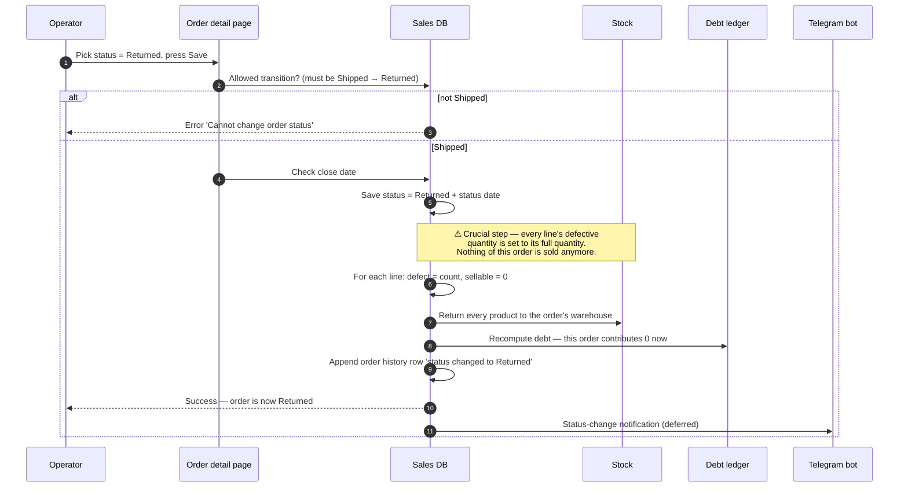

# Whole-order return

## What this feature is for

The client refused the **entire delivery** — every product, every line. The operator marks the order as **Returned**. This is a status change, not a line-by-line defect operation. All goods are released back to the order's warehouse, and the client's debt for this order is wiped.

This is the right page if **nothing** from the order stayed with the client. If the client took most of the order but rejected a few items, use [Partial defect](./partial-defect.md) instead.

## Whole-order return vs. partial defect — the difference QA must understand

| | Whole-order return | Partial defect |
|---|---|---|
| **What it is** | A status transition (Shipped → **Returned**) | An edit on an existing Shipped or Delivered order |
| **Trigger** | Operator picks "Returned" from the order's status dropdown | Operator opens the "Mark defective quantity" dialog per line |
| **Granularity** | All-or-nothing — the entire order comes back | Per-line — only the affected lines are marked |
| **Stock movement** | All quantities returned to the **order's warehouse** | Defective quantities moved to the **defect store** (if expeditor has one) — otherwise stock stays where it was |
| **Order status after** | **Returned** | **Shipped** or **Delivered** (status doesn't change — only line quantities do) |
| **Debt effect** | Debt for this order goes to zero | Debt drops by the defective portion only |
| **History** | Status-change row | Multiple line-edit rows |

A common QA bug is using the wrong workflow: marking every line as defective via partial-defect when the operator really should have used whole-order return. The two end states **are different** — one is Delivered with all-defective lines, the other is Returned. Test plans must call out which one is being tested.

## Who uses it and where they find it

| Role | What they do here | How they get to the screen |
|---|---|---|
| Operator (3) | Records that the client refused the delivery | Web → Orders → open order → status dropdown → **Returned** |
| Operations (5), Manager (2), Admin (1), Key-account (9) | Same | Same |
| Agent (4), Expeditor (10) | Do not see the status dropdown | — |

## When this feature is allowed

This is a status transition. The allowed move is:

- **Shipped → Returned** — when the client refused on delivery.

These are **not** allowed:

- New → Returned (the order has to be Shipped first).
- Delivered → Returned (if the client already accepted it, the right path is to mark line defects, not a whole-order return).
- Cancelled → Returned (cancelled orders never reached the client).

If a returned order needs to be undone (mistake), it can move **Returned → New** — then it's re-opened for correction, and a new status transition will be needed to ship it again.

## The workflow — at a glance

## Step by step

1. The operator opens the order's detail page. The order must currently be **Shipped**.
2. The operator picks **Returned** from the status dropdown and presses **Save**.
3. *The system checks the transition is allowed.* ⛔ If the order is in any state other than Shipped, the error is *"Cannot change order status"*.
4. *The system checks the close date.* ⛔ If the order is older than the close date, returning it is blocked.
5. *The system saves the new status.* The order is now **Returned**.
6. *For every line, the system sets the defective quantity to the full ordered quantity* — meaning none of this order is considered sold anymore.
7. *The system restores all the goods to the order's warehouse.* Note this is the **original warehouse**, not the defect store — whole returns are not damaged-goods returns; they're refusals.
8. *The system recomputes the client's debt.* The order's contribution drops to zero, and the running balance (or this order's debt row) is reduced accordingly.
9. *The system links any online-order or sub-system records to the new status* (e.g. the connected online-order entry switches to its return status).
10. *The system writes a status-change row to the order history.*
11. *After the response is sent*, the Telegram bot publishes the status change.

## What can go wrong (errors the operator sees)

| Trigger | Error message | Plain-language meaning |
|---|---|---|
| Trying to return an order that is not Shipped | "Cannot change order status" | The order is in New, Delivered, Returned or Cancelled. |
| Order is older than the close date | "Order date past close date" | Too old to change status. |
| Order is blocked by a pending filial-order decision | "Order waiting for dealer acceptance / rejection" | Returns are not allowed during the approval window. |

## Rules and limits

- **Whole-order return is a status transition.** It does **not** behave like a per-line defect dialog — there's no quantity input. Every line goes 100% defective.
- **Stock returns to the order's warehouse, not the defect store.** This is the opposite of partial defect, where the defective quantity moves to the *defect store*. Whole returns are treated as "the client never accepted these — give them back to the regular warehouse".
- **Re-opening to New is allowed.** Once an order is Returned, the operator can re-open it to New (Returned → New) to correct it. When that happens, the line defects are cleared back to zero and the order can be re-shipped.
- **Debt becomes zero, not negative.** This order's contribution to client debt is reset, not flipped to a credit.
- **No defect-store movement.** A QA test plan must not look for an exchange record into the defect store on a whole return — that record only exists for partial defects.

## What to test

### Happy paths

- Order in Shipped → Returned. Order ends in status **Returned**. Stock is back in the order's warehouse. Client debt for this order is zero. History has a status-change row.
- Re-open: Returned → New. Order is in **New**. Lines are back to original (no defective quantity). Stock has been consumed again. Debt is back. (Test this carefully — re-opening has many side effects.)

### Forbidden transitions

- New → Returned. Expect: rejection.
- Delivered → Returned. Expect: rejection.
- Cancelled → Returned. Expect: rejection.
- Returned → Returned (no-op). Expect: either silent success or "no change" — verify behaviour.

### Date and lock checks

- Order older than 21 days → try to return. Expect: close-date error.
- Order with pending filial-order decision → try to return. Expect: filial-lock error.

### Role gating

- Operator, Operations, Manager, Admin, Key-account — can return. ✅
- Agent (4) and Expeditor (10) — cannot reach the screen.
- Filial isolation — a user from filial A cannot return an order from filial B.

### Distinction-from-partial-defect tests

- Order with 10 lines, mark each line 100% defective via the partial-defect dialog. End state: order is still **Delivered** (or Shipped) with line quantities zeroed. Verify the order is **not** in Returned status — even though the numbers look the same.
- Same order, but use the whole-order return path. End state: order is in **Returned** status. Verify this is the correct visual state for the operator.
- Stock should land in different warehouses for the two cases — partial defect with defect-store moves stock to the defect store; whole return moves stock to the order's original warehouse. Verify each.

### Audit and side effects

- One history row appears with *"status changed from Shipped to Returned"*.
- Stock balances on the order's warehouse rise by the order's quantities.
- The defect store balance is **unchanged** (because this was a return, not a defect).
- The client debt row for this order is zero (or the running balance has been credited back).
- A Telegram message announces the status change.
- If the order had a connected online-order entry, that entry switched to its return status.

## Where this leads next

- If only some items are defective, use [Partial defect](./partial-defect.md) instead.
- If the operator opens the order back up to fix something, see [Edit order](./edit-order.md).
- For the full status diagram, see [Status transitions](./status-transitions.md).

## For developers

Developer reference: `docs/modules/orders.md` — see *Workflow 1.2 — Order lifecycle (status transitions)*.
