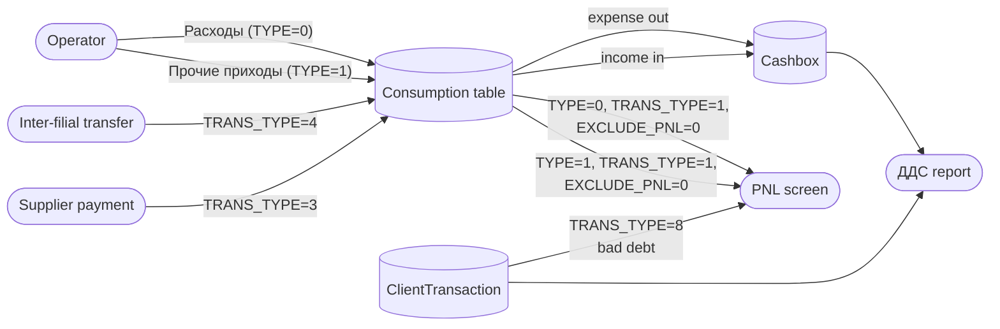
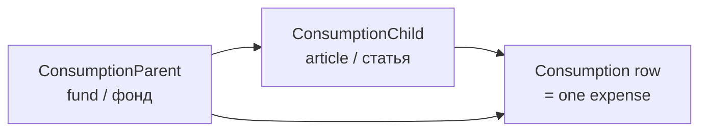
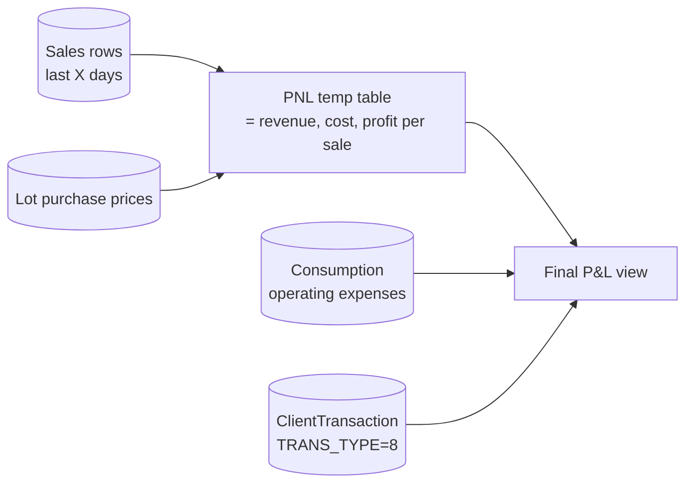
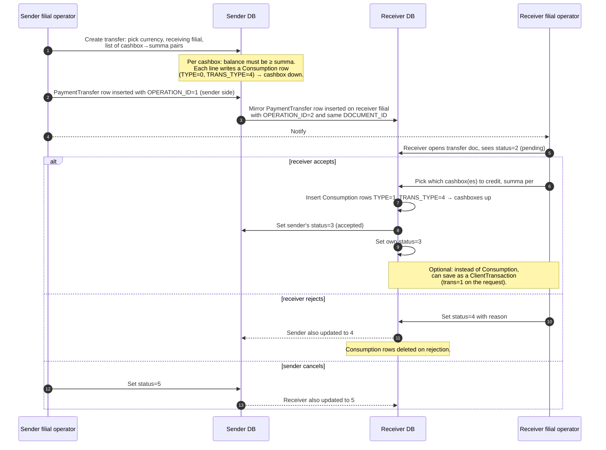

# Expenses, cash-movement, P&L, inter-filial transfer

## What this feature is for

These five screens cover everything *outside* client receipts but *inside* the dealer's daily money flow:

- **Расходы** (Expenses) — operator records money paid out of a cashbox.
- **Прочие приходы в кассу** (Other cashbox income) — operator records money coming into a cashbox that *isn't* a client receipt (e.g. owner top-up).
- **Статьи и Фонды** (Categories and funds) — the catalogue of expense categories (two-level: parent fund + child article).
- **Движение денежных средств** (Cash-movement report, "ДДС") — a summary of every move into and out of a chosen cashbox for the date range.
- **PNL** — profit-and-loss screen: revenue minus cost minus operating expenses.
- **Перевод платежей между филиалами** (Inter-filial payment transfer) — moves cash from one filial's cashbox to another filial's cashbox with an explicit accept/reject workflow.

All of these read or write the same `Consumption` table — the *expense ledger*. Bugs in any one screen ripple through to the others.

## Who uses it and where they find it

| Role | What they do | Path |
|---|---|---|
| Operator (3), Operations (5), Key-account (9) | Full access to all screens | Web → Finance → Расходы / Прочие приходы / ДДС / PNL / Перевод платежей |
| Cashier (6) | Scoped to their own cashbox; can record expenses against it only; supervisor can also access PNL | Same paths |
| Partner (7) | PNL filtered to their product category only | Same |
| Supervisor (8) | Reads expenses and PNL; expense pivot scoped to their agents | Same |

Permission gates:
- **`operation.finans.consumption`** — see expenses list.
- **`operation.finans.addconsumption`**, **`.editconsumption`**, **`.deleteconsumption`** — write actions on expense rows.
- **`operation.finans.credit`** — see / write other-income rows (`TYPE=1`).
- **`operation.finans.consumptionCategory`** — manage categories.
- **`operation.finans.consumptionReport`** — see the cash-movement report.
- **`operation.finans.pnl`** — see PNL.

## How it all hangs together

## Step by step — recording an expense

1. Operator opens **Расходы** (Expenses), picks the date range, and clicks **Add expense**.
2. Operator fills in: parent category (fund), child category (article), summa, currency, cashbox, date, comment, optional **Exclude from PNL** flag.
3. *The system checks the closed-period gate* via `Closed::check_update('finans', date)`. ⛔ If closed and the role is not exempt, redirect to the period-closed error.
4. *The system inserts a `Consumption` row* with `TYPE=0` (expense), `TRANS_TYPE=1` (normal user entry), and the chosen fields.
5. A Telegram notification is sent to the configured channel (via `TelegramReport::newConsumption`).
6. The cashbox balance for that cashbox immediately reflects the decrease.

Editing and deleting follow the same shape, with their own permission gates. Delete also has two cascade behaviours:
- If the row has `SHIPPER_TRANS_ID` set and the `enableDeleteConsumptionOfShipperPayment` server flag is on, the linked `ShipperTransaction` is also deleted.
- If `enableDeleteConsumptionOfClientTransaction` is on and the row's `TYPE=0` and `XML_ID` is non-null, then linked `ClientTransaction` rows (`TRANS_TYPE=2`, same cashbox/currency) are also deleted with history.

These cascades can surprise QA — what looks like a single-row delete can erase multiple rows. Always test with the cascade flag set both ways for the server you're testing.

## Step by step — recording other-income (Прочие приходы)

Same form as expense, but `TYPE=1` is set instead of `TYPE=0`. The same closed-period gate applies. No Telegram notification on this path. Used for non-client cash movements *into* a cashbox.

## Step by step — managing categories

The **Статьи и Фонды** (Categories and funds) screen lets the operator add/edit/delete expense categories. The hierarchy is **fund (parent) → article (child)**.

Two things QA must test on delete:
- **Cannot delete a fund or article that is still used by any `Consumption` row.** The screen prevents this; the prevention is name `checkFinans` in the back-end and silently swallows the delete if any row references the category. Confirm the UI gives feedback.
- **System-protected categories** (with `SYSTEM=1`, `XML_ID='sc4pt...'`) are reserved for inter-filial transfer book-keeping. Never editable or deletable.

## Step by step — the cash-movement report (ДДС)

The report computes, per cashbox and per currency, for the chosen date range:

- **Opening balance** = sum of all ledger and expense rows up to the start of the range.
- **Receipts from clients** = sum of `ClientTransaction.SUMMA` where `TRANS_TYPE` is 3 or 4 in the range.
- **Other cashbox income** = sum of `Consumption.SUMMA` where `TYPE=1` in the range, grouped by fund + article.
- **Expense** = sum of `Consumption.SUMMA` where `TYPE=0` in the range, grouped by fund + article. (Note: also includes `TRANS_TYPE=2` payouts from `ClientTransaction`.)
- **Closing balance** = opening + receipts + other income − expense.

The report breaks each section out by client (for client receipts) and by category (for expenses). This is the screen QA uses to verify a recorded expense actually showed up where it should.

## Step by step — PNL screen

The PNL screen:

1. Builds a *temp table* called `pnl` for the chosen date range. Each row represents one sale with its purchase price (from the lot it was sold from) and the sales price.
2. Aggregates that temp table to get **revenue**, **cost of goods**, and **gross profit** for the period.
3. Adds operating numbers: **expense** = sum of `Consumption` where `TRANS_TYPE=1` and `TYPE=0` and `EXCLUDE_PNL=0`; **other income** = same with `TYPE=1`; **bad debt** = sum of `ClientTransaction` where `TRANS_TYPE=8` and `TYPE=1` and `SUMMA>0`.
4. Breaks the result down by **sales model** (regular / van-selling / online) and by **product category**.

**Availability gate.** The temp-table build relies on either MySQL 8 features or the lot-management module. On a server with neither, the temp table will not populate correctly. The PNL menu may also be hidden by server flag. QA should ask the dev team which servers have which.

**Date floor.** The `pnlStartDate` server parameter sets the earliest date PNL will compute from. Requests before this date are silently clamped up. QA should test that the displayed period reflects the clamp.

**Partner scoping.** Role 7 (partner) is automatically scoped to their assigned `PRODUCT_CAT_ID` — the partner sees only the P&L for their own categories. Test this is honoured even when the user supplies a `productCat` filter.

**Red categories.** Filial-blacklisted categories (`FilialProduct::getRedCategories`) are always excluded. Confirm with a known-blacklisted SKU.

## Step by step — inter-filial transfer

The transfer has five statuses: **1=new**, **2=pending**, **3=accepted**, **4=rejected**, **5=cancelled**. Allowed transitions are role-dependent and direction-dependent. The validator (`statusCheck` + `allowedStatus`) enforces:

- Sender can: pending → accepted | cancelled. (Confirms or pulls back.)
- Receiver can: new → accepted | rejected.

Cross-filial concurrency is real here: both sides may try to update the same document. The flow re-reads the document after lock and rolls back if the state diverges, returning `reload_page` to the UI.

## What can go wrong

| Trigger | What you see | Plain-language meaning |
|---|---|---|
| Save an expense in a closed period | Redirect to period-closed error | Working as designed. |
| Add an expense with no category selected | Form rejects | The two category dropdowns are required. |
| Try to delete a fund that has rows | Silent fail or "still in use" | Categories with history are protected. |
| Try to edit a system fund (`sc4pt`) | No-op or hidden in UI | Reserved for inter-filial transfer book-keeping. |
| PNL on a server without MySQL 8 or lot-management | Numbers all zero, or screen missing | The temp-table build can't run. Document with dev team. |
| Inter-filial transfer — insufficient balance on a cashbox | "Недостаточно средств" (Insufficient funds) | Sender's cashbox balance is checked before write. |
| Inter-filial transfer — receiver's currency becomes inactive between create and accept | "Используемая валюта стала неактивной" + reload | Validator caught the stale state. Sender must redo. |
| Inter-filial transfer — receiver's chosen cashbox is deactivated | "Данная касса стала неактивной" + reload | Same as above. |
| Inter-filial transfer — totals don't match | "Сумма перевода не соответствует сумме в документе" | The receiver's per-cashbox summa must sum to the document's `SUMMA`. |
| Two managers try to accept the same transfer concurrently | One gets `reload_page` error | Working as designed. |
| Delete a `Consumption` row that has `SHIPPER_TRANS_ID` set | The supplier transaction may also be deleted (cascade) | Depends on `enableDeleteConsumptionOfShipperPayment`. Test both states. |
| Mark `EXCLUDE_PNL=1` on a routine expense | Expense disappears from PNL but still shows in ДДС | Used to keep non-operating moves out of profit. |

## Rules and limits

- **`Consumption` has two row-shape discriminators.** `TYPE` (0=expense / 1=income) and `TRANS_TYPE` (1=user expense, 3=supplier payment, 4=inter-filial). Bugs that mis-stamp `TRANS_TYPE` make a row appear in the wrong report.
- **Cashier (role 6) sees only their cashbox.** All four screens honour this. Test with a role-6 user and confirm they cannot select a cashbox not theirs.
- **The expense pivot screen** (`/finans/consumption/pivot`) is a separate front-end that unions `Consumption` rows with `ClientTransaction` rows and lets the user save report templates per user. Supervisor scoping applies to the unioned dataset.
- **`startFinans` server parameter** floors all expense queries — rows before this date are not shown. This is *not* the same as the closed-period gate; `startFinans` is the *system-start* date.
- **Categories are soft-protected.** Marking a category as inactive (`ACTIVE='N'`) hides it from new-expense dropdowns but does not delete historical rows.
- **`SYSTEM=1` categories are created on-demand** by the inter-filial transfer flow. They use `XML_ID='sc4pt'` (parent) and `sc4pt0` / `sc4pt1` (children). Operators never see these in normal management UIs.
- **The inter-filial transfer status flow is strict.** Skipping states or returning to an earlier state is blocked by the validator. Test each invalid transition and confirm rejection.
- **PNL temp table is per-request.** Each PNL load rebuilds the temp table. Concurrent loads do not interfere because each connection has its own temp table.

## What to test

### Expense entry
- Add an expense — confirm `Consumption` row appears with `TYPE=0`, `TRANS_TYPE=1`, the correct `CASHBOX`, and `EXCLUDE_PNL=0`.
- Edit the row's summa and currency. Both must update.
- Toggle `EXCLUDE_PNL=1` on the row. Confirm it stops appearing in PNL but still shows in ДДС.
- Delete the row. Confirm cashbox balance goes back up.
- Add an expense in a closed period as a non-exempt user — must be rejected.
- Add an expense as cashier (role 6) — only their own cashbox in the dropdown.

### Other-income entry
- Add a `TYPE=1` row. Cashbox balance goes up. Should appear in ДДС under "other income".
- Edit and delete — same as expense.

### Categories
- Add a new fund and child. Verify in expense dropdowns.
- Try to delete a fund that has rows — must fail silently or warn.
- Deactivate a fund — disappears from new-expense form but historical rows still display.
- Confirm system funds (`XML_ID='sc4pt'`) are never editable in the UI.

### Cash-movement report (ДДС)
- Pick a cashbox + date range. Confirm opening + receipts + income − expense = closing.
- Switch cashboxes — every row scoped correctly.
- Cashier sees only their cashbox.

### PNL
- On a server with MySQL 8 / lot-management: load PNL for a known month. Cross-check revenue, cost, profit against a hand-computed value for a small dataset.
- Confirm `EXCLUDE_PNL=1` rows are not in the PNL expenses total but `EXCLUDE_PNL=0` rows are.
- Confirm bad-debt (`TRANS_TYPE=8`, `SUMMA>0`) is included.
- Confirm red product categories are excluded.
- As partner (role 7): only their categories appear.
- Try to load PNL before `pnlStartDate` — date should be clamped up.

### Inter-filial transfer
- Create a transfer from filial A to filial B for one cashbox / one currency. Confirm two `PaymentTransfer` rows (one per filial), one `Consumption` row on sender side.
- Receiver accepts: confirm `Consumption` `TYPE=1` row on receiver, status flips to 3 on both sides.
- Receiver rejects: confirm status flips to 4 on both sides; sender's `Consumption` row remains, receiver's never written.
- Sender cancels before receiver acts: confirm status 5 on both sides.
- Create with summa larger than sender's cashbox balance — must fail.
- Receiver accepts with `trans=1` (save as `ClientTransaction` mode) — confirm a `ClientTransaction` with `TRANS_TYPE=3` is written instead of a `Consumption` row.
- Receiver accepts but the totals per cashbox don't sum to the document `SUMMA` — must fail with "Сумма перевода не соответствует".
- Try invalid status transitions (e.g. accepted → rejected) — must fail.
- Concurrent accept by two users — one succeeds, other gets `reload_page`.
- Currency or cashbox deactivated mid-flow — receiver gets the inactivity error.

## Where this leads next

- For the *other* side of cashbox movements (client receipts), see [Cashbox balance](../finans/cashbox-balance.md).
- For supplier payments, which write into the same `Consumption` table with `TRANS_TYPE=3`, see [Supplier finance](./supplier-finance.md).
- For approval of mobile-collected cash before it becomes a client receipt, see [Payment approval](./payment-approval.md).
- For period locking, see [Manual correction](../finans/manual-correction.md).

## For developers

Developer reference: `protected/modules/finans/controllers/ConsumptionController.php` (expenses + categories + ДДС + pivot), `protected/modules/finans/controllers/PnlController.php` (PNL screen + AJAX feeders), `protected/modules/finans/controllers/PaymentTransferController.php` (inter-filial). Models: `Consumption`, `ConsumptionParent`, `ConsumptionChild`, `ConsumptionHistory`, `PaymentTransfer`, `Closed`. PNL temp-table builder: `Finans::pnlTempTable`. Cascade flags: `ServerSettings::enableDeleteConsumptionOfShipperPayment`, `ServerSettings::enableDeleteConsumptionOfClientTransaction`. Date floor: `Yii::app()->params['pnlStartDate']`, `startFinans`.
