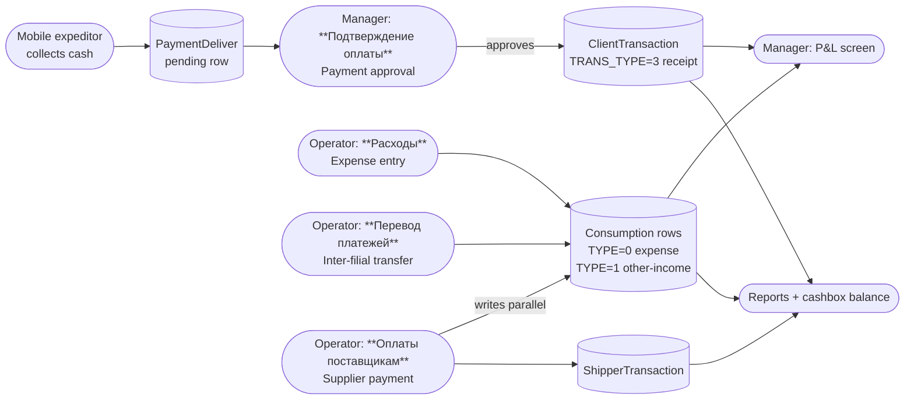
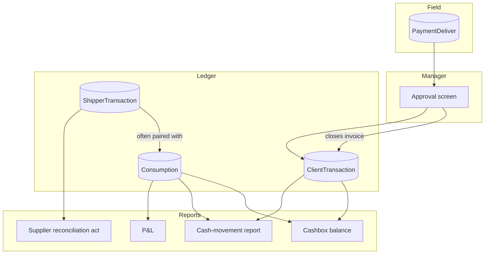

# Payment, expenses, and supplier finance — QA test guide

> **Reader.** A QA engineer who tests anything that converts *pending money* into *finalised money* — manager approvals of cash collected in the field, the expense ledger, P&L, inter-filial cash transfers, and the parallel supplier (Поставщик) ledger.
>
> **Why this module group is grouped together.** All four areas pull from and push to the same low-level tables (`ClientTransaction`, `Consumption`, `ShipperTransaction`). A bug in one screen can poison reports in another. QA tests must look at the full chain, not one screen at a time.

## What this guide covers

The pages in this section sit between the **field-side payment capture** (the mobile expeditor flow documented in [Mobile payment](../orders/mobile-payment.md)) and the **client ledger** (documented in the [Finans QA guide](../finans/index.md)). The screens here cover three concerns:

1. **Approval** — the manager's gate that turns a pending field payment (a `PaymentDeliver` row) into a finalised payment receipt (`ClientTransaction` with `TRANS_TYPE=3`).
2. **Expenses, cash movement, and profit** — the *other* side of the dealer's cashbox: not what clients pay in but what the dealer pays out, plus the consolidated P&L screen and the inter-filial cash transfer flow.
3. **Supplier finance** — a smaller parallel ledger for the *dealer's* suppliers (Поставщики). Where the main finans tracks money owed *by clients to the dealer*, this tracks money owed *by the dealer to its suppliers*.

## How to use this guide

| When you want to test… | Open this page |
|---|---|
| Manager-approves-expeditor's-cash flow, and the legacy variant on the older finans screen | [Payment approval](./payment-approval.md) |
| Recording expenses, the cash-movement report, expense categories, the P&L screen, inter-filial transfers | [Expenses and P&L](./expenses-and-pnl.md) |
| The Поставщик (supplier) directory, supplier payments, supplier reconciliation acts, supplier initial balances | [Supplier finance](./supplier-finance.md) |

## Master view — how the screens fit together

The same `Consumption` table is written by four different screens (manual expense, manual other-income, inter-filial transfer, supplier payment). QA must keep the source straight when investigating why a single row appeared in two reports.

## Glossary — terms specific to this section

| Term | Meaning |
|---|---|
| **PaymentDeliver** | A pending payment row written by the mobile app when the expeditor collected cash. Stays in this table until a manager approves it. |
| **CONFIRM** | The status column on `PaymentDeliver`: `0`=pending, `1`=approved (a `ClientTransaction` was created), `2`=rejected. |
| **Consumption** | The expense / other-income ledger. Two-level categorisation: parent (фонд / fund) and child (статья / article). |
| **TYPE on Consumption** | `0` = расход (expense — money out), `1` = приход (other income — money in not from a client invoice). |
| **TRANS_TYPE on Consumption** | `1` = normal user-entered expense or income, `3` = supplier payment, `4` = inter-filial transfer. |
| **EXCLUDE_PNL** | Boolean flag on a `Consumption` row. If set, the row exists for cashbox accounting but is hidden from the P&L screen. Used for non-operating cash moves. |
| **PaymentTransfer** | A document representing money moving between two filials (branches). Sender filial writes one row, receiver filial writes a mirror row. |
| **Поставщик (Shipper)** | A supplier — the upstream from whom the dealer buys product. |
| **ShipperTransaction** | The supplier-ledger row. Parallel to `ClientTransaction` but for suppliers. `TYPE=0` arrival, `TYPE=1` payment, `TYPE=2` initial balance, `TYPE=4` return, `TYPE=5` inter-filial move. |
| **Акт сверки** | A reconciliation act between the dealer and a single supplier (or client) over a date range. |

## Master view — how the screens build on the same tables

## Common pitfalls QA should know going in

- **The approval screen writes two rows.** When a manager approves a `PaymentDeliver`, the system inserts a new `ClientTransaction` (the receipt) *and* may rewrite the linked invoice row's `COMPUTATION`. Bugs here look like *"the debt didn't go down by the right amount"*. Always look at both rows.
- **`Consumption` is double-purpose.** The same table holds operator expenses, inter-filial transfers, and supplier payments. The discriminator is `TRANS_TYPE` on the `Consumption` row. Reports filter on this column. A bug that mis-stamps it makes a row appear in the wrong report.
- **Supplier payment writes two rows in two tables.** When the operator records a supplier payment, the system creates a `ShipperTransaction` (the supplier ledger entry) *and* a paired `Consumption` row (so the cashbox total goes down). Deleting one without the other leaves the books out of balance.
- **The P&L screen has an availability condition.** P&L is gated by either MySQL 8 or the lot-management feature. On a server that has neither, the screen will be present but the P&L section in the navigation may be hidden. Confirm with the dev team which servers have which.
- **Inter-filial transfers cross filials.** The flow physically writes to two databases (sender filial's and receiver filial's). QA must check both sides after a transfer.
- **Role 6 (cashier) scoping is everywhere.** Every screen in this section honours cashbox-scoping for role 6, just like the finans screens. Always test as both roles.

## Common test pattern

For every action in this section the test should:

1. Record the affected **cashbox balance**, the affected **client balance** (if applicable), and the **supplier balance** (if applicable) **before** the action.
2. Execute the action.
3. Verify all three changed by exactly the amount the action declared (and zero for the rest).
4. Open the corresponding report (P&L, cash-movement, reconciliation) and check the new row appears in the expected bucket.

## Permission map

| Screen | Required permission |
|---|---|
| **Подтверждение оплаты** (Payment approval) | `operation.clients.paymentApproval` (open) + `operation.clients.finansCreate` (approve) + `operation.clients.finansDelete` (reject) |
| **Расходы** (Expenses) | `operation.finans.consumption` (open), `operation.finans.addconsumption` / `editconsumption` / `deleteconsumption` (write) |
| **Прочие приходы в кассу** (Other income) | `operation.finans.credit` |
| **Статьи и Фонды** (Categories) | `operation.finans.consumptionCategory` |
| **Движение денежных средств** (Cash-movement) | `operation.finans.consumptionReport` |
| **PNL** | `operation.finans.pnl` |
| **Перевод платежей между филиалами** | role check (3/5/6/9) + per-status validation |
| **Поставщики** (Supplier directory) | `operation.clients.shipper` |
| **Оплаты поставщикам** (Supplier payments) | `operation.clients.shipperFinans` |
| **Акт сверки** (Reconciliation) | `operation.clients.shipperFinans.revise` |
| **Обороты по поставщикам** (Turnover) | `operation.clients.shipperFinans.report` |
| **Начальные балансы поставщиков** | `operation.clients.shipperFinans.initialBalans` + `operation.clients.finansCreateInitialBalans` |

The permissions are independent — a user with `paymentApproval` but not `finansCreate` can open the approval screen but not actually approve. Test both axes of the matrix.

## What is *not* in this section

- **Mobile-side capture** of cash by the expeditor — see [Mobile payment](../orders/mobile-payment.md).
- **Client-side ledger reading** (`ClientTransaction`, `TransactionClosed`, `ClientFinans`) — see the [Finans QA guide](../finans/index.md).
- **Period locking** itself — see [Manual correction](../finans/manual-correction.md). Every screen in this section reads the same closed-period gate; the gate's mechanics live with the finans docs.
- **Purchase / arrival flows** that write `ShipperTransaction TYPE=0` rows. These belong to the inventory / purchase QA area, not here.

## Cross-references

- For mobile-side payment capture, see [Mobile payment](../orders/mobile-payment.md).
- For the client-side ledger and `ClientTransaction` reading, see the [Finans QA guide](../finans/index.md) and especially [Transaction types](../finans/transaction-types.md).
- For period locking (which gates writes on every screen here), see [Manual correction](../finans/manual-correction.md).
- For per-cashbox running totals (which every screen here changes), see [Cashbox balance](../finans/cashbox-balance.md).

## For developers

Developer reference: `protected/modules/payment/controllers/ApprovalController.php`, `protected/modules/finans/controllers/ConsumptionController.php`, `protected/modules/finans/controllers/PnlController.php`, `protected/modules/finans/controllers/PaymentTransferController.php`, `protected/modules/clients/controllers/ShipperController.php`, `protected/modules/clients/controllers/ShipperFinansController.php`. Models: `PaymentDeliver`, `Consumption`, `ConsumptionParent`, `ConsumptionChild`, `PaymentTransfer`, `Shipper`, `ShipperTransaction`.
