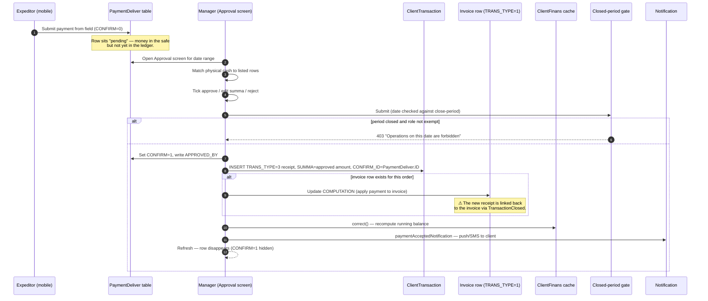

# Payment approval — manager confirms field cash

## What this feature is for

When an expeditor (or van-selling agent) collects cash from a client on delivery, the mobile app records it as a *pending* payment. The money is *physically* in the field — the dealer's ledger does not yet show it. A manager in the office reviews each pending row, ticks the ones that match the cash actually handed in, and **approves** them. Approval is what turns the pending row into a real receipt that closes the client's invoice and ticks up the cashbox total.

This is the single most important gate between *"the expeditor says they got the money"* and *"the dealer's books say the money is in"*. If approval is mis-implemented, the books and the safe disagree.

Two screens implement the same intent:

- **Подтверждение оплаты** (Payment approval) — the new screen, found at `/payment/approval`. Bulk approve, edit, reject. Loaded as a single-page front-end.
- **Подтверждение оплаты** (legacy variant) — found at `/clients/finans/deliver`. The older screen — still in use on some installs. Same data, older UI.

QA should know both exist and which one is enabled per server. Same underlying table (`PaymentDeliver`), same business rules.

## Who uses it and where they find it

| Role | What they do here | Path |
|---|---|---|
| Operator (3), Operations (5), Key-account (9) | Approve, edit, reject, unlink pending payments | Web → Finance → **Подтверждение оплаты** (Payment approval) |
| Supervisor (8) | Same as operator, but only sees payments from their own agents | Same |
| Cashier (6) | Read-only on payments tied to their cashbox | Same |
| Admin (1) | All actions including override of the per-payment `editPaymentDeliver` flag | Same |

Permission gates:
- **`operation.clients.paymentApproval`** — required to open the screen.
- **`operation.clients.finansCreate`** — required to approve (write a `ClientTransaction`).
- **`operation.clients.finansDelete`** — required to reject (mark `CONFIRM=2`).
- **`editPaymentDeliver`** server parameter — additionally gates the *edit* button on individual rows.

## The workflow

## The pending-row shape

The mobile flow described in [Mobile payment](../orders/mobile-payment.md) inserts one row per currency line into the `PaymentDeliver` table. Each row carries:

- **CONFIRM** — `0` pending, `1` approved, `2` rejected. New rows are always `0`.
- **ORDER_ID** — the order this payment was collected against, if the field linked it. May be empty if the field captured *general* cash with no order tie.
- **CLIENT_ID** — the client the field claims paid.
- **AGENT_ID** + **USER_ID** — the agent who serves the client and the expeditor who collected.
- **SUMMA**, **CURRENCY**, **DATE** — the captured amount, currency, and the date the field reports as the payment date.
- **TYPE** — distinguishes delivery payments from agent-collected payments (used to filter rows on the legacy screen).
- **TRADE_ID** — the trade direction / store the payment is attributable to.
- **CREATE_SOURCE** / **CREATE_BY** — where it came from (mobile vs web) and which user pushed it.

The approval screen reads these directly via a single SELECT over the date range. Filters (currency, agent, expeditor, supervisor) are applied client-side.

## What approval actually writes

For each approved `PaymentDeliver` row, the system writes — inside one DB transaction — these rows:

1. The pending row itself is updated: `CONFIRM=0 → 1`, `APPROVED_BY` is stamped with the manager, `SUMMA` is replaced if the manager edited it, `COMMENT` and `CURRENCY` may also be replaced.
2. A new `ClientTransaction` is created with `TRANS_TYPE=3` (payment receipt), `TYPE=1`, `STATUS='Y'`, `CONFIRM_ID` set to the `PaymentDeliver.ID`, `CONFIRM_USER=1`. The receipt's `DATE` is the approval date (or, if the manager chose *use delivery-date*, the `PaymentDeliver.DATE`).
3. If the pending row references an order — i.e. `PaymentDeliver.ORDER_ID` is set — and an invoice for that order exists (`TRANS_TYPE=1`), then the invoice's `COMPUTATION` is updated: the payment is applied against the debt, and a `TransactionClosed` link row is created from invoice → receipt.
4. The per-client cache `ClientFinans` is recomputed (or `ClientTransaction.correct` is called on contragent installs).
5. The client gets a push/SMS notification via `paymentAcceptedNotification`.

If any of these fails, the whole transaction rolls back and the row stays pending. QA should verify the all-or-nothing property: a partial save must never happen.

## Step by step

1. Manager opens **Подтверждение оплаты** (Payment approval) and chooses a date range.
2. *The system loads all `PaymentDeliver` rows where the date is in range,* regardless of status. The screen filters to `CONFIRM=0` by default but allows showing approved or rejected too.
3. Manager filters by expeditor, agent, currency, client.
4. For each pending row, manager can:
    - **Approve** — leave the amount alone, tick the row, hit save. Goes through the workflow above.
    - **Edit then approve** — change the summa, currency, or comment. Allowed only if `editPaymentDeliver` server flag is set, *or* the user is admin. The edit is saved into `PaymentDeliver` first; then approval proceeds.
    - **Reject** — sets `CONFIRM=2`. No `ClientTransaction` is written, but the row stops appearing in default filters. The cash from the field is effectively *not accepted*.
    - **Unlink from order** — clears `PaymentDeliver.ORDER_ID`. Used when the field accidentally tagged a wrong order. Approval after unlink writes a receipt with `IDEN=0` (no invoice link).
5. *The system checks each selected row against the close-period gate* via `Closed::check_update('finans', date)`. ⛔ If the period is closed for that date and the user is not in the exception list, the **whole submit** is rejected with a 403.
6. Manager hits save. Each row is processed in its own transaction. Successful IDs are returned in `success_ids`; failures (with messages) in `failed`.
7. Approved rows disappear from the default view.

## What can go wrong

| Trigger | What you see | Plain-language meaning |
|---|---|---|
| Period closed for the payment date | All-rows-rejected with "Operations on this date are forbidden" | The dealer locked the period. Only an exempted role can write. Edit the period or get role exemption. |
| `PaymentDeliver` already approved | "Платеж уже подтвержден или не найден" (Payment already approved or not found) | Two managers approved the same row concurrently. The second one's transaction rolled back. |
| Receipt already written for this `CONFIRM_ID` | "Транзакция с этим ID уже существует" (Transaction with this ID already exists) | A bug or a retry — the system refuses to double-write. |
| `ORDER_ID` set but the invoice row was deleted | Receipt is written but with no invoice link; client's debt is unchanged | The order was deleted after the field captured the payment. Manager should *unlink* before approving, or rebuild the order. |
| Approved amount > invoice debt | An overpayment row is left as `COMPUTATION` on the receipt | Real situation — the client overpaid. The credit will be applied to the next invoice. |
| Currency mismatch invoice vs receipt | Receipt is written in receipt's currency; invoice debt unchanged | Settlement only links same-currency rows. Don't expect debt to fall. |
| Edit summa when `editPaymentDeliver=false` and non-admin | Edit button hidden in UI; direct API call returns 400 | Working as designed. Test that the gate holds at the API level too. |

## Rules and limits

- **Only `CONFIRM=0` rows are approvable.** `CONFIRM=1` (already approved) and `CONFIRM=2` (rejected) are read-only via this screen. The approval action's `findByAttributes(['CONFIRM' => 0])` is strict.
- **Approval is per-row in a per-row DB transaction.** A failure on one row does not block the others. The response distinguishes `success_ids` and `failed`.
- **`CONFIRM_ID` on the receipt is the `PaymentDeliver.ID`.** This is the audit trail — a receipt always knows which field row produced it. Useful for QA investigation.
- **The receipt's `DATE` defaults to the manager's chosen approval date,** but the manager can choose *use payment's original date* (in which case `COMMENT` is suffixed with `у.д.с` — "у.д.с" is the Russian abbreviation used to mark *backdated* receipts).
- **Reject is irreversible from this screen.** To "unreject" a row, dev intervention is needed. Document this when training users.
- **Unlink-order is bulk.** The unlink action takes an array of IDs and clears `ORDER_ID` on all of them in one statement. There is no per-row rollback.
- **The legacy `/clients/finans/deliver` screen** uses the same `PaymentDeliver` table but renders an older list-and-form UI. Some servers run only one of the two paths. Test the one your install actually has, then verify the other path is hidden or returns 404.

## What to test

- Approve a single pending row tied to one order. Verify: a new `ClientTransaction` with `TRANS_TYPE=3` appears with `CONFIRM_ID` set to the pending row's id; the linked invoice's `COMPUTATION` drops by the approved amount; the client's running balance changes by the right delta; the cashbox total goes up.
- Approve five rows at once. Force one to fail (e.g. by closing the period for that date). Verify the other four still write and the one failed is returned with its error message.
- Approve a row with no `ORDER_ID`. Receipt should write with `IDEN=0` and no `TransactionClosed` link.
- Edit a row's summa before approval (with the right permission). Verify both the `PaymentDeliver.SUMMA` and the receipt's `SUMMA` reflect the edit.
- Try to edit a row's summa without the permission. UI button should be hidden; if the API is called directly, should 400.
- Reject a pending row. Verify `CONFIRM=2`, no `ClientTransaction` is written, and the row stops appearing in the default filter.
- Unlink a row from its order, then approve. Verify the resulting receipt has no invoice link.
- Approve a row dated inside the closed period as a non-exempt user. Verify 403; verify no row was written. Repeat as exempt admin — should succeed.
- Concurrent approvals: open two browsers, approve the same row at the same time. One must succeed; the other must report "already approved or not found".
- Approve a row where the amount exceeds the invoice debt. Verify an overpayment is left on the receipt's `COMPUTATION` and the invoice is fully closed.
- Approve a row in currency that differs from the invoice. Verify the receipt is written in its own currency; the invoice debt is unchanged.
- Notifications: confirm the client received the SMS/push *after* successful approval. Do not send for failed rows.
- Audit trail: open the resulting receipt; confirm `APPROVED_BY` and `CREATE_BY` are correct, and `CONFIRM_ID` points to the right `PaymentDeliver`.
- Supervisor (role 8): open the screen as supervisor; verify only their agents' rows are shown.
- Legacy screen `/clients/finans/deliver`: same set of tests on whichever filter UI it offers.

## Reading the receipt back to its pending row

QA investigating a customer complaint about a payment can trace the chain in either direction:

- **From pending → receipt:** look up `PaymentDeliver.ID`; find the `ClientTransaction` where `CONFIRM_ID = PaymentDeliver.ID`. If none, the row is still pending (CONFIRM=0) or was rejected (CONFIRM=2).
- **From receipt → pending:** read `ClientTransaction.CONFIRM_ID`. If non-zero, the receipt came from the approval flow; if zero, it came from a different path (manual entry, supplier-payment side-effect, etc.).
- **From receipt → invoice closed:** read `TransactionClosed` rows linking the receipt's `CLIENT_TRANS_ID` to invoice `CLIENT_TRANS_ID`s.
- **From pending → order:** read `PaymentDeliver.ORDER_ID`. May be empty.

When the chain is broken — receipt with `CONFIRM_ID` pointing at a deleted `PaymentDeliver`, or `PaymentDeliver` with `CONFIRM=1` but no matching `ClientTransaction.CONFIRM_ID` — that's a bug. Both directions should always resolve.

## Two screens, one source of truth

| | New (`/payment/approval`) | Legacy (`/clients/finans/deliver`) |
|---|---|---|
| Front-end style | Single-page Vue / React | Server-rendered list + edit form |
| Bulk approve | Yes — multi-row submit | Per-row or per-batch on the older grid |
| Per-row edit gated by `editPaymentDeliver` | Yes | Same gate |
| Reject (CONFIRM=2) | Yes | Yes |
| Unlink-order | Yes (bulk) | One-at-a-time |
| Filters | Date range, supervisor scoping, full text | Date range, agent, expeditor, currency, user |
| Audit | `APPROVED_BY` always stamped | Same |

If both screens are enabled, they write into the same `PaymentDeliver` table. There is no risk of double-approval as long as both honour the `CONFIRM=0` filter — both do.

## Where this leads next

- For the upstream side (how the expeditor captures cash), see [Mobile payment](../orders/mobile-payment.md).
- For the receipt rows the approval writes, see [Transaction types](../finans/transaction-types.md).
- For how period locking works, see [Manual correction](../finans/manual-correction.md).
- For per-cashbox totals that this screen feeds, see [Cashbox balance](../finans/cashbox-balance.md).

## For developers

Developer reference: `protected/modules/payment/controllers/ApprovalController.php` (new screen), `protected/modules/clients/controllers/FinansController.php::actionDeliver` + `actionAjaxDeliver` (legacy screen). Model: `protected/models/PaymentDeliver.php`. Receipt model: `protected/models/ClientTransaction.php`. Settlement: `protected/models/TransactionClosed.php`. Server flag: `Yii::app()->params['editPaymentDeliver']`. Notification: `PaymentDeliver::paymentAcceptedNotification`.
