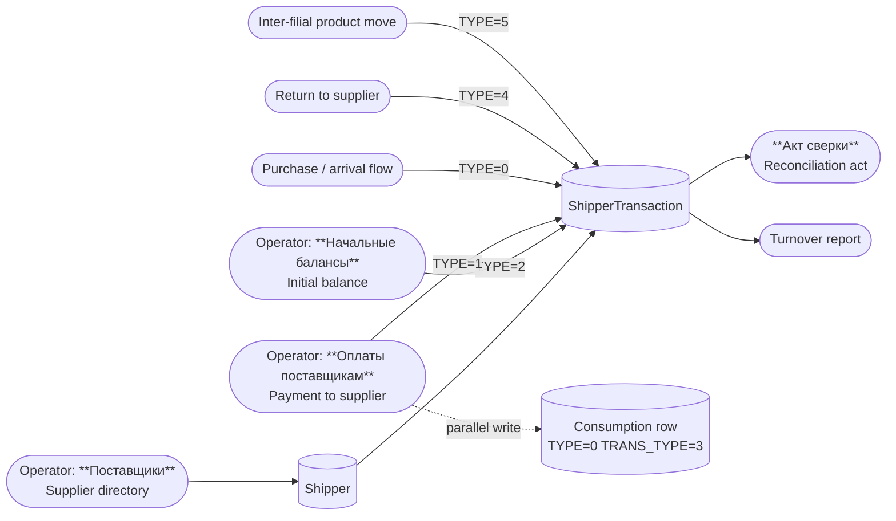
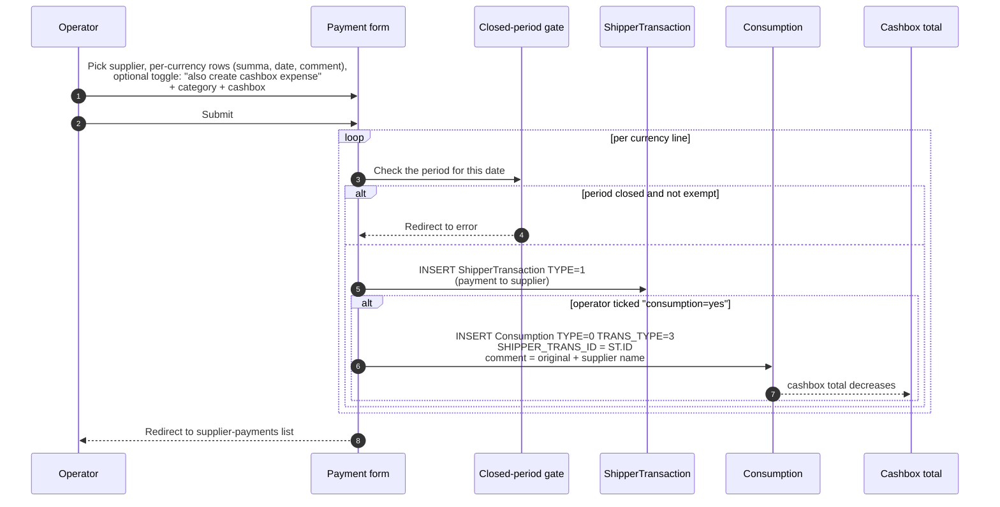

# Supplier finance — the parallel ledger for Поставщики

## What this feature is for

Where the main finans module tracks money the *clients* owe the dealer, the supplier-finance area tracks money the *dealer* owes its **Поставщики** (Suppliers). The structure is deliberately parallel:

- A directory of suppliers with contact info, sort order, optional product-category restriction, and an optional JWT secret (for supplier-portal access).
- A ledger of every arrival, payment, return, initial balance, and inter-filial move per supplier — `ShipperTransaction`.
- A payment screen where the operator records money paid out to a supplier; this writes both a `ShipperTransaction` row and a paired `Consumption` row so the cashbox total goes down.
- A reconciliation act (**Акт сверки**) per supplier per date range, with carry-forward and per-row breakdown.
- An aggregated supplier turnover report.
- An initial-balance entry screen for onboarding suppliers with an opening debt or credit.

## Who uses it and where they find it

| Role | What they do | Path |
|---|---|---|
| Operator (3), Operations (5), Key-account (9) | Manage supplier directory; record payments; view reconciliation, reports, initial balances | Web → Clients → **Поставщики** (Suppliers) and **Оплаты поставщикам** (Supplier payments) |
| Cashier (6) | Record payments from their own cashbox only; read-only on directory | Same |
| Admin (1) | All | Same |

Permission gates:
- **`operation.clients.shipper`** — supplier directory.
- **`operation.clients.shipperFinans`** — supplier-payment screen.
- **`operation.clients.shipperFinans.report`** — supplier turnover report and per-supplier report.
- **`operation.clients.shipperFinans.revise`** — reconciliation act.
- **`operation.clients.shipperFinans.initialBalans`** — view initial balances.
- **`operation.clients.finansCreateInitialBalans`** — create an initial balance.
- **`operation.clients.transactionsUpdate`** — edit or delete a `ShipperTransaction` row.

## The full workflow

## The supplier directory

The directory (`/clients/shipper`) is a standard AJAX-CRUD list with these fields:

- **FIO** — display name.
- **ACTIVE** — `Y`/`N`. Inactive suppliers are hidden from new-payment forms but remain in reports.
- **SORT** — display order.
- **PRODUCT_CAT** — comma-separated list of product-category IDs the supplier is restricted to (used by the supplier-portal and by some report filters). Only present if `shipperCategory` server flag is on.
- **JWT_SECRET** — used to generate a long-lived JWT for the supplier-portal. Can be regenerated or deleted from the row's actions.
- Audit fields: `CREATE_DATE`, `CREATE_BY`, `UPDATE_DATE`, `UPDATE_BY`.

**Delete protection:** a supplier with any `ShipperTransaction` rows cannot be deleted from the directory. The screen pre-loads which suppliers have history and silently swallows delete requests for them.

**Filial gate:** create and update require `FilialComponent::isOnlyFilial()` — i.e. the operator must be working in a single specific filial. If they're in a multi-filial view, the form rejects with the standard `FilialComponent::$errorMessage`.

### JWT for the supplier portal

If a supplier has a `JWT_SECRET`, the directory page exposes a long-lived JWT token (10-year expiry) embedding `shipper_id`. The supplier uses this token to log into a dedicated supplier portal. QA should verify:
- New supplier saves auto-generate a `JWT_SECRET` on the second save (after the row gets its ID).
- Regenerate-secret rotates the token; the old token must stop working.
- Delete-secret nulls the field and the supplier portal access is revoked.

## Step by step — recording a supplier payment

The **Оплаты поставщикам** (Supplier payments) form is multi-row by currency: one supplier, multiple currency lines, each with its own summa, comment, and date.

Each currency line is wrapped in its own DB transaction. A failure on one line rolls back only that line.

**Two write paths.** The supplier-payment form has a switch: the operator can record the payment as a *ledger-only* event (only `ShipperTransaction`, no cashbox impact) or as a *paid-from-cashbox* event (also writes `Consumption`). The second is the normal case. The first is used when paying via a channel the dealer doesn't track in a cashbox (e.g. bank wire from an account not modelled as a cashbox).

**Category defaults.** If the operator doesn't pick a fund/article, the system defaults to `cat_parent=1`, `cat_child=1`, and `cashbox=1`. QA should know this fallback is intentional but easy to mis-attribute.

## Step by step — editing / deleting a supplier payment

The `/clients/shipperFinans/view` screen edits one row at a time.

**Edit rules:**
- Only `TYPE=1` (payment) and `TYPE=2` (initial balance) rows are editable through the UI. `TYPE=0` (arrival), `TYPE=4` (return), `TYPE=5` (move) come from other flows and are edited there.
- Both the *original* date and the *new* date are checked against the closed-period gate. Either being closed blocks the save.
- If the currency changes, the row's `SUMMA` is zeroed first, then re-saved with the new amount — this is to keep the old-currency balance correct.
- The paired `Consumption` row is found via `SHIPPER_TRANS_ID`, or (legacy fallback) via matching date+summa+currency+`TRANS_TYPE=3`. If exactly one match is found, the `Consumption` row is updated to match the new summa, date, currency. If multiple matches, the `Consumption` is left alone — a manual investigation is needed.

**Delete rules:**
- Permission `operation.clients.transactionsUpdate` required.
- The paired `Consumption` row (or rows, via fallback match) is deleted first.
- Then the `ShipperTransaction` is deleted.
- Closed-period gate applied.

The legacy fallback (match by date+summa+currency) is fragile: if two `Consumption` rows happen to have the same shape, neither will be updated. QA should test rows created before the `SHIPPER_TRANS_ID` field was added.

## Step by step — initial supplier balance

A supplier joins the system already owing the dealer (or being owed by the dealer). The operator opens **Начальные балансы поставщиков** (Initial supplier balances) and adds a `TYPE=2` `ShipperTransaction`.

- The screen has a *direction* toggle (`type=1` means "dealer owes supplier" — the summa is inverted with `* -1`; otherwise positive).
- Date must satisfy the closed-period gate.
- The form writes only to `ShipperTransaction` — no `Consumption` paired write — because no cash actually moved.

## Step by step — reconciliation act (Акт сверки)

The **Акт сверки с поставщиком** screen (`/clients/shipperFinans/revise`) produces a per-supplier statement:

1. Operator picks supplier, date range, optional currency filter.
2. *The system computes the opening balance* — sum of all `ShipperTransaction.SUMMA` for that supplier dated before the range start (clamped to `startFinans`).
3. Then lists every `ShipperTransaction` in the range, in date order, showing type, summa, currency, comment, and `PURCHASE_ID` link.
4. Also lists any `PurchaseRefund` rows with `TYPE=2` (return-to-supplier) for the range.
5. Closing balance = opening + sum of all in-range rows.

The report is what the dealer prints (or emails) to the supplier for sign-off. The numbers must reconcile exactly with the supplier's own books.

The reconciliation page recognises five `TYPE` values, displayed as:
- **0** — Поступление на склад (arrival)
- **1** — Оплата (payment)
- **2** — Начальный остаток (initial balance)
- **4** — Возврат поставщику (return to supplier)
- **5** — Перемещение между филиалами (inter-filial move)

## Step by step — turnover report

**Обороты по поставщикам** (`/clients/shipperFinans/report`) is a one-row-per-supplier table:

- **Initial sum** — sum of `ShipperTransaction.SUMMA` *before* the date range (and after `startFinans`).
- **Negative interval sum** — sum of in-range rows where `SUMMA < 0` (typically purchases / arrivals).
- **Positive interval sum** — sum of in-range rows where `SUMMA > 0` (typically payments and returns).
- **End sum** = initial + negative + positive.

Filterable by currency. Inactive suppliers are excluded. This is the high-level "who do we owe how much" view.

## What can go wrong

| Trigger | What you see | Plain-language meaning |
|---|---|---|
| Try to delete a supplier with history | Silent fail in the directory | Working as designed — must clear or re-assign rows first. |
| Save a supplier payment in a closed period | Redirect to period-closed error | Working as designed. |
| Edit a payment row that's outside the closed period but the *new* date is inside | Save blocked | Both old and new dates are gated. |
| Edit currency without re-entering summa | Old-currency summa zeroed, new-currency summa empty | The two-step save expects the operator to also change `SUMMA`. Test by changing currency only. |
| Delete a supplier payment when multiple `Consumption` rows match (no `SHIPPER_TRANS_ID`) | The first match is deleted, the `ShipperTransaction` is deleted | Test paired-row consistency. |
| `enableDeleteConsumptionOfShipperPayment` server flag is on, and operator deletes the *Consumption* row from the expense screen | The paired `ShipperTransaction` is also deleted | Surprising cascade — document this for operators. |
| Save a payment without category | Defaults to `cat_parent=1`, `cat_child=1`, `cashbox=1` | Working as designed but test the silent fallback. |
| Generate JWT for a supplier, then regenerate | Old token must stop authenticating against supplier portal | Test the rotation hard. |
| Edit a `ShipperTransaction` of `TYPE=0` (arrival) via this screen | UI blocks; only TYPE=1 or 2 are editable here | Other types are managed in the purchase / refund flows. |
| Reconciliation act with multi-currency supplier | Each currency runs as its own subtotal | Working as designed. Confirm the dealer and supplier agree on which currency they reconcile. |
| Reconciliation date range crosses `startFinans` | Range is clamped — older rows ignored | `startFinans` is the system epoch. |
| Filial gate: operator in multi-filial view tries to add supplier | Form rejected with filial-error | Working as designed. |

## Rules and limits

- **`ShipperTransaction.TYPE` is the row's kind, not its sign.** TYPE=1 payments can have positive or negative `SUMMA` depending on direction. The reconciliation act treats the row's stored `SUMMA` as authoritative.
- **The paired write (`ShipperTransaction` + `Consumption`) is opt-in per row.** When the operator unticks the consumption box for a payment line, the row is supplier-only; the cashbox balance does not move. Test both modes.
- **Pairing is by `SHIPPER_TRANS_ID`** on `Consumption`. The legacy date+summa+currency match is a fallback for old data. QA should test both.
- **Inactive suppliers do not appear in new-payment dropdowns** but their historical rows are still in every report.
- **Permission `operation.clients.shipperFinans.revise`** gates the reconciliation act — different from the payment-write gate. Some users can pay but not reconcile, or vice versa.
- **`shipperCategory` server flag** changes the directory form: if on, suppliers have a multi-select of product categories. If off, the field is hidden and ignored.
- **`PURCHASE_ID` on `ShipperTransaction`** links a `TYPE=0` arrival row back to the originating `Purchase` document. The supplier-payment screen does *not* write this field — only the purchase flow does.
- **`startFinans` floors all queries.** The reconciliation, the turnover report, and the per-supplier list all clamp the start of the range up to `startFinans` if the user-provided date is older.

## What to test

### Directory
- Create a supplier in a single-filial view. Verify `CREATE_DATE`, `CREATE_BY` are set; `JWT_SECRET` is generated on the second save.
- Update a supplier. Verify audit fields update.
- Try to delete a supplier with no transactions — should succeed.
- Try to delete a supplier with at least one transaction — should silently no-op.
- With `shipperCategory` flag on: assign two categories, confirm `PRODUCT_CAT` stores them comma-separated.
- Try create/update in a multi-filial view — must fail.
- Regenerate JWT — the old token must fail against the supplier portal; the new token must work.
- Delete JWT — supplier portal access revoked.

### Supplier payment
- Pay one supplier in one currency with consumption-pairing on. Verify two rows appear: `ShipperTransaction TYPE=1` and `Consumption TYPE=0 TRANS_TYPE=3` with `SHIPPER_TRANS_ID` set. Cashbox balance decreases.
- Pay the same supplier in two currencies in one form submission. Verify two pairs of rows.
- Pay with consumption-pairing off. Verify only the `ShipperTransaction` is written; cashbox balance unchanged.
- Pay in a closed period as a non-exempt user — must redirect to error; no rows written.
- Pay with no category selected — verify defaults `1, 1, 1` are stored.
- Pay as cashier (role 6) — only their cashbox in the dropdown.
- Edit a paid row: change summa. Verify `ShipperTransaction.SUMMA` updates and the paired `Consumption.SUMMA` updates too.
- Edit a paid row: change currency. Verify the multi-step path zeroes then re-saves correctly in both tables.
- Edit a paid row whose paired `Consumption` was deleted manually — `Consumption` is missing but `ShipperTransaction` still updates.
- Delete a paid row. Verify both the supplier row and the paired consumption row are gone.
- Delete with `enableDeleteConsumptionOfShipperPayment` on, from the expense screen — verify the `ShipperTransaction` is also cascaded.

### Initial balance
- Add a "dealer owes supplier" initial balance. Verify `TYPE=2`, summa is negative.
- Add an "supplier owes dealer" initial balance. Verify `TYPE=2`, summa is positive.
- Try with a date inside the closed period — must fail.
- Verify the row appears in the reconciliation act as **Начальный остаток**.

### Reconciliation act
- Pick a supplier with mixed history. Verify opening + in-range sum = closing for each currency.
- Switch currency filter. Verify rows in the unselected currencies are excluded.
- Pick a range starting before `startFinans` — confirm clamp.
- Verify type labels are correctly translated: arrival, payment, initial balance, return, inter-filial.
- Print / export — confirm totals are formatted the same as the on-screen view.

### Turnover report
- Run for a known month. Cross-check initial / negative / positive / end against hand-computed totals for a small dataset.
- Filter by currency. Verify all numbers respect the filter.
- Inactive suppliers — not in the result.

### Cross-screen consistency
- Record a supplier payment. Open the cash-movement report (ДДС) — the row should appear there as a `TRANS_TYPE=3` expense under whatever category the operator chose.
- Open the supplier reconciliation act — the row should appear as TYPE=1 payment.
- Open the supplier turnover report — the row should be in the positive interval column.
- Delete the row. All three screens must drop it on next refresh.

## Where this leads next

- For the *client* side ledger (the mirror image of this module), see the [Finans QA guide](../finans/index.md).
- For where `Consumption` rows the supplier-payment flow writes show up alongside operator expenses, see [Expenses and P&L](./expenses-and-pnl.md).
- For period locking, see [Manual correction](../finans/manual-correction.md).
- For how the supplier-payment row affects the cashbox total, see [Cashbox balance](../finans/cashbox-balance.md).

## For developers

Developer reference: `protected/modules/clients/controllers/ShipperController.php` (directory + JWT + per-shipper report), `protected/modules/clients/controllers/ShipperFinansController.php` (payments + reconciliation + turnover + initial balance). Models: `Shipper`, `ShipperTransaction`, `Consumption`, `Purchase`, `PurchaseRefund`. Server flags: `Yii::app()->params['shipperCategory']`, `ServerSettings::enableDeleteConsumptionOfShipperPayment`. JWT helper: `Shipper::generateJwtSecret`, `JWT` class. Pairing key: `Consumption.SHIPPER_TRANS_ID`. System fund check: `ConsumptionParent.XML_ID='sc4pt'` (transfers only — never shipper).
