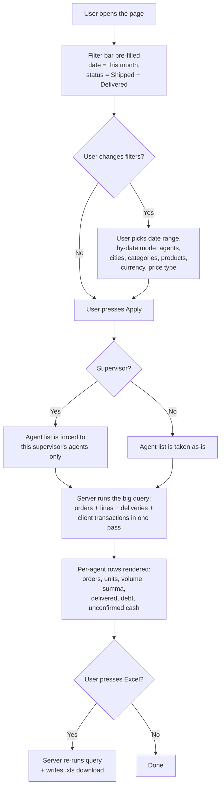

# Заказы по агентам — sales-per-agent page

## What this feature is for

This page answers one question every dealer asks every morning: **"how much did each of my agents sell yesterday / this week / this month?"** It is the most-opened screen in the Reports section. For every agent it shows their order count, units, volume, total amount, and — uniquely on this page — their **outstanding debt** and the **cash they collected but have not yet handed in**. A supervisor uses it to spot underperformers. A manager uses it to check that money is making it back from the field. An owner uses it to size-check a payroll calculation.

It is also the page that touches the most data: orders, order-detail lines, deliveries, client transactions, payment deliveries. A wide date range or a big filial therefore makes this the **first page to time out**, and that is where most QA bugs live.

## Who uses it and where they find it

| Role | What they do here | How they get to the screen |
|---|---|---|
| Operator (3) | Daily check on what the agents brought in | Web → Отчёты → **Заказы по агентам** |
| Supervisor (8) | Same, but only for their own agents — scoping is automatic | Web → Отчёты → **Заказы по агентам** |
| Manager / KAM (9) | Cross-team check | Web → Отчёты → **Заказы по агентам** |
| Partner (7) | Same, but restricted to their product categories | Web → Отчёты → **Заказы по агентам** |
| Admin (1) | Everything | Web → Отчёты → **Заказы по агентам** |

Field agents (4) and expeditors (10) do not see this page.

## The workflow

## Filters and columns

### Filters

| Filter | Type | Server-side or client-side? |
|---|---|---|
| Date range (from / to) | Date pickers | **Server-side** — bounds the SQL |
| **By what date?** — order date / load date / delivery date | Radio | **Server-side** — picks which date column is used |
| Status | Multi-select; default is **Shipped + Delivered** | **Server-side** |
| Agent | Multi-select | **Server-side** (a supervisor cannot widen this past their own agents) |
| Supervisor | Visible only to non-supervisors | **Server-side** (restricts which agents appear) |
| City | Multi-select | **Server-side** |
| Client category | Multi-select | **Server-side** |
| Product category | Multi-select | **Server-side** (a partner's choices are silently capped) |
| Product | Multi-select | **Server-side** |
| Product group | Multi-select — expands to a product list | **Server-side** |
| Currency | Multi-select | **Server-side** |
| Price type | Multi-select | **Server-side** |
| **Excluded categories / products** | Hidden — "red" categories and products configured per filial | **Server-side**, always on, user cannot override |

### Columns

| Column | What it shows |
|---|---|
| Agent name | The agent (FIO) |
| Orders | Count of orders in scope |
| Units | Total piece count across all order lines |
| Volume | Total volume (e.g. litres / cubic units) — comes from the product card |
| Sum (per currency) | Total amount of those orders, **per currency** — UZS and USD shown separately |
| Delivered units | Units that actually reached clients (Delivered status only) |
| Defect | Units written off as defective on delivery |
| **Debt** | Per-currency unpaid amount on the agent's orders in the period |
| **Confirmed cash collected** | Cash the agent handed in to the cashier and that was reconciled |
| **Unlocated cash** | Cash that was received but not yet posted against an order |
| **Unconfirmed cash** | Cash the agent reported collecting but that has not yet been accepted by the cashier |
| Average ticket | Sum ÷ Orders, per currency |

The totals row at the bottom shows the same metrics across all agents in scope.

## Step by step

1. The user opens **Отчёты → Заказы по агентам**.
2. *The page loads with default filters:* date from the **1st of the current month** to today, status = **Shipped + Delivered**, *by what date* = **load date**.
3. *If the user is a supervisor,* the agent drop-down is **already restricted** to their agents — they cannot widen it.
4. *If the user is a partner,* the product-category drop-down is restricted to their categories.
5. The user chooses the date range, the **by what date** radio, and any combination of agents / cities / categories / products / currency / price type.
6. The user presses **Apply** (the bar's submit button).
7. *The server runs four queries:* one big aggregation for orders + lines (the rows the user will see), and three smaller queries for **debt**, **confirmed cash** and **unconfirmed cash**.
8. The grid renders. Each agent is one row. The bottom of the grid shows a totals row.
9. The user can sort columns or click an agent to drill into that agent's own per-day page (a separate URL).
10. If the user presses **Excel**, the server re-runs the same query and streams a `.xls` file.

## What can go wrong

| Trigger | What the user sees | Plain-language meaning |
|---|---|---|
| Empty result | Empty grid, totals row reads zero | No orders in the period match the filters. Often a filter combination that excludes everything. |
| Date range crosses **close date** | Numbers appear but **orders older than the close date are still counted** (close date does not affect this page) | The close date stops *editing*; it does **not** stop reporting. |
| Two currencies in the period | Per-currency split is shown, but the *units / volume / debt* columns aggregate across currencies | Volume and units do not depend on currency. Sum and debt must always be read per-currency. |
| Date range > 90 days on a big filial | Page is slow to first paint; sometimes a 504 from the proxy | The query joins three big tables. Wide windows are expensive. |
| Status filter unchecked entirely | Falls back to the default (Shipped + Delivered) | The filter "no statuses chosen" is treated as "default", not as "all statuses". |
| Supervisor tries to add an agent that is not theirs via the URL | The agent is silently dropped from the result set | Scoping is enforced on the server. |
| Inactive agent had orders in the period | They still appear with their numbers | Activation is a status of the agent profile, not of historical orders. |
| Agent who never had an order in the period | Does not appear at all | The grid is built from orders, not from the agent list. An agent with zero orders has nothing to show. |
| Product-category filter conflicts with the dealer's "excluded" list | The user-picked category wins for the visible rows, but the excluded products are never counted | Excluded products are hard-coded out. |

## Rules and limits

- **Default status is "real sales".** Unless the user changes the status filter, only Shipped + Delivered orders are counted.
- **Supervisor scoping is silent.** A supervisor sees only their own agents. There is no UI indication of the scoping — the agent drop-down simply does not list other supervisors' agents.
- **Partner scoping is silent too.** A partner sees only their product categories.
- **"Without agent" agent is excluded by default.** Orders that have no agent are not counted as belonging to anyone.
- **Cash columns are best-effort.** Confirmed / unconfirmed cash come from the **deliveries** table, not from the order. If an order has been delivered but the cash has not been recorded, that order shows up with zero cash.
- **No automatic currency conversion.** UZS and USD orders are summed in their own currency. There is no live FX rate applied.
- **The close date does not affect this page.** Read-only orders still count.
- **Date range has no UI cap.** A user *can* enter a 365-day range — but on a big filial that may not return in time.
- **Excel export is single-shot.** It re-runs the query and downloads a `.xls`; there is no resumable export.

## What to test

### Happy paths

- Default filters (this month, Shipped + Delivered, load date) — page renders, totals row equals the sum of agent rows.
- Pick a single agent with known orders — orders / units / sum match what is in the orders list.
- Pick a range that crosses two months — totals split correctly.
- Switch **by what date** between order / load / delivery — verify the numbers change (they should, unless every order in the window has all three dates identical).
- Excel export — file downloads, totals row in `.xls` equals on-screen totals row.

### Filter combinations

- Status: Shipped only → the **delivered** column is zero, **defect** is zero.
- Status: Delivered only → debt column is computed only for delivered orders.
- Status: Returned only → expect zero sales but possibly non-zero defect.
- Currency = USD only → ensure UZS orders are excluded.
- Product category that has no orders in the window → empty grid.
- Product group that expands to >100 products → page still works.

### Permissions / scoping

- Open as Supervisor A → only A's agents listed, totals match A's team only.
- Open as Supervisor B → only B's agents, none of A's.
- Open as Admin → all agents across filial.
- Open as Partner with categories X, Y → product-category drop-down is locked to X, Y; opening the page with no category picked still excludes other categories.
- Try to force a foreign agent into the URL as Supervisor — verify the agent is dropped, not honoured.
- Open as Operator with no supervisor link → all agents visible.

### Performance

- Date range = today only → page should return under 2 seconds on a normal filial.
- Date range = current month → under 10 seconds.
- Date range = 90 days on a 50-agent filial → flag as a known slow path; should still complete.
- Date range = 365 days → expect timeout on big filials; verify the user gets a graceful timeout, not a partial page.

### Edge cases

- An order that was created in the window but cancelled later in the same window — should not be counted under the default status.
- An order that was loaded inside the window but delivered outside it — counted only if **by load date** is selected.
- An order with two currencies on its lines (very rare) — verify the per-currency split.
- An agent who is currently inactive but had orders in the period — should appear.
- An order from a deleted client — should still appear (client is shown by ID if name is gone).
- An order that contains only excluded ("red") categories or products — its rows should not add to units / volume, but its order count and total still appear.
- Empty result — verify the totals row reads zero and not blank.

## Where this leads next

After identifying an under-performing agent, the manager usually drills into:

- [Продажи по клиентам](./report-customer.md) — to see *which* clients that agent missed.
- [По визитам 2.0](./report-visit.md) — to see whether the agent visited those clients at all.
- [Order list & history](../orders/order-list-and-history.md) — to inspect the actual orders one by one.

## For developers

Developer reference: `report` module → `AgentController::actionIndex` and `Agent::reportAgent`.
