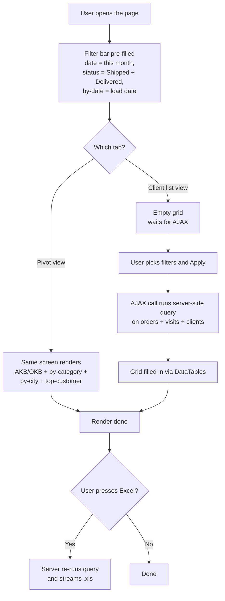

# Продажи по клиентам — sales-per-client page

## What this feature is for

This page answers the second-most-asked question after agent sales: **"which clients bought what, and which clients have stopped buying?"** It comes in two flavours that share the same filter bar:

- **Pivot view** — the dealer's headline KPIs are at the top: AKB (active client base), OKB (total client base), strike rate, by-category and by-city breakdowns, top-customer list.
- **Client list view** — a flat, one-row-per-client table that supports filtering down to a handful of clients and exporting to Excel.

The dealer uses this page to identify (a) top clients who deserve special treatment, (b) clients who used to buy and have gone silent, and (c) which client categories or cities are growing or shrinking.

## Who uses it and where they find it

| Role | What they do here | How they get to the screen |
|---|---|---|
| Operator (3), Manager (2) | Daily / weekly client review | Web → Отчёты → **Продажи по клиентам** |
| Supervisor (8) | Same, restricted to their own agents' clients | Web → Отчёты → **Продажи по клиентам** |
| KAM (9) | Watches their key-account list | Web → Отчёты → **Продажи по клиентам** |
| Partner (7) | Restricted to their product categories | Web → Отчёты → **Продажи по клиентам** |
| Admin (1) | Everything | Web → Отчёты → **Продажи по клиентам** |

Agents and expeditors do not see this page.

## The workflow

## Filters and columns

### Filters

| Filter | Type | Server-side or client-side? |
|---|---|---|
| Date range (from / to) | Date pickers | **Server-side** |
| **By what date?** — order / load / delivery | Radio | **Server-side** (picking *Delivered* forces status = Delivered too) |
| Status | Multi-select; default = Shipped + Delivered | **Server-side** |
| Agent | Multi-select | **Server-side** (capped by supervisor scoping) |
| Supervisor | Drop-down | **Server-side** |
| Client category | Multi-select | **Server-side** |
| City | Multi-select | **Server-side** |
| Client type | Multi-select | **Server-side** |
| Client class | Multi-select | **Server-side** |
| Channel | Multi-select | **Server-side** |
| Currency | Multi-select | **Server-side** |
| Price type | Multi-select | **Server-side** |
| Expeditor | Multi-select (client-list view only) | **Server-side** |
| Product category | Multi-select | **Server-side** |
| Product | Multi-select | **Server-side** |
| Product group | Multi-select — expands | **Server-side** |
| Product producer | Drop-down — expands to products | **Server-side** |
| Tag (client) | Multi-select | **Server-side** (intersected with location filter) |
| Location | Map / list of clients | **Server-side** |
| Active only? (client) | Toggle: Y / N / both | **Server-side** |
| Day of week (visit) | Multi-select | **Server-side** for the visit half of the query |
| Has inventory? | Y / N / both | **Server-side** |
| Excluded products | Hidden | **Server-side**, always on |

### Columns — Pivot view

| Block | What it shows |
|---|---|
| Header KPIs | AKB (clients who ordered), OKB (clients visited), strike rate |
| By client category | Per-category: AKB, sum, units, volume |
| By city | Per-city: AKB, sum, units, volume |
| Top customers | Per client: sum, units, volume, agents who served them |

### Columns — Client list view

| Column | What it shows |
|---|---|
| Client ID | The client's ID |
| Client name | |
| City | |
| Phone | |
| Last order date | Most recent order date for this client (any period) |
| Order count | Distinct orders in the period |
| Sum (per currency) | Total spent in the period |
| Units | Total units |
| Volume | Total volume |
| Visit days | Which weekdays the client is scheduled to be visited |
| Agents | Comma-separated list of agents who served this client |
| Active? | Y / N — current activation state of the client |

## Step by step

1. The user opens **Отчёты → Продажи по клиентам**.
2. *The page loads with default filters:* current month, status Shipped + Delivered, *by load date*.
3. *If the user is a supervisor,* the agent list is restricted to their team — and **so is the client list**, because clients are linked to their agents through visits.
4. *If the user is a partner,* the product-category drop-down is restricted to their categories.
5. The user picks filters. Picking **Delivered** as the by-date radio also forces status = Delivered (because an undelivered order has no delivery date).
6. The user presses **Apply**.
7. *The pivot tab renders directly from the rendered HTML.* The client-list tab renders an empty grid and immediately fires an AJAX call.
8. *The AJAX call runs* the orders + visits + clients aggregation server-side.
9. The grid renders. The user can sort, search within the visible rows, and export.
10. **Excel export** — a separate server endpoint receives the same filters and streams a `.xls`.

## What can go wrong

| Trigger | What the user sees | Plain-language meaning |
|---|---|---|
| **By delivery date** chosen with no Delivered orders | Empty result, even though Shipped orders exist | The page silently forces status = Delivered when by-date = delivery. |
| Wide date range on big filial | Slow AJAX, sometimes 504 | The visits query joins orders + visits + clients. |
| Client whose visit lives in the period but who never ordered | Appears in **OKB** (visited) but not in **AKB** (active). Listed in the client list as zero orders. | Correct behaviour, but easy to mis-interpret. |
| Client whose only orders were Cancelled or Returned | Not in AKB. Their last-order date may still show. | "Last order" is the latest order regardless of status. |
| Currency mixing | The per-client sum is one number per currency; the totals row shows them stacked | No FX conversion. |
| Supervisor changes the agent filter to all | Drop-down silently ignores agents that are not theirs | The supervisor's agent list is the cap. |
| Filter by tag + filter by location | Result is the **intersection** | Bug-prone — looks like "OR" but is "AND". |
| Filter by *day of week* with a date range > 6 days | Day filter is ignored | The day filter only works inside a one-week window. |
| Client deactivated after some orders | The client shows up with their historical numbers. *Active? = N.* | Deactivation does not erase history. |
| Excluded products | Their units / sums are removed from the totals; the client may disappear if all their orders were excluded | Excluded products are hard-coded out. |

## Rules and limits

- **Default status is Shipped + Delivered.** Picking by-date = delivery forces status = Delivered.
- **Supervisor scoping is silent and double — agent + client.** A client served only by another supervisor's agent will not appear.
- **Partner scoping is silent.** Only the partner's product categories are counted.
- **AKB = distinct clients with at least one Shipped/Delivered order in the period.** Returned-only clients are not AKB.
- **OKB = distinct clients visited in the period.** Visit must be marked as completed.
- **Strike rate = AKB ÷ OKB.** If OKB is zero, the page shows a dash, not infinity.
- **Tag and location filters intersect.** Picking both narrows to the overlap.
- **Day-of-week filter only applies within a one-week window.** Wider windows ignore it.
- **No currency conversion.** Sums are summed in their own currency.
- **The default route filter is "in route".** There is a separate page (`/report/report`) for "out of route".
- **Excel export is supported on the client-list view, not on the pivot view.**

## What to test

### Happy paths

- Pivot view loads with default filters; AKB / OKB / strike rate look sane.
- Client-list view shows the same client count as pivot's AKB block (with the same status filter).
- Pick a single agent — every client in the list is one that agent served.
- Switch the by-date radio from order to load to delivery — verify the AKB/OKB number changes (or stays the same) consistently.
- Excel export of the client list — file row count = on-screen row count.

### Filter combinations

- Tag = "Promo" + Location = "Tashkent" → only Promo clients in Tashkent.
- Product category that the dealer's clients do not buy → empty AKB.
- Status = Returned only → AKB drops to clients who only returned.
- City = one small city → totals match a hand-count.
- Day-of-week = Monday with a one-week window — only Monday-scheduled clients counted in OKB.
- Day-of-week = Monday with a 30-day window — day filter is silently ignored.
- Currency = USD only → only USD orders are summed.

### Permissions / scoping

- Open as Supervisor A → clients only of A's agents.
- Open as KAM with their account list → only their key accounts visible.
- Open as Partner with category X → other categories' lines do not affect AKB.
- Force `agent=` URL param as Supervisor → invalid agent silently dropped.

### Performance

- Date range = today only → snappy.
- Date range = current month → under 15 seconds for medium filials.
- Date range = 90 days on big filial → expect a slow AJAX; client-list view especially.
- Date range = 365 days → likely timeout; verify graceful error message.

### Edge cases

- A client who appears in OKB but not AKB → strike rate < 100%.
- A client with two currencies in the period → per-currency line shown.
- A client whose only order in the period was Cancelled → not in AKB, not in totals.
- A client deactivated mid-period → still appears, *Active? = N*.
- "Active only" toggle = N → only inactive clients.
- Empty result → all KPIs show zero or dash, no JavaScript errors.

## Where this leads next

- [Заказы по агентам](./report-agent.md) — same KPIs cut by agent rather than client.
- [Продажи по товарам / SKU](./report-volume-sku.md) — same data cut by product.
- [Order list & history](../orders/order-list-and-history.md) — to inspect individual client orders.

## For developers

Developer reference: `report` module → `CustomerController::actionIndex` and `actionClientList` + `actionClientListAjax`.
